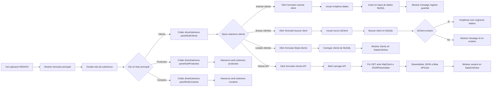

# <h1>
RedData
</h1>

![[Pasted image 20260121173155.png|1000]]

## Introducción

### Descripción

La aplicacion sirve para mostrar productos/clientes e insertarlos

**Audiencia objetivo**

Administradores de ventas

**Alcance**

Resuelve la gestion de clientes, recopilacion de info de productos y la informacion de todas las compras

**Requisitos previos**

- Tener instalado un servidor sql.
- Tener internet.
- 8GB de ram
- 3 GB de almacenamiento.

## Uso de la aplicación
### FlowChart

