# Pasos grabados

## Paso 1: initial
- **Hora:** 2025-10-16T16:59:53.358436
- **Descripción:** Recording session started
- **Ventana:** Steps Recorder Pro

## Paso 2: click
- **Hora:** 2025-10-16T16:59:54.150041
- **Descripción:** Left-clicked at (350, 254)
- **Ventana:** Steps Recorder Pro

## Paso 3: click
- **Hora:** 2025-10-16T17:01:06.579671
- **Descripción:** Left-clicked at (252, 732)
- **Ventana:** Steps Recorder Pro

## Paso 4: click
- **Hora:** 2025-10-16T17:02:36.397942
- **Descripción:** Left-clicked at (369, 721)
- **Ventana:** Steps Recorder Pro

## Paso 5: click
- **Hora:** 2025-10-16T17:02:55.815317
- **Descripción:** Left-clicked at (587, 962)
- **Ventana:** VPC | us-east-1 - Brave

## Paso 6: click
- **Hora:** 2025-10-16T17:03:09.672043
- **Descripción:** Left-clicked at (997, 900)
- **Ventana:** VPC | us-east-1 - Brave

## Paso 7: click
- **Hora:** 2025-10-16T17:04:49.438409
- **Descripción:** Left-clicked at (101, 747)
- **Ventana:** VPC | us-east-1 - Brave

## Paso 8: click
- **Hora:** 2025-10-16T17:04:53.064787
- **Descripción:** Left-clicked at (1824, 354)
- **Ventana:** SecurityGroups | VPC | us-east-1 - Brave

## Paso 9: click
- **Hora:** 2025-10-16T17:05:20.099297
- **Descripción:** Left-clicked at (1797, 222)
- **Ventana:** Steps Recorder Pro

## Paso 10: click
- **Hora:** 2025-10-16T17:05:29.759667
- **Descripción:** Left-clicked at (482, 518)
- **Ventana:** VPC | us-east-1 - Brave

## Paso 11: click
- **Hora:** 2025-10-16T17:05:30.900432
- **Descripción:** Left-clicked at (401, 628)
- **Ventana:** VPC | us-east-1 - Brave

## Paso 12: click
- **Hora:** 2025-10-16T17:05:32.759103
- **Descripción:** Left-clicked at (1822, 554)
- **Ventana:** VPC | us-east-1 - Brave

## Paso 13: click
- **Hora:** 2025-10-16T17:06:11.090849
- **Descripción:** Left-clicked at (1600, 536)
- **Ventana:** VPC | us-east-1 - Brave

## Paso 14: click
- **Hora:** 2025-10-16T17:06:12.081240
- **Descripción:** Left-clicked at (1825, 552)
- **Ventana:** Steps Recorder Pro

## Paso 15: click
- **Hora:** 2025-10-16T17:06:26.998604
- **Descripción:** Left-clicked at (1432, 769)
- **Ventana:** VPC | us-east-1 - Brave

## Paso 16: click
- **Hora:** 2025-10-16T17:06:28.279458
- **Descripción:** Left-clicked at (1822, 551)
- **Ventana:** VPC | us-east-1 - Brave

## Paso 17: click
- **Hora:** 2025-10-16T17:07:25.467011
- **Descripción:** Left-clicked at (383, 699)
- **Ventana:** Panel | EC2 | us-east-1 - Brave

## Paso 18: click
- **Hora:** 2025-10-16T17:07:36.225899
- **Descripción:** Left-clicked at (1819, 555)
- **Ventana:** Lanzar una instancia | EC2 | us-east-1 - Brave

## Paso 19: click
- **Hora:** 2025-10-16T17:12:51.046407
- **Descripción:** Left-clicked at (1821, 549)
- **Ventana:** Steps Recorder Pro

## Paso 20: click
- **Hora:** 2025-10-16T17:14:51.899453
- **Descripción:** Left-clicked at (997, 708)
- **Ventana:** Steps Recorder Pro

## Paso 21: click
- **Hora:** 2025-10-16T17:14:52.980171
- **Descripción:** Left-clicked at (1826, 560)
- **Ventana:** Steps Recorder Pro

## Paso 22: click
- **Hora:** 2025-10-16T17:17:08.984725
- **Descripción:** Left-clicked at (1816, 552)
- **Ventana:** Steps Recorder Pro

## Paso 23: click
- **Hora:** 2025-10-16T17:18:02.799906
- **Descripción:** Left-clicked at (1835, 557)
- **Ventana:** Steps Recorder Pro

## Paso 24: annotation
- **Hora:** 2025-10-16T17:19:19.632332
- **Descripción:** Hostname cambiado
- **Ventana:** Steps Recorder Pro

## Paso 25: click
- **Hora:** 2025-10-16T17:19:22.073301
- **Descripción:** Left-clicked at (178, 1061)
- **Ventana:** Steps Recorder Pro

## Paso 26: click
- **Hora:** 2025-10-16T17:19:23.667351
- **Descripción:** Left-clicked at (253, 1070)
- **Ventana:** Instancias | EC2 | us-east-1 - Brave

## Paso 28: click
- **Hora:** 2025-10-16T17:19:49.585896
- **Descripción:** Left-clicked at (107, 949)
- **Ventana:** Instancias | EC2 | us-east-1 - Brave

## Paso 29: click
- **Hora:** 2025-10-16T17:19:53.178748
- **Descripción:** Left-clicked at (1647, 237)
- **Ventana:** Direcciones IP elásticas | EC2 | us-east-1 - Brave

## Paso 30: click
- **Hora:** 2025-10-16T17:19:54.487684
- **Descripción:** Left-clicked at (1730, 236)
- **Ventana:** Direcciones IP elásticas | EC2 | us-east-1 - Brave

## Paso 31: click
- **Hora:** 2025-10-16T17:19:57.062069
- **Descripción:** Left-clicked at (476, 525)
- **Ventana:** Asignar dirección IP elástica | EC2 | us-east-1 - Brave

## Paso 32: click
- **Hora:** 2025-10-16T17:19:57.890815
- **Descripción:** Left-clicked at (476, 525)
- **Ventana:** Asignar dirección IP elástica | EC2 | us-east-1 - Brave

## Paso 33: click
- **Hora:** 2025-10-16T17:19:58.887751
- **Descripción:** Left-clicked at (430, 725)
- **Ventana:** Asignar dirección IP elástica | EC2 | us-east-1 - Brave

## Paso 34: click
- **Hora:** 2025-10-16T17:20:00.214128
- **Descripción:** Left-clicked at (257, 1065)
- **Ventana:** Asignar dirección IP elástica | EC2 | us-east-1 - Brave

## Paso 49: click
- **Hora:** 2025-10-16T17:20:41.575861
- **Descripción:** Left-clicked at (339, 435)
- **Ventana:** Direcciones IP elásticas | EC2 | us-east-1 - Brave

## Paso 50: click
- **Hora:** 2025-10-16T17:21:09.136871
- **Descripción:** Left-clicked at (583, 537)
- **Ventana:** Direcciones IP elásticas | EC2 | us-east-1 - Brave

## Paso 54: annotation
- **Hora:** 2025-10-16T17:21:24.862043
- **Descripción:** Ip Elastica creada
- **Ventana:** Steps Recorder Pro

## Paso 55: click
- **Hora:** 2025-10-16T17:21:31.267860
- **Descripción:** Left-clicked at (263, 1054)
- **Ventana:** Steps Recorder Pro
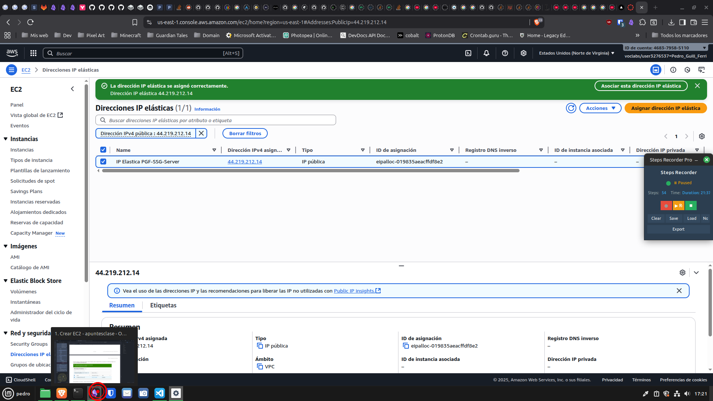

## Paso 56: click
- **Hora:** 2025-10-16T17:21:32.226267
- **Descripción:** Left-clicked at (263, 1054)
- **Ventana:** 1. Crear EC2 - apuntesclase - Obsidian v1.9.14
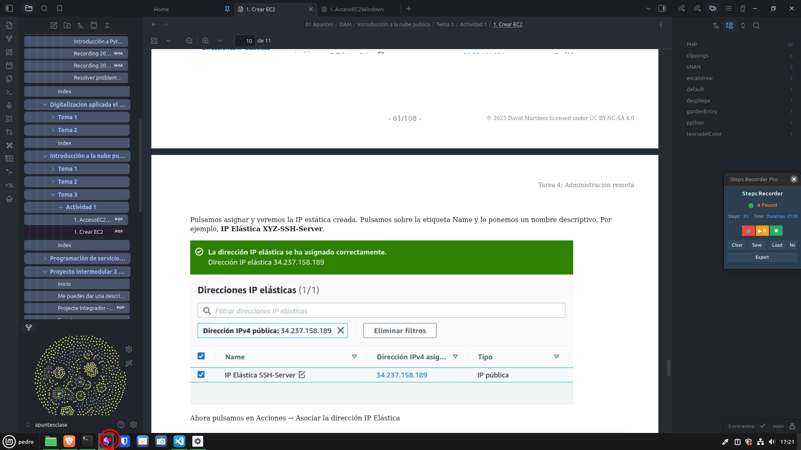

## Paso 57: click
- **Hora:** 2025-10-16T17:21:33.319860
- **Descripción:** Left-clicked at (428, 1054)
- **Ventana:** Steps Recorder Pro

## Paso 58: click
- **Hora:** 2025-10-16T17:22:15.479083
- **Descripción:** Left-clicked at (162, 1076)
- **Ventana:** steps-recorder.py - steps-recorder - Python - Visual Studio Code
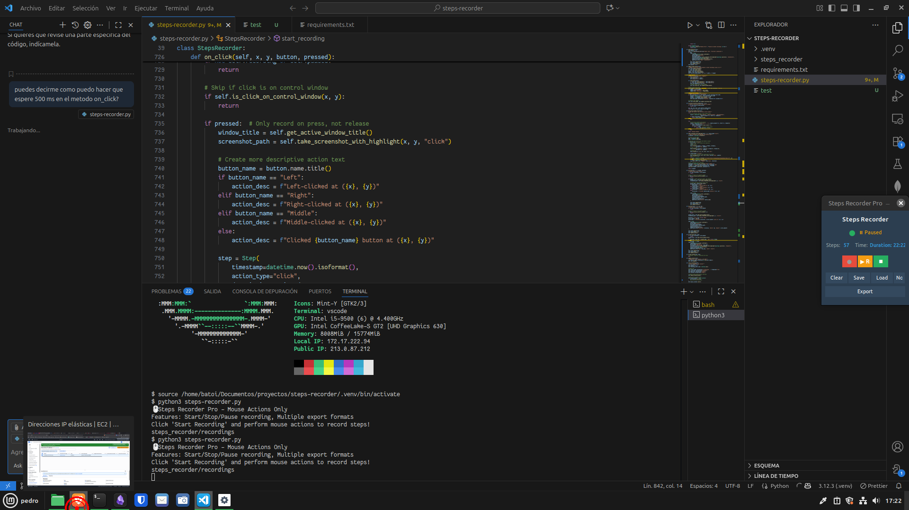

## Paso 59: click
- **Hora:** 2025-10-16T17:22:17.097799
- **Descripción:** Left-clicked at (242, 1066)
- **Ventana:** Direcciones IP elásticas | EC2 | us-east-1 - Brave
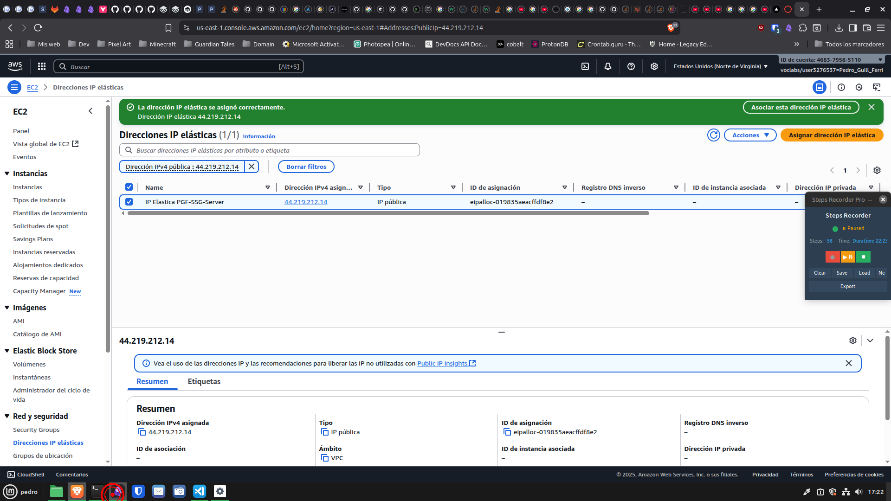

## Paso 60: click
- **Hora:** 2025-10-16T17:22:20.535998
- **Descripción:** Left-clicked at (416, 1051)
- **Ventana:** 1. Crear EC2 - apuntesclase - Obsidian v1.9.14

## Paso 61: click
- **Hora:** 2025-10-16T17:22:27.056182
- **Descripción:** Left-clicked at (191, 623)
- **Ventana:** steps-recorder.py - steps-recorder - Python - Visual Studio Code
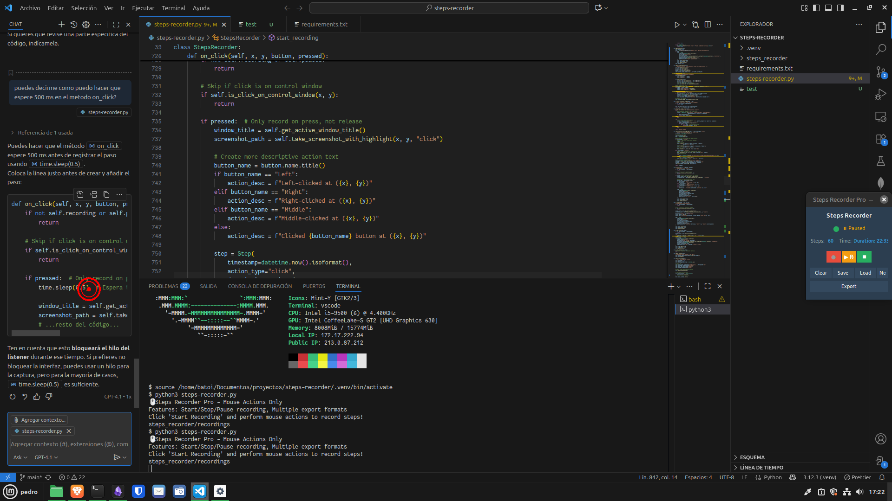

## Paso 62: click
- **Hora:** 2025-10-16T17:22:33.552973
- **Descripción:** Left-clicked at (733, 288)
- **Ventana:** steps-recorder.py - steps-recorder - Python - Visual Studio Code
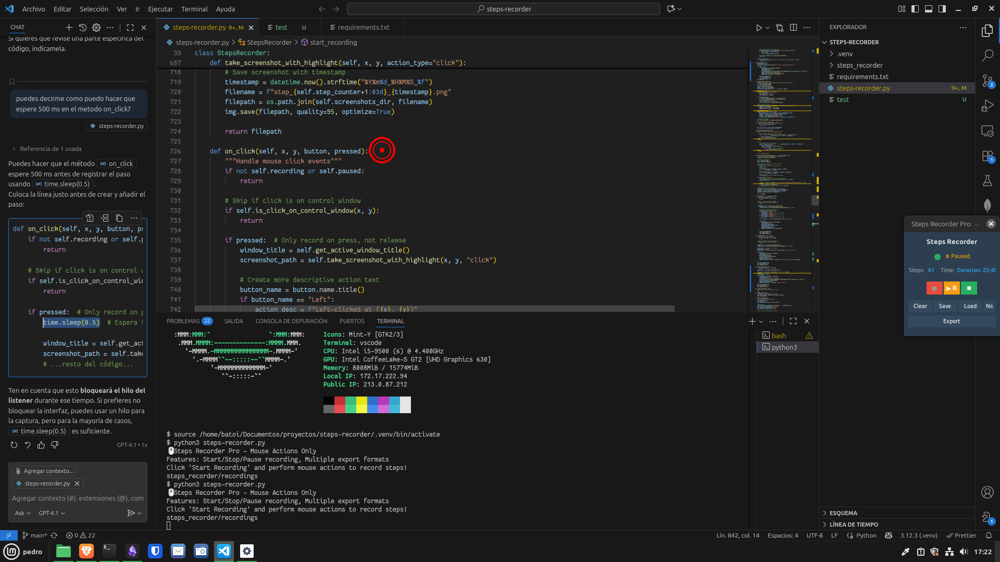

## Paso 63: click
- **Hora:** 2025-10-16T17:22:53.096720
- **Descripción:** Left-clicked at (1565, 378)
- **Ventana:** ● steps-recorder.py - steps-recorder - Python - Visual Studio Code
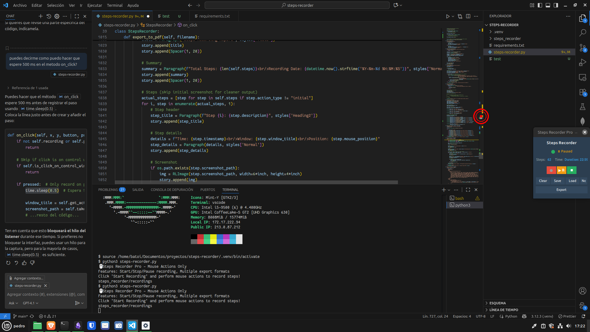

## Paso 64: click
- **Hora:** 2025-10-16T17:23:16.177693
- **Descripción:** Left-clicked at (971, 208)
- **Ventana:** ● steps-recorder.py - steps-recorder - Python - Visual Studio Code

## Paso 65: click
- **Hora:** 2025-10-16T17:23:24.333191
- **Descripción:** Left-clicked at (1013, 216)
- **Ventana:** ● steps-recorder.py - steps-recorder - Python - Visual Studio Code
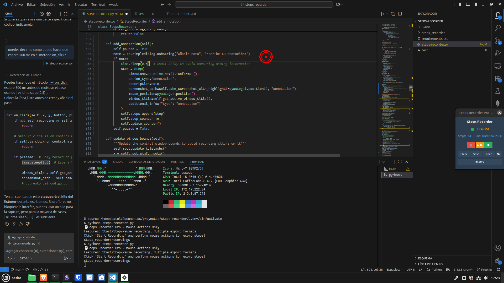

## Paso 66: click
- **Hora:** 2025-10-16T17:23:27.886785
- **Descripción:** Left-clicked at (144, 1066)
- **Ventana:** steps-recorder.py - steps-recorder - Python - Visual Studio Code
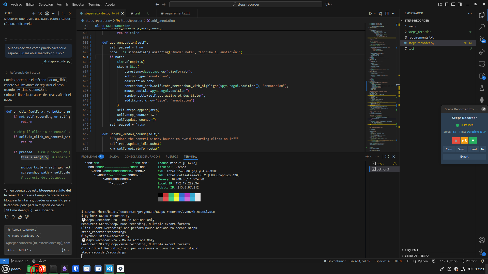

## Paso 67: click
- **Hora:** 2025-10-16T17:23:28.278212
- **Descripción:** Left-clicked at (149, 1067)
- **Ventana:** steps-recorder.py - steps-recorder - Python - Visual Studio Code

## Paso 68: click
- **Hora:** 2025-10-16T17:23:32.280824
- **Descripción:** Left-clicked at (1657, 292)
- **Ventana:** Direcciones IP elásticas | EC2 | us-east-1 - Brave

## Paso 69: click
- **Hora:** 2025-10-16T17:23:38.743616
- **Descripción:** Left-clicked at (264, 1063)
- **Ventana:** Direcciones IP elásticas | EC2 | us-east-1 - Brave
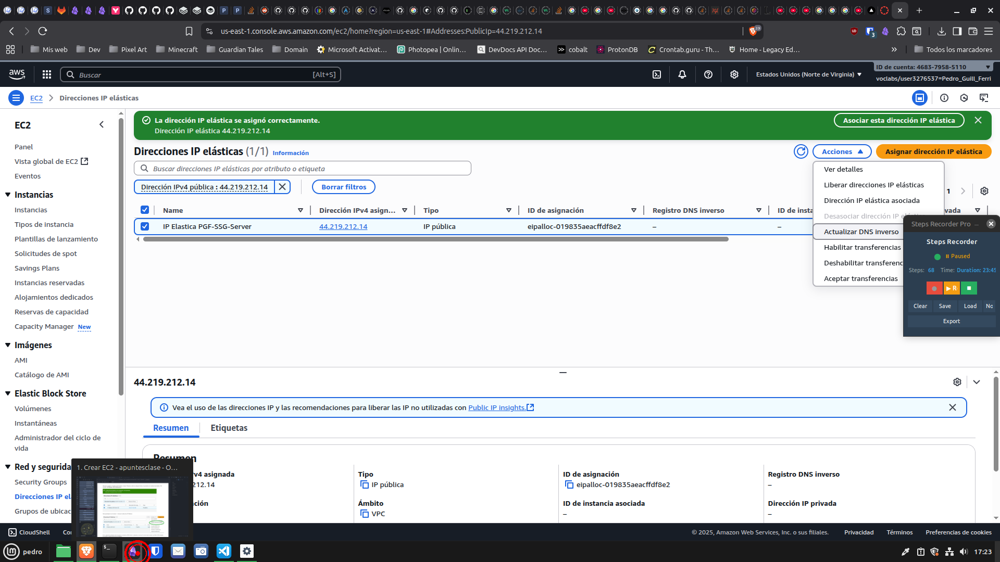

## Paso 70: click
- **Hora:** 2025-10-16T17:23:40.013601
- **Descripción:** Left-clicked at (264, 1063)
- **Ventana:** 1. Crear EC2 - apuntesclase - Obsidian v1.9.14
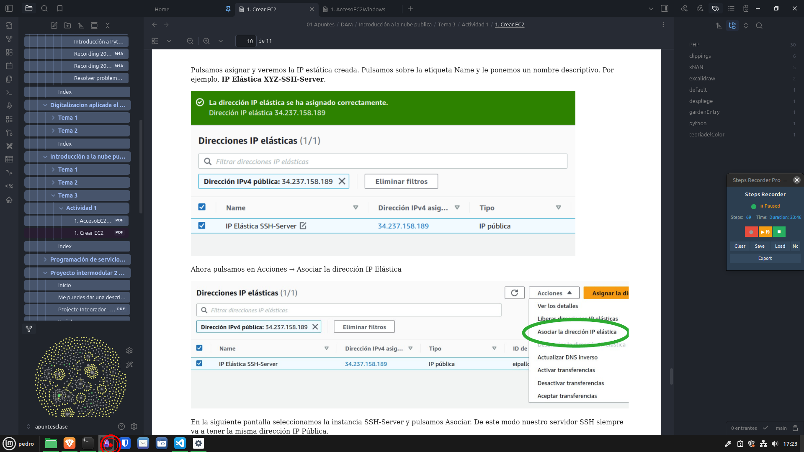

## Paso 71: click
- **Hora:** 2025-10-16T17:23:44.035143
- **Descripción:** Left-clicked at (1765, 441)
- **Ventana:** Steps Recorder Pro
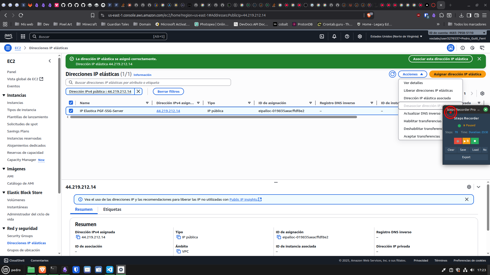

## Paso 72: click
- **Hora:** 2025-10-16T17:23:45.968052
- **Descripción:** Left-clicked at (1656, 378)
- **Ventana:** Steps Recorder Pro

## Paso 73: click
- **Hora:** 2025-10-16T17:23:48.780860
- **Descripción:** Left-clicked at (420, 544)
- **Ventana:** Dirección IP elástica asociada | EC2 | us-east-1 - Brave

## Paso 74: click
- **Hora:** 2025-10-16T17:23:50.440560
- **Descripción:** Left-clicked at (492, 629)
- **Ventana:** Dirección IP elástica asociada | EC2 | us-east-1 - Brave

## Paso 75: click
- **Hora:** 2025-10-16T17:23:52.603888
- **Descripción:** Left-clicked at (262, 1061)
- **Ventana:** Dirección IP elástica asociada | EC2 | us-east-1 - Brave

## Paso 76: click
- **Hora:** 2025-10-16T17:23:53.421227
- **Descripción:** Left-clicked at (262, 1061)
- **Ventana:** 1. Crear EC2 - apuntesclase - Obsidian v1.9.14
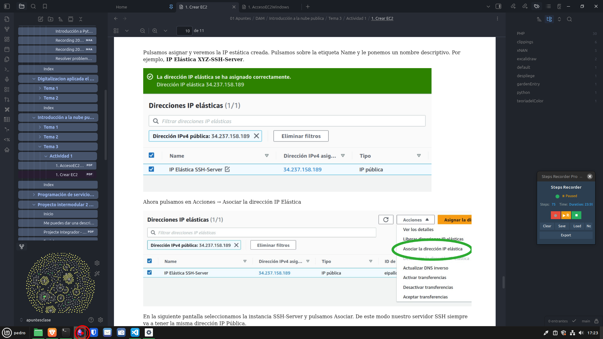

## Paso 77: click
- **Hora:** 2025-10-16T17:23:54.580709
- **Descripción:** Left-clicked at (1864, 724)
- **Ventana:** Steps Recorder Pro
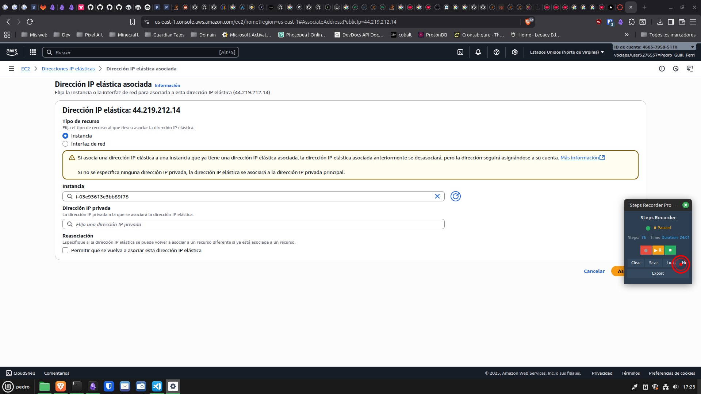

## Paso 78: annotation
- **Hora:** 2025-10-16T17:24:09.324261
- **Descripción:** Asignacion de ip elastica a la maquina
- **Ventana:** Steps Recorder Pro

## Paso 79: click
- **Hora:** 2025-10-16T17:24:10.670574
- **Descripción:** Left-clicked at (253, 1050)
- **Ventana:** Steps Recorder Pro
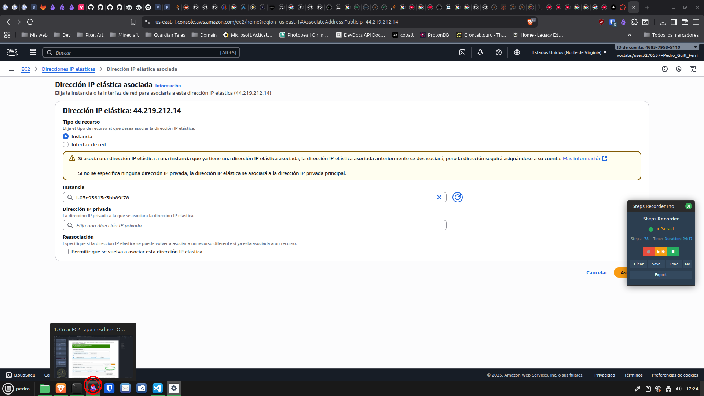

## Paso 80: click
- **Hora:** 2025-10-16T17:24:17.253214
- **Descripción:** Left-clicked at (176, 1068)
- **Ventana:** 1. Crear EC2 - apuntesclase - Obsidian v1.9.14
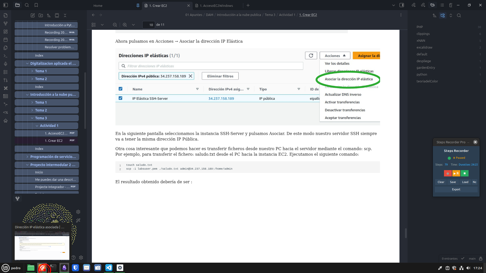

## Paso 81: click
- **Hora:** 2025-10-16T17:24:18.640858
- **Descripción:** Left-clicked at (1738, 563)
- **Ventana:** Dirección IP elástica asociada | EC2 | us-east-1 - Brave

## Paso 82: click
- **Hora:** 2025-10-16T17:24:19.925152
- **Descripción:** Left-clicked at (1721, 730)
- **Ventana:** Dirección IP elástica asociada | EC2 | us-east-1 - Brave
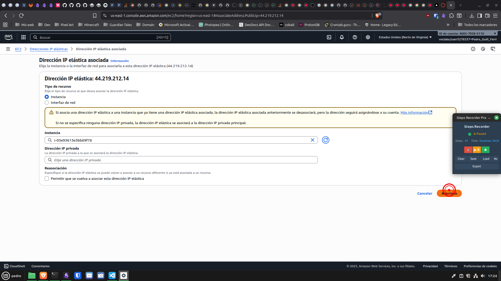

## Paso 83: click
- **Hora:** 2025-10-16T17:24:24.193826
- **Descripción:** Left-clicked at (98, 403)
- **Ventana:** Direcciones IP elásticas | EC2 | us-east-1 - Brave
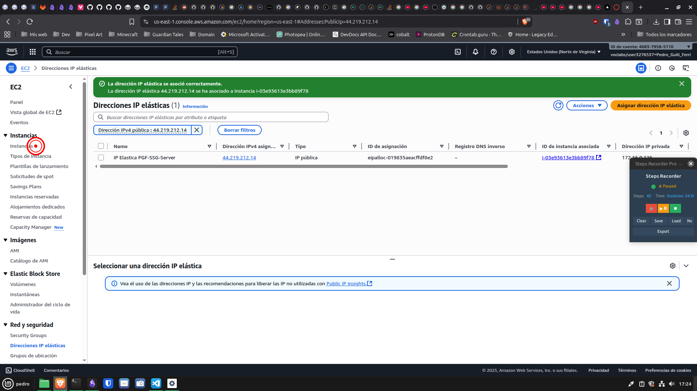

## Paso 84: click
- **Hora:** 2025-10-16T17:24:24.597745
- **Descripción:** Left-clicked at (86, 401)
- **Ventana:** Direcciones IP elásticas | EC2 | us-east-1 - Brave
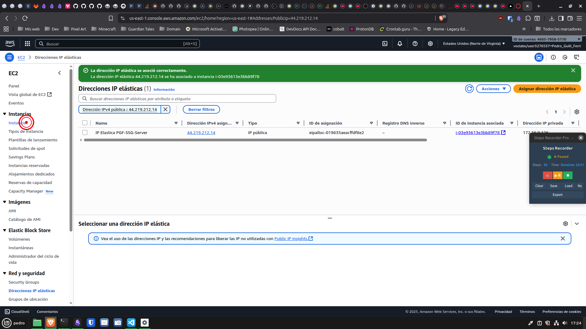

## Paso 85: click
- **Hora:** 2025-10-16T17:24:25.785178
- **Descripción:** Left-clicked at (233, 1041)
- **Ventana:** Instancias | EC2 | us-east-1 - Brave
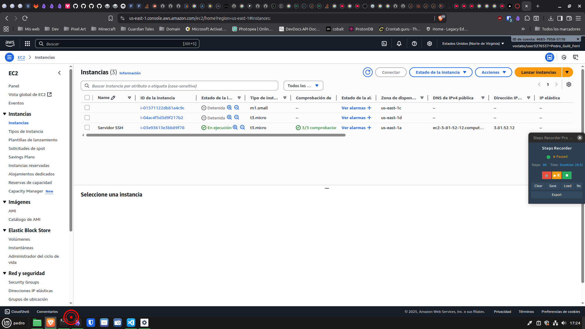

## Paso 86: click
- **Hora:** 2025-10-16T17:24:26.150255
- **Descripción:** Left-clicked at (225, 1048)
- **Ventana:** Instancias | EC2 | us-east-1 - Brave

## Paso 87: click
- **Hora:** 2025-10-16T17:24:30.814325
- **Descripción:** Left-clicked at (258, 994)
- **Ventana:** ec2-user@PGF-SSH-Server:~
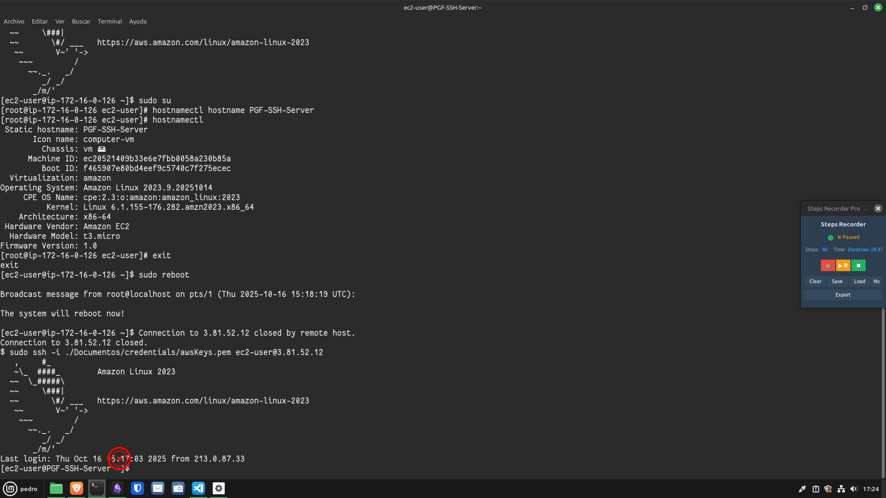

## Paso 88: click
- **Hora:** 2025-10-16T17:24:31.907265
- **Descripción:** Left-clicked at (165, 1058)
- **Ventana:** ec2-user@PGF-SSH-Server:~
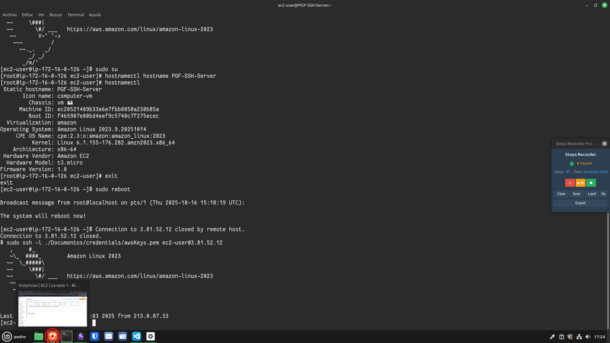

## Paso 89: click
- **Hora:** 2025-10-16T17:24:33.517476
- **Descripción:** Left-clicked at (926, 413)
- **Ventana:** Instancias | EC2 | us-east-1 - Brave
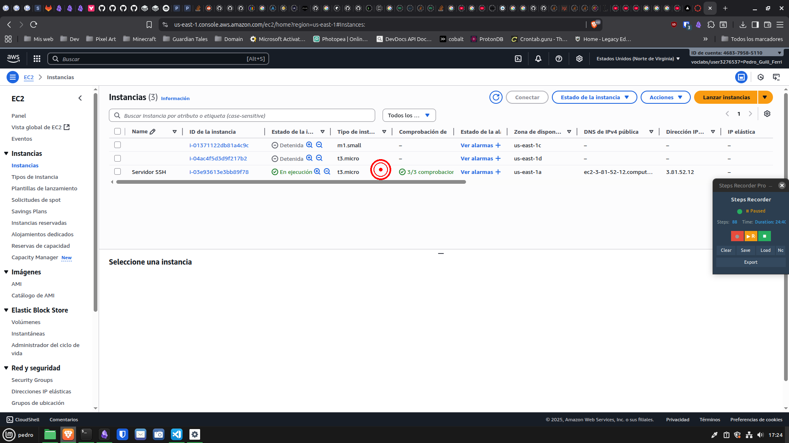

## Paso 90: click
- **Hora:** 2025-10-16T17:24:36.803586
- **Descripción:** Left-clicked at (225, 1051)
- **Ventana:** Instancias | EC2 | us-east-1 - Brave

## Paso 91: click
- **Hora:** 2025-10-16T17:24:37.810069
- **Descripción:** Left-clicked at (361, 818)
- **Ventana:** ec2-user@PGF-SSH-Server:~
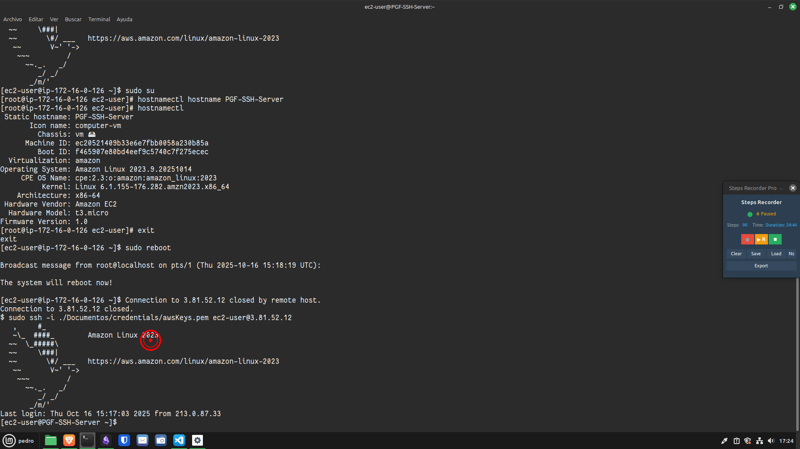

## Paso 92: click
- **Hora:** 2025-10-16T17:24:38.258183
- **Descripción:** Right-clicked at (365, 795)
- **Ventana:** ec2-user@PGF-SSH-Server:~
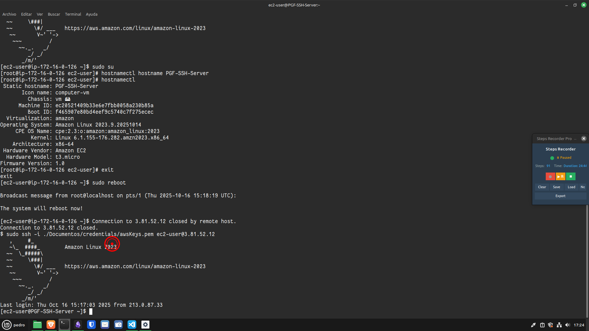

## Paso 93: click
- **Hora:** 2025-10-16T17:24:40.449541
- **Descripción:** Left-clicked at (223, 49)
- **Ventana:** ec2-user@PGF-SSH-Server:~
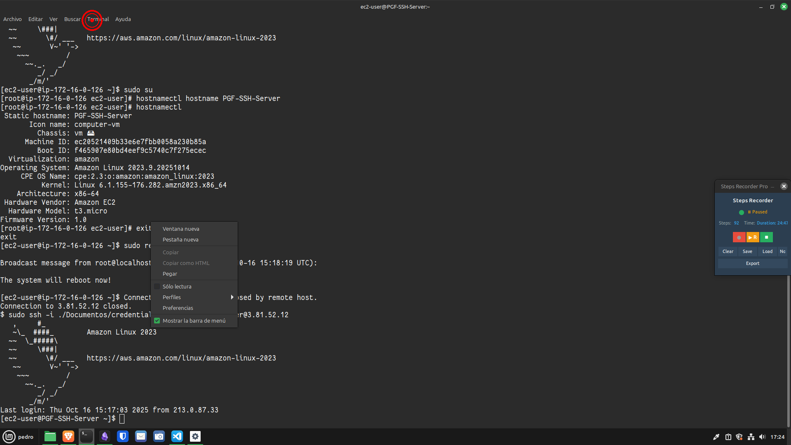

## Paso 94: click
- **Hora:** 2025-10-16T17:24:40.740583
- **Descripción:** Left-clicked at (223, 49)
- **Ventana:** ec2-user@PGF-SSH-Server:~

## Paso 95: click
- **Hora:** 2025-10-16T17:24:41.628556
- **Descripción:** Left-clicked at (258, 135)
- **Ventana:** ec2-user@PGF-SSH-Server:~

## Paso 96: click
- **Hora:** 2025-10-16T17:24:43.965130
- **Descripción:** Left-clicked at (243, 35)
- **Ventana:** ec2-user@PGF-SSH-Server:~
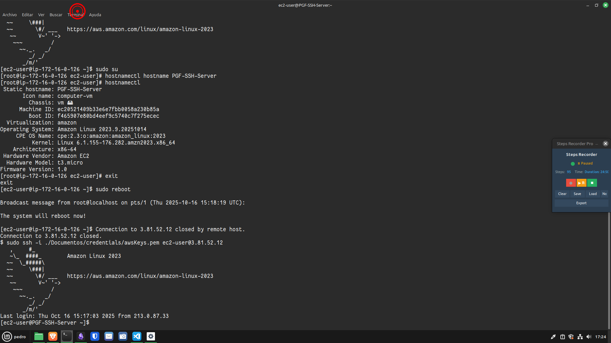

## Paso 97: click
- **Hora:** 2025-10-16T17:24:44.836813
- **Descripción:** Left-clicked at (270, 173)
- **Ventana:** ec2-user@PGF-SSH-Server:~
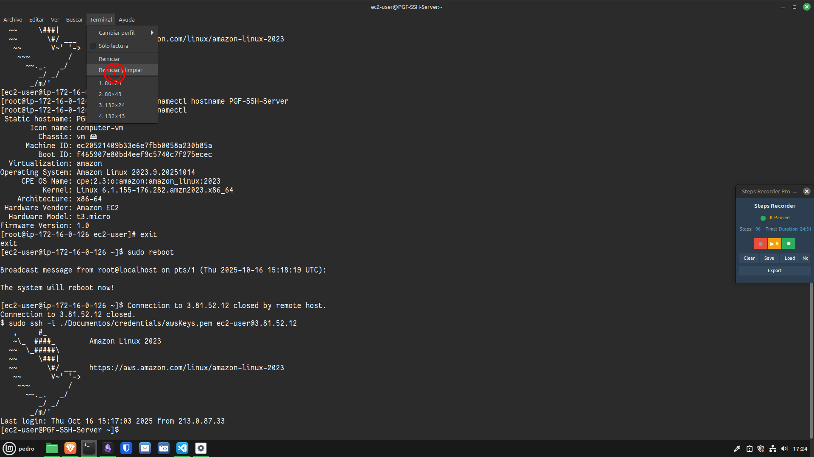

## Paso 98: click
- **Hora:** 2025-10-16T17:24:49.775757
- **Descripción:** Left-clicked at (1908, 14)
- **Ventana:** ec2-user@PGF-SSH-Server:~
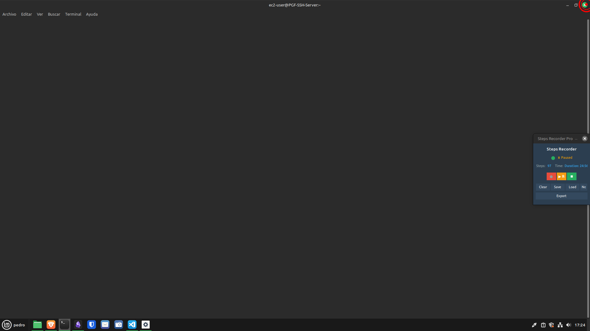

## Paso 99: click
- **Hora:** 2025-10-16T17:24:51.004229
- **Descripción:** Left-clicked at (1070, 622)
- **Ventana:** 
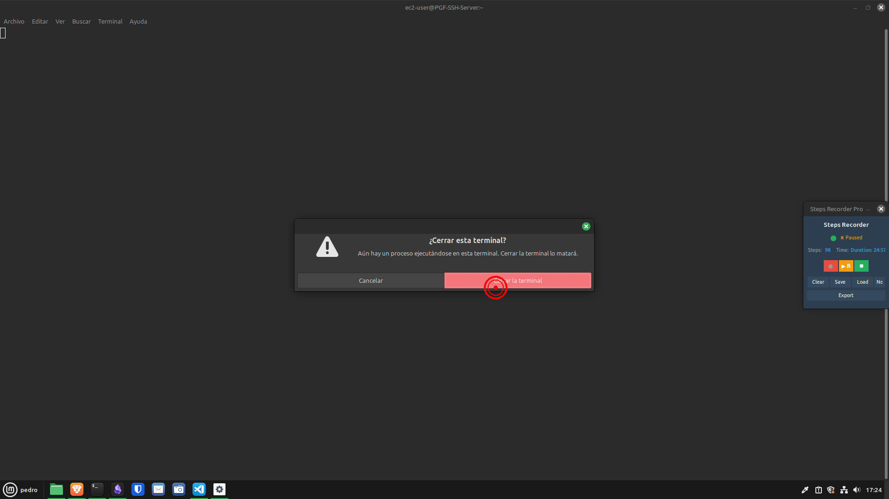

## Paso 100: click
- **Hora:** 2025-10-16T17:24:52.038937
- **Descripción:** Left-clicked at (213, 1045)
- **Ventana:** Steps Recorder Pro
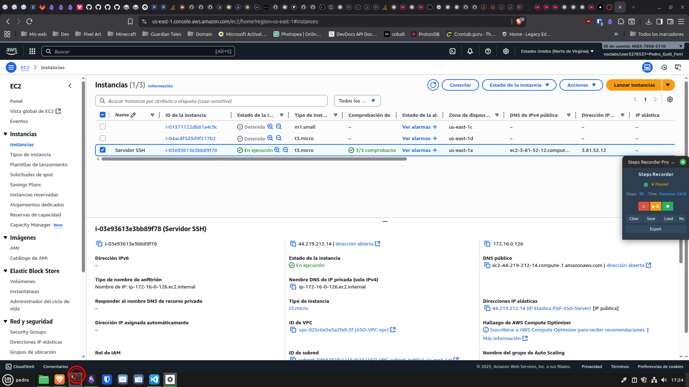

## Paso 101: click
- **Hora:** 2025-10-16T17:24:53.917874
- **Descripción:** Left-clicked at (424, 67)
- **Ventana:** Terminal
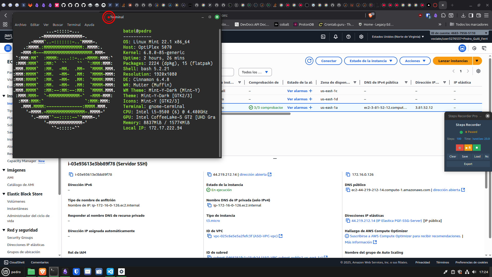

## Paso 102: click
- **Hora:** 2025-10-16T17:24:55.701887
- **Descripción:** Left-clicked at (820, 676)
- **Ventana:** Terminal

## Paso 103: click
- **Hora:** 2025-10-16T17:24:57.276304
- **Descripción:** Left-clicked at (225, 1067)
- **Ventana:** Instancias | EC2 | us-east-1 - Brave

## Paso 104: click
- **Hora:** 2025-10-16T17:25:02.210234
- **Descripción:** Left-clicked at (246, 1043)
- **Ventana:** Terminal

## Paso 105: click
- **Hora:** 2025-10-16T17:25:06.899143
- **Descripción:** Left-clicked at (246, 1043)
- **Ventana:** 1. Crear EC2 - apuntesclase - Obsidian v1.9.14
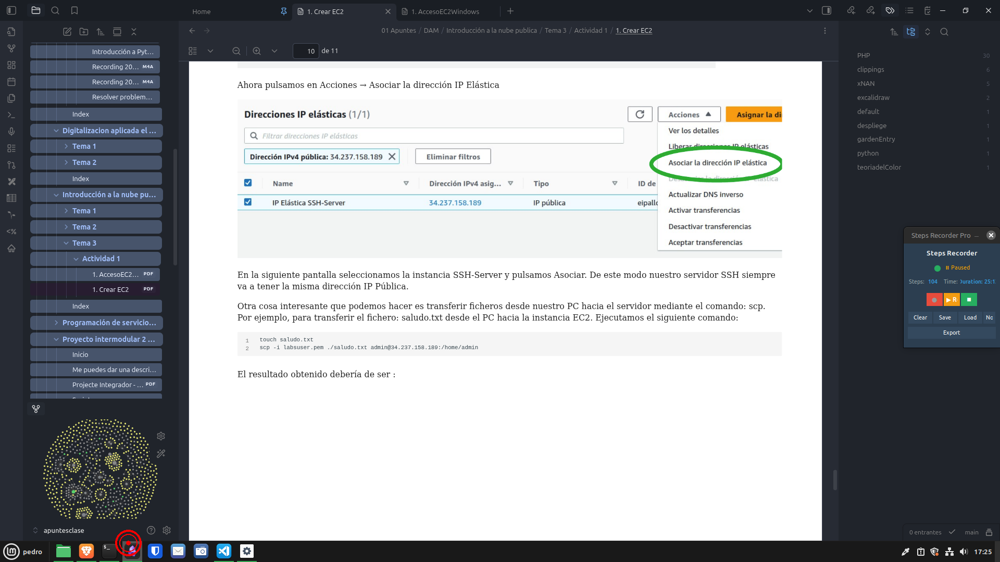

## Paso 106: click
- **Hora:** 2025-10-16T17:25:09.312775
- **Descripción:** Left-clicked at (821, 546)
- **Ventana:** Terminal
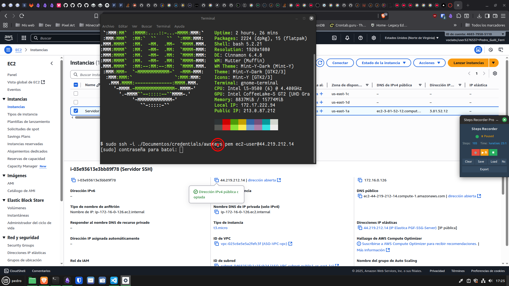

## Paso 107: click
- **Hora:** 2025-10-16T17:25:20.069956
- **Descripción:** Left-clicked at (178, 1063)
- **Ventana:** ec2-user@PGF-SSH-Server:~
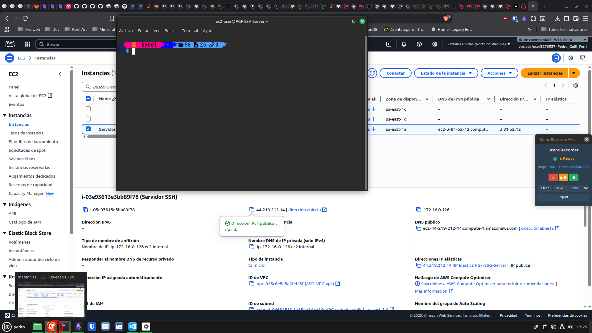

## Paso 108: click
- **Hora:** 2025-10-16T17:25:20.742590
- **Descripción:** Left-clicked at (178, 1063)
- **Ventana:** Instancias | EC2 | us-east-1 - Brave

## Paso 109: click
- **Hora:** 2025-10-16T17:25:22.757948
- **Descripción:** Left-clicked at (250, 1070)
- **Ventana:** Steps Recorder Pro
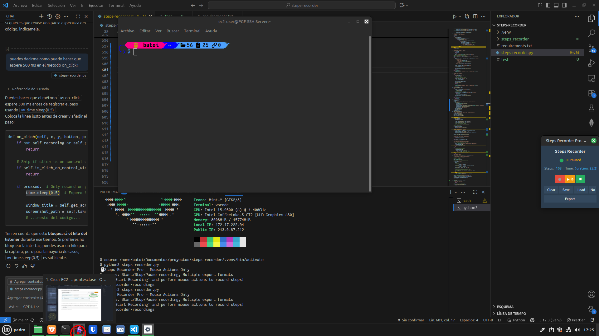

## Paso 110: click
- **Hora:** 2025-10-16T17:25:25.535556
- **Descripción:** Left-clicked at (502, 652)
- **Ventana:** 1. Crear EC2 - apuntesclase - Obsidian v1.9.14
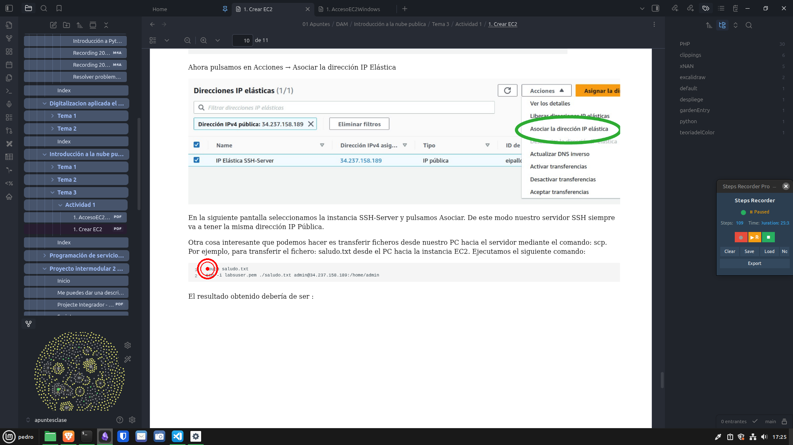

## Paso 111: click
- **Hora:** 2025-10-16T17:25:26.547224
- **Descripción:** Left-clicked at (606, 655)
- **Ventana:** 1. Crear EC2 - apuntesclase - Obsidian v1.9.14
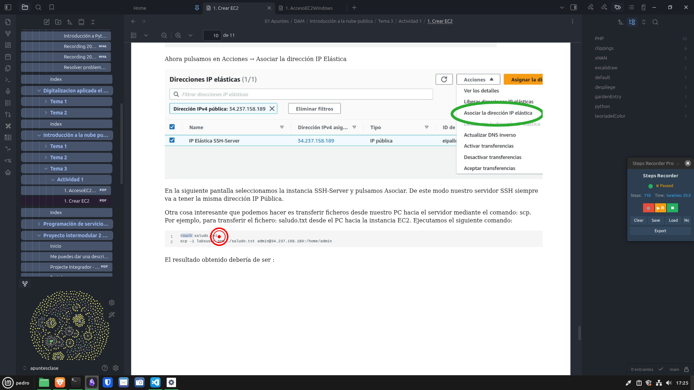

## Paso 112: click
- **Hora:** 2025-10-16T17:25:26.996020
- **Descripción:** Left-clicked at (605, 655)
- **Ventana:** 1. Crear EC2 - apuntesclase - Obsidian v1.9.14

## Paso 113: click
- **Hora:** 2025-10-16T17:25:27.599035
- **Descripción:** Left-clicked at (609, 650)
- **Ventana:** 1. Crear EC2 - apuntesclase - Obsidian v1.9.14

## Paso 114: click
- **Hora:** 2025-10-16T17:25:29.310601
- **Descripción:** Left-clicked at (502, 647)
- **Ventana:** 1. Crear EC2 - apuntesclase - Obsidian v1.9.14

## Paso 115: click
- **Hora:** 2025-10-16T17:25:30.157517
- **Descripción:** Left-clicked at (602, 655)
- **Ventana:** 1. Crear EC2 - apuntesclase - Obsidian v1.9.14

## Paso 116: click
- **Hora:** 2025-10-16T17:25:31.099659
- **Descripción:** Left-clicked at (599, 650)
- **Ventana:** 1. Crear EC2 - apuntesclase - Obsidian v1.9.14
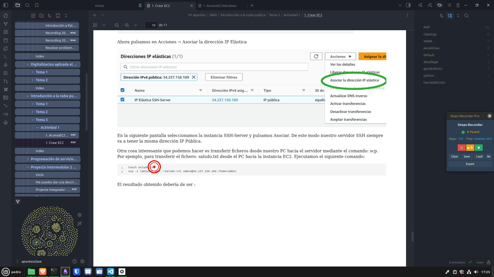

## Paso 117: click
- **Hora:** 2025-10-16T17:25:32.192863
- **Descripción:** Left-clicked at (501, 653)
- **Ventana:** 1. Crear EC2 - apuntesclase - Obsidian v1.9.14

## Paso 118: click
- **Hora:** 2025-10-16T17:25:33.922040
- **Descripción:** Left-clicked at (216, 1058)
- **Ventana:** 1. Crear EC2 - apuntesclase - Obsidian v1.9.14

## Paso 119: click
- **Hora:** 2025-10-16T17:25:34.401393
- **Descripción:** Right-clicked at (692, 443)
- **Ventana:** ec2-user@PGF-SSH-Server:~

## Paso 120: click
- **Hora:** 2025-10-16T17:25:35.283964
- **Descripción:** Left-clicked at (767, 567)
- **Ventana:** ec2-user@PGF-SSH-Server:~
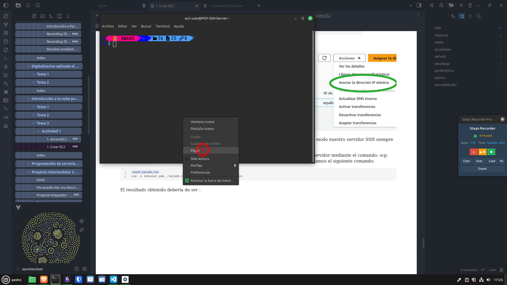

## Paso 121: click
- **Hora:** 2025-10-16T17:25:59.893750
- **Descripción:** Left-clicked at (121, 1066)
- **Ventana:** ec2-user@PGF-SSH-Server:~
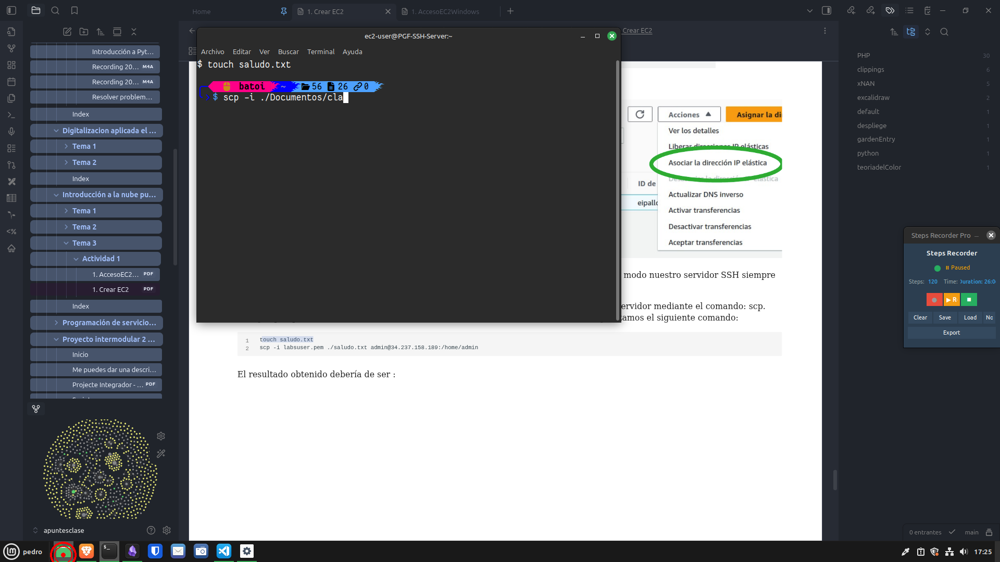

## Paso 122: click
- **Hora:** 2025-10-16T17:26:01.347865
- **Descripción:** Left-clicked at (91, 189)
- **Ventana:** screenshots
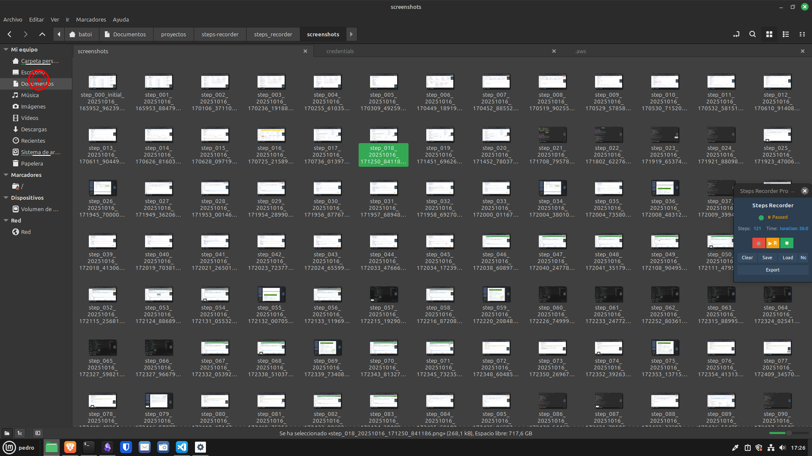

## Paso 123: click
- **Hora:** 2025-10-16T17:26:03.140035
- **Descripción:** Left-clicked at (214, 1049)
- **Ventana:** Documentos
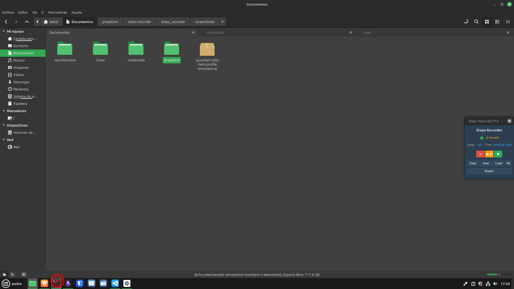

## Paso 124: click
- **Hora:** 2025-10-16T17:26:07.740364
- **Descripción:** Left-clicked at (175, 1053)
- **Ventana:** ec2-user@PGF-SSH-Server:~
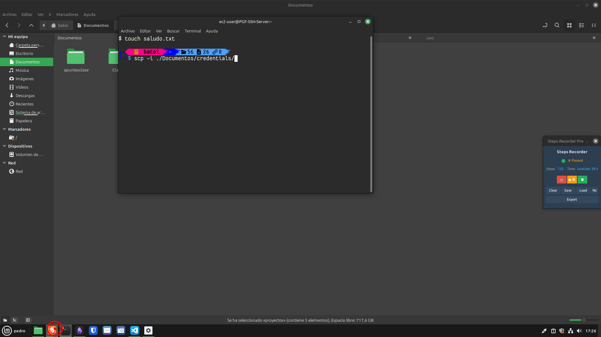

## Paso 125: click
- **Hora:** 2025-10-16T17:26:09.509079
- **Descripción:** Left-clicked at (208, 1058)
- **Ventana:** Instancias | EC2 | us-east-1 - Brave

## Paso 126: click
- **Hora:** 2025-10-16T17:26:12.256738
- **Descripción:** Left-clicked at (140, 1060)
- **Ventana:** ec2-user@PGF-SSH-Server:~
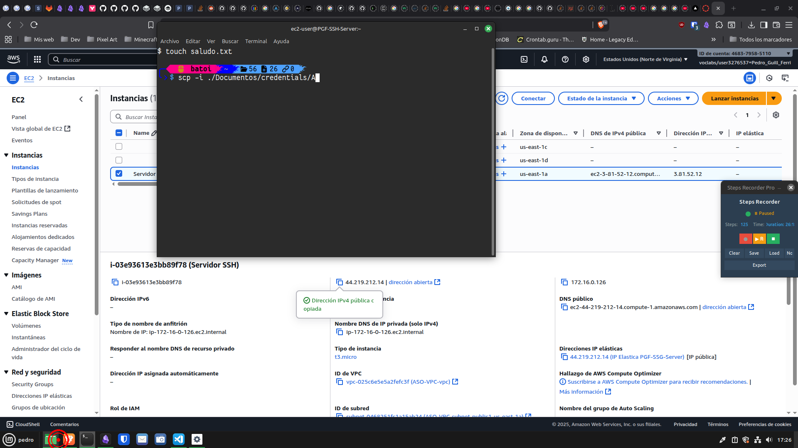

## Paso 127: click
- **Hora:** 2025-10-16T17:26:13.154968
- **Descripción:** Left-clicked at (507, 213)
- **Ventana:** Documentos
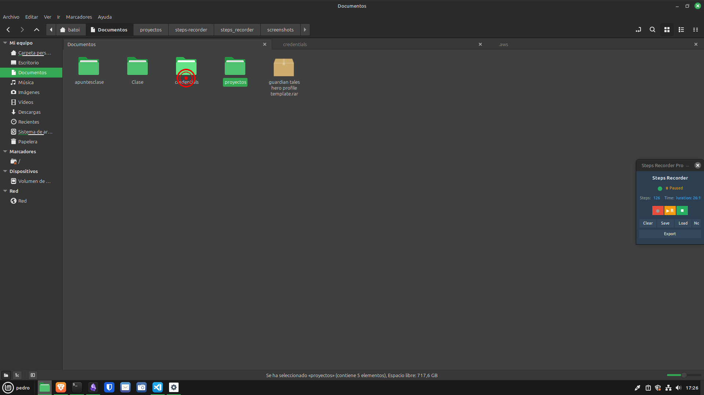

## Paso 128: click
- **Hora:** 2025-10-16T17:26:14.566975
- **Descripción:** Left-clicked at (0, 91)
- **Ventana:** Documentos

## Paso 129: click
- **Hora:** 2025-10-16T17:26:14.947296
- **Descripción:** Left-clicked at (8, 85)
- **Ventana:** Documentos
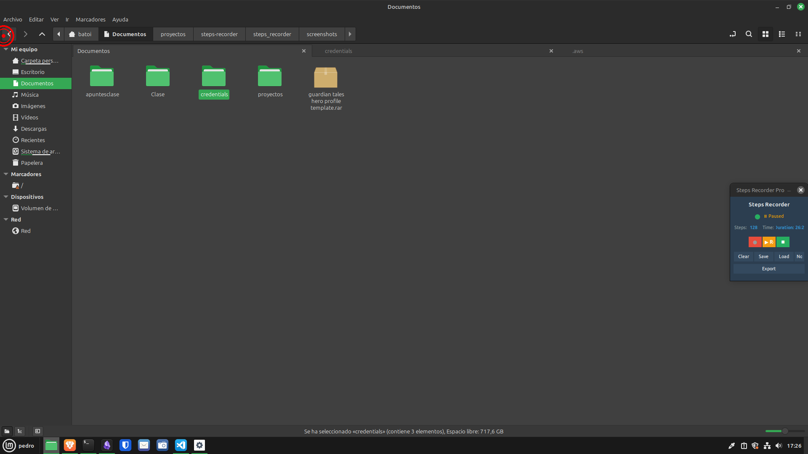

## Paso 130: click
- **Hora:** 2025-10-16T17:26:16.421278
- **Descripción:** Left-clicked at (8, 85)
- **Ventana:** screenshots
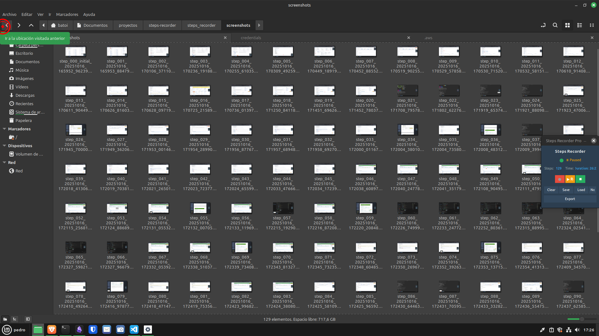

## Paso 131: click
- **Hora:** 2025-10-16T17:26:17.927360
- **Descripción:** Left-clicked at (803, 109)
- **Ventana:** steps_recorder
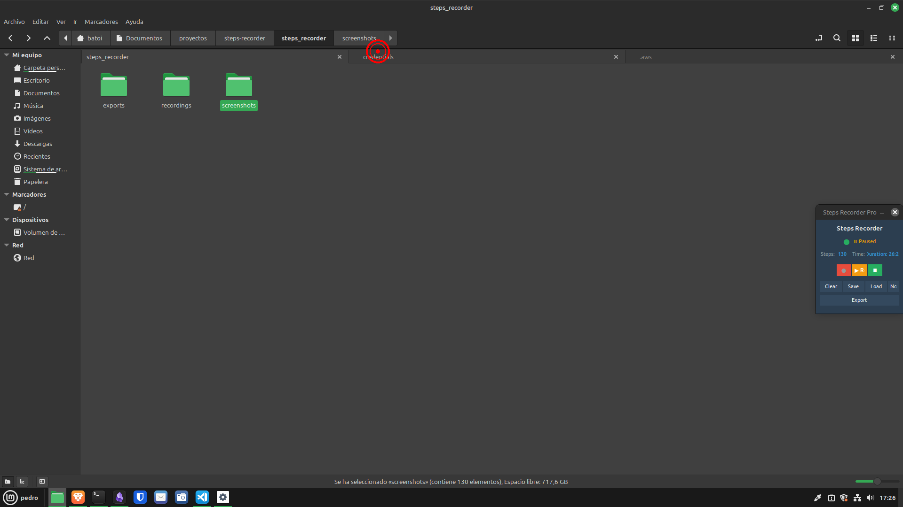

## Paso 132: click
- **Hora:** 2025-10-16T17:26:20.044168
- **Descripción:** Left-clicked at (198, 1064)
- **Ventana:** credentials
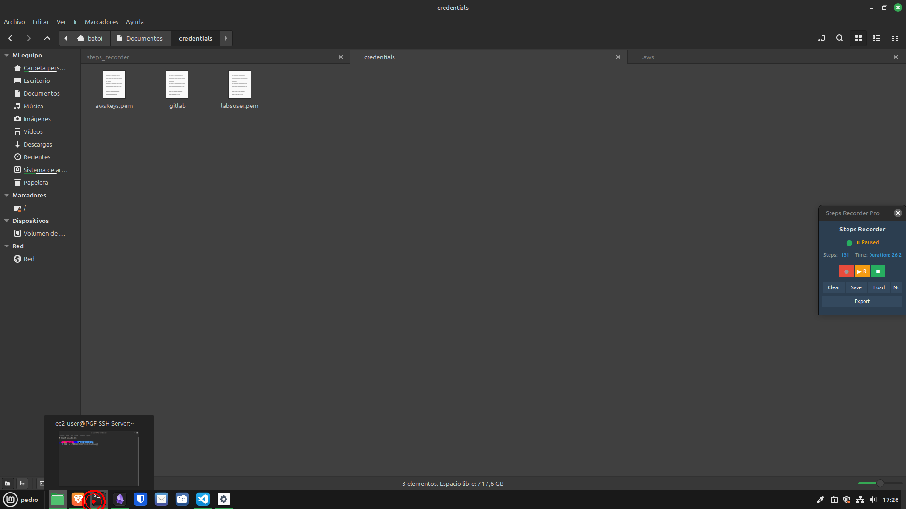

## Paso 133: click
- **Hora:** 2025-10-16T17:26:23.803790
- **Descripción:** Left-clicked at (259, 1052)
- **Ventana:** ec2-user@PGF-SSH-Server:~
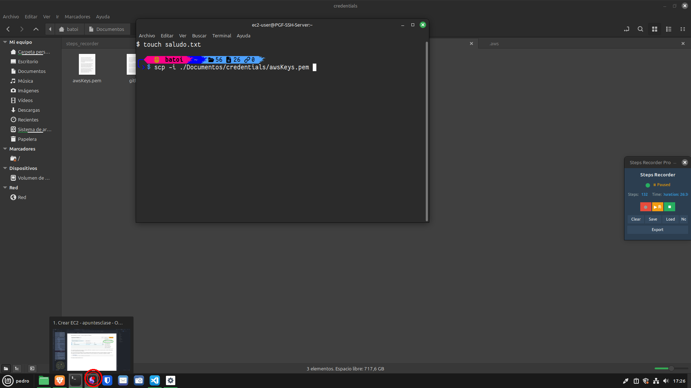

## Paso 134: click
- **Hora:** 2025-10-16T17:26:25.201650
- **Descripción:** Left-clicked at (205, 1054)
- **Ventana:** 1. Crear EC2 - apuntesclase - Obsidian v1.9.14
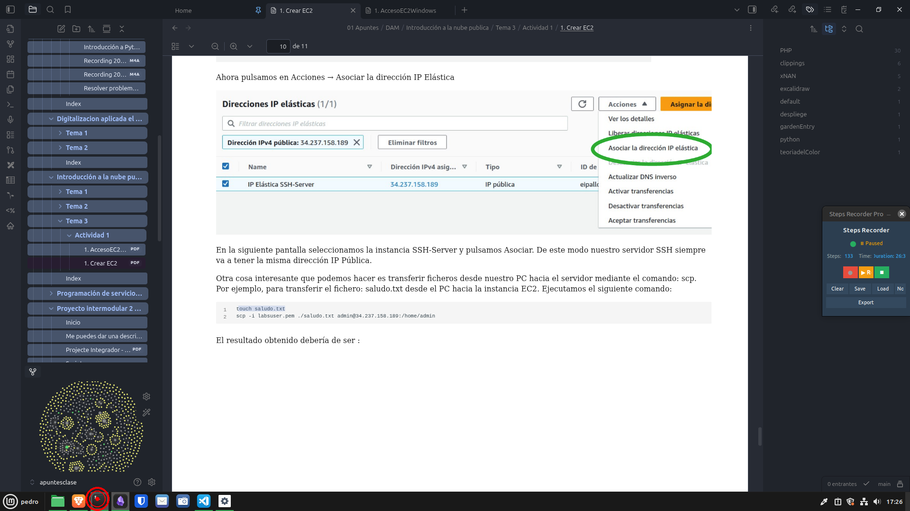

## Paso 135: click
- **Hora:** 2025-10-16T17:26:59.658441
- **Descripción:** Right-clicked at (1008, 346)
- **Ventana:** ec2-user@PGF-SSH-Server:~
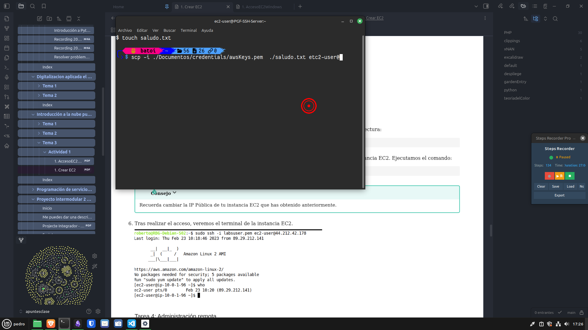

## Paso 136: click
- **Hora:** 2025-10-16T17:27:00.289704
- **Descripción:** Left-clicked at (1066, 469)
- **Ventana:** ec2-user@PGF-SSH-Server:~

## Paso 137: click
- **Hora:** 2025-10-16T17:27:04.977732
- **Descripción:** Left-clicked at (162, 1065)
- **Ventana:** ec2-user@PGF-SSH-Server:~
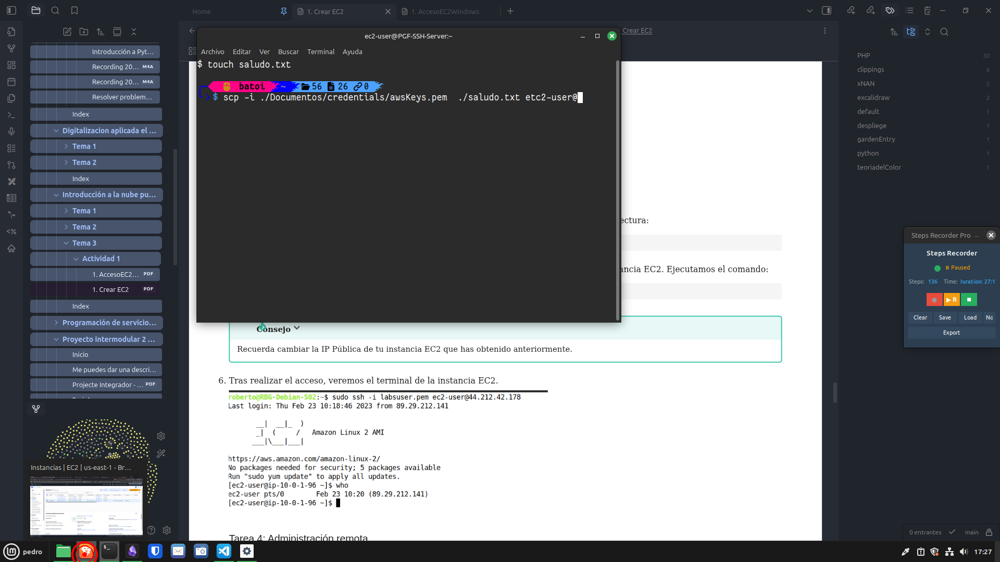

## Paso 138: click
- **Hora:** 2025-10-16T17:27:06.262588
- **Descripción:** Left-clicked at (810, 681)
- **Ventana:** Instancias | EC2 | us-east-1 - Brave
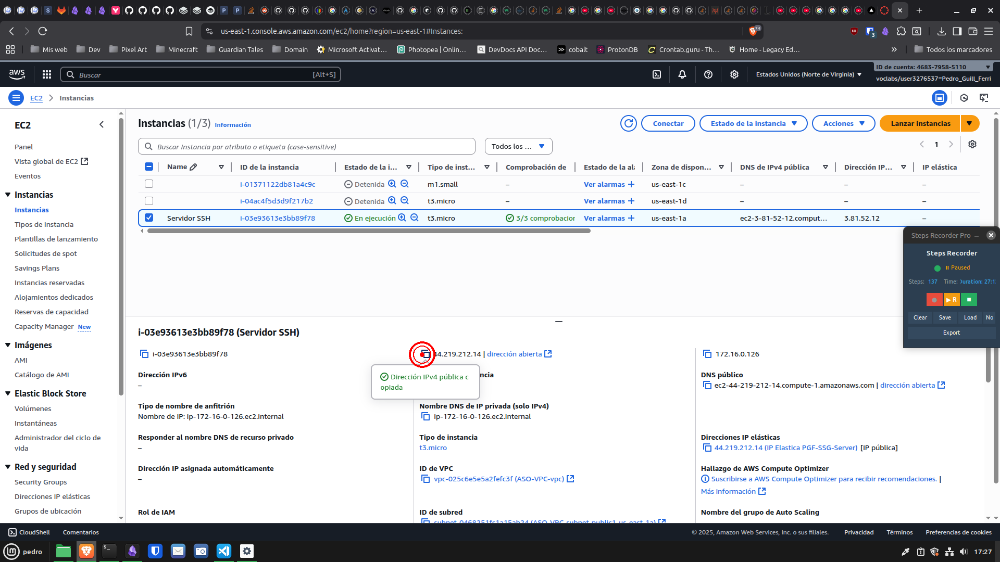

## Paso 139: click
- **Hora:** 2025-10-16T17:27:07.132692
- **Descripción:** Left-clicked at (214, 1059)
- **Ventana:** Instancias | EC2 | us-east-1 - Brave
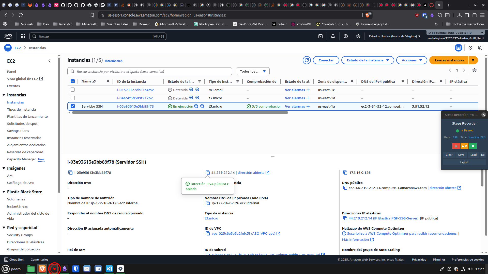

## Paso 140: click
- **Hora:** 2025-10-16T17:27:07.731159
- **Descripción:** Right-clicked at (941, 386)
- **Ventana:** ec2-user@PGF-SSH-Server:~
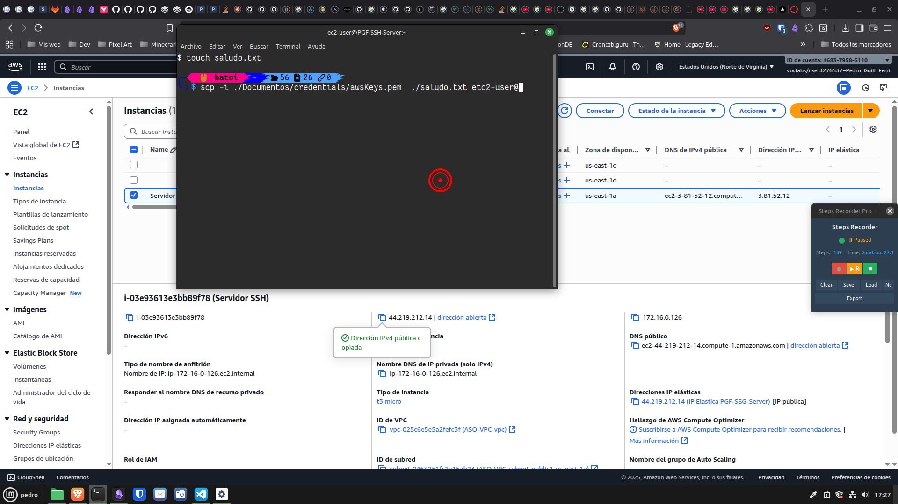

## Paso 141: click
- **Hora:** 2025-10-16T17:27:08.353242
- **Descripción:** Left-clicked at (1006, 521)
- **Ventana:** ec2-user@PGF-SSH-Server:~
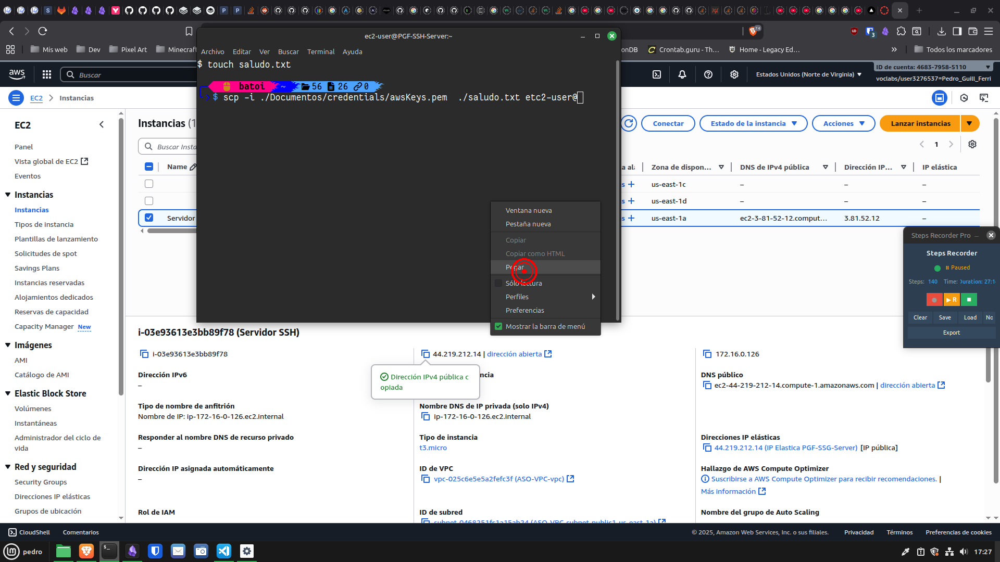

## Paso 142: click
- **Hora:** 2025-10-16T17:27:09.947306
- **Descripción:** Left-clicked at (1142, 67)
- **Ventana:** ec2-user@PGF-SSH-Server:~
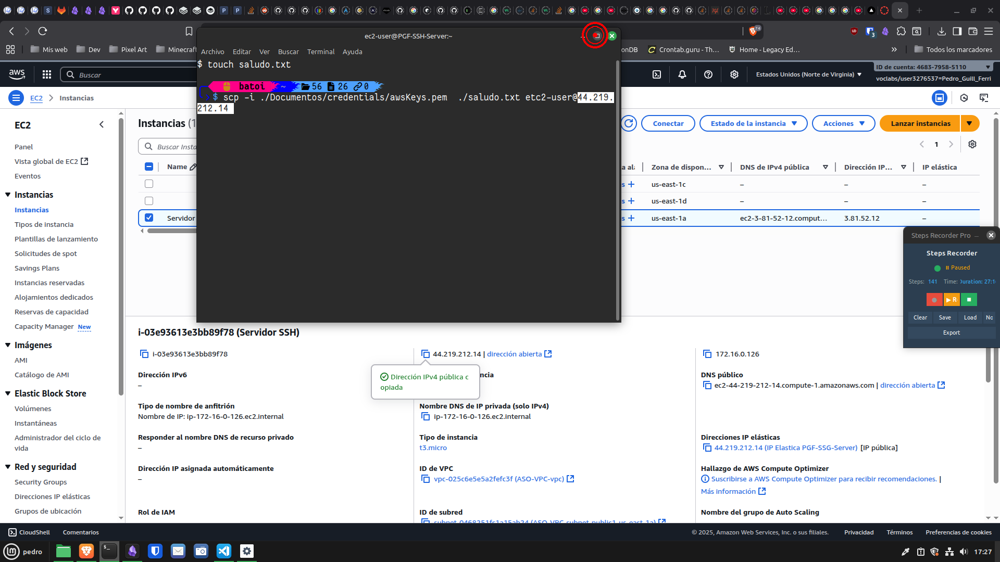

## Paso 143: click
- **Hora:** 2025-10-16T17:27:12.488444
- **Descripción:** Left-clicked at (254, 1064)
- **Ventana:** ec2-user@PGF-SSH-Server:~
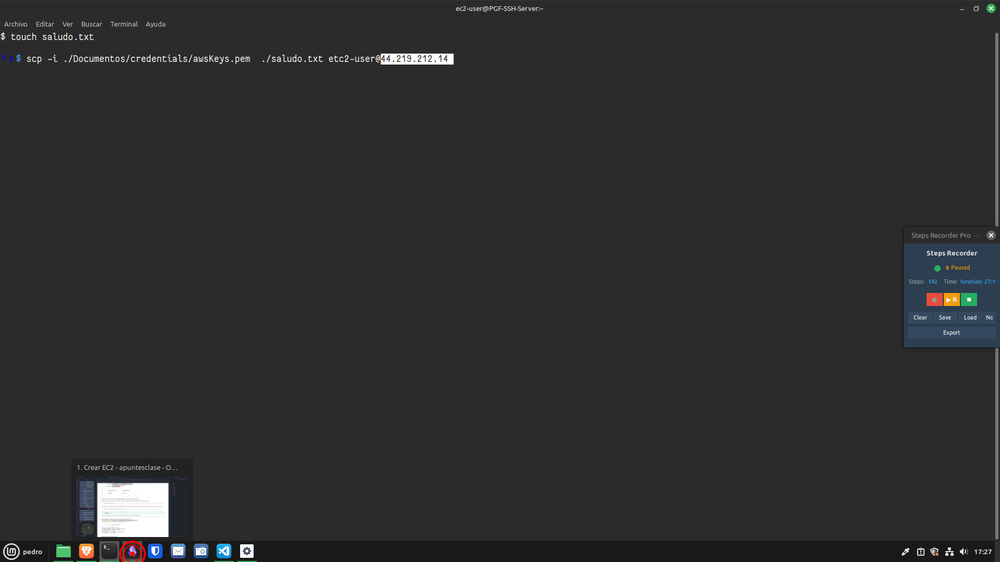

## Paso 144: click
- **Hora:** 2025-10-16T17:27:13.947951
- **Descripción:** Left-clicked at (217, 1069)
- **Ventana:** 1. Crear EC2 - apuntesclase - Obsidian v1.9.14
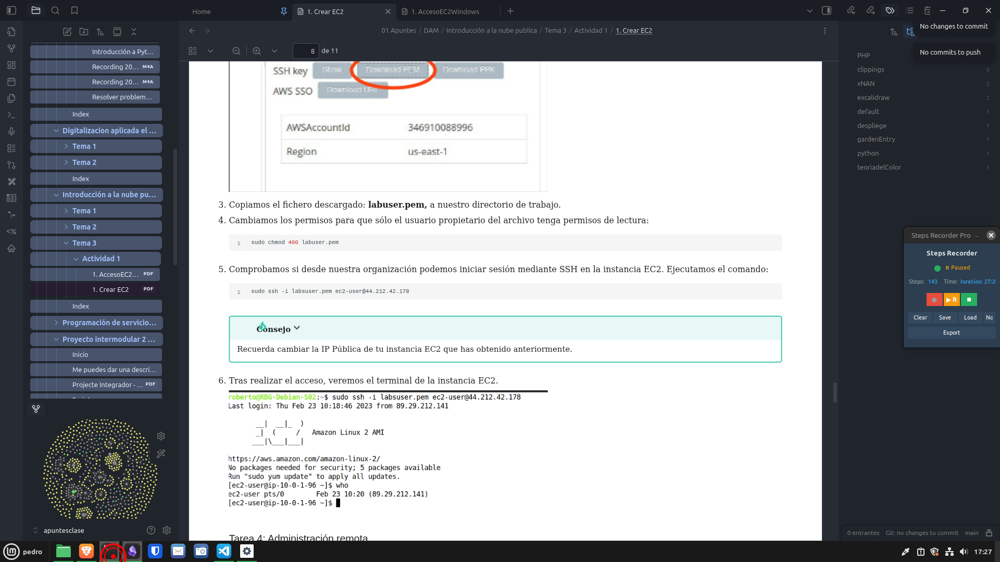

## Paso 145: click
- **Hora:** 2025-10-16T17:27:18.069077
- **Descripción:** Left-clicked at (263, 1055)
- **Ventana:** ec2-user@PGF-SSH-Server:~

## Paso 146: click
- **Hora:** 2025-10-16T17:27:30.865806
- **Descripción:** Left-clicked at (222, 1056)
- **Ventana:** 1. Crear EC2 - apuntesclase - Obsidian v1.9.14

## Paso 147: click
- **Hora:** 2025-10-16T17:27:39.546432
- **Descripción:** Left-clicked at (244, 1066)
- **Ventana:** ec2-user@PGF-SSH-Server:~
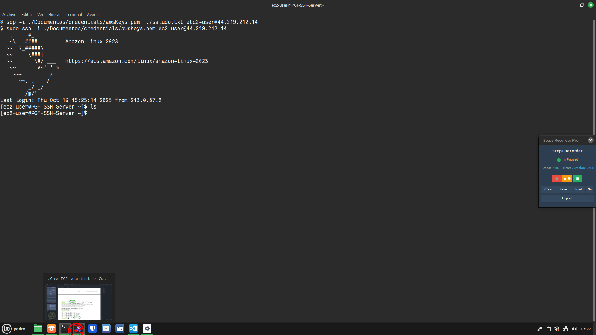

## Paso 148: click
- **Hora:** 2025-10-16T17:27:41.228232
- **Descripción:** Left-clicked at (244, 1066)
- **Ventana:** 1. Crear EC2 - apuntesclase - Obsidian v1.9.14
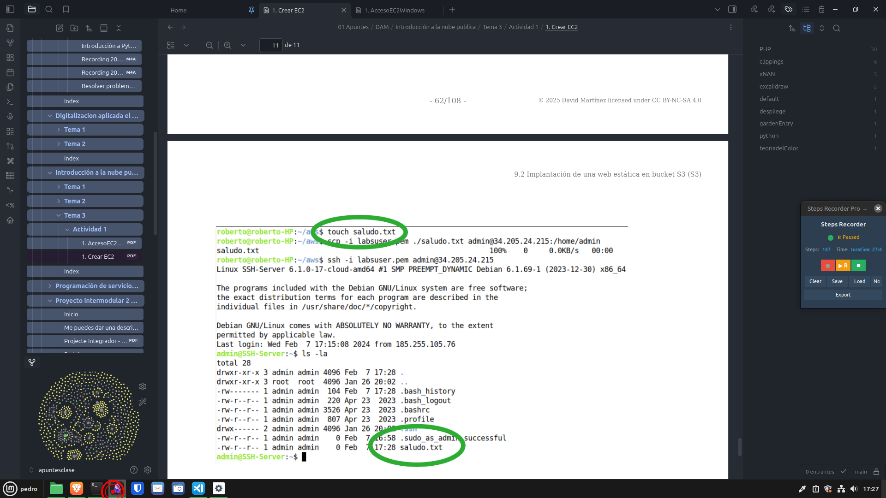

## Paso 149: click
- **Hora:** 2025-10-16T17:27:45.912164
- **Descripción:** Left-clicked at (1009, 603)
- **Ventana:** ec2-user@PGF-SSH-Server:~

## Paso 150: click
- **Hora:** 2025-10-16T17:27:55.508079
- **Descripción:** Left-clicked at (136, 1052)
- **Ventana:** ec2-user@PGF-SSH-Server:~

## Paso 151: click
- **Hora:** 2025-10-16T17:27:57.165114
- **Descripción:** Left-clicked at (587, 111)
- **Ventana:** credentials

## Paso 152: click
- **Hora:** 2025-10-16T17:27:57.871919
- **Descripción:** Left-clicked at (507, 169)
- **Ventana:** steps_recorder

## Paso 153: click
- **Hora:** 2025-10-16T17:27:58.007595
- **Descripción:** Left-clicked at (507, 169)
- **Ventana:** steps_recorder

## Paso 154: click
- **Hora:** 2025-10-16T17:28:06.690917
- **Descripción:** Left-clicked at (1312, 301)
- **Ventana:** screenshots

## Paso 155: click
- **Hora:** 2025-10-16T17:28:06.960325
- **Descripción:** Left-clicked at (1312, 301)
- **Ventana:** screenshots

## Paso 156: click
- **Hora:** 2025-10-16T17:28:15.639756
- **Descripción:** Left-clicked at (1896, 18)
- **Ventana:** step_060_20251016_172226_749997.png

## Paso 157: click
- **Hora:** 2025-10-16T17:28:17.251395
- **Descripción:** Left-clicked at (260, 1061)
- **Ventana:** Steps Recorder Pro

## Paso 158: click
- **Hora:** 2025-10-16T17:28:20.890098
- **Descripción:** Left-clicked at (203, 1063)
- **Ventana:** 1. Crear EC2 - apuntesclase - Obsidian v1.9.14

## Paso 159: click
- **Hora:** 2025-10-16T17:28:21.828142
- **Descripción:** Left-clicked at (179, 1060)
- **Ventana:** ec2-user@PGF-SSH-Server:~

## Paso 160: click
- **Hora:** 2025-10-16T17:28:23.004336
- **Descripción:** Left-clicked at (211, 1064)
- **Ventana:** Instancias | EC2 | us-east-1 - Brave

## Paso 161: click
- **Hora:** 2025-10-16T17:28:43.871828
- **Descripción:** Left-clicked at (170, 1050)
- **Ventana:** ec2-user@PGF-SSH-Server:~

## Paso 162: click
- **Hora:** 2025-10-16T17:28:44.900357
- **Descripción:** Left-clicked at (242, 1062)
- **Ventana:** Instancias | EC2 | us-east-1 - Brave

## Paso 163: click
- **Hora:** 2025-10-16T17:28:55.002889
- **Descripción:** Left-clicked at (223, 1041)
- **Ventana:** 1. Crear EC2 - apuntesclase - Obsidian v1.9.14

## Paso 164: click
- **Hora:** 2025-10-16T17:29:11.277879
- **Descripción:** Left-clicked at (260, 1068)
- **Ventana:** ec2-user@PGF-SSH-Server:~

## Paso 165: click
- **Hora:** 2025-10-16T17:29:12.970872
- **Descripción:** Middle-clicked at (838, 753)
- **Ventana:** 1. Crear EC2 - apuntesclase - Obsidian v1.9.14

## Paso 166: click
- **Hora:** 2025-10-16T17:29:20.419551
- **Descripción:** Left-clicked at (215, 1052)
- **Ventana:** 1. Crear EC2 - apuntesclase - Obsidian v1.9.14

## Paso 167: click
- **Hora:** 2025-10-16T17:29:25.832060
- **Descripción:** Left-clicked at (254, 1063)
- **Ventana:** ec2-user@PGF-SSH-Server:~

## Paso 168: click
- **Hora:** 2025-10-16T17:29:27.911167
- **Descripción:** Left-clicked at (254, 1063)
- **Ventana:** 1. Crear EC2 - apuntesclase - Obsidian v1.9.14

## Paso 169: click
- **Hora:** 2025-10-16T17:29:29.070866
- **Descripción:** Left-clicked at (802, 676)
- **Ventana:** ec2-user@PGF-SSH-Server:~

## Paso 170: click
- **Hora:** 2025-10-16T17:29:38.766376
- **Descripción:** Left-clicked at (258, 1069)
- **Ventana:** ec2-user@PGF-SSH-Server:~

## Paso 171: click
- **Hora:** 2025-10-16T17:29:46.166694
- **Descripción:** Left-clicked at (217, 1059)
- **Ventana:** 1. Crear EC2 - apuntesclase - Obsidian v1.9.14

## Paso 172: click
- **Hora:** 2025-10-16T17:29:51.917413
- **Descripción:** Left-clicked at (765, 155)
- **Ventana:** ec2-user@PGF-SSH-Server:~

## Paso 173: click
- **Hora:** 2025-10-16T17:29:53.225437
- **Descripción:** Right-clicked at (913, 153)
- **Ventana:** ec2-user@PGF-SSH-Server:~

## Paso 174: click
- **Hora:** 2025-10-16T17:29:53.977061
- **Descripción:** Left-clicked at (954, 240)
- **Ventana:** ec2-user@PGF-SSH-Server:~

## Paso 175: click
- **Hora:** 2025-10-16T17:29:54.391038
- **Descripción:** Left-clicked at (955, 240)
- **Ventana:** ec2-user@PGF-SSH-Server:~

## Paso 176: click
- **Hora:** 2025-10-16T17:29:56.916077
- **Descripción:** Right-clicked at (955, 240)
- **Ventana:** ec2-user@PGF-SSH-Server:~

## Paso 177: click
- **Hora:** 2025-10-16T17:29:58.440358
- **Descripción:** Left-clicked at (754, 369)
- **Ventana:** ec2-user@PGF-SSH-Server:~

## Paso 178: click
- **Hora:** 2025-10-16T17:30:04.602293
- **Descripción:** Right-clicked at (1020, 229)
- **Ventana:** ec2-user@PGF-SSH-Server:~

## Paso 179: click
- **Hora:** 2025-10-16T17:30:05.539263
- **Descripción:** Left-clicked at (1087, 366)
- **Ventana:** ec2-user@PGF-SSH-Server:~

## Paso 180: click
- **Hora:** 2025-10-16T17:30:06.048798
- **Descripción:** Left-clicked at (1087, 366)
- **Ventana:** ec2-user@PGF-SSH-Server:~

## Paso 181: click
- **Hora:** 2025-10-16T17:30:10.809635
- **Descripción:** Left-clicked at (1819, 567)
- **Ventana:** ec2-user@PGF-SSH-Server:~

## Paso 182: click
- **Hora:** 2025-10-16T17:30:13.588155
- **Descripción:** Left-clicked at (1820, 582)
- **Ventana:** Steps Recorder Pro

## Paso 183: click
- **Hora:** 2025-10-16T17:32:05.640481
- **Descripción:** Left-clicked at (1103, 648)
- **Ventana:** ec2-user@PGF-SSH-Server:~

## Paso 184: click
- **Hora:** 2025-10-16T17:32:18.403714
- **Descripción:** Left-clicked at (1442, 650)
- **Ventana:** ec2-user@PGF-SSH-Server:~

## Paso 185: click
- **Hora:** 2025-10-16T17:32:19.374122
- **Descripción:** Left-clicked at (1838, 585)
- **Ventana:** ec2-user@PGF-SSH-Server:~

