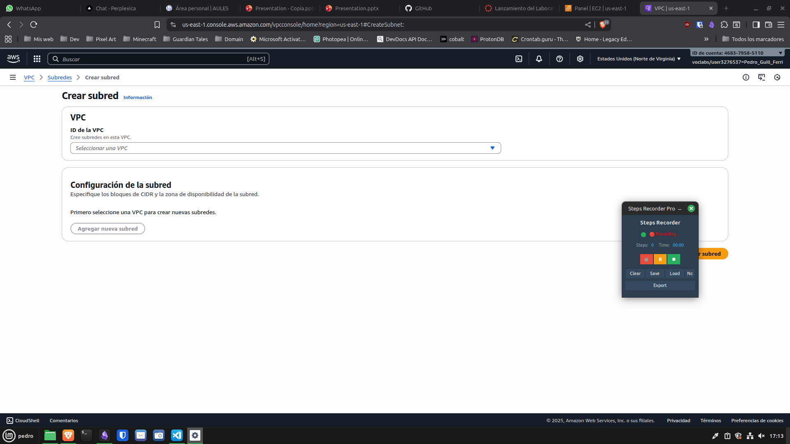
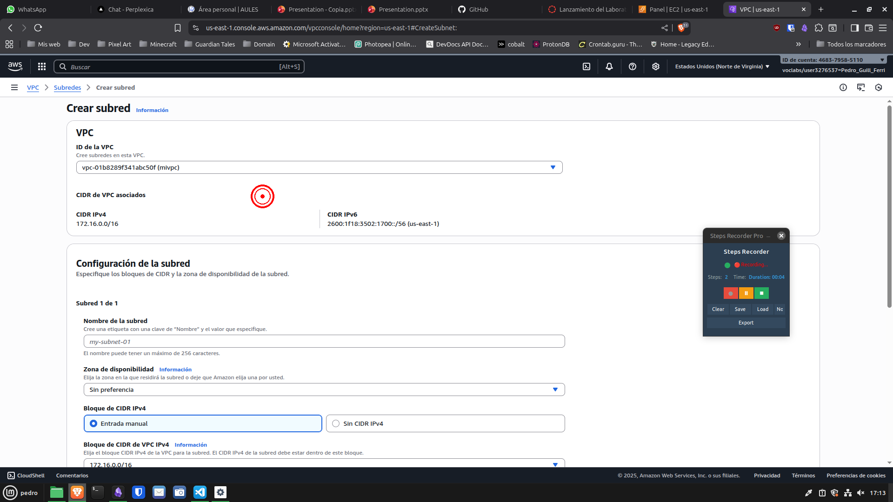
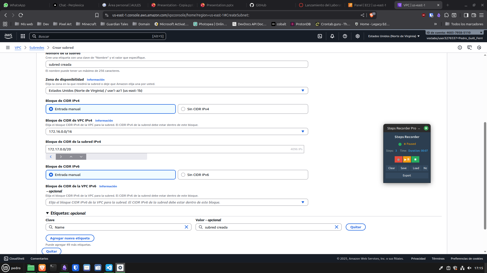
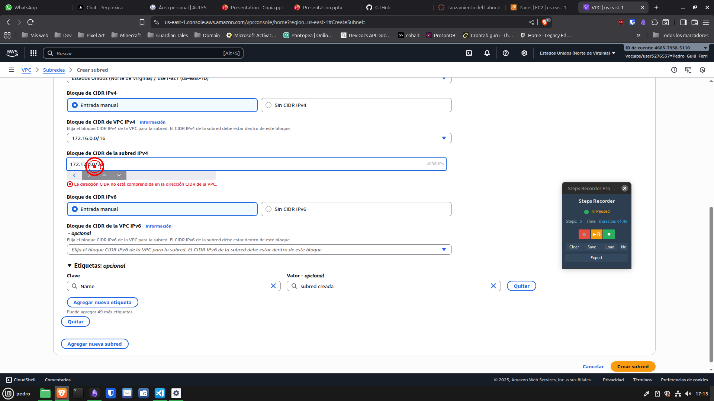
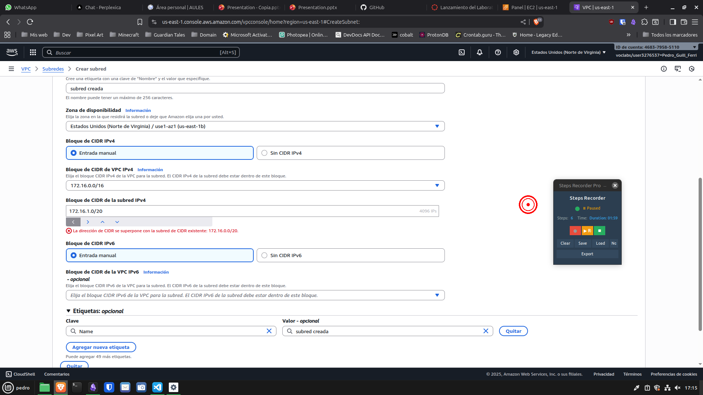

# Pasos grabados

## Paso 1: initial
- **Hora:** 2025-10-30T17:13:27.032034
- **Descripción:** Recording session started
- **Ventana:** Steps Recorder Pro

## Paso 2: click
- **Hora:** 2025-10-30T17:13:28.707827
- **Descripción:** Left-clicked at (650, 358)
- **Ventana:** VPC | us-east-1 - Brave

## Paso 3: click
- **Hora:** 2025-10-30T17:13:31.334318
- **Descripción:** Left-clicked at (564, 422)
- **Ventana:** VPC | us-east-1 - Brave

## Paso 4: annotation
- **Hora:** 2025-10-30T17:15:04.860546
- **Descripción:** Bloque de CIDR
- **Ventana:** Steps Recorder Pro

## Paso 5: click
- **Hora:** 2025-10-30T17:15:10.663592
- **Descripción:** Left-clicked at (1718, 962)
- **Ventana:** VPC | us-east-1 - Brave

## Paso 6: click
- **Hora:** 2025-10-30T17:15:13.432092
- **Descripción:** Left-clicked at (254, 448)
- **Ventana:** VPC | us-east-1 - Brave

## Paso 7: click
- **Hora:** 2025-10-30T17:15:27.077978
- **Descripción:** Left-clicked at (1442, 559)
- **Ventana:** VPC | us-east-1 - Brave

