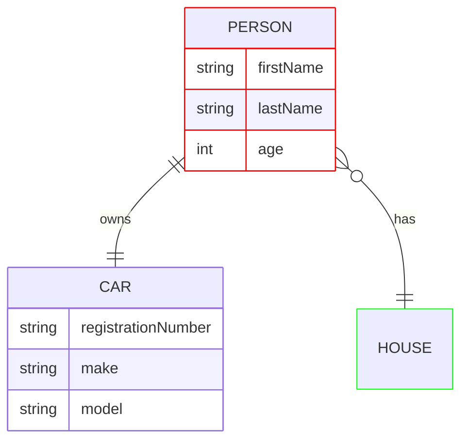
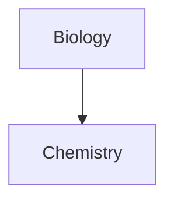

```mermaid
erDiagram
    CAR {
        string registrationNumber
        string make
        string model
    }
    PERSON {
        string firstName
        string lastName
        int age
    }
    PERSON:::foo ||--|| CAR : owns
    PERSON o{--|| HOUSE:::bar : has
    classDef foo stroke:#f00
    classDef bar stroke:#0f0
    classDef foobar stroke:#00f
```

```mermaid
graph TD

Biology --> Chemistry

class Biology,Chemistry internal-link;
```

