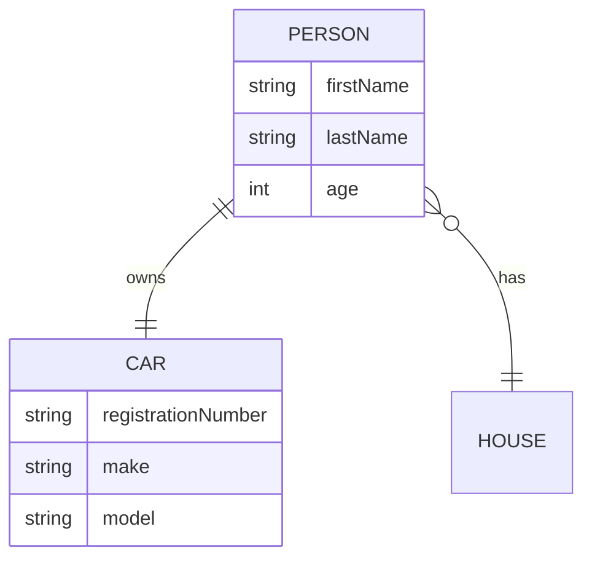

```mermaid
erDiagram

CAR {

string registrationNumber

string make

string model

}

PERSON {

string firstName

string lastName

int age

}

PERSON ||--|| CAR : owns

PERSON o{--|| HOUSE : has


```

