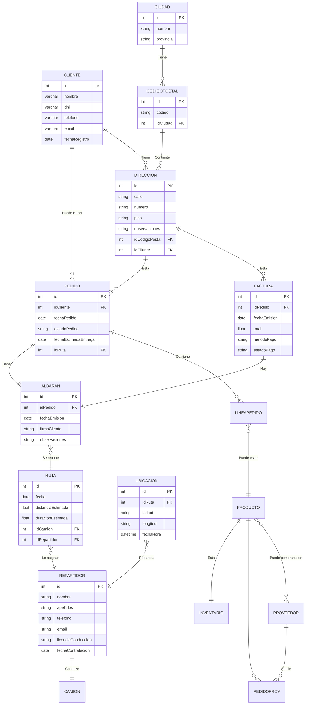

```mermaid
erDiagram

CLIENTE{
	int id pk
	varchar nombre
	varchar dni
	varchar telefono
	varchar email 
	date fechaRegistro
}
DIRECCION{
	int id PK 
	string calle 
	string numero 
	string piso 
	string observaciones 
	int idCodigoPostal FK 
	int idCliente FK
}

CODIGOPOSTAL{
	int id PK 
	string codigo 
	int idCiudad FK
}
CIUDAD{
	int id PK 
	string nombre 
	string provincia
}
FACTURA{
	int id PK 
	int idPedido FK 
	date fechaEmision 
	float total 
	string metodoPago 
	string estadoPago
}
PEDIDO{
	int id PK 
	int idCliente FK 
	date fechaPedido 
	string estadoPedido 
	date fechaEstimadaEntrega 
	int idRuta FK
}
ALBARAN{
	int id PK 
	int idPedido FK 
	date fechaEmision 
	string firmaCliente 
	string observaciones
}
RUTA{
	int id PK 
	date fecha 
	float distanciaEstimada 
	float duracionEstimada 
	int idCamion FK 
	int idRepartidor FK
}
REPARTIDOR{
	int id PK 
	string nombre 
	string apellidos 
	string telefono 
	string email 
	string licenciaConduccion 
	date fechaContratacion
}
UBICACION{
	int id PK 
	int idRuta FK 
	string latitud 
	string longitud 
	datetime fechaHora
}
CAMION{
}
LINEAPEDIDO{
}
PRODUCTO{
}
PEDIDOPROV{
}
PROVEEDOR{
}
INVENTARIO{
}
CLIENTE ||--o{ PEDIDO : "Puede Hacer"
CLIENTE ||--o{ DIRECCION : "Tiene"
DIRECCION ||--o{ PEDIDO : "Esta"
DIRECCION ||--o{ FACTURA : "Esta"
CODIGOPOSTAL ||--o{ DIRECCION: "Contiente"
CIUDAD ||--o{ CODIGOPOSTAL : "Tiene"
FACTURA ||--|| ALBARAN: "Hay"
PEDIDO ||--|| ALBARAN : "Tiene"
ALBARAN }o--|| RUTA : "Se reparte"
RUTA }o--|| REPARTIDOR : "Le asignan"
UBICACION }o--|| REPARTIDOR: "Reparte a"
REPARTIDOR ||--|| CAMION : "Conduze"
PEDIDO ||--o{ LINEAPEDIDO : "Contiene"
LINEAPEDIDO }o--|| PRODUCTO : "Puede estar"
PRODUCTO ||--|| INVENTARIO : "Esta"
PRODUCTO ||--o{ PEDIDOPROV : ""
PRODUCTO }o--o{ PROVEEDOR: "Puede comprarse en"
PROVEEDOR ||--o{ PEDIDOPROV : "Suplie"
```

