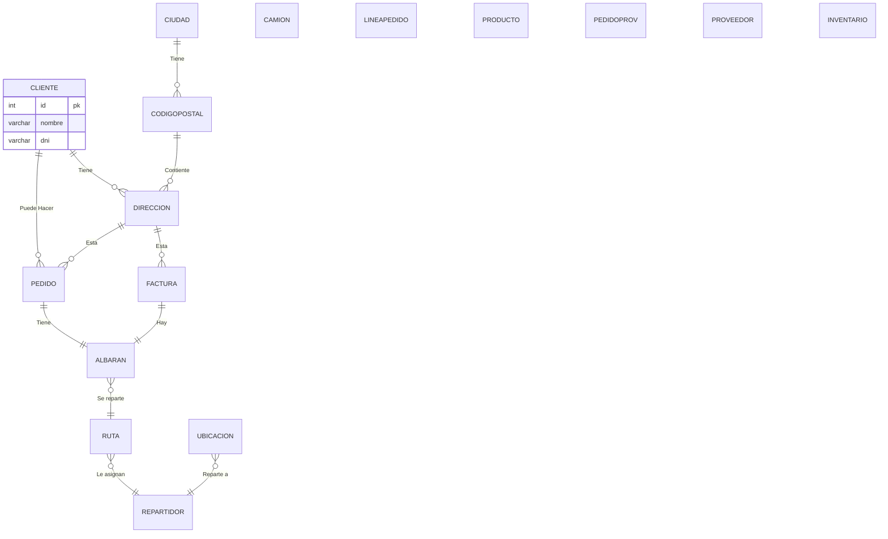

```mermaid
erDiagram

CLIENTE{
	int id pk
	varchar nombre
	varchar dni
}
DIRECCION{
}

CODIGOPOSTAL{
}
CIUDAD{
}
FACTURA{
}
PEDIDO{
}
ALBARAN{
}
RUTA{
}
REPARTIDOR{
}
UBICACION{
}
CAMION{
}
LINEAPEDIDO{
}
PRODUCTO{
}
PEDIDOPROV{
}
PROVEEDOR{
}
INVENTARIO{
}
CLIENTE ||--o{ PEDIDO : "Puede Hacer"
CLIENTE ||--o{ DIRECCION : "Tiene"
DIRECCION ||--o{ PEDIDO : "Esta"
DIRECCION ||--o{ FACTURA : "Esta"
CODIGOPOSTAL ||--o{ DIRECCION: "Contiente"
CIUDAD ||--o{ CODIGOPOSTAL : "Tiene"
FACTURA ||--|| ALBARAN: "Hay"
PEDIDO ||--|| ALBARAN : "Tiene"
ALBARAN }o--|| RUTA : "Se reparte"
RUTA }o--|| REPARTIDOR : "Le asignan"
UBICACION }o--|| REPARTIDOR: "Reparte a"
```

