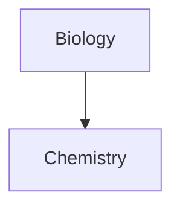

```mermaid
erDiagram
    TABLE1 ||--o{ TABLE2 : relationship
    TABLE1 {
        string id PK
        string name
    }
    TABLE2 {
        string id PK
        string description
    }
    %% Aplica la clase al nodo que quieres enlazar
    classDef internal-link fill:#f9f,stroke:#333,stroke-width:2px;
    class TABLE1 internal-link;

```




