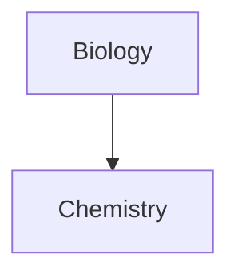

```mermaid
erDiagram
    TABLE1 ||--o{ TABLE2 : relationship
    TABLE1[[CUSTOMER]] {
        string id PK
        string name
    }
    TABLE2 {
        string id PK
        string description
    }
```




