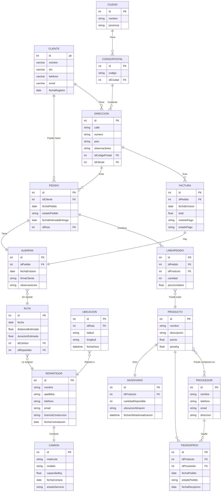

```
El plan de sostenibilidad debe centrarse en BatoiLOGIC (empresa de logística en crecimiento que digitaliza su operativa) y alinearse con los impactos ambientales, sociales y de gobernanza identificados en el módulo de Sostenibilidad y con la Agenda 2030.[1]

## 1. Métricas de sostenibilidad (5 indicadores)

Se proponen cinco indicadores sencillos de medir y alineados con el contexto logístico‑digital de BatoiLOGIC.[1]

1. kWh consumidos al mes por el servidor principal y equipos de backoffice  
   - Por qué es útil: permite evaluar si las medidas de eficiencia energética (configuración, virtualización, horarios de apagado, uso de nube, etc.) reducen el consumo ligado a la digitalización de procesos logísticos.[1]
   - Qué evalúa: impacto ambiental (energía y emisiones indirectas, categoría E de ASG) y contribución a objetivos como energía asequible y no contaminante (ODS 7) y acción por el clima (ODS 13).[1]

2. Litros de combustible consumidos por la flota de camiones por cada 100 pedidos entregados  
   - Por qué es útil: relaciona directamente la eficiencia logística (rutas, planificación de cargas, número de intentos de entrega) con el uso de combustible.[1]
   - Qué evalúa: impacto ambiental en transporte (emisiones, contaminación atmosférica) y eficiencia en la logística, alineado con la necesidad de optimitzar rutes i repartiment descrita en el proyecto.[1]

3. Kilogramos de residuos tecnológicos generados y porcentaje de reutilización/reciclaje al año  
   - Por qué es útil: permite comprobar si las medidas de economía circular (reutilizar dispositivos, reciclar hardware, alargar vida útil de tablets, servidores y periféricos) se aplican de forma efectiva.[1]
   - Qué evalúa: impacto ambiental (residuos y recursos materiales) y las bones pràctiques d’economia circular requeridas en el mòdul de Sostenibilitat.[1]

4. Número de incidencias de accesibilidad y usabilidad reportadas al mes en las aplicaciones (cliente, repartidor, backoffice)  
   - Por qué es útil: conecta el diseño de interfaces accesibles y con ajuda con la experiencia de usuarios diversos, incluyendo persones amb discapacitat, tal como se exige en DI y Sostenibilitat.[1]
   - Qué evalúa: dimensión social (S de ASG), igualdad de oportunidades de acceso al servicio y contribución a ODS como salud y bienestar (ODS 3) y reducción de desigualdades (ODS 10).[1]

5. Número de incidencias de seguridad, privacidad o uso indebido de datos registradas al año  
   - Por qué es útil: mide si las políticas de ciberseguridad y protección de datos se aplican correctamente en un contexto de digitalización (API REST, apps móviles, Odoo en la nube, geolocalización de flota, etc.).[1]
   - Qué evalúa: gobernanza y cumplimiento (G de ASG), protección de datos de clientes y proveedores, y alineación con las expectatives dels grups d’interés y riscos identificats en el projecte.[1]

## 2. Matriz ASG (5 entradas)

Tabla de ejemplo con 5 filas (mínimo) que cubren las tres dimensiones ASG para BatoiLOGIC.[1]

| Aspecto      | Problema o riesgo                                                                 | Oportunidad                                                                 | Acción propuesta                                                                                                       | Indicador ASG                                                                                          |
|--------------|------------------------------------------------------------------------------------|------------------------------------------------------------------------------|-------------------------------------------------------------------------------------------------------------------------|--------------------------------------------------------------------------------------------------------|
| Ambiental    | Consumo elevado de energía en servidor, BBDD centralitzada i equips de backoffice.| Reducir consum energètic i costos operatius de la digitalització.           | Configurar modes d’estalvi, virtualitzar serveis quan siga viable i ajustar horaris d’encesa/apagat automàtic.         | kWh consumidos al mes por servidores y equipos de backoffice (objetivo: -10% el primer año). [1] |
| Ambiental    | Alt consum de combustible per rutes poc optimitzades i intents d’entrega fallits. | Millorar eficiència logística i reduir emissions associades al repartiment. | Implementar sistema de planificació de rutes basat en dades, agrupar comandes i reduir segones entregues.              | Litros de combustible por cada 100 pedidos entregados (objetivo: -15% en dos años). [1]          |
| Ambiental    | Generació de residus tecnològics (tauletes, ordinadors, perifèrics) sense control.| Aplicar economia circular i reduir impacte de residus electrònics.         | Establir protocol de reutilització, donació i reciclatge de dispositius, amb registre anual de residus i destí final.  | kg de RAEE generados y % reutilizado/reciclado al año (objetivo: reciclar o reutilizar ≥80%). [1] |
| Social       | Aplicacions (client, repartidor, backoffice) amb mancances d’accessibilitat.       | Millorar experiència d’usuari i complir normativa d’accessibilitat.        | Dissenyar interfícies amb contrast adequat, navegació per teclat, etiquetes descriptives i textos d’ajuda contextual.  | Número de incidencias de accesibilidad/usabilidad detectadas al mes (objetivo: -50% en un año). [1] |
| Gobernanza   | Riscos en seguretat i privacitat de dades (API REST, AWS, Odoo, geolocalització). | Enfortir la confiança de clients/proveïdors i la ciberseguretat corporativa.| Definir política de seguretat, revisar rols en Odoo, auditar accessos i xifrar comunicacions i dades sensibles.         | Número de incidencias de seguridad y privacidad al año (objetivo: 0 incidentes críticos). [1]     |

Estas cinco filas se pueden ampliar o adaptar a otros riscos identificats en el análisis del model logístic i de digitalització de BatoiLOGIC, manteniendo siempre el vínculo con accions, oportunitats i indicadors.[1]

## 3. Esquema del informe de sostenibilidad (Word)

El informe debe recoger el trabajo de las dos sesiones de Sostenibilitat y poder integrarse como anex del Projecte Integrador de 2n DAM.[1]

Se puede estructurar así:

1. Introducción  
   - Breve descripción de BatoiLOGIC, su creixement logístic i el pla de digitalització (apps client, repartidor, backoffice, Odoo, API REST, AWS, etc.).[1]
   - Relación del proyecto con la sostenibilidad y con la Agenda 2030 (ODS relevantes: energía, trabajo decente, industria e innovación, ciudades sostenibles, acción climática, etc.).[1]

2. Análisis ASG inicial  
   - Resumen de los principales impactos ambientales (consumo energético, combustible, residus), sociales (condicions de treball, accessibilitat) y de gobernanza (gestió de dades, rols i responsabilitats) detectados en el model de producció i logística actual.[1]
   - Identificación de grupos de interés (clients, repartidors, personal de magatzem, direcció, proveïdors, administració pública) y riscos de no actuar de forma sostenible.[1]

3. Métricas de sostenibilidad  
   - Presentación de los cinco indicadores seleccionados (definición, fórmula de cálculo, periodicidad de medida y responsable de seguimiento).  
   - Justificación de cada indicador en relación con los impactes identifcats y con los ODS o estàndards ESG/GRI que se quieren cubrir.[1]

4. Matriz ASG del proyecto  
   - Inclusión de la tabla ASG con aspectos ambientales, sociales y de gobernanza, problemas o riscos, oportunitats, accions i indicadors.[1]
   - Explicación de cómo estas acciones se integran en el pla de transformació digital (p. ej., aprovechar el mòdul de Digitalització per a rutes més eficients i monitorització energètica).[1]

5. Plan de mejora y seguimiento  
   - Descripción de objetivos cuantitativos (porcentajes de reducción, plazos y prioridades) y acciones a corto, medio y largo plazo.  
   - Procedimientos de seguimiento y control (qui mesura, amb quines eines, amb quina periodicitat, com es reporta al projecte i a la direcció).[1]

6. Conclusión y encaje en el proyecto intermodular  
   - Breve síntesis de cómo el pla de sostenibilitat reforça els resultats d’aprenentatge del mòdul de Sostenibilitat i del Projecte (RA3 i RA4).[1]
   - Indicación de en qué apartat de la documentació del projecte s’integrarà l’informe (annex específic de sostenibilitat o secció dins del pla de transformació digital).[1]

Si quieres, se puede desarrollar el texto completo del informe a partir de este esquema y adaptarlo exactamente a tu diseño de base de dades, arquitectura d’aplicacions i decisions tècniques.

[1](https://ppl-ai-file-upload.s3.amazonaws.com/web/direct-files/attachments/6994565/1219fafc-00de-455a-926d-b25043b3c731/Projecte-Integrador-DAM_v2.0.pdf)
```