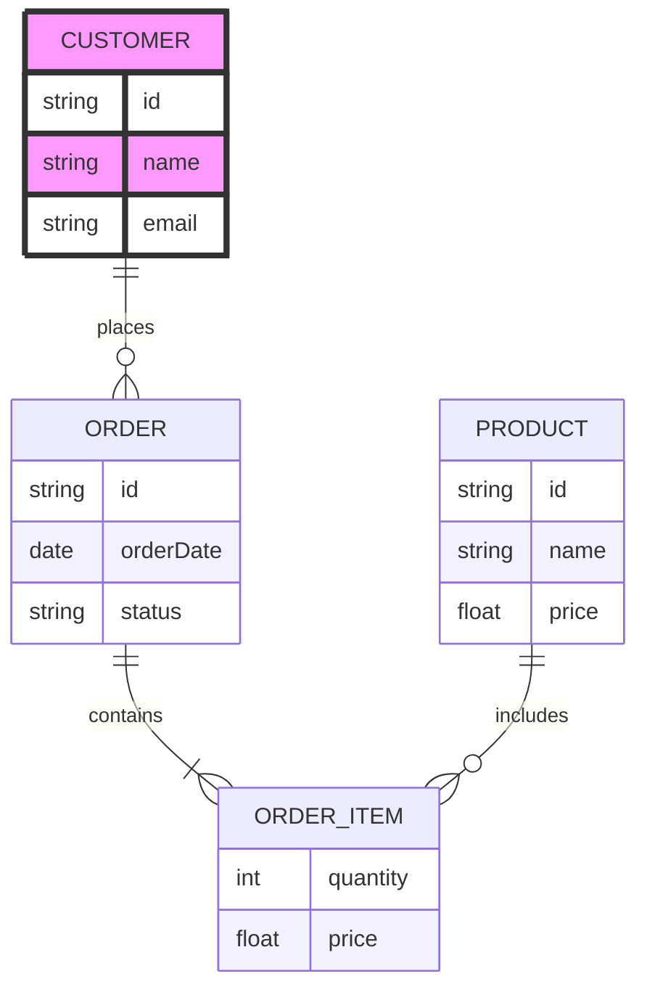

 - ### Profesora:
    
    _Cristina Balaguer Seguí_
    
    c.balaguersegui@edu.gva.es

- ### Normas para la entrega de actividades
    - **Normas para la entrega de actividades**
        Con el objetivo de mantener un estándar uniforme y facilitar la evaluación de las actividades del curso, todas las entregas deberán realizarse **exclusivamente en formato PDF**. Este formato garantiza la correcta visualización del contenido y evita problemas de compatibilidad.
        
        Cada actividad entregada deberá respetar la siguiente **estructura obligatoria**:
        1. **Portada:** Debe incluir el nombre del curso, el título de la actividad, el nombre del estudiante y la fecha de entrega.
        2. **Índice:** Presentar un listado claro de los contenidos y apartados incluidos en la actividad, con la correspondiente numeración de páginas.
        3. **Desarrollo:** Contenido principal de la actividad, redactado de manera ordenada, clara y coherente, siguiendo las indicaciones específicas de cada tarea.
        4. **Webgrafía:** Listado de todas las fuentes consultadas para la realización de la actividad, respetando normas básicas de citación académica.
El cumplimiento de esta estructura será considerado un criterio dentro de la evaluación, por lo que se solicita a los estudiantes entregar sus actividades siguiendo estas pautas de manera rigurosa


```dataviewjs
const temasRoot = dv.current().file.folder;
dv.header(1, temasRoot.split("/").pop());

// Detecta carpetas de tema
const allPages = dv.pages(`"${temasRoot}"`).where(p => p.file.path.startsWith(temasRoot));
const temasKeys = new Set();
allPages.forEach(p => {
  let folders = p.file.folder.split("/");
  folders.forEach(f => {
    if (f.startsWith("Tema ")) temasKeys.add(f);
  });
});
[...temasKeys].sort().forEach(temaKey => {
  dv.header(2, temaKey);
  // Carpeta Temario
  const temarioFolder = `${temasRoot}/${temaKey}/Temario`;
  // Markdown recursivos
  let temarioMdFiles = dv.pages().where(
    p => p.file.path.startsWith(temarioFolder)
  );
  // PDFs recursivos usando API de Obsidian
  let pdfFiles = app.vault.getFiles().filter(
    f => f.extension === "pdf" && f.path.startsWith(temarioFolder)
  );

  if (temarioMdFiles.length === 0 && pdfFiles.length === 0) {
    dv.paragraph("No hay temario");
  } else {
    dv.header(3, "Temario");
    if (temarioMdFiles.length > 0) {
      dv.list(temarioMdFiles.map(f => dv.fileLink(f.file.path)));
    }
    if (pdfFiles.length > 0) {
      dv.list(pdfFiles.map(f => dv.fileLink(f.path)));
    }
  }

  // Actividades igual que antes
  let actividades = dv.pages(`"${temasRoot}/${temaKey}"`)
    .where(p => p.file.folder.includes("Actividad"));
  if (actividades.length) {
    dv.header(3, "Actividades");
    actividades.forEach(act => {
      dv.paragraph(dv.fileLink(act.file.name));
    });
  } else {
    dv.paragraph("No hay actividades");
  }
});
```


