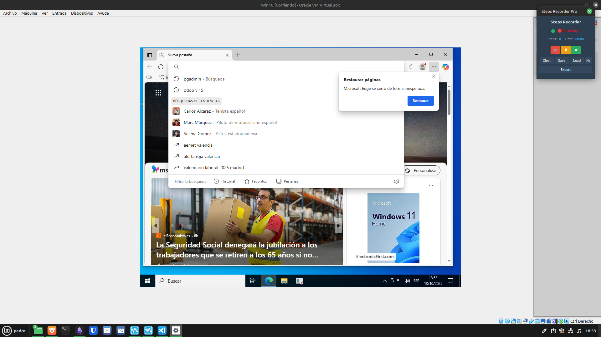
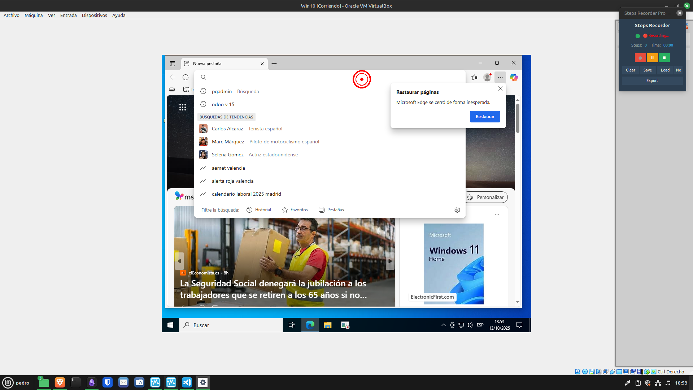
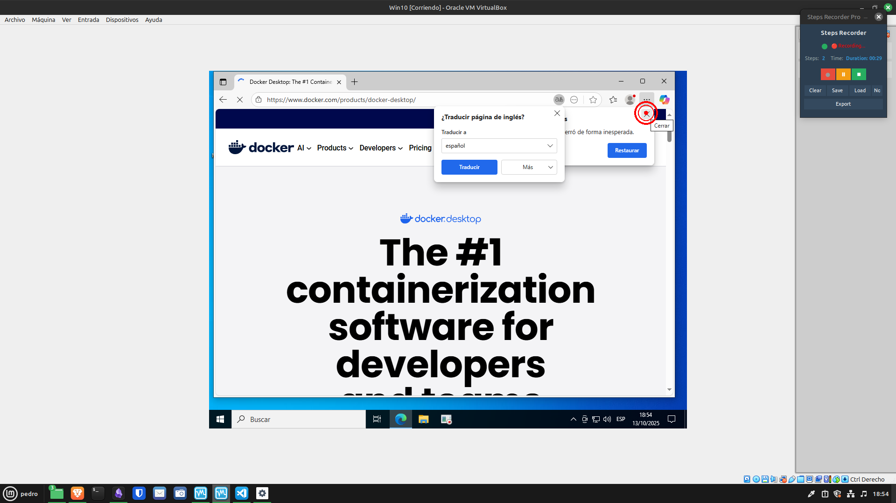
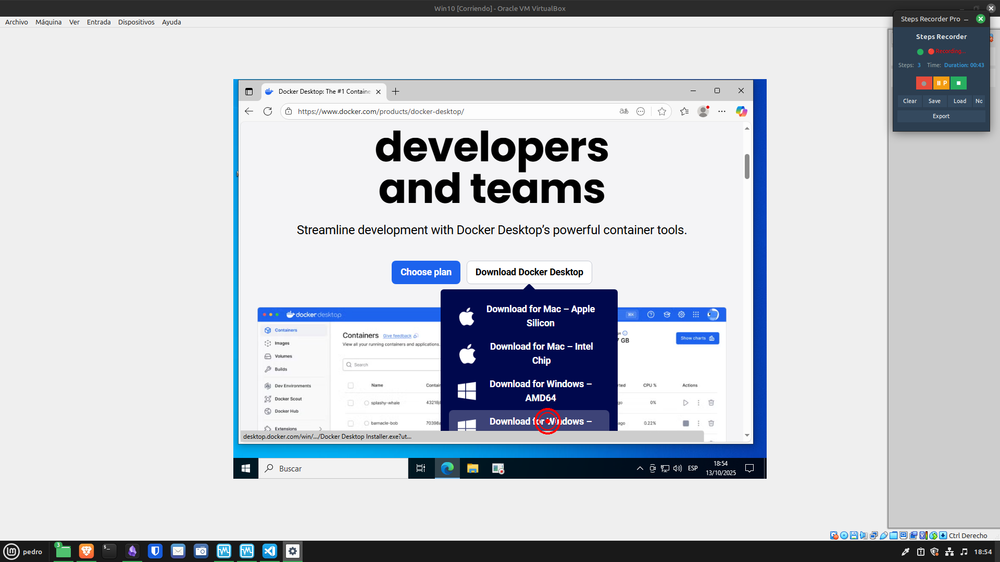
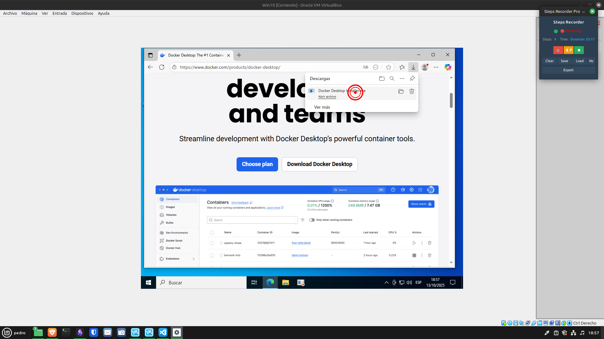
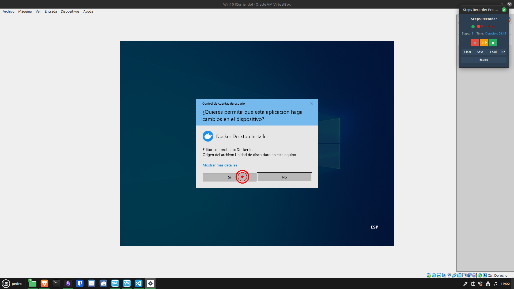
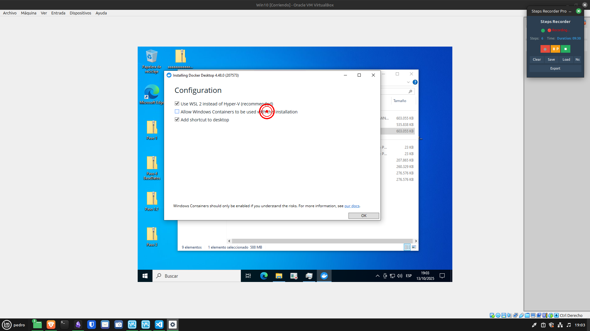
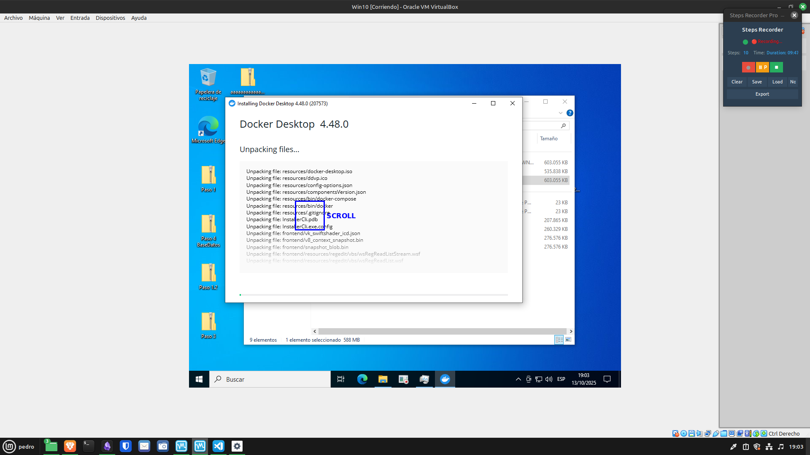
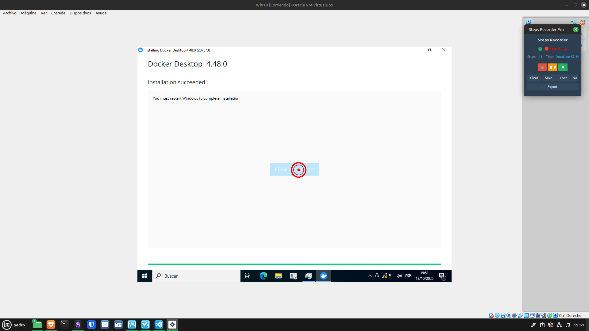
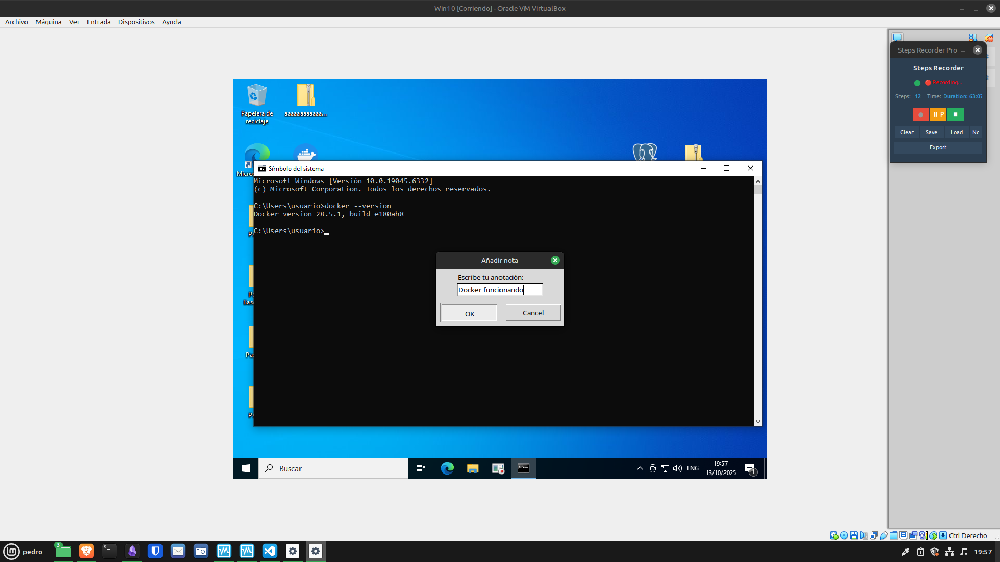

# Instalacion del docker en windows
# Pasos grabados

## Paso 1: initial
- **Hora:** 2025-10-13T18:53:52.636076
- **Descripción:** Recording session started
- **Ventana:** Steps Recorder Pro


## Paso 2: click
- **Hora:** 2025-10-13T18:53:52.640427
- **Descripción:** Left-clicked at (1002, 219)
- **Ventana:** Win10 [Corriendo] - Oracle VM VirtualBox


## Paso 3: click
- **Hora:** 2025-10-13T18:54:21.493807
- **Descripción:** Left-clicked at (1384, 242)
- **Ventana:** Win10 [Corriendo] - Oracle VM VirtualBox


## Paso 4: click
- **Hora:** 2025-10-13T18:54:35.421929
- **Descripción:** Left-clicked at (1051, 809)
- **Ventana:** Steps Recorder Pro


## Paso 5: click
- **Hora:** 2025-10-13T18:57:09.962990
- **Descripción:** Left-clicked at (1129, 294)
- **Ventana:** Win10 [Corriendo] - Oracle VM VirtualBox


## Paso 6: click
- **Hora:** 2025-10-13T19:02:38.015926
- **Descripción:** Left-clicked at (905, 660)
- **Ventana:** Win10 [Corriendo] - Oracle VM VirtualBox


## Paso 7: click
- **Hora:** 2025-10-13T19:03:22.624434
- **Descripción:** Left-clicked at (868, 363)
- **Ventana:** Steps Recorder Pro


## Paso 8: click
- **Hora:** 2025-10-13T19:03:24.920788
- **Descripción:** Left-clicked at (1181, 701)
- **Ventana:** Win10 [Corriendo] - Oracle VM VirtualBox


## Paso 9: scroll
- **Hora:** 2025-10-13T19:03:37.844529
- **Descripción:** Scrolled down (1 units) at (1054, 502)
- **Ventana:** Win10 [Corriendo] - Oracle VM VirtualBox


## Paso 10: scroll
- **Hora:** 2025-10-13T19:03:38.164112
- **Descripción:** Scrolled down (1 units) at (1054, 502)
- **Ventana:** Win10 [Corriendo] - Oracle VM VirtualBox


## Paso 11: scroll
- **Hora:** 2025-10-13T19:03:39.368917
- **Descripción:** Scrolled up (1 units) at (734, 511)
- **Ventana:** Win10 [Corriendo] - Oracle VM VirtualBox


## Paso 12: click
- **Hora:** 2025-10-13T19:51:08.540362
- **Descripción:** Left-clicked at (973, 554)
- **Ventana:** Win10 [Corriendo] - Oracle VM VirtualBox


## Paso 13: annotation
- **Hora:** 2025-10-13T19:57:06.286290
- **Descripción:** Docker funcionando
- **Ventana:** Steps Recorder Pro


# Istalacion docker en linux

Ejecutar esto en la consola

```bash
for pkg in docker.io docker-doc docker-compose docker-compose-v2 podmandocker containerd runc; do sudo apt-get remove $pkg; done
sudo apt-get update
sudo apt-get install ca-certificates curl
sudo install -m 0755 -d /etc/apt/keyrings
sudo curl -fsSL https://download.docker.com/linux/ubuntu/gpg -o /etc/apt/keyrings/docker.asc
sudo chmod a+r /etc/apt/keyrings/docker.asc

echo "deb [arch=$(dpkg --print-architecture) signedby=/etc/apt/keyrings/docker.asc] https://download.docker.com/linux/ubuntu $(. /etc/os-release && echo "${UBUNTU_CODENAME:-$VERSION_CODENAME}") stable" | sudo tee /etc/apt/sources.list.d/docker.list > /dev/null
sudo apt-get update

sudo apt-get install docker-ce docker-ce-cli containerd.io docker-buildx-plugin docker-compose-plugin

sudo groupadd docker
sudo usermod -aG docker $USER

newgrp docker
```
![[Pasted image 20251013200601.png]]


# Odoo en linux

Fichero docker compose:
```yml
services:
	web:
		image: odoo:15.0
		depends_on:
			- db
		ports:
			- "8069:8069"
		volumes:
			- ./odoo-data:/var/lib/odoo
			- ./odoo-config:/etc/odoo
			- ./odoo-addons:/mnt/extra-addons
	db:
		image: postgres:15
		environment:
			- POSTGRES_DB=postgres
			- POSTGRES_PASSWORD=odoo
			- POSTGRES_USER=odoo
			- PGDATA=/var/lib/postgresql/data/pgdata
		volumes:
			- ./odoo-db:/var/lib/postgresql/data/pgdata
```

Captura del `docker compose up -d`
![[Pasted image 20251013201607.png]]

