# 1. Crea 5 proveedores diferentes rellenando toda la información de cada uno.

## Paso 1:Ir a sección de compras
Para crear los proveedores vamos a abrir el meno y seleccionar la opción Compra.

## Paso 2: Ir a pestaña de proveedores
Ahora desde compras vamos a tener que ir a la pestaña proveedores

## Paso 3: Creación del proveedor
Para creear el proveedor vamos a hacer una compañia y rellenaremos todos los datos posibles

## Paso 4: Crear Contacto empresa
Antes de finalizar la creación del proovedor vamos a crear un contacto para poder comunicarnos con el

## Paso 5: Seleccionar método de venta y guardar
Ahora vamos a introducir los datos necesarios de ventas y guardamos

# 2. Crea las categorías de los productos y a continuación, crea 5 productos distintos con la información de cada uno de los apartados asociados a este.
### Categorias

## Paso 1: initial
- **Hora:** 2025-10-23T19:57:28.363274
- **Descripción:** Recording session started
- **Ventana:** Steps Recorder Pro

## Paso 2: click
- **Hora:** 2025-10-23T19:57:30.695577
- **Descripción:** Left-clicked at (460, 140)
- **Ventana:** Odoo - Solicitudes de presupuesto - Brave
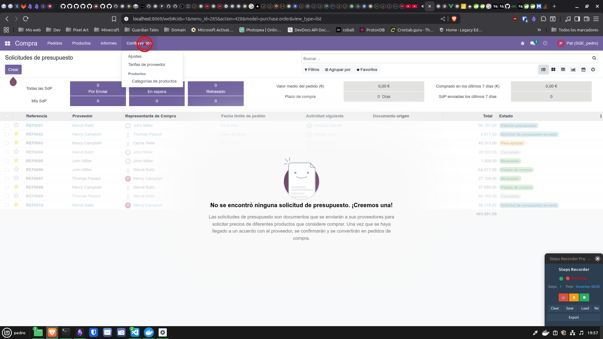

## Paso 3: click
- **Hora:** 2025-10-23T19:57:34.367000
- **Descripción:** Left-clicked at (559, 255)
- **Ventana:** Odoo - Categorías de productos - Brave
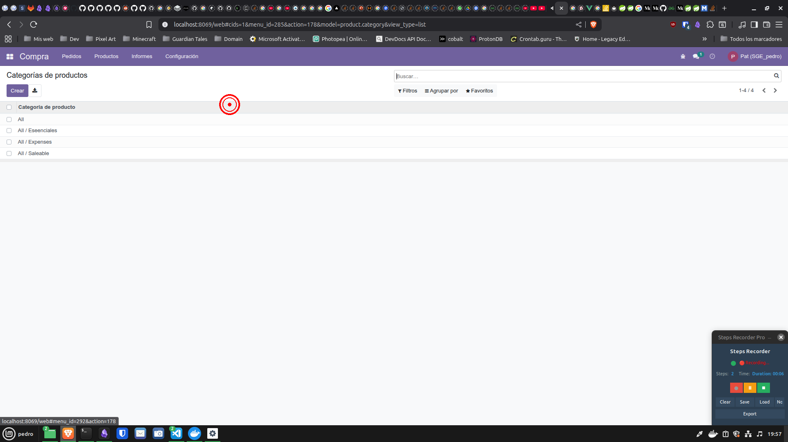

## Paso 4: click
- **Hora:** 2025-10-23T19:57:48.103775
- **Descripción:** Left-clicked at (33, 222)
- **Ventana:** Odoo - Nuevo - Brave
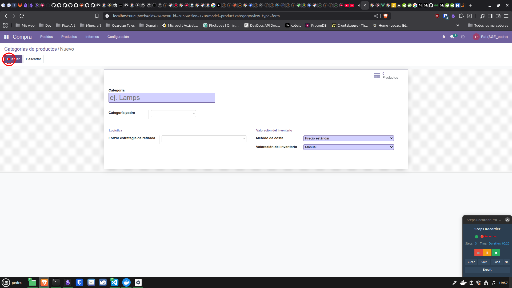

## Paso 5: annotation
- **Hora:** 2025-10-23T19:58:53.913254
- **Descripción:** Categoria Materiales la cual es hija de esenciales
- **Ventana:** Steps Recorder Pro
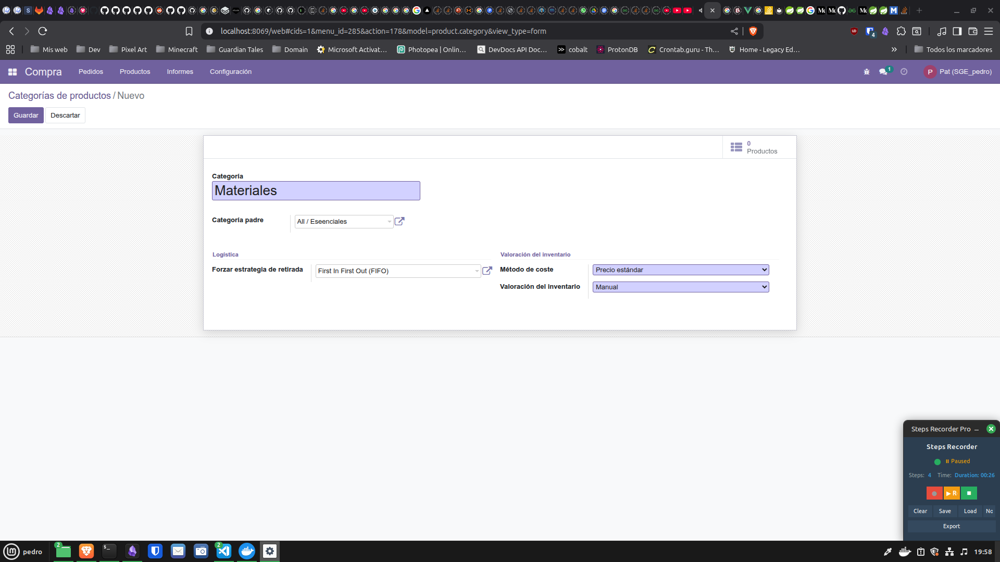

## Paso 6: click
- **Hora:** 2025-10-23T19:58:56.976877
- **Descripción:** Left-clicked at (52, 222)
- **Ventana:** Odoo - All / Eseenciales / Materiales - Brave
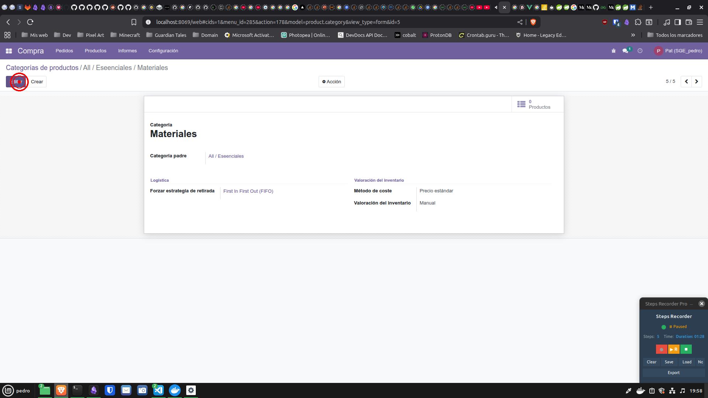

## Paso 7: click
- **Hora:** 2025-10-23T19:58:59.691617
- **Descripción:** Left-clicked at (173, 182)
- **Ventana:** Odoo - Categorías de productos - Brave
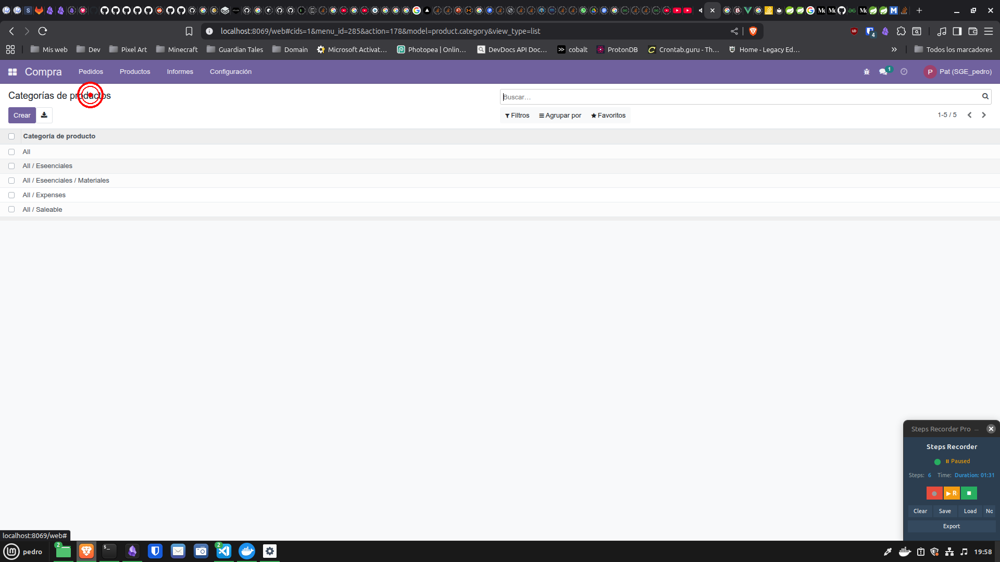
### Productos
## Paso 1: annotation
- **Hora:** 2025-10-23T20:03:46.533821
- **Descripción:** Creacion de Producto Info
- **Ventana:** Steps Recorder Pro
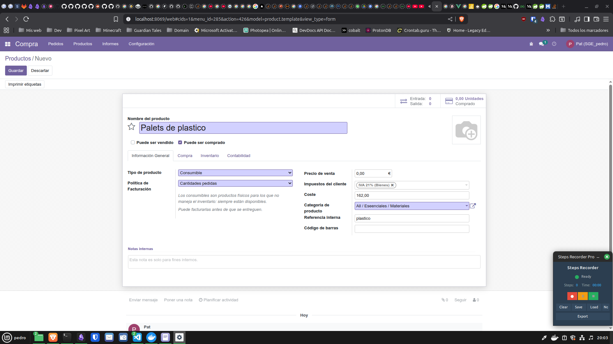

## Paso 2: annotation
- **Hora:** 2025-10-23T20:04:39.692788
- **Descripción:** Creacion de Producto Compra
- **Ventana:** Steps Recorder Pro

## Paso 3: annotation
- **Hora:** 2025-10-23T20:05:23.988568
- **Descripción:** Creacion de producto Inventario
- **Ventana:** Steps Recorder Pro
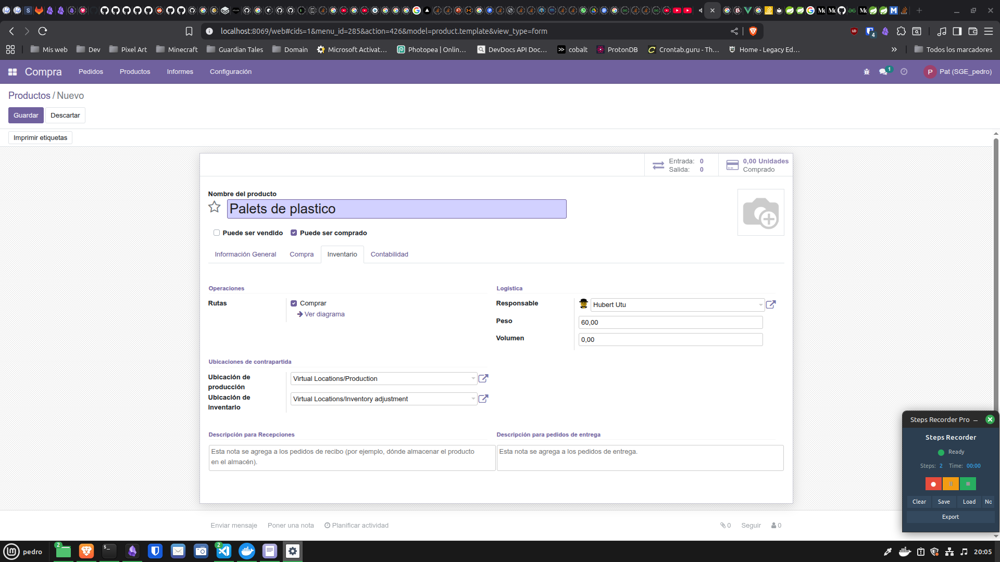

# 3. Realiza una solicitud de compra para cada producto de 50, 30, 20, 15 y 5. (Respectivamente a la creación del producto).
# Pasos grabados

## Paso 1: annotation
- **Hora:** 2025-10-23T20:15:50.076796
- **Descripción:** Creacion de Pedido de compra de Palets de plastico
- **Ventana:** Steps Recorder Pro
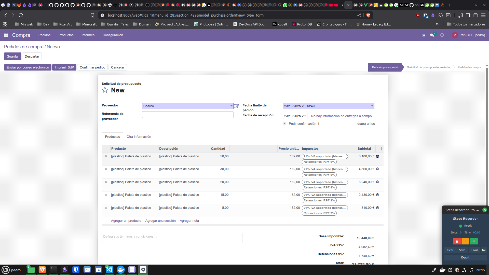

## Paso 2: initial
- **Hora:** 2025-10-23T20:16:28.468723
- **Descripción:** Recording session started
- **Ventana:** Steps Recorder Pro
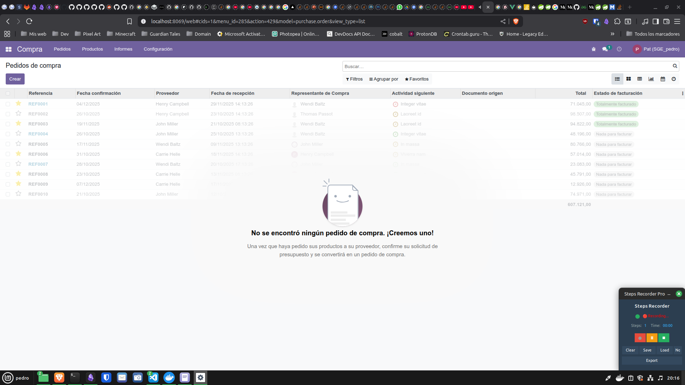

## Paso 3: click
- **Hora:** 2025-10-23T20:16:29.772730
- **Descripción:** Left-clicked at (32, 221)
- **Ventana:** Odoo - Nuevo - Brave
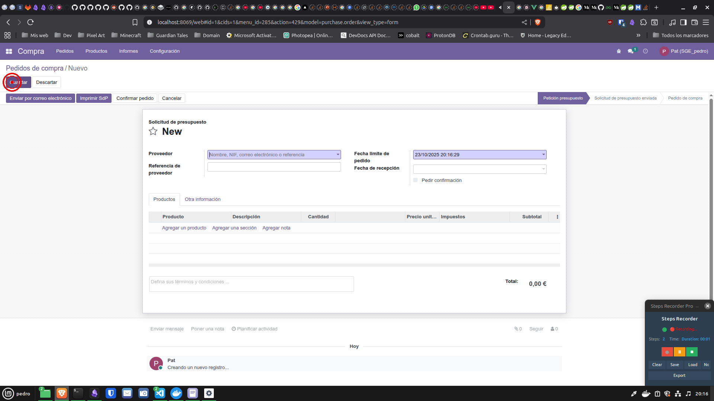

## Paso 4: click
- **Hora:** 2025-10-23T20:16:31.493811
- **Descripción:** Left-clicked at (753, 419)
- **Ventana:** Odoo - Nuevo - Brave

## Paso 5: click
- **Hora:** 2025-10-23T20:16:33.150701
- **Descripción:** Left-clicked at (716, 485)
- **Ventana:** Odoo - Nuevo - Brave
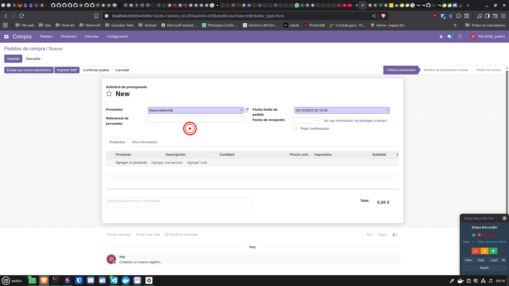

## Paso 6: click
- **Hora:** 2025-10-23T20:16:34.346936
- **Descripción:** Left-clicked at (532, 609)
- **Ventana:** Odoo - Nuevo - Brave

## Paso 7: click
- **Hora:** 2025-10-23T20:16:35.551118
- **Descripción:** Left-clicked at (531, 615)
- **Ventana:** Odoo - Nuevo - Brave

## Paso 8: click
- **Hora:** 2025-10-23T20:16:36.801156
- **Descripción:** Left-clicked at (561, 676)
- **Ventana:** Odoo - Nuevo - Brave

## Paso 9: click
- **Hora:** 2025-10-23T20:16:40.280570
- **Descripción:** Left-clicked at (871, 614)
- **Ventana:** Odoo - Nuevo - Brave

## Paso 10: click
- **Hora:** 2025-10-23T20:16:48.340004
- **Descripción:** Left-clicked at (324, 703)
- **Ventana:** Odoo - Nuevo - Brave

# 4. Envíalo al proveedor correspondiente y confirma el pedido de cada producto.

Cuando este la solicitud solo le das a Confirmar pedido y se le envia al prooveedor

![[Pasted image 20251023202217.png]]

# 5. Recibe los productos y crea la factura. Luego confírmalo.

## Paso 1: initial
- **Hora:** 2025-10-23T20:24:37.374418
- **Descripción:** Recording session started
- **Ventana:** Steps Recorder Pro
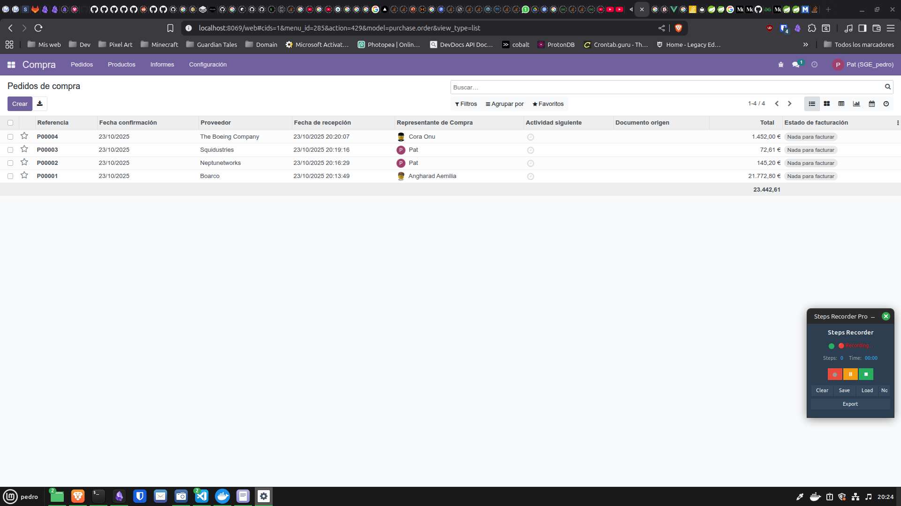

## Paso 2: click
- **Hora:** 2025-10-23T20:24:40.355628
- **Descripción:** Left-clicked at (132, 294)
- **Ventana:** Odoo - P00004 - Brave
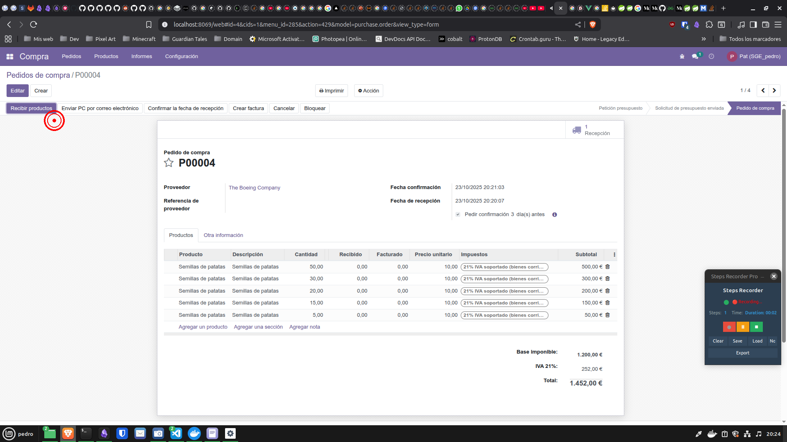

## Paso 3: click
- **Hora:** 2025-10-23T20:24:46.930838
- **Descripción:** Left-clicked at (505, 272)
- **Ventana:** Odoo - P00004 - Brave

## Paso 4: click
- **Hora:** 2025-10-23T20:24:57.423094
- **Descripción:** Left-clicked at (75, 266)
- **Ventana:** Odoo - P00004 - Brave
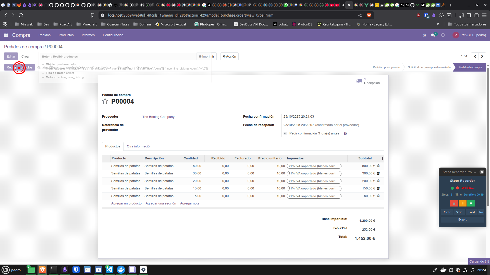

## Paso 5: click
- **Hora:** 2025-10-23T20:25:20.069209
- **Descripción:** Left-clicked at (56, 266)
- **Ventana:** Odoo - WH/IN/00004 - Brave
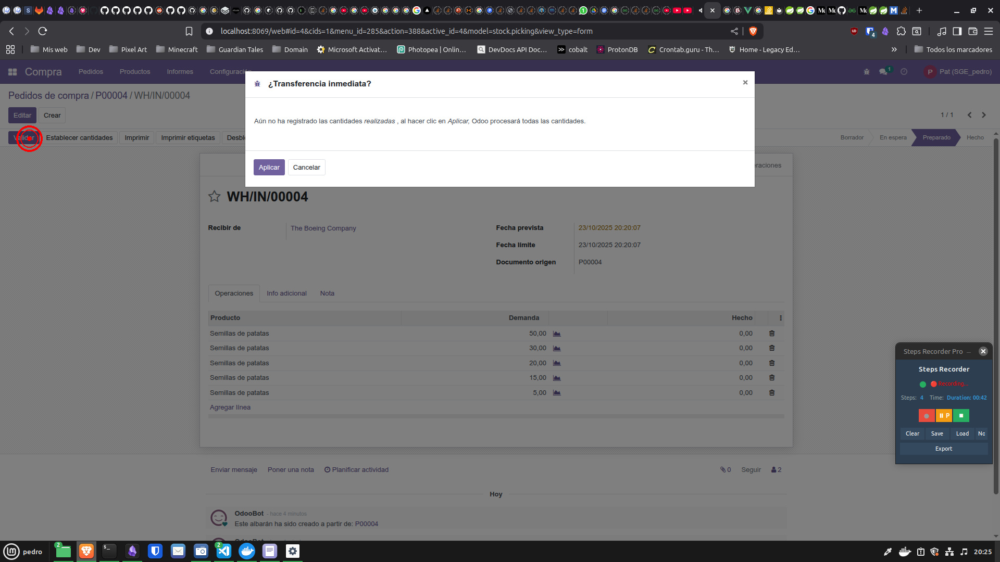

## Paso 6: click
- **Hora:** 2025-10-23T20:25:24.330016
- **Descripción:** Left-clicked at (517, 334)
- **Ventana:** Odoo - stock.immediate.transfer,1 - Brave
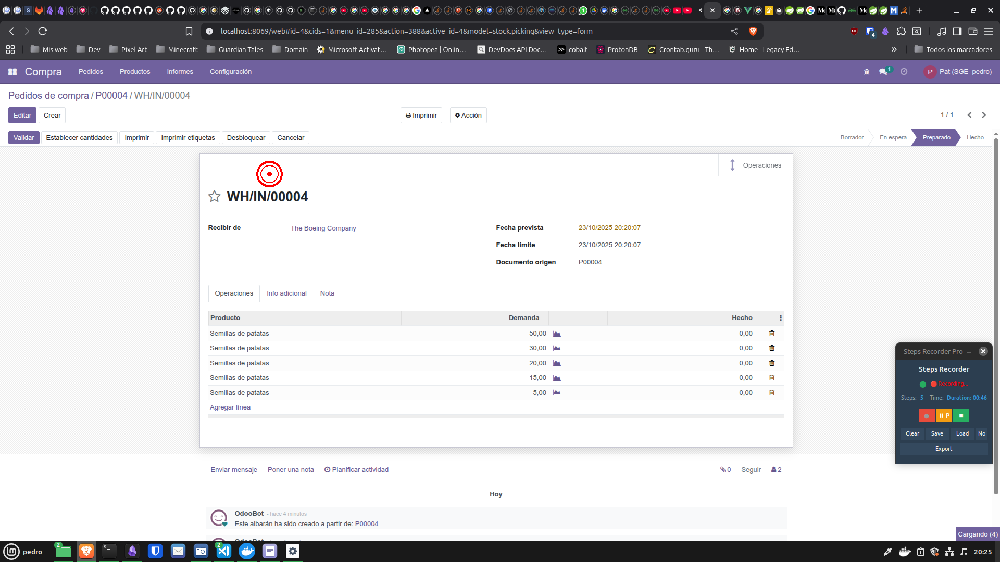

## Paso 7: click
- **Hora:** 2025-10-23T20:25:36.318362
- **Descripción:** Left-clicked at (887, 216)
- **Ventana:** Odoo - WH/IN/00004 - Brave
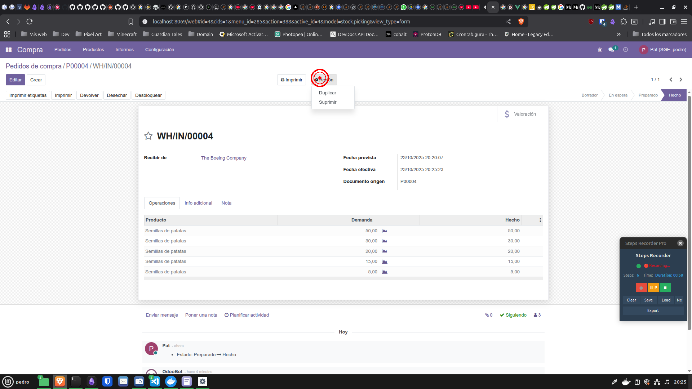

## Paso 8: click
- **Hora:** 2025-10-23T20:26:16.117114
- **Descripción:** Left-clicked at (31, 258)
- **Ventana:** Odoo - P00004 - Brave

## Paso 9: click
- **Hora:** 2025-10-23T20:26:25.645845
- **Descripción:** Left-clicked at (67, 259)
- **Ventana:** Odoo - Borrador de factura FACTU/2025/10/0001 - Brave
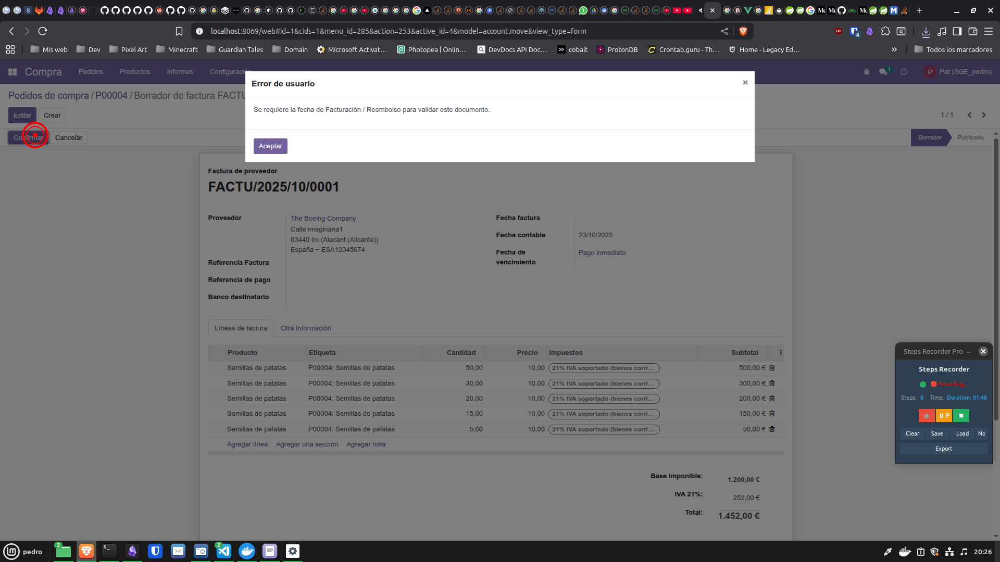

## Paso 10: click
- **Hora:** 2025-10-23T20:26:29.016972
- **Descripción:** Left-clicked at (534, 279)
- **Ventana:** Odoo - Borrador de factura FACTU/2025/10/0001 - Brave
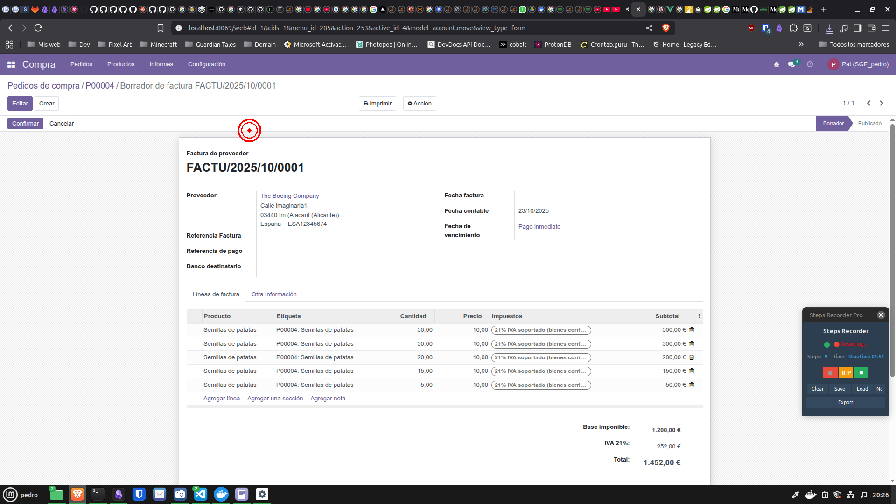

# 6. Para realizar el pago: crea previamente el banco, y luego realiza el pago. 
## Paso 4: click
- **Hora:** 2025-10-24T16:23:47.352992
- **Descripción:** Left-clicked at (759, 411)
- **Ventana:** Odoo - Facturas - Brave
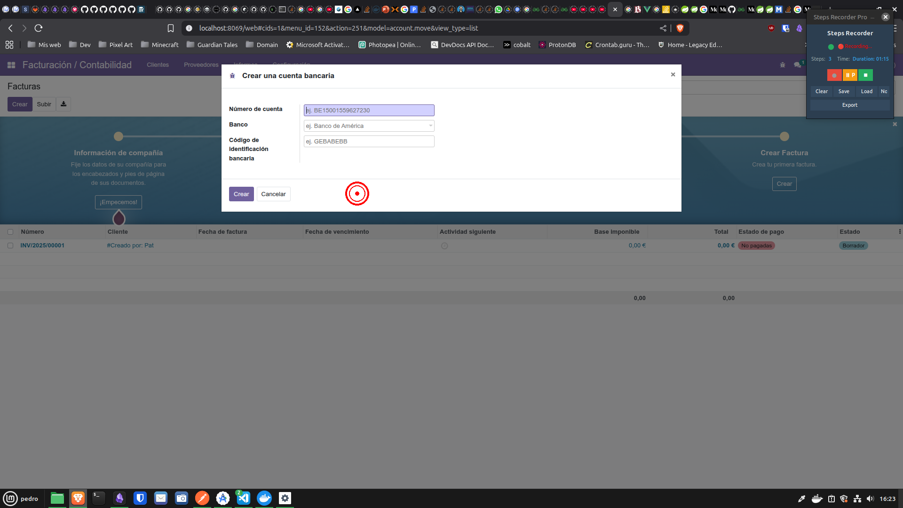

## Paso 5: annotation
- **Hora:** 2025-10-24T16:24:15.215870
- **Descripción:** Cuenta
- **Ventana:** Steps Recorder Pro
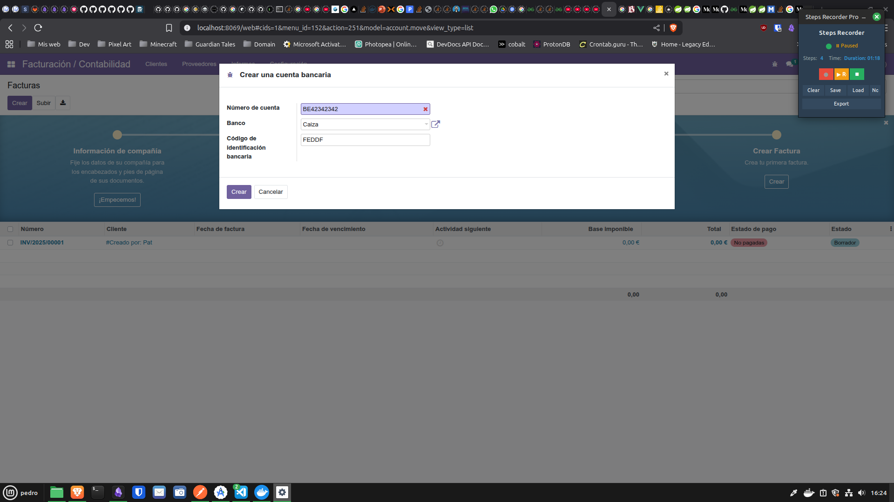

## Paso 6: click
- **Hora:** 2025-10-24T16:24:18.431939
- **Descripción:** Left-clicked at (529, 412)
- **Ventana:** Odoo - Facturas - Brave
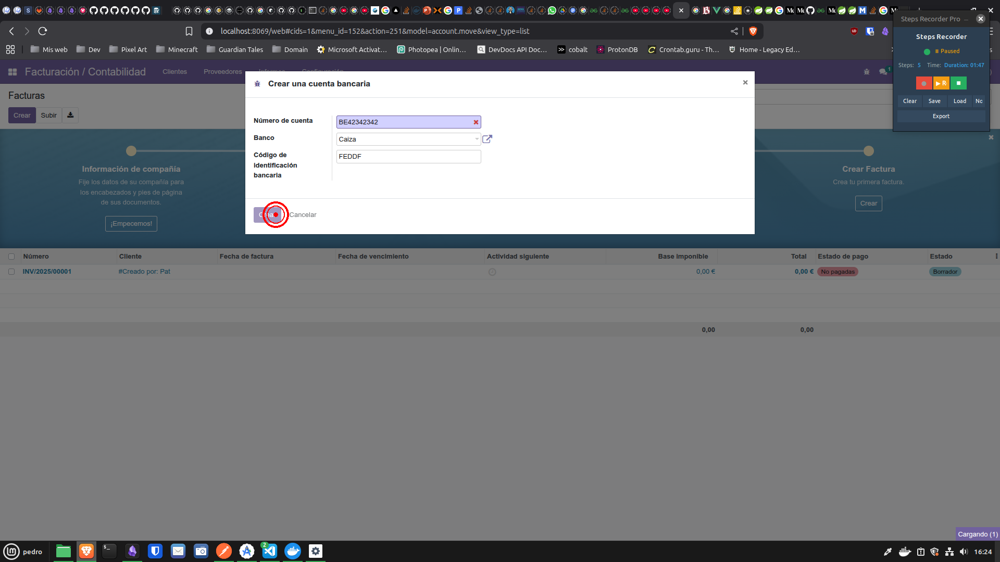

## Paso 7: click
- **Hora:** 2025-10-24T16:24:24.319854
- **Descripción:** Left-clicked at (15, 139)
- **Ventana:** Odoo - Facturas - Brave
# Pasos grabados

## Paso 1: initial
- **Hora:** 2025-10-24T16:22:32.182062
- **Descripción:** Recording session started
- **Ventana:** Steps Recorder Pro
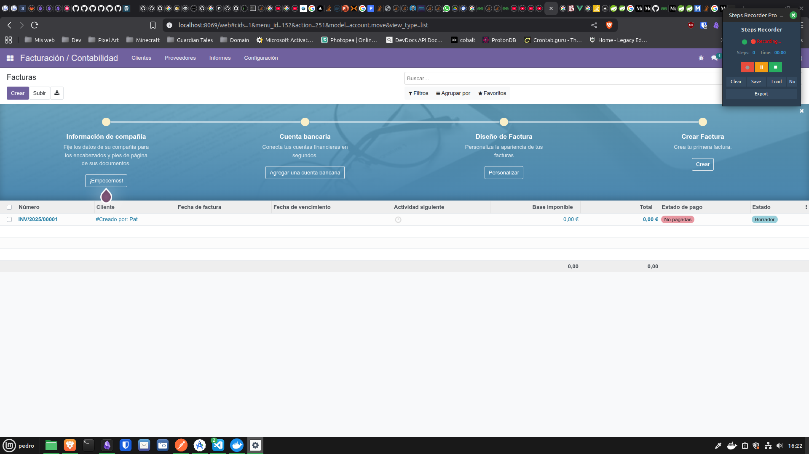

## Paso 2: click
- **Hora:** 2025-10-24T16:22:33.562392
- **Descripción:** Left-clicked at (599, 136)
- **Ventana:** Odoo - Facturas - Brave
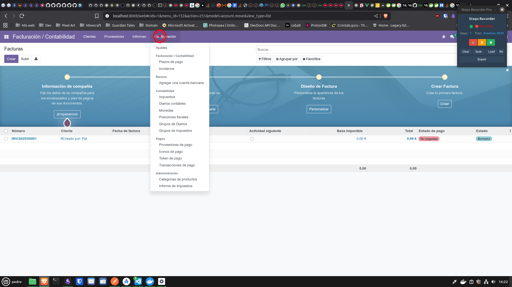

## Paso 3: click
- **Hora:** 2025-10-24T16:22:47.606150
- **Descripción:** Left-clicked at (715, 548)
- **Ventana:** Odoo - Proveedores de pago - Brave
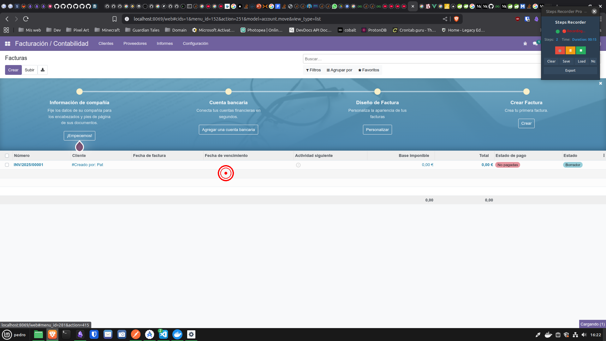

## Paso 4: click
- **Hora:** 2025-10-24T16:23:47.352992
- **Descripción:** Left-clicked at (759, 411)
- **Ventana:** Odoo - Facturas - Brave

## Paso 5: annotation
- **Hora:** 2025-10-24T16:24:15.215870
- **Descripción:** Cuenta
- **Ventana:** Steps Recorder Pro

## Paso 6: click
- **Hora:** 2025-10-24T16:24:18.431939
- **Descripción:** Left-clicked at (529, 412)
- **Ventana:** Odoo - Facturas - Brave

## Paso 7: click
- **Hora:** 2025-10-24T16:24:24.319854
- **Descripción:** Left-clicked at (15, 139)
- **Ventana:** Odoo - Facturas - Brave
![[Pasted image 20251024162653.png]]

# 7. Comprueba que los productos están en el inventario y que están las unidades acordadas de cada uno de los productos.
![[Pasted image 20251024164538.png]]