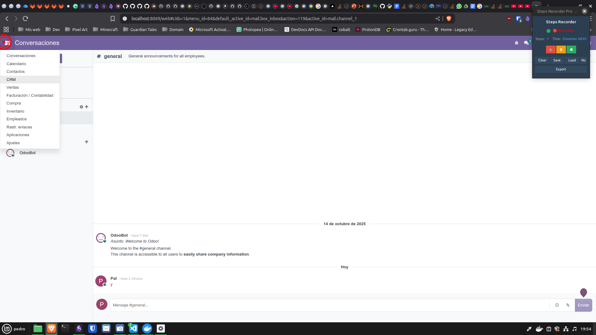
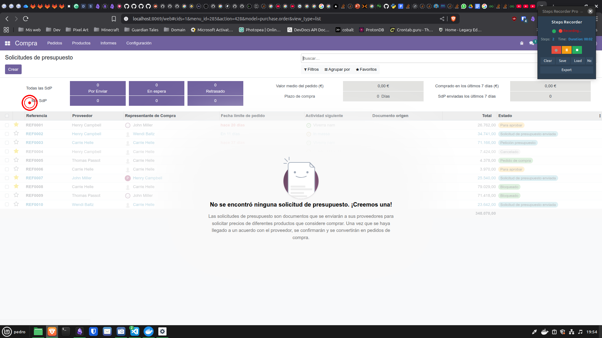
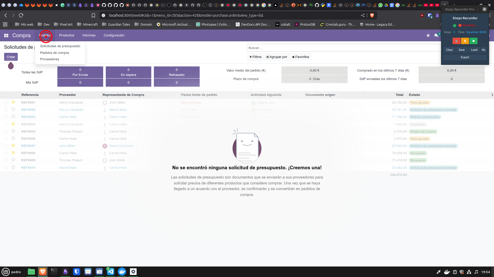
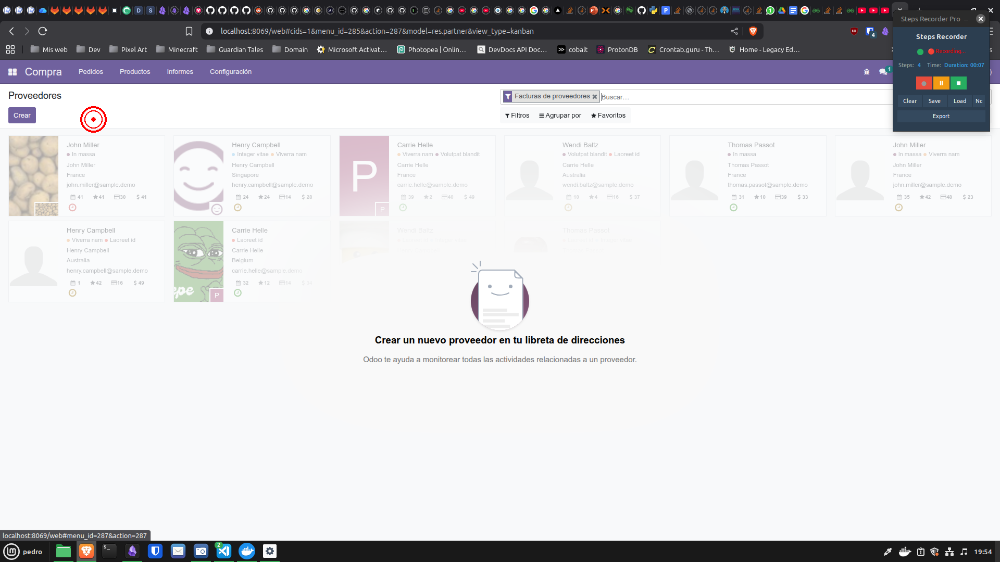
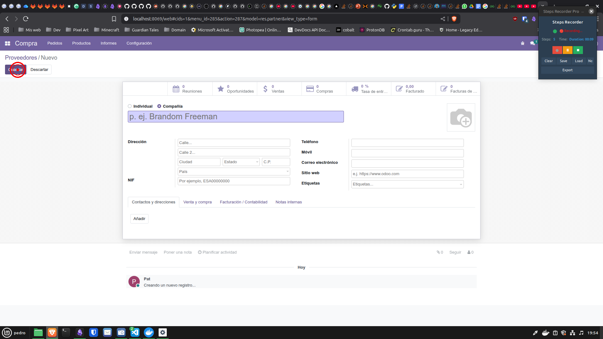
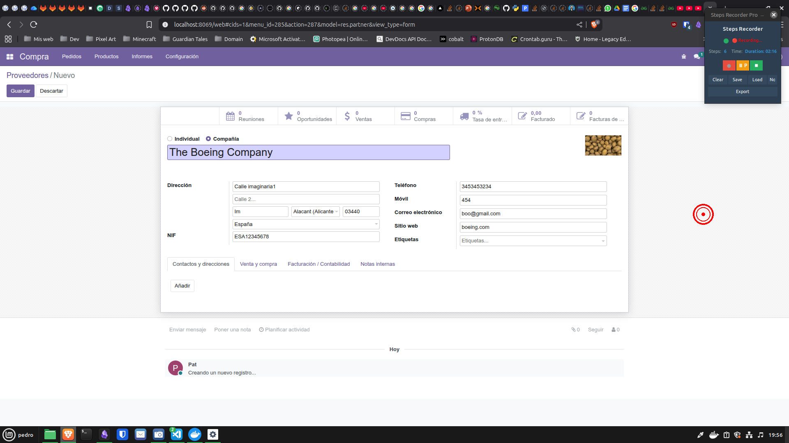
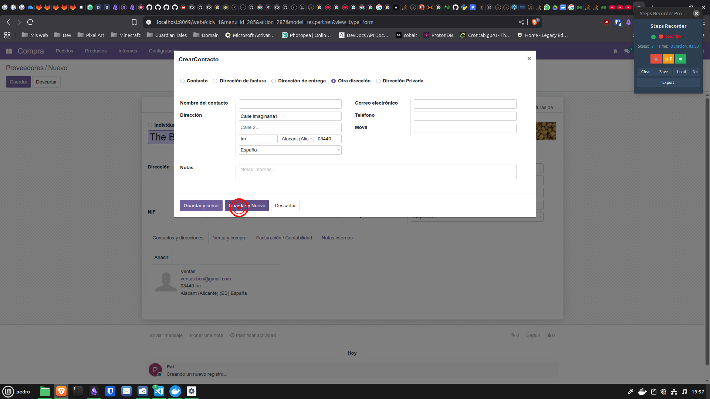
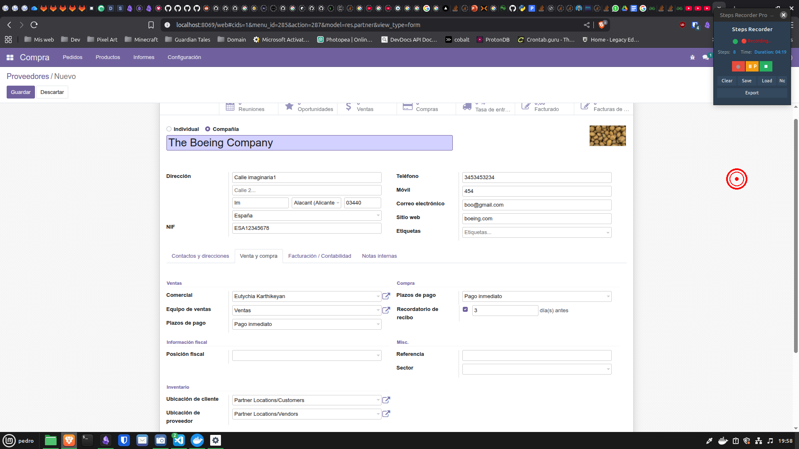

# 1. Crea 5 proveedores diferentes rellenando toda la información de cada uno.

## Paso 2: click
- **Hora:** 2025-10-21T19:54:03.734218
- **Descripción:** Left-clicked at (12, 135)
- **Ventana:** Odoo - Conversaciones - Brave

## Paso 3: click
- **Hora:** 2025-10-21T19:54:05.040050
- **Descripción:** Left-clicked at (94, 328)
- **Ventana:** Odoo - Solicitudes de presupuesto - Brave

## Paso 4: click
- **Hora:** 2025-10-21T19:54:08.249945
- **Descripción:** Left-clicked at (178, 142)
- **Ventana:** Odoo - Solicitudes de presupuesto - Brave

## Paso 5: click
- **Hora:** 2025-10-21T19:54:10.211752
- **Descripción:** Left-clicked at (179, 229)
- **Ventana:** Odoo - Proveedores - Brave

## Paso 6: click
- **Hora:** 2025-10-21T19:54:12.261171
- **Descripción:** Left-clicked at (56, 222)
- **Ventana:** Odoo - Nuevo - Brave

## Paso 7: click
- **Hora:** 2025-10-21T19:56:19.092960
- **Descripción:** Left-clicked at (1711, 522)
- **Ventana:** Odoo - Nuevo - Brave

## Paso 8: click
- **Hora:** 2025-10-21T19:57:56.012281
- **Descripción:** Left-clicked at (646, 562)
- **Ventana:** Odoo - Nuevo - Brave

## Paso 9: click
- **Hora:** 2025-10-21T19:58:22.281828
- **Descripción:** Left-clicked at (1770, 430)
- **Ventana:** Odoo - Nuevo - Brave

# 2. Crea las categorías de los productos y a continuación, crea 5 productos distintos con la información de cada uno de los apartados asociados a este.

# 3. Realiza una solicitud de compra para cada producto de 50, 30, 20, 15 y 5. (Respectivamente a la creación del producto).

# 4. Envíalo al proveedor correspondiente y confirma el pedido de cada producto.

# 5. Recibe los productos y crea la factura. Luego confírmalo.

# 6. Para realizar el pago: crea previamente el banco, y luego realiza el pago. 

# 7. Comprueba que los productos están en el inventario y que están las unidades acordadas de cada uno de los productos.
