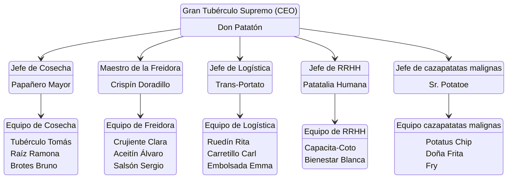

### Información de la empresa:
- **Nombre:** La Orden del Tubérculo
- **Eslogan:** patatin patatan patatun
- **Logo:** 

### Misión:
Esparcir conocimiento sobre las maravillas de las patatas, y dar a conocer todos los tipos de patatas que hay en este maravilloso mundo.
### Visión:
Ser una empresa competitiva en el sector agrícola de las patatas, con la capacidad de elegir correctamente las mejores patatas para nuestros clientes.
### Valores:
Nuestros valores serán escuchar a los trabajadores y a los clientes, aportar buenos productos, formación para los empleados y información a todo el que la necesite.

## Estructura Organizativa

### Organigrama:
> No se ve bien :(

### Descripción de los puestos:
#### **Gran Tubérculo Supremo (CEO) – Don Patatón**

**Responsabilidades principales:**

* Liderar la visión estratégica de toda la Orden del Tubérculo.
* Tomar las decisiones clave sobre cosecha, producción, freído, embalaje y distribución de tubérculos.
* Asegurar que la cadena de valor de la patata mantenga sus altos estándares de *excelencia crujiente*.
* Supervisar a todos los jefes de departamento.
* Representar a la empresa ante socios, clientes y el “Consejo Sagrado de Patata”.

#### **Jefe de Cosecha – Papañero Mayor**

**Responsabilidades:**

* Planificar las campañas de cultivo, cosecha y selección de tubérculos.
* Coordinar al Equipo de Cosecha y asignar tareas diarias.
* Garantizar que las patatas sean de primera calidad, libres de imperfecciones dañinas.
* Colaborar con logística para estimar volúmenes futuros.
* Mantener un registro del rendimiento de cada campo.

##### **Equipo de Cosecha**

**Tubérculo Tomás, Raíz Ramona, Brotes Bruno**

**Funciones principales:**

* Sembrar, regar, cuidar y vigilar los cultivos.
* Extraer las patatas con delicadeza ritual (*evitando traumatismos al tubérculo*).
* Clasificar por tamaño, peso y potencial gastronómico.
* Reportar plagas o anomalías en el patatal.
* Mantener herramientas y maquinaria agrícola.
