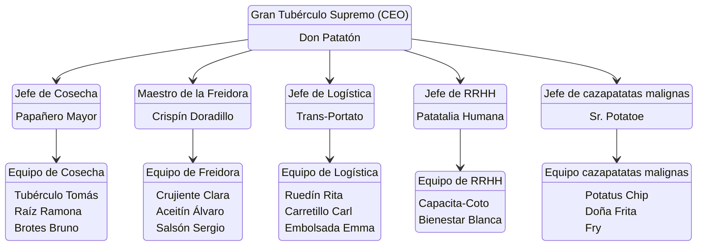

### Información de la empresa:
- **Nombre:** La Orden del Tubérculo
- **Eslogan:** patatin patatan patatun
- **Logo:** 
![[logo.png|200]]
### Misión:
Esparcir conocimiento sobre las maravillas de las patatas, y dar a conocer todos los tipos de patatas que hay en este maravilloso mundo.
### Visión:
Ser una empresa competitiva en el sector agrícola de las patatas, con la capacidad de elegir correctamente las mejores patatas para nuestros clientes.
### Valores:
Nuestros valores serán escuchar a los trabajadores y a los clientes, aportar buenos productos, formación para los empleados y información a todo el que la necesite.

## Estructura Organizativa

### Organigrama:
> No se ve bien :(


### Descripción de los puestos:
#### **Gran Tubérculo Supremo (CEO) – Don Patatón**

**Responsabilidades principales:**

* Liderar la visión estratégica de toda la Orden del Tubérculo.
* Tomar las decisiones clave sobre cosecha, producción, freído, embalaje y distribución de tubérculos.
* Asegurar que la cadena de valor de la patata mantenga sus altos estándares de *excelencia crujiente*.
* Supervisar a todos los jefes de departamento.
* Representar a la empresa ante socios, clientes y el “Consejo Sagrado de Patata”.

#### **Jefe de Cosecha – Papañero Mayor**

**Responsabilidades:**

* Planificar las campañas de cultivo, cosecha y selección de tubérculos.
* Coordinar al Equipo de Cosecha y asignar tareas diarias.
* Garantizar que las patatas sean de primera calidad, libres de imperfecciones dañinas.
* Colaborar con logística para estimar volúmenes futuros.
* Mantener un registro del rendimiento de cada campo.

##### **Equipo de Cosecha**

**Tubérculo Tomás, Raíz Ramona, Brotes Bruno**

**Funciones principales:**

* Sembrar, regar, cuidar y vigilar los cultivos.
* Extraer las patatas con delicadeza ritual (*evitando traumatismos al tubérculo*).
* Clasificar por tamaño, peso y potencial gastronómico.
* Reportar plagas o anomalías en el patatal.
* Mantener herramientas y maquinaria agrícola.

#### **Maestro de la Freidora – Crispín Doradillo**

**Responsabilidades:**

* Supervisar todos los procesos de cocción, fritura y dorado.
* Definir la temperatura, tiempos y aceite ideal para cada producto.
* Desarrollar nuevos productos fritos (chips, papas deluxe, wedges, etc.).
* Garantizar la seguridad en el área de freído.
* Capacitar al equipo en técnicas de crujencia avanzada.

##### **Equipo de Freidora**

**Crujiente Clara, Aceitín Álvaro, Salsón Sergio**

**Funciones principales:**

* Operar las freidoras y controlar tiempos de cocción.
* Preparar salsas y adobos complementarios.
* Escurrir, sazonar y revisar calidad de cada lote.
* Mantener la cocina impecable y cumplir normas sanitarias.
* Informar al Maestro de cualquier variación en la textura o el sabor.

#### **Jefe de Logística – Trans-Portato**

**Responsabilidades:**

* Organizar el transporte interno y externo de las patatas.
* Gestionar inventarios, almacenes y embalaje.
* Coordinar la entrega a distribuidores, tiendas y clientes.
* Garantizar que los envíos lleguen frescos y sin daños.
* Optimizar rutas y reducir costos de transporte.

##### **Equipo de Logística**

**Ruedín Rita, Carretillo Carl, Embolsada Emma**

**Funciones principales:**

* Empaquetar y etiquetar los productos.
* Cargar y descargar mercancía.
* Preparar pedidos según las órdenes del día.
* Controlar stock y revisar integridad del envase.
* Mantener vehículos y carretillas listas para operar.

#### **Jefe de RRHH – Patatalia Humana**

**Responsabilidades:**

* Reclutar, capacitar y retener talento (humano o tubérculo-delivery).
* Desarrollar políticas laborales y clima organizacional.
* Resolver conflictos internos.
* Supervisar planes de bienestar y motivación.
* Realizar evaluaciones de desempeño.

##### **Equipo de RRHH**

**Capacita-Coto, Bienestar Blanca**

**Funciones principales:**

* Organizar formaciones (como “manejo de tubérculos sensibles” o “freído zen”).
* Gestionar documentación de empleados.
* Apoyar en procesos de selección, entrevistas y onboarding.
* Planificar actividades de convivencia entre departamentos.
* Atender solicitudes y necesidades del personal.

#### **Jefe de cazapatatas malignas – Sr. Potatoe**

**Responsabilidades:**

* Organizar la vigilancia para impedir el escape de peligrosas patatas malignas.

##### **Equipo de cazapatatas malignas**

**Potatus Chip, Doña Frita, Fry**

**Funciones principales:**
- Incursionar en peleas de vida a muerte contra patatas venenosas.
- Asegurar la seguridad de todos los empleados de la empresa.

## Descripción de los productos

```
### Producto nº
- Nombre:
- Descripción:
- Precio:
- Imagen:
![[|100]]
```

### Producto nº1
- Nombre: Yogurt de patata
- Descripción: Este es un yogurt muy nutritivo hecho con las mejores patatas del mercado.
- Precio: 2.50€
- Imagen: 
![[yogurtpatata.jpeg|100]]
### Producto nº2
- Nombre: Tenedor de patata.
- Descripción: Este utensilio de cocina no tiene mucha utilidad pero es comestible
- Precio:1.99€
- Imagen:
![[tenedorPatata.jpeg|100]]
### Producto nº3
- Nombre: Sujetapatatas para la Nintendo Switch
- Descripción: Este es un sujetapatatas pata la popular consola nintendo switch, su funcion es sujetar tus patatas fritas para que puedas disfrutar de ellas mientras juegas tus partidas
- Precio: 30€
- Imagen:
![[sujetapatatasSwitch.jpeg|300]]
### Producto nº4
- Nombre: Suéter Patata
- Descripción: Un suéter perfecto para cada ocasión, esta pieza de moda es perfecta para cuando salgas con tus amigos y tengas hambre, ya que la puedes comer en cualquier momento.
- Precio: 46.74€
- Imagen:
![[SueterPatata.jpeg|200]]
### Producto nº5
- Nombre: Perro Patata
- Descripción: Un fiel amigo para tus aventuras, este pequeño ser puede protejer todos tus cultivos de patatas, incrementar la velocidad en la que crecen un 200% y puede defenderte a ti.
- Precio:453.99€
- Imagen:
![[perroPatata.jpeg|300]]
### Producto nº6
- Nombre: PatataVela
- Descripción: Una vela muy duradera hecha solo con patatas, su luz te puede durar meses.
- Precio: 2€
- Imagen:
![[PatataVela.jpeg|300]]
### Producto nº7
- Nombre: PatataSaurio
- Descripción: Un ser prehistórico que existe desde los años 1000000 ac, este ser es muy útil para el transporte de alimentos
- Precio: 6847€
- Imagen:
![[patatasaurio.jpeg|200]]
### Producto nº8
- Nombre: Patata Robot
- Descripción: Un robot con los últimos modelos de Inteligencia Artificial experto en recoger tus patatas.
- Precio: 1000€
- Imagen:
![[patataRobot.jpeg|300]]
### Producto nº9
- Nombre: PatataPikmin
- Descripción: Un ser extraño que apareció en nuestros huertos de patatas, no sabemos que hace, pero parece ser amigable en cierto sentido, esta criatura se suele cooperar bien con el PatataRobot
- Precio: 4€
- Imagen:
![[patataPicmin.jpeg|200]]
### Producto nº10
- Nombre: PatataPC
- Descripción: Un Ordenador hecho de patatas, cuando te digan malo en cualquier juego podrás decir que tu Pc es una patata, y sera justificado
- Precio: 350€
- Imagen:
![[patatapc.jpeg|400]]
### Producto nº11
- Nombre: Patata Jabón
- Descripción: Un jabón de la mejor calidad, hecho de patatas.
- Precio: 10€
- Imagen:
![[patataJabon.jpeg|300]]
### Producto nº12
- Nombre: Patata Hamburguesa
- Descripción: Es una hamburguesa preparada por los mejores chefs, solo que en vez de usar pan se usa patatas, incluso los celiacos podrán comer esta hamburguesa.
- Precio: 7.50€
- Imagen:
![[patataHamburgesa.jpeg|400]]
### Producto nº13
- Nombre: Patata de oro
- Descripción: Una patata hecha del oro mas fino, incluso es comestible.
- Precio: 16100€
- Imagen:
![[patatadorada.jpeg|200]]
### Producto nº14
- Nombre: Patata Colorida
- Descripción: Una Bolsa de patatas de diferentes colores, perfecta para las fiestas de los mas pequeños del hogar
- Precio: 13€
- Imagen:
![[patataDeColores.jpeg|300]]
### Producto nº15
- Nombre: Patata Bateria
- Descripción: Una bateria de 10000mAh
- Precio: 456€
- Imagen:
![[PatataBateria.jpeg|400]]
### Producto nº16
- Nombre: Mantata
- Descripción: Una manzana hibrida con patata, es un milagro de la ciencia
- Precio: 14€
- Imagen:
![[mantata.jpeg|200]]
### Producto nº17
- Nombre: Lego patata
- Descripción: Patatas con forma de lego para construir la comida mas deliciosa que probaras. 
- Precio: 21€
- Imagen:
![[legopatata.jpeg|400]]
### Producto nº18
- Nombre: La Trinidad PelaPatatas
- Descripción: Una herramienta muy útil con sus 3 lados que sirven para pelar las patatas de forma muy rápida y eficaz.
- Precio: 23€
- Imagen:
![[laTrinidadPelapatatas.jpeg|300]]
### Producto nº19
- Nombre: Gatopatata Fuego
- Descripción: El gatopatata que todos conocemos, pero esta es la edicion limitada de fuego, esta edicion te brindara calor cuando lo necesites.
- Precio: 500€
- Imagen:
![[gatoPatataFuego.jpeg]]
### Producto nº20
- Nombre: Gatopatata
- Descripción: El mejor animal de compañia que caza a patatas malignas y te querra
- Precio: 430€
- Imagen:
![[gatato.jpeg|300]]

### Producto nº21
- Nombre: Gatopatata 1
- Descripción: El mejor animal de compañia que caza a patatas malignas y te querra
- Precio: 430€
- Imagen:
![[gatoPatata1.jpeg|200]]
### Producto nº22
- Nombre: PatataMovil
- Descripción: Un automóvil de patatas, que usa la energía de la batería patata para funcionar.
- Precio: 3000€
- Imagen:
![[cochePatata.jpeg|300]]
### Producto nº23
- Nombre: Bombilla patata
- Descripción: Una bombilla de patatas que iluminara tu vida de una forma que no te esperas
- Precio: 6€
- Imagen:
![[bombillaPatata.jpeg|300]]
### Producto nº24
- Nombre: BombaPatata
- Descripción: Una deliquised de patata con queso y kepchup por encima
- Precio: 26.99€
- Imagen:
![[Bombapatata.jpeg|600]]
### Producto nº25
- Nombre: Bocadillo Patata
- Descripción: Un bocadillo normal pero se intercambian los panes por patatas hervidas
- Precio: 20€
- Imagen:
![[BocadilloDePatata.jpeg|400]]

