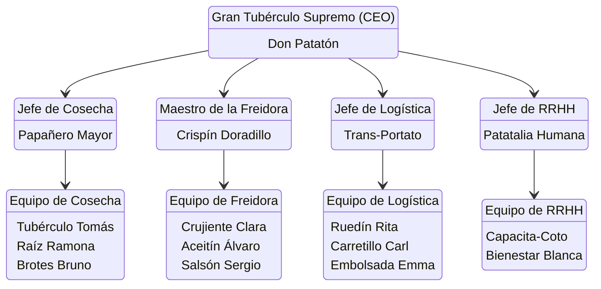

### Información de la empresa:
- **Nombre:** La Orden del Tubérculo
- **Eslogan:** patatin patatan patatun
- **Logo:** 

### Misión:
Esparcir conocimiento sobre las maravillas de las patatas, y dar a conocer todos los tipos de patatas que hay en este maravilloso mundo.
### Visión:
Ser una empresa competitiva en el sector agrícola de las patatas, con la capacidad de elegir correctamente las mejores patatas para nuestros clientes.
### Valores:
Nuestros valores serán escuchar a los trabajadores y a los clientes, aportar buenos productos, formación para los empleados y información a todo el que la necesite.

## Estructura Organizativa

### Organigrama:
> No se ve bien :(

