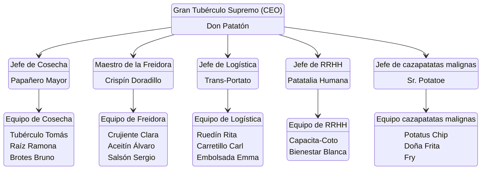

Ultima Modificacion: `$= dv.current().file.mtime`

Curso: Desarollo de aplicaciones multiplataforma segundo

Titulo de la actividad: **SGE: Proyecto La instalacion de odoo**

Alumno: Pedro Guill Ferri

Fecha de entrega: `$= dv.date("today")`

> Eliminar despues
> Contraseña maestra: 57gg-kgyy-q3nn
> Email maestro: el mio personal
> Contraseña del email maestro: 57gg-kgyy-q3nn

# 1. Configurar los datos de la empresa
Cambio de la informacion de la emppresa:
![[Pasted image 20260101115328.png]]
# 2. Crear Estructura Organizativa
## Grupos de la organizacion

Los grupos serán los siguientes y cada grupo por encima de otro heredara los permisos de ese grupo, osea que el ceo podra ver todo lo que hagan los demas

Y aqui esta la captura de odoo con los equipos creados:
![[Pasted image 20260102114108.png]]

## Usuarios
Aqui se introduciran los usuarios que estan debajo de cada puesto en el apartado anteror, aunque para el proyecto solo los equipos de Freidora(ventas encuvierta, ya que son los responsables del putno de venta especifico) y Logistica tendran relevancia, aun asi crearemos todos los usuarios
