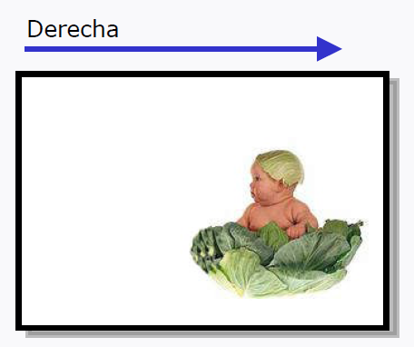
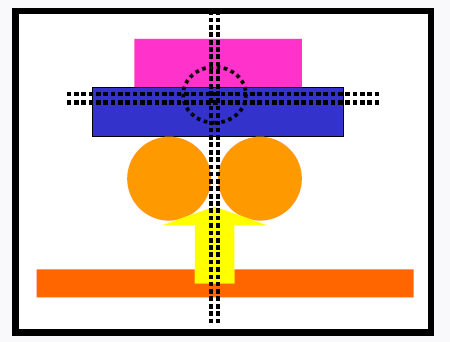
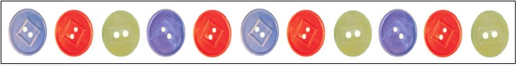
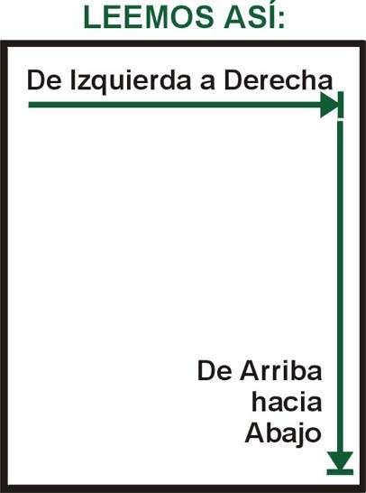
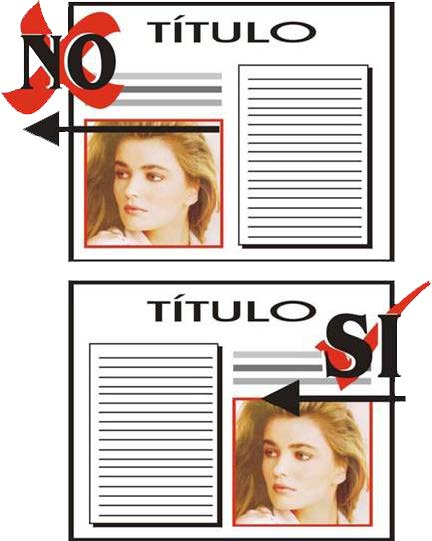
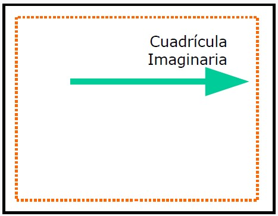
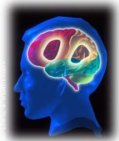
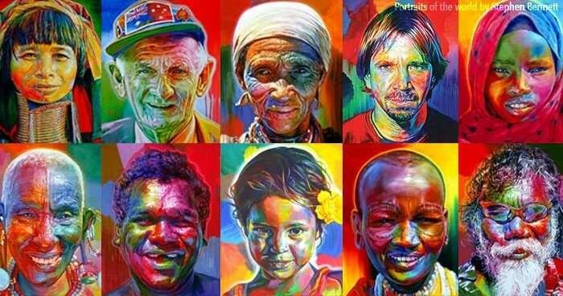

# Percepción visual. Fundamentos de la composición

## Tabla de Contenidos
- [Introducción](#introducción)
- [Peso de los Elementos](#peso-de-los-elementos)
- [Factor de Equilibrio](#factor-de-equilibrio)
- [Factor de Tensión](#factor-de-tensión)
- [Factor de Ritmo](#factor-de-ritmo)
- [Recorrido Visual de las Áreas de Diseño](#recorrido-visual-de-las-áreas-de-diseño)
- [Ubicación de las Imágenes](#ubicación-de-las-imágenes)
- [Ubicación de los Elementos](#ubicación-de-los-elementos)
- [Percepción del Receptor](#percepción-del-receptor)

---
## Introducción

Diseñar implica organizar distintos elementos gráficos dentro de un área visual previamente seleccionada, combinándolos de tal forma que transmitan un significado coherente. Los mensajes de diseño visual se basan en una combinación estructurada de elementos como imágenes, textos o espacios, o incluso la ausencia deliberada de alguno de estos.

---
## Peso de los Elementos

Cada elemento ubicado en el área de diseño (como la pantalla de un ordenador) adquiere un **peso visual** en la composición. Es esencial que el diseño forme un conjunto armonioso en el que cada elemento tenga una función específica sin interferir con los demás.

- Es crucial determinar el **orden de importancia** de cada elemento (título, ilustración, textos, etc.) y asignarles la proporción adecuada.
- No debemos exagerar el tamaño de un elemento (como una ilustración) a costa de otros, ya que esto podría crear una composición desequilibrada y poco atractiva.

### Posición de los Elementos y su Peso Visual

- Los elementos situados en la **derecha** tienden a tener un mayor peso visual, proyectando una sensación de avance en la composición.

- Los elementos situados en la **izquierda** ofrecen una sensación de ligereza visual, retrotrayendo la composición.

- La **zona superior** de la pantalla tiene menor peso visual debido al espacio en blanco que la equilibra.

- La **zona inferior**, que carece de un espacio que equilibre, tiene mayor peso visual.

---
## Factor de Equilibrio

El centro óptico de nuestra pantalla no es precisamente el centro geométrico de la misma, pues el primero está ubicado un poco por encima del segundo.

Toda composición debe poseer un **equilibrio visual**, que puede ser de dos tipos:

### Equilibrio Formal o Simétrico

El equilibrio formal se basa en la simetría, donde los elementos tienen igual peso a ambos lados del eje central. Este tipo de equilibrio transmite **estabilidad**, **calma** y **armonía**.

### Equilibrio Informal o Asimétrico

En las composiciones de equilibrio informal no existe simetría, y el equilibrio se logra mediante el contraste de los pesos visuales. Este tipo de equilibrio aporta **dinamismo** y **fuerza gráfica**.

---
## Factor de Tensión

La **tensión** añade fuerza, dinamismo y movimiento al diseño. Se puede lograr mediante la combinación de líneas y formas agudas e irregulares. Existen varias técnicas para introducir tensión en una composición:

### Técnica Sugestiva

Se busca dirigir la atención hacia un punto específico, utilizando elementos como líneas que confluyen en un mismo lugar.

### Técnica Rítmica

Aprovecha la tendencia natural del ojo humano a completar secuencias, agrupando elementos similares y creando patrones visuales.

### Técnica Mecánica

Se guía imperativamente la atención del observador hacia un punto específico, aunque puede ser menos efectiva que otras técnicas ya que genera coacción visual.

---
## Factor de Ritmo

El **ritmo** se logra a través de la repetición secuencial de elementos, creando armonía y movimiento en la composición. El ojo humano sigue recorridos dinámicos, lo que transmite una alta sensación de dinamismo.

Se puede crear ritmo mediante:

1. **Alternar elementos de manera secuencial**.
    

2. **Repetir elementos semejantes** (colores, formas, etc.).
    
3. **Provocar una progresión de elementos**, ya sea mediante gradación de colores o variación en las dimensiones.
    

---
## Recorrido Visual de las Áreas de Diseño

El recorrido visual en las composiciones está determinado por dos factores:

1. **El sistema de percepción visual humano**.
2. **Factores culturales**, como en el mundo occidental, donde se lee de izquierda a derecha y de arriba hacia abajo.

La estructura del diseño debe seguir este recorrido visual para comunicar efectivamente el mensaje. Colocar **la información más importante en la parte superior derecha** y descender en orden de importancia es clave. La información **más relevante debe ubicarse en la esquina inferior derecha**.

---
## Ubicación de las Imágenes

Las imágenes deben colocarse de manera que dirijan su atención hacia el interior de la composición. Si se colocan mirando hacia afuera, pueden desviar la atención del espectador fuera del área de diseño.

---
## Ubicación de los Elementos

Es recomendable usar una **cuadrícula imaginaria** para alinear y colocar correctamente los elementos dentro de la composición. Esto ayuda a mantener la unidad y la armonía.

A través de las líneas segmentadas rojas y verdes podemos observar como los elementos están alineados y relacionados provocando unidad y armonía en el diseño.

---
## Percepción del Receptor

Además de los factores técnicos de la composición, es importante considerar cómo el receptor percibe e interpreta el mensaje visual. Existen tres componentes principales que influyen en la percepción:

### a. Componentes Psicosomáticos del Sistema Nervioso

El sistema nervioso permite al receptor interpretar la información visual. Los ojos capturan información como formas, ubicaciones y colores, que el cerebro procesa para dotarlos de significado.

### b. Componentes Culturales

La cultura influye en la interpretación de ciertos estímulos. Por ejemplo, en Occidente el color negro está asociado al luto, mientras que en algunas culturas orientales el luto se asocia al color blanco.

### c. Experiencias Compartidas con el Entorno

Estas son asociaciones que las personas adquieren a lo largo de su vida, como "cielo-azul" o "hielo-frío". Estas experiencias forman patrones que influyen en cómo las personas interpretan la realidad.

