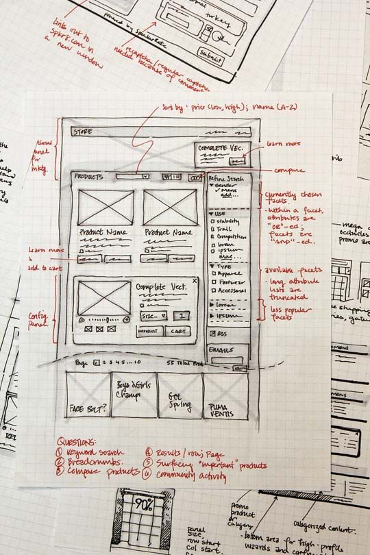
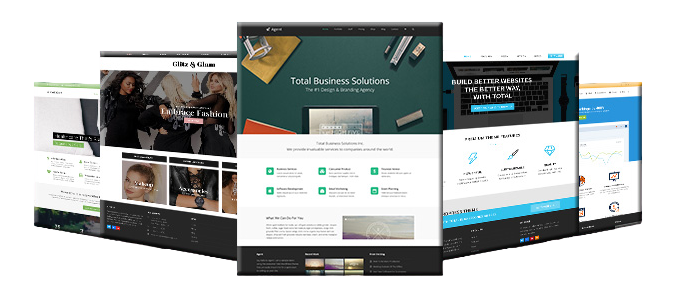

# Fases del diseño de una interfaz web

## Tabla de Contenidos
- [Objetivos del diseño](#objetivos-del-diseño)
- [Fases del Diseño de una Interfaz Web](#fases-del-diseño-de-una-interfaz-web-1)

---

## Objetivos del diseño
Aunque cuando estudiemos la usabilidad web abordaremos de nuevo el tema de los objetivos, conviene que establezcamos unas ideas generales desde ahora.

*¿Sabes cuántas cosas hay que tener en cuenta al comenzar a elaborar una interfaz web? ¿Tienes claro a qué tipo de público irá dirigida tu página? ¿Quieres obtener un rendimiento económico con cada visita? ¿Quieres contentar a todo el mundo que te visite o prefieres especializarte en un tema y tener menos seguidores?*

Al diseñar una interfaz web, debemos considerar las respuestas a estas preguntas, ya que nos darán una idea clara de cuáles son los objetivos de nuestro sitio y nos orientarán sobre el enfoque que debemos darle al diseño de la interfaz.

Si inicias un proyecto web sin pensar en los usuarios a los que va dirigido, es probable que no tenga la acogida que esperabas en un principio.

Una interfaz web es un sistema gráfico que permite a los usuarios acceder a los contenidos de la web mediante el uso de elementos visuales, los cuales son familiares para la mayoría de los usuarios que visitan nuestra página.

***El objetivo principal en el diseño de una interfaz web es que sus potenciales usuarios puedan acceder a todos sus contenidos de la forma más rápida y sencilla posible.***

Para que un diseño web sea efectivo, **debemos crear una interfaz que cubra todos nuestros objetivos**. Este diseño debe lograr que los usuarios de nuestro sitio puedan acceder con facilidad a sus contenidos, interactuar eficazmente con todos sus componentes y se sientan cómodos haciéndolo.

Para conseguir dicho objetivo, debemos tener en cuenta varios aspectos:

- La **paciencia** de las personas no es ilimitada. Cuando alguien busca información y entra en una página después de realizar una búsqueda, no permanecerá mucho tiempo en ella si no encuentra rápidamente lo que busca.
- El **gusto**, considerado como una cuestión de preferencias personales en materia de estética, varía mucho de una persona a otra. Sin embargo, no debemos olvidar que un diseño cuidadoso, una interfaz agradable y un uso coherente de los elementos gráficos nunca nos hará perder visitantes.
- Los enlaces que no funcionan o que no conducen a la información prometida provocan en el usuario una sensación de rechazo, con la consiguiente pérdida de **confianza en nuestra página**, pudiendo incluso llevar a la determinación de no visitarla de nuevo.

---

## Fases del Diseño de una Interfaz Web

El diseño de una interfaz web pasa por varias etapas esenciales antes de su desarrollo. Estas fases permiten afinar el diseño, la estructura y la funcionalidad de la aplicación, minimizando problemas en etapas posteriores. A continuación, se describen cada una de las fases:

---

### 1. Sketch

El **Sketch** es la primera fase del diseño y se refiere a los primeros trazos o bocetos que se realizan para plasmar la idea inicial. Estos bocetos suelen hacerse en papel, aunque hoy en día es común utilizar tablets o herramientas digitales.

- **Objetivo**: Reflejar ideas generales y responder preguntas clave como:
  - ¿Dónde estarán los elementos más importantes (logos, botones, imágenes)?
  - ¿Cómo se organizará la navegación?
  - ¿Qué áreas de contenido y servicios ofreceremos?

  

---

### 2. Wireframe
Un **wireframe** es un diagrama o esquema simple que representa la estructura básica de una página o aplicación. Se centra en el diseño de la interfaz y la distribución de los elementos **sin entrar en detalles visuales como colores, tipografías, o imágenes**.

  

#### ¿Por qué son importantes?

Los wireframes permiten a los diseñadores y desarrolladores concentrarse en la funcionalidad y en la disposición de los elementos antes de comprometerse con un diseño visual específico. Esto ayuda a:

- **Visualizar la estructura básica**: Permite a todos los involucrados entender la arquitectura de la información y la jerarquía de contenido.
- **Detectar problemas tempranamente**: Facilita la identificación de problemas de usabilidad o de flujo de navegación antes de invertir tiempo en detalles visuales.
- **Ahorrar tiempo y recursos**: Al enfocarse en la funcionalidad antes de los detalles gráficos, se evita retrabajo costoso en etapas posteriores.

#### ¿Cómo hacer un Wireframe?

1. **Comenzar con un boceto en papel (sketch)**: Antes de usar herramientas digitales, es útil plasmar las ideas iniciales en papel. Esto permite una exploración rápida de diferentes estructuras.

2. **Definir las secciones clave**:
   - **Cabecera**: Incluir el logo, menú de navegación, y otros elementos fijos como el buscador.
   - **Cuerpo**: Organizar el contenido principal, priorizando los elementos más importantes.
   - **Pie de página**: Información de contacto, enlaces adicionales y otros recursos.

3. **Enfocarse en la funcionalidad**:
   - **Botones y CTA (Call To Action)**: Asegúrate de que las acciones clave estén claramente visibles y accesibles.
   - **Navegación**: Diseña un flujo de navegación intuitivo. Cada pantalla debe estar conectada de manera lógica con las demás.

4. **Mantener la simplicidad**:
   - **Sin colores ni imágenes**: Solo cajas y líneas para indicar la disposición de los elementos.
   - **Tipografía genérica**: Usa texto de muestra para títulos, subtítulos y párrafos, enfocándote solo en la jerarquía y el tamaño relativo.

5. **Prototipado básico**: Puedes crear versiones clicables de los wireframes para simular la navegación y obtener retroalimentación temprana.

#### Herramientas recomendadas para Wireframing

- **Balsamiq**: Ideal para crear wireframes simples y rápidos.
- **Sketch**: Popular entre diseñadores por su flexibilidad y capacidad de crear wireframes y otros recursos visuales.
- **Figma**: Herramienta colaborativa que permite diseñar wireframes y compartirlos con el equipo en tiempo real.

---

### 3. Mockup
Un **mockup** es una representación visual detallada de la aplicación o página web. A diferencia del wireframe, el mockup **incorpora elementos gráficos completos, incluyendo colores, tipografías, imágenes, y otros detalles de diseño**.

#### ¿Por qué son importantes?

Los mockups son cruciales para:

- **Visualización realista**: Muestra cómo se verá el producto final, lo que facilita la toma de decisiones y la validación con clientes o partes interesadas.
- **Comunicación clara**: Proporciona una herramienta visual que ayuda a los diseñadores, desarrolladores, y clientes a estar alineados en la visión del producto.
- **Ajustes antes del desarrollo**: Permite hacer ajustes visuales y de diseño antes de que comience el desarrollo técnico, ahorrando tiempo y evitando retrabajo.

#### ¿Cómo hacer un Mockup?

1. **Utilizar el wireframe como base**: Empieza con la estructura definida en el wireframe, luego añade detalles visuales como colores, tipografías y gráficos.

2. **Seleccionar una paleta de colores**: Escoge colores que se alineen con la identidad de la marca y que sean coherentes a lo largo de todo el diseño.

3. **Definir la tipografía**:
   - **Titulares**: Fuentes grandes y claras para captar la atención.
   - **Cuerpo de texto**: Fuentes legibles y que complementen los titulares.
   - **Contrastes**: Asegúrate de que haya suficiente contraste entre el texto y el fondo para facilitar la lectura.

4. **Incorporar imágenes y gráficos**:
   - **Imágenes de alta calidad**: Usa imágenes que sean representativas del contenido y que mantengan la coherencia visual.
   - **Iconografía**: Los íconos deben ser consistentes en estilo y tamaño a lo largo de toda la aplicación.

5. **Prototipado avanzado**: Algunos mockups pueden ser interactivos, permitiendo que los usuarios naveguen entre pantallas o prueben funciones clave, simulando la experiencia real.

#### Herramientas recomendadas para Mockups

- **Adobe XD**: Herramienta completa para diseño de interfaces y prototipos, ideal para crear mockups detallados.
- **Sketch**: También utilizado para mockups, permite integrar plugins y recursos para acelerar el proceso.
- **Figma**: Permite diseño colaborativo y es ideal para proyectos donde varias personas necesitan trabajar en el mismo mockup en tiempo real.

#### Consejos Adicionales

- **Revisar con el cliente**: Es importante presentar el mockup al cliente para asegurarse de que está alineado con sus expectativas antes de proceder al desarrollo.
- **Evitar la sobrecarga visual**: No abuses de efectos y detalles que puedan hacer el diseño más complejo de implementar.
- **Adaptabilidad**: Asegúrate de que el mockup sea responsive, es decir, que se adapte bien a diferentes tamaños de pantalla.

---
### 4. Prototipo

El **Prototipo** es un modelo navegable y de alta fidelidad de la aplicación. Este modelo permite probar y evaluar la experiencia del usuario y las funcionalidades de la aplicación antes de su lanzamiento.

- **Ventajas**:
  - Identificación de sistemas de navegación, iconografía, y otros elementos críticos.
  - Pruebas con usuarios para validar la usabilidad y ajustar el producto según sus necesidades.
  - Ahorro de tiempo y dinero al detectar problemas antes del desarrollo completo.
