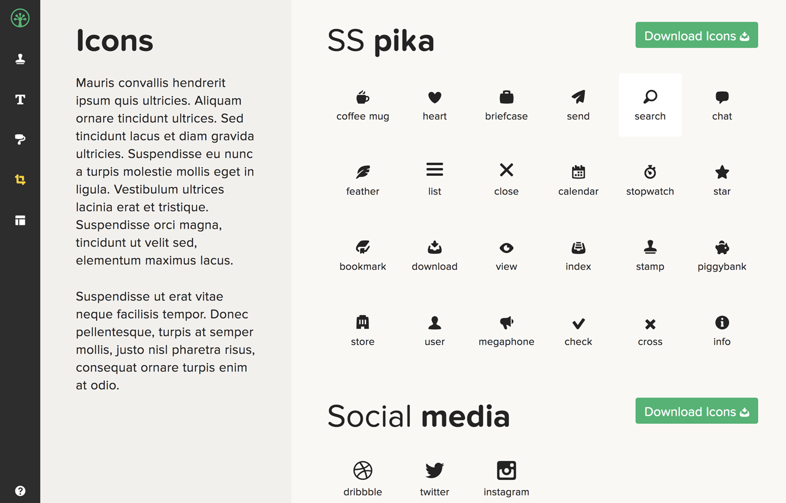
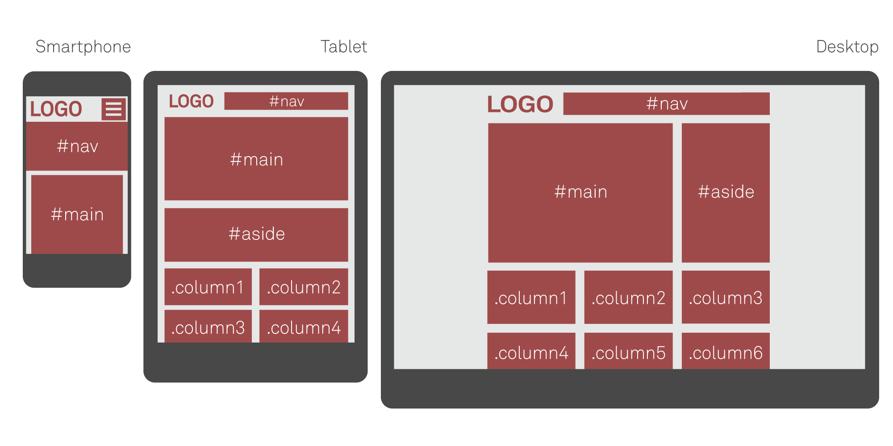

# Pasos para Crear una Guía de Estilo (Orientativo)

## Tabla de Contenidos
- [1. Reunir Información y Definir Requisitos](#1-reunir-información-y-definir-requisitos)
- [2. Establecer la Estructura de la Guía](#2-establecer-la-estructura-de-la-guía)
- [3. Desarrollar los Elementos Visuales](#3-desarrollar-los-elementos-visuales)
- [4. Definir Estilos para Interacciones y Usabilidad](#4-definir-estilos-para-interacciones-y-usabilidad)
- [5. Redactar y Documentar las Directrices](#5-redactar-y-documentar-las-directrices)
- [6. Revisión y Validación](#7-publicación-y-mantenimiento)
- [7. Publicación y Mantenimiento](#7-publicación-y-mantenimiento)

---
Crear una guía de estilo es un proceso que requiere planificación, investigación y colaboración entre los miembros del equipo. A continuación se detallan los pasos fundamentales para desarrollar una guía de estilo efectiva:

## 1. **Reunir Información y Definir Requisitos**

- **Objetivo del Proyecto**: Define claramente el propósito de la guía de estilo y cómo se alineará con los objetivos del proyecto.
- **Audiencia**: Identifica a los usuarios finales de la guía de estilo, como diseñadores, desarrolladores, y editores de contenido.
- **Investigación Previa**: Revisa guías de estilo existentes y tendencias de diseño para tomar decisiones informadas.

---
## 2. **Establecer la Estructura de la Guía**

- **Índice o Tabla de Contenidos**: Crea un esquema inicial que incluya todas las secciones principales de la guía.
- **Categorías Principales**: Define categorías clave como tipografías, colores, iconografía, layout, etc.
- **Navegación**: Asegúrate de que la guía esté bien organizada para que los usuarios puedan encontrar fácilmente la información que necesitan.

---
## 3. **Desarrollar los Elementos Visuales**

- **Tipografías**: Selecciona las fuentes que se utilizarán y define las reglas para su uso.

- **Paleta de Colores**: Establece una paleta de colores que refleje la identidad de la marca.

- **Iconografía y Gráficos**: Selecciona o diseña los iconos y gráficos que se utilizarán y define sus aplicaciones.

- **Layout y Estructura**: Diseña la estructura básica de las páginas, incluyendo rejillas y otros componentes de layout.

  

  

---
## 4. **Definir Estilos para Interacciones y Usabilidad**

- **Botones y Enlaces**: Especifica cómo deben lucir y comportarse los botones y enlaces.
- **Formularios y Campos de Entrada**: Detalla el estilo y funcionalidad de los formularios.
- **Mensajes de Error y Confirmación**: Proporciona directrices para el diseño de mensajes que guíen al usuario.

---
## 5. **Redactar y Documentar las Directrices**

- **Instrucciones Claras**: Redacta instrucciones precisas y fáciles de seguir para cada elemento y estilo.
- **Ejemplos y Casos de Uso**: Incluye ejemplos visuales que ilustren cómo aplicar cada directriz.
- **Notas Técnicas**: Proporciona detalles técnicos adicionales donde sea necesario, como códigos CSS o HTML.

---
## 6. **Revisión y Validación**

- **Revisión por el Equipo**: Solicita retroalimentación de diseñadores, desarrolladores, y otros stakeholders para mejorar la guía.
- **Pruebas de Consistencia**: Asegúrate de que todas las secciones de la guía sean coherentes y se complementen entre sí.
- **Ajustes Finales**: Realiza ajustes según el feedback recibido y asegúrate de que la guía esté completa.

---
## 7. **Publicación y Mantenimiento**

- **Distribución**: Publica la guía en un lugar accesible para todos los miembros del equipo, como un sitio web o un repositorio compartido.
- **Actualización Regular**: Establece un proceso para revisar y actualizar la guía conforme el proyecto evoluciona.
- **Formación y Comunicación**: Organiza sesiones de formación para garantizar que todos comprendan y sigan la guía de estilo.

