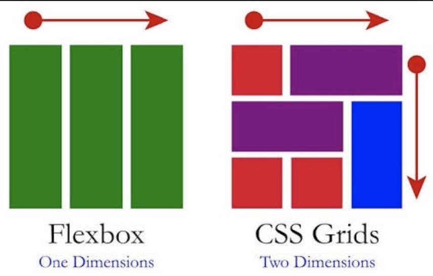
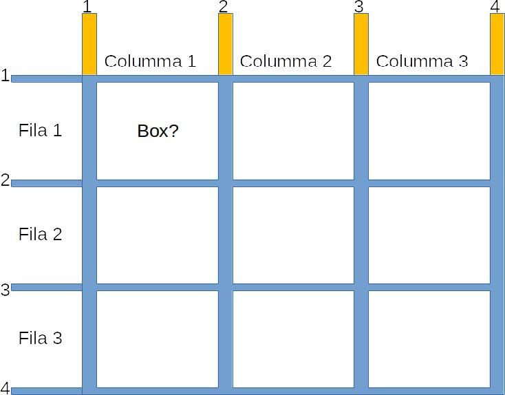

# Grid
## Tabla de Contenidos
- [Elementos de CSS Grid](#elementos-de-css-grid)
- [Propiedades del Grid](#propiedades-del-grid)
- [Trabajando con la Grid](#trabajando-con-la-grid)
- [Combinando Celdas](#combinando-celdas)
- [Explotando la Potencia de CSS Grid](#explotando-la-potencia-de-css-grid)
- [Ejemplo Práctico](#ejemplo-práctico)

---

## Elementos de CSS Grid

### Grid Container
El **Grid Container** es el elemento que contiene la rejilla. Para crear un contenedor de grid, se define el elemento CSS como `display: grid` o `display: inline-grid`.

```css
.container {
    display: grid;
}
```

### Grid Item
Un **Grid Item** es cada uno de los elementos contenidos en el Grid Container.


### Grid Line
Las **Grid Lines** son las líneas que forman la cuadrícula, tanto verticales como horizontales. Se utilizan para definir el crecimiento y los espacios de los elementos.



### Cell
Una **Cell** es el espacio entre dos líneas adyacentes, tanto verticales como horizontales.


### Track
Un **Track** (pista o camino) es el espacio entre dos líneas adyacentes.


### Grid Area
Una **Grid Area** es todo el espacio envuelto entre cuatro líneas de la grid.


---
## Propiedades del Grid
CSS Grid tiene varias propiedades para configurar el comportamiento de la rejilla y de los elementos dentro de ella. A continuación, se detallan algunas de las más importantes:

| **Contenedor**        | **Grid Item**     |
|-----------------------|------------------|
| `display`             |                  |  
| `grid-template-columns` | `grid-column`<br></br>`grid-column-start`<br></br>`grid-column-end`<br></br>`grid-row`<br></br>  `grid-row-start`<br></br>`grid-row-end`  <br></br>   |  
| `grid-template-rows`  | `grid-row`       |  
| `grid-template-areas` | `grid-area`      |  
| `grid-template`       |                  |  
| `grid-column-gap`     |                  |  
| `grid-row-gap`        |                  |  
| `grid-gap`            |                  |  
| `justify-items`       |                  |  
| `align-items`         |                  |  
| `place-items`         |                  |  
| `justify-content`     | `justify-self`   |  
| `align-content`       | `align-self`     |  
| `place-content`       | `place-self`     |  
| `grid-auto-columns`   |                  |  
| `grid-auto-rows`      |                  |  
| `grid-auto-flow`      |                  |  

---
## Trabajando con la Grid
### Creando Filas y Columnas
Mediante las propiedades grid-template-columns y grid-template-rows se puede definir la estructura básica de la rejilla. Por ejemplo, para crear una cuadrícula de 3 columnas de 100px de ancho y 2 filas de 30px de alto:

```css
.container {
    display: grid;
    grid-template-columns: 100px 100px 100px;
    grid-template-rows: 30px 30px;
}
```
**Resultado:**
<div class="container-pix">
  <div>1</div>
  <div>2</div>
  <div>3</div>
  <div>4</div>
  <div>5</div>
  <div>6</div>
</div>

También puedes usar **proporciones**:

```css
.container {
    display: grid;
    grid-template-columns: 10% 50% 100px;
    grid-template-rows: 30px 30px;
}
```
**Resultado:**
<div class="container-prop">
  <div>A</div>
  <div>B</div>
  <div>C</div>
  <div>D</div>
  <div>E</div>
  <div>F</div>
</div>

O utilizar **fracciones** (`fr`):
```css
.container {
    display: grid;
    grid-template-columns: 1fr 1fr 2fr;
    grid-template-rows: 1fr 5fr;
}
```
**Resultado:**
<div class="container-frac">
  <div>X</div>
  <div>Y</div>
  <div>Z</div>
  <div>W</div>
  <div>V</div>
  <div>U</div>
</div>

---
## Combinando Celdas
Puedes combinar celdas utilizando las propiedades `grid-column-start` y `grid-column-end` o su forma abreviada `grid-column`.

```css
.grid-container {
  display: grid;
  grid-template-columns: 100px 100px 100px;
  grid-template-rows: 50px 50px 50px;
  gap: 5px;

}

.item1 {
  grid-column-start: 1;
  grid-column-end: 3;
  background-color: lightcoral;
  text-align: center;
}

.item2 {
  background-color: lightblue;
  text-align: center;
}

.item3 {
  grid-column-start: 1;
  grid-column-end: 4;
  background-color: lightgreen;
  text-align: center;
}

.item4 {
  background-color: lightyellow;
  text-align: center;
}

.item5 {
  background-color: lightpink;
  text-align: center;
  grid-column: 2/4;
}
```
**Resultado:**
  <div class="grid-container">
      <div class="item1">Item 1</div>
      <div class="item2">Item 2</div>
      <div class="item3">Item 3</div>
      <div class="item4">Item 4</div>
      <div class="item5">Item 5</div>
  </div>


### Grid Areas
En lugar de definir explícitamente la posición de cada elemento, puedes usar `grid-template-areas` para crear áreas con nombre, facilitando la disposición de los elementos.

```css
.container {
    display: grid;
    grid-template-areas: 
        "header header header"
        "sidebar content content"
        "footer footer footer";
}

.header {
    grid-area: header;
}

.sidebar {
    grid-area: sidebar;
}

.content {
    grid-area: content;
}

.footer {
    grid-area: footer;
}
```


### Disposición de los Elementos
#### Justificación y Alineación en Eje Horizontal y Vertical
Para alinear los elementos en el eje horizontal, usa `justify-items` o `justify-self` para alineación individual. Para alinear en el eje vertical, usa `align-items` o `align-self`.

```css
.container {
    justify-items: center;
    align-items: center;
}
```

### Gap
La propiedad `gap` controla el espacio entre los elementos de la grid. También puedes usar `column-gap` y `row-gap` para definir espacios específicos.

```css
.container {
    gap: 1em; /* Define un espacio de 1em entre los elementos */
}
```
---
## Explotando la Potencia de CSS Grid
### Repetición con `repeat()`
La función `repeat()` permite simplificar la definición de columnas o filas repetitivas.

```css
.container {
    grid-template-columns: repeat(3, 200px);
}
```

### Responsividad y Función `minmax()`
Usa `minmax()` para definir el tamaño mínimo y máximo de las columnas o filas, mejorando la flexibilidad y responsividad de la grid.

```css
.container {
    grid-template-columns: repeat(auto-fill, minmax(100px, 1fr));
}
```
---
## Ejemplo Práctico

```html
<!DOCTYPE html>
<html lang="en">
<head>
    <meta charset="UTF-8">
    <meta name="viewport" content="width=device-width, initial-scale=1.0">
    <link rel="stylesheet" href="style.css">
    <title>The Grid</title>
</head>
<body>
    <main class="container">
        <div class="box1">Box1</div>
        <div class="box2">Box2</div>
        <div class="box3">Box3</div>
        <div class="box4">Box4</div>
        <div class="box5">Box5</div>
        <div class="box6">Box6</div>
    </main>
</body>
</html>

<style>
* {
    margin: 0;
    padding: 0;
    box-sizing: border-box;
}

.container {
    display: grid;
    grid-template-columns: repeat(3, 1fr);
    gap: 10px;
    padding: 20px;
}

.box1 { background: lightcoral; }
.box2 { background: lightsalmon; }
.box3 { background: lightblue; }
.box4 { background: lightcyan; }
.box5 { background: lightseagreen; }
.box6 { background: lightgreen; }
</style>
```
<main class="container-ejemplo">
        <div class="box1">Box1</div>
        <div class="box2">Box2</div>
        <div class="box3">Box3</div>
        <div class="box4">Box4</div>
        <div class="box5">Box5</div>
        <div class="box6">Box6</div>
    </main>