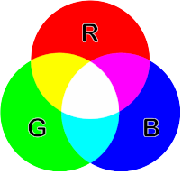

# Colores

## Tabla de Contenidos
- [El Sistema RGB](#el-sistema-rgb)
- [Colores seguros](#colores-seguros)
- [Propiedad `color` en CSS](#propiedad-color-en-css)
- [Fondos](#fondos)

---

El uso de colores y fondos es fundamental para crear una estética visual atractiva y coherente en cualquier página web. Vamos a ver cómo utilizar las propiedades de color y fondo en CSS para personalizar el diseño de tu sitio web.

##  El Sistema RGB

El ojo humano percibe los colores: rojo, verde y azul y, el resto de los colores se consiguen con la adición de estos tres colores en diferentes proporciones. El blanco se consigue con la mezcla de los tres colores puros y se considera el negro como la ausencia de color. A estos colores se les llama colores aditivos y el ordenador se basa en este sistema para la representación de los colores dando lugar a lo que conocemos como Modo de color RGB. RGB es el acrónimo de los nombres de los colores rojo, verde y azul en inglés: Red, Green, Blue.

Los ordenadores emplean estos tres colores para representar cualquier color de la escala cromática. Pero ¿cómo lo hace? El ordenador utiliza 8 bits de información para representar cada color. La escala monocromática de un color viene dada por todas las posibles combinaciones de estos 8 bits, en total 256. Si tenemos en cuenta que tenemos una escala de 0 a 255 para representar cada color, es decir, 256 grados de cada color y, que el resto de los colores se consiguen mezclando estos tres ¿cuántos colores tenemos en total? Para saberlo tenemos que calcular todas las combinaciones que existen multiplicando tres veces el número de grados de cada color: 256 x 256 x 256, lo que nos da 16.777.216 colores.

A la hora de representar cada color utilizamos este modelo RGB y lo podemos hacer empleando tanto el sistema de numeración decimal como el sistema de numeración hexadecimal.



---
## Colores seguros

Recuerda que una misma página se puede ver de distinta forma según la plataforma, sistema operativo, navegador y monitor empleados. ¿Acaso los colores no son siempre los mismos?

El color rojo siempre es y será rojo. Pero, ¿es posible que quede algún usuario con un monitor muy antiguo o con una versión del navegador muy anticuada? Sí, es posible y debemos tenerlo en cuenta. Hay monitores que sólo permiten visualizar 256 colores. Hay navegadores que poseen una paleta de sólo 216 colores conocidos en el ámbito del diseño web como colores seguros. Emplear estos colores seguros es una forma de garantizar que nuestro sitio Web se verá del mismo modo en todos los navegadores.

Los colores seguros son los que se forman con las combinaciones de los tres colores rojo, verde y azul pero sólo con los valores hexadecimales: 00, 33, 66, 99, CC y FF. Son seis grados distintos de cada color y por eso hay 216 colores en total ya que 216 es el resultado de multiplicar 6 x 6 x 6.


---
## Propiedad `color` en CSS
La propiedad `color` en CSS establece el color del texto (primer plano) de un elemento. Existen varias maneras de definir colores:

1. **Palabras clave**: Colores predefinidos como `red`, `blue`, `green`, etc.
2. **Valores RGB**:
   - **RGB (`rgb`)**: Define colores mediante combinaciones de rojo, verde y azul. Cada canal puede tener un valor entre 0 y 255.
   - **Hexadecimal**: Representa colores en formato hexadecimal, por ejemplo, `#ff0000` para rojo.
   - **Porcentaje**: Se pueden usar porcentajes para definir cada canal RGB, como `rgb(100%, 0%, 0%)`.

3. **RGBA**: Similar a RGB pero incluye un canal alfa para controlar la opacidad. Sus valores van de 0 (transparente) a 1 (opaco).
   ```css
   color: rgba(255, 0, 0, 0.5); /* Rojo semitransparente */
   ```
    **Resultado:**
    <div class="rgba">
    <p>Rojo semitransparente</p>
    </div>
4. **HSL**:
    - **Hue** (Tono): Define el color base usando un círculo cromático (0 a 360 grados).
    - **Saturation** (Saturación): Controla la pureza del color, de 0% (gris) a 100% (color puro).
    - **Lightness** (Luminosidad): Controla la cantidad de luz del color, de 0% (negro) a 100% (blanco).

    ```css
    color: hsl(120, 100%, 50%); /* Verde puro */
    ```
    **Resultado:**
    <div class="hsl">
    <p>Verde puro</p>
    </div>

5. **HSLA**: Añade un canal alfa a HSL para controlar la opacidad.
    ```css
    color: hsla(120, 100%, 50%, 0.3); /* Verde con 30% de opacidad */
    ```
    **Resultado:**
    <div class="hsla">
    <p>Verde 30% opacidad</p>
    </div>

---
## Fondos
### Propiedades de Fondo
CSS ofrece diversas propiedades para personalizar el fondo de los elementos:

1. **`background-color`**: Define el color de fondo. Se puede aplicar a la página completa o a elementos individuales.

    ```css
    background-color: #5f92f9;
    ```
    **Resultado:**
    <div class="bg-color">
    <p>Fondo azul</p>
    </div>

2. **`background-image`**: Establece una imagen como fondo. Se utiliza con la función `url()`:

    ```css
    background-image: url('imagen.png');
    ```
    **Resultado:**
    <div class="bg-img"></div>

3. **`background-repeat`**: Controla cómo se repite la imagen de fondo:
    - **`repeat`**: Repite la imagen tanto horizontal como verticalmente.
    - **`repeat-x`**: Repite solo en la dirección horizontal.
    - **`repeat-y`**: Repite solo en la dirección vertical.
    - **`no-repeat`**: No repite la imagen.

4. **`background-position`**: Define la posición de la imagen de fondo. Puede usar valores predefinidos como `top`, `bottom`, `center` o valores en píxeles o porcentajes para controlar la posición exacta.

    ```css
    background-position: center center;
    ```
    **Resultado:**
    <div class="bg-position"></div>

5. **`background-attachment`**: Determina si la imagen de fondo se desplaza con el contenido o se mantiene fija:

    - **`scroll`**: La imagen se mueve con el contenido.
    - **`fixed`**: La imagen permanece fija al hacer scroll.
    - **`inherit`**: Hereda el valor del elemento padre.

6. **`background-origin`** y **`background-clip`**: Controlan desde dónde se pinta la imagen de fondo y el área visible de la misma, respectivamente:
    - Valores: `border-box`, `padding-box`, `content-box`.

7. **`background-size`**: Ajusta el tamaño de la imagen de fondo:
    - cover: La imagen cubre todo el área del fondo.
    - contain: La imagen se escala para caber completamente en el área del fondo.

8. **`background-blend-mode`**: Define cómo se combinan múltiples capas de fondo. Puedes probar diferentes modos en w3schools.

#### Sintaxis Completa de background
Todas estas propiedades pueden combinarse en una sola declaración background:

```css
background: url('fondo1.png') top left no-repeat, 
            url('fondo2.png') center no-repeat, 
            #ffffff;
```
**Resultado:**
<div class="bg-completo"></div>

El orden de las propiedades es indiferente, excepto para `background-position`, que debe mantener sus valores de posición horizontal y vertical juntos.

### Degradados
1. **`linear-gradient`**: Crea un degradado lineal. Puedes definir el ángulo del degradado con grados (`deg`).

    ```css
    background: linear-gradient(45deg, #ff0000, #0000ff);
    ```
    **Resultado:**
    <div class="degradado-lineal">
    <p>Degradado lineal</p>
    </div>

2. **`radial-gradient`**: Crea un degradado radial. Funciona de manera similar a `linear-gradient`, pero sin ángulo.

    ```css
    background: radial-gradient(circle, #ff0000, #0000ff);
    ```
    **Resultado:**
    <div class="degradado-radial">
    <p>Degradado radial</p>
    </div>

### Sombras y Filtros
1. **`box-shadow`**: Crea una sombra alrededor de un elemento. La sintaxis incluye valores para la posición horizontal, vertical, el difuminado y el color.

    ```css
    box-shadow: 10px 10px 5px #888888;
    ```
    **Resultado:**
    <div class="sombra">
    <p>Sombra</p>
    </div>

2. **`inset`**: Para sombras internas. Se pueden combinar múltiples sombras separadas por comas.

3. **`text-shadow`**: Aplica sombras al texto de manera similar a box-shadow:

    ```css
    text-shadow: 2px 2px 4px #000000;
    ```
    **Resultado:**
    <div class="sombra-texto">
    <p>Texto con sombra</p>
    </div>

4. **`filter`**: Aplica efectos visuales a las imágenes, como desenfoque, escala de grises, sepia, entre otros. Puedes experimentar con los diferentes filtros en w3schools.

    ```css
    filter: grayscale(100%);
    ```
    **Resultado:**
    <div class="filtro"></div> 