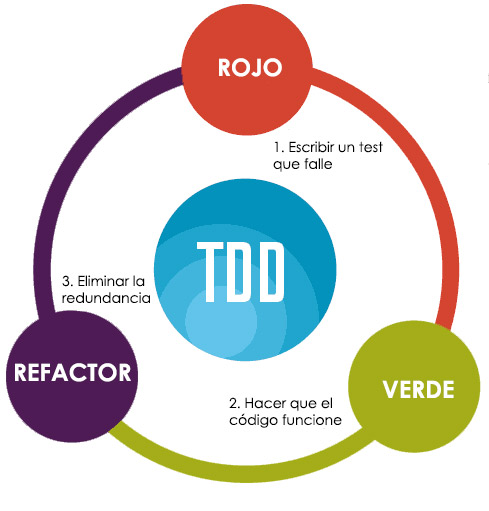

# Ferramentes

??? abstract "Duració y criteris d'avaluació"

    Duració estimada: 16 hores

    <hr />

    | Resultat d'aprenentatge  | Criteris d'avaluació  |
    | ------                    | -----                |
    | 4.- Desarrolla aplicaciones Web embebidas en lenguajes de marcas analizando e incorporando funcionalidades según especificaciones.        | g) Se han utilizado herramientas y entornos para facilitar la programación, prueba y depuración del código.   |

En aquesta unitat estudiarem algunes de les eines més utilitzades en PHP.

## Composer

<figure style="float: right;">
    
    <figcaption>Logo Composer</figcaption>
</figure>

Eina per excel·lència en PHP per a la gestió de llibreries i dependències, de manera que instal·la i les actualitza assegurant que tot l'equip de desenvolupament té el mateix entorn i versions. A més, ofereix *autoloading* del nostre codi, de manera que no hàgem de fer-lo nosaltres "a mà".

Està escrit en PHP, i podeu consultar tota la seua documentació en [https://getcomposer.org/](https://getcomposer.org/).

Utilitza [*Packagist*]( https://packagist.org/) com a repositori de llibreries.

Funcionalment, és similar a Maven (Java) / npm (JS).

### Instal·lació

Si estem usant XAMPP, hem d'instal·lar *Composer* en el propi sistema operatiu. Es recomana seguir les [instruccions oficials](https://getcomposer.org/doc/00-intro.md) segons el sistema operatiu a emprar.

En canvi, si usem *Docker*, necessitem modificar la configuració del nostre contenidor. En el nostre cas, hem decidit modificar l'arxiu `Dockerfile` i afegir el següent comando:

``` docker
COPY --from=composer:2.0 /usr/bin/composer /usr/local/bin/composer
```

És important que dins del contenidor comprovem que tenim la v2:

``` bash
composer -V
```

### Primers passos

Quan creem un projecte per primera vegada, hem d'inicialitzar el repositori. Per a això, executarem el comando `composer init` on:

* Configurem el nom del paquet, descripció, autor (nom <email>), tipus de paquet (project), etc...
* Definim les dependències del projecte (`require`) i les de desenvolupament (`require-dev`) de manera interactiva.
* En les de desenvolupament s'indica aquelles que no s'instal·laran a l'entorn de producció, per exemple, les llibreries de proves.

Després de la seua configuració, es crearà automàticament l'arxiu `composer.json` amb les dades introduïdes i descàrrega les llibreries en la carpeta `vendor`. La instal·lació de les llibreries sempre es realitza de manera local per a cada projecte.

``` json
{
    "name": "dwes/log",
    "description": "Pruebas con Monolog",
    "type": "project",
    "require": {
        "monolog/monolog": "^2.1"
    },
    "license": "MIT",
    "authors": [
        {
            "name": "Aitor Medrano",
            "email": "a.medrano@edu.gva.es"
        }
    ]
}
```

A l'hora d'indicar cada llibreria introduirem:

* el nom de la llibreria, composta tant pel creador o "vendor", com pel nom del projecte. Exemples: `monolog/monolog` o `laravel/installer`.
* la versió de cada llibreria. Tenim diverses opcions per a indicar-la:

    * Directament: 1.4.2
    * Amb comodins: 1.
    * A partir de: >= 2.0.3
    * Sense trencament de canvis: ^1.3.2 // >=1.3.2 <2.0.0

### Actualitzar llibreries

Podem definir les dependències via l'arxiu `composer.json` o mitjançant comandos amb el format `composer require vendor/package:version`. Per exemple, si volem afegir phpUnit com a llibreria de desenvolupament, farem:

``` bash
composer require phpunit/phpunit –dev
```

Després d'afegir noves llibreries, hem d'actualitzar el nostre projecte:

``` bash
composer update
```

Si creem l'arxiu `composer.json` nosaltres directament sense inicialitzar el repositori, hem d'instal·lar les dependències:

``` bash
composer install
```

En fer aquest pas (tant instal·lar com actualitzar), com ja hem comentat, es descarreguen les llibreries en dins de la carpeta `vendor`. És molt important afegir aquesta carpeta a l'arxiu `.gitignore` per a no pujar-les a GitHub.

A més es crea l'arxiu `composer.lock`, que emmagatzema la versió exacta que s'ha instal·lat de cada llibreria (aquest arxiu no es toca).

### `autoload.php`

*Composer* crea de manera automàtica en `vendor/autoload.php` el codi per a incloure de manera automàtica totes les llibreries que tinguem configurades en `composer.json`.

Per a utilitzar-ho, en la capçalera del nostre arxius posarem:

``` php
<?php
require 'vendor/autoload.php';
```

En el nostre cas, de moment només el podrem en els arxius on provem les classes

Si volem que Composer també s'encarregue de carregar de manera automàtica les nostres classes de domini, dins de l'arxiu `composer.json`, definirem la propietat `autoload`:

``` json
"autoload": {
    "psr-4": {"Dwes\\": "app/Dwes"}
},
```

Posteriorment, hem de tornar a generar el *autoload* de *Composer* mitjançant l'opció `dump-autoload` (o `du`):

``` bash
composer dump-autoload
```

## Arxius PDF


Amb PHP podem manejar tot tipus d'arxius com ja hem vist però, què passa si volem generar fitxers PDF amb dades tretes d'una base de dades?

<div class="center img-small">
    
</div>


Gràcies a una classe escrita en PHP, podem generar arxius PDF sense necessitat d'instal·lar llibreries addicionals en el nostre servidor.
Però anem a utilitzar una llibreria que permet transformar codi html en pdf.

### DOMPDF

Afegirem la llibreria de [*DOMPDF*](https://github.com/seldaek/monolog) al nostre projecte. Per a això, inclourem la llibreria en el nostre projecte amb:

``` bash
composer require dompdf/dompdf
```
Una vegada que DOMPDF està instal·lat, el procés per generar PDFs des de HTML és bastant directe. Els passos bàsics són:

Pas 1: Incloent DOMPDF
Primer, necessitarem incloure DOMPDF en el script PHP. Si estem utilitzant Composer, això es fa automàticament a través de l'auto-càrrega de Composer. Només cal afegir la següent línia al principi del'script:

```php
require 'vendor/autoload.php';
```

Pas 2: Creació d'una Instància de DOMPDF
A continuació, creem una nova instància de la classe DOMPDF:

```php

use Dompdf\Dompdf;

$dompdf = new Dompdf();
```

Pas 3: Carregar HTML
Després, carregem l'HTML en l'objecte DOMPDF. Això es pot fer directament com una cadena o carregant un fitxer HTML:

```php
$html = "<html><body>Hola, això és una prova.</body></html>";
$dompdf->loadHtml($html);
```

O bé carregar un fitxer HTML:

```php
$dompdf->loadHtml(file_get_contents('path/to/your/file.html'));
```

Pas 4: Configuració de la Mida del Paper i l'Orientació
Podem configurar la mida del paper i l'orientació si és necessari:

```php
$dompdf->setPaper('A4', 'portrait'); // o 'landscape'
```

Pas 5: Renderització del PDF
Ara, demanem a DOMPDF que renderitze el PDF:

```php
$dompdf->render();
```

Pas 6: Eixida del PDF
Finalment, podem enviar el PDF al navegador, guardar-lo en un fitxer o fer amb ell el que necessitem:

Per mostrar-lo al navegador:

```php
$dompdf->stream("document.pdf", array("Attachment" => false));
```

Per desar-lo en un fitxer:

```php
$output = $dompdf->output();
file_put_contents('path/to/save/document.pdf', $output);
```

##### Consells Addicionals
Cal assegurar-se que l'HTML és vàlid i ben format. DOMPDF intenta ser tolerant amb l'HTML, però l'HTML mal format pot causar problemes.
El CSS que s'utilitze pot afectar significativament com es veu el PDF. DOMPDF suporta una bona part de CSS 2.1, però no tot.
Si necessitem incloure imatges, cal assegurar-se que les rutes són absolutes i accessibles des del servidor on s'executa DOMPDF.
Aquesta és una guia bàsica per començar amb DOMPDF. Per a casos d'ús més avançats i opcions de configuració, cal consultar la documentació oficial de DOMPDF.

## Monolog

Provarem *Composer* afegint la llibreria de [*Monolog*](https://github.com/seldaek/monolog) al nostre projecte. Es tracta d'un llibreria per a la gestió de logs de les nostres aplicacions, suportant diferents nivells (info, warning, etc...), eixides (fitxers, sockets, BBDD, Web Services, email, etc) i formats (text pla, HTML, JSON, etc...).

Per a això, inclourem la llibreria en el nostre projecte amb:

``` bash
composer require monolog/monolog
```

Monolog 2 requereix almenys PHP 7.2, compleix amb el estandar de logging PSR-3, i és la llibreria emprada per *Laravel* i *Symfony* per a la gestió de logs.

!!! info "Quan utilitzar un log"
    * Seguir les acciones/moviments dels usuaris
    * Registrar les transaccions
    * Rastrejar els errors d'usuari
    * Fallades/avisos a nivell de sistema
    * Interpretar i col·leccionar dades per a posterior investigació de patrons

### Nivells

A continuació vam mostrar els diferents nivells de menys a més restrictiu:
 
    * debug -100: Informació detallada amb propòsits de debug. No usar en entorns de producció.
    * info - 200: Esdeveniments interessants com l'inici de sessió d'usuaris.
    * notice - 250: Esdeveniments normals però significatius.
    * warning - 300: Ocurrències excepcionals que no arriben a ser error.
    * error - 400: Errors d'execució que permeten continuar amb l'execució de l'aplicació però que han de ser monitorats.
    * critical - 500: Situacions importants on es generen excepcions no esperades o no hi ha disponible un component.
    * alert - 550: S'han de prendre mesures immediatament.
      Caiguda completa de la web, base de dades no disponible, etc... A més, se solen enviar missatges per email.
    * emergency - 600: És l'error més greu i indica que tot el sistema està inutilitzable.

### Hola Monolog

Per exemple, en l'arxiu `pruebaLog.php` que col·locaríem en l'arrel, primer incloem el *autoload*, importem els classes a utilitzar per a finalment usar els mètodes de *Monolog*:

``` php
<?php
include __DIR__ ."/vendor/autoload.php";

use Monolog\Logger;
use Monolog\Handler\StreamHandler;

$log = new Logger("MiLogger");
$log->pushHandler(new StreamHandler("logs/milog.log", Logger::DEBUG));

$log->debug("Esto es un mensaje de DEBUG");
$log->info("Esto es un mensaje de INFO");
$log->warning("Esto es un mensaje de WARNING");
$log->error("Esto es un mensaje de ERROR");
$log->critical("Esto es un mensaje de CRITICAL");
$log->alert("Esto es un mensaje de ALERT");
```

En tots els mètodes de registre de missatges (`debug`, `info`, ...), a més del propi missatge, li podem passar informació com el contingut d'alguna variable, usuari de l'aplicació, etc.. com a segon paràmetre dins d'un array, el qual es coneix com **array de contexte**. 
És convenient fer-ho mitjançant un array associatiu per a facilitar la lectura del log.

``` php
<?php
$log->warning("Producto no encontrado", [$producto]);
$log->warning("Producto no encontrado", ["datos" => $producto]);
```

### Funcionament

Cada instància `Logger` té un nom de canal i una pila de manejadores (*handler*).
Cada missatge que manem al log travessa la pila de manejadores, i cadascun decideix si ha de registrar la informació, i si es dona el cas, finalitzar la propagació.
Per exemple, un `StreamHandler` en el fons de la pila que ho escriga tot en disc, i en el topall afig un `MailHandler` que envie un mail només quan hi haja un error.

### Manejadors

Cada manejador tambien té un formatejador (`Formatter`). Si no s'indica cap, se li assigna un per defecte. L'últim manejador inserit serà el primer a executar-se.
Després es van executant conforme a la pila.

Els manejadores més utilitzats són:

* `StreamHandler(ruta, nivel)`
* `RotatingFileHandler(ruta, maxFiles, nivel)`
* `NativeMailerHandler(para, asunto, desde, nivel)`
* `FirePHPHandler(nivel)`

Si volem que els missatges de l'aplicació isquen pel log del servidor,
en el nostre cas l'arxiu `error.log` de Apatxe* utilitzarem com a ruta l'eixida d'error:

``` php
<?php
// error.log
$log->pushHandler(new StreamHandler("php://stderr", Logger::DEBUG));
```

!!! tip "FirePHP"
    Per exemple, mitjançant `FirePHPHandler`, podem utilitzar `FirePHP`, la qual és una eina per a fer debug en la consola de Firefox*.
    Després d'instal·lar l'extensió en Firefox, habilitar les opcions i configurar el *Handler*, podem veure els missatges acolorits amb les seues dades:

    ``` php
    <?php
    $log = new Logger("MiFirePHPLogger");
    $log->pushHandler(new FirePHPHandler(Logger::INFO));

    $datos = ["real" => "Bruce Wayne", "personaje" => "Batman"];
    $log->debug("Esto es un mensaje de DEBUG", $datos);
    $log->info("Esto es un mensaje de INFO", $datos);
    $log->warning("Esto es un mensaje de WARNING", $datos);
    // ...
    ```

    <figure style="align: center;">
        
        <figcaption>Ejemplo de uso de FirePHP</figcaption>
    </figure>

### Canals

Se'ls assigna en crear el `Logger`. En grans aplicacions, es crea un canal per cada subsistema: vendes, comptabilitat, magatzem.
No és una bona pràctica usar el nom de la classe com a canal, això es fa amb un processador.

Per al seu ús, és recomane assignar el log a una propietat privada a Logger, i posteriorment, en el constructor de la classe, assignar el canal, manejadors i format.

``` php
<?php
$this->log = new Logger("MiApp");
$this->log->pushHandler(new StreamHandler("logs/milog.log", Logger::DEBUG));
$this->log->pushHandler(new FirePHPHandler(Logger::DEBUG));
```

I dins dels mètodes per a escriure en el log:

``` php
<?php
$this->log->warning("Producto no encontrado", [$producto]);
```

### Processadors

Els processadors permeten afegir informació als missatges. 
Per a això, s'apilen després de cada manejador mitjançant el mètode `pushProcessor($processador)`.

Alguns processadors coneguts són `IntrospectionProcessor` (mostren la línia, fitxer, classe i metodo des del qual s'invoca el log), `WebProcessor` (afig la URI, mètode i IP) o `GitProcessor` (afig la branca i el commit).

=== "PHP"

    ``` php
    <?php
    $log = new Logger("MiLogger");
    $log->pushHandler(new RotatingFileHandler("logs/milog.log", 0, Logger::DEBUG));
    $log->pushProcessor(new IntrospectionProcessor());
    $log->pushHandler(new StreamHandler("php://stderr", Logger::WARNING));
    // no usa Introspection pq lo hemos apilado después, le asigno otro
    $log->pushProcessor(new WebProcessor());
    ```

=== "Consola en format text"

    ``` log
    [2020-11-26T13:35:31.076138+01:00] MiLogger.DEBUG: Esto es un mensaje de DEBUG [] {"file":"C:\\xampp\\htdocs\\log\\procesador.php","line":12,"class":null,"function":null}
    [2020-11-26T13:35:31.078344+01:00] MiLogger.INFO: Esto es un mensaje de INFO [] {"file":"C:\\xampp\\htdocs\\log\\procesador.php","line":13,"class":null,"function":null}
    ```

### Formateadores

S'associen als manejadores amb `setFormatter`. Els formateadores més utilitzats són `LineFormatter`, `HtmlFormatter` o `JsonFormatter`.

=== "PHP"

    ``` php
    <?php
    $log = new Logger("MiLogger");
    $rfh = new RotatingFileHandler("logs/milog.log", Logger::DEBUG);
    $rfh->setFormatter(new JsonFormatter());
    $log->pushHandler($rfh);
    ```

=== "Consola en JSON"

    ``` json
    {"message":"Esto es un mensaje de DEBUG","context":{},"level":100,"level_name":"DEBUG","channel":"MiLogger","datetime":"2020-11-27T15:36:52.747211+01:00","extra":{}}
    {"message":"Esto es un mensaje de INFO","context":{},"level":200,"level_name":"INFO","channel":"MiLogger","datetime":"2020-11-27T15:36:52.747538+01:00","extra":{}}
    ```

!!! tip "Més informació"
    Més informació sobre manejadores, formateadores i processadors en <https://github.com/Seldaek/monolog/blob/master/doc/02-handlers-formatters-processors.md>

### Ús de Factories

En comptes de instanciar un log en cada classe, és convenient crear una factoria (per exemple, seguint la idea del patró de disseny [*Factory Method*](https://refactoring.guru/és/design-patterns/factory-method)).

Per al següent exemple, suposarem que creguem la factoria en el *namespace* `Dwes\Exemples\Util`.

``` php
<?php
namespace Dwes\Ejemplos\Util

use Monolog\Logger;
use Monolog\Handler\StreamHandler;

class LogFactory {

    public static function getLogger(string $canal = "miApp") : Logger {
        $log = new Logger($canal);
        $log->pushHandler(new StreamHandler("logs/miApp.log", Logger::DEBUG));

        return $log;
    }
}
```

Si en comptes de retornar un `Monolog\Logger` utilitzem la interfície de PSR, si en el futur canviem la implementació del log, no haurem de modificar nostre codi. Així doncs, la factoria ara retornarà `Psr\Log\LoggerInterface`:

``` php
<?php
namespace Dwes\Ejemplos\Util

use Monolog\Handler\StreamHandler;
use Monolog\Logger;
use Psr\Log\LoggerInterface;

class LogFactory {

    public static function getLogger(string $canal = "miApp") : LoggerInterface {
        $log = new Logger($canal);
        $log->pushHandler(new StreamHandler("log/miApp.log", Logger::DEBUG));

        return $log;
    }
}
```

Finalment, per a utilitzar la factoria, només canviem el codi que teníem en el constructor de les classes que usen el log, quedant alguna cosa asi:

``` php
<?php

namespace Dwes\Ejemplos\Model;

use Dwes\Ejemplos\Util\LogFactory;
use Monolog\Logger;

class Cliente {

    private $codigo; 

    private Logger $log;

    function __construct($codigo){ 
        $this->codigo=$codigo; 

        $this->log = LogFactory::getLogger();
    }

    /// ... resto del código
}
```

## Documentación con *phpDocumentor*


[phpDocumentor](https://www.phpdoc.org/) és l'eina per a documentar el codi PHP. És similar en propòsit i funcionament a *Javadoc*.

Així doncs, és un eina que facilita la documentació del codi PHP, creant un lloc web amb l'API de l'aplicació.

Es basa en l'ús d'anotacions sobre els docblocks. Per a posar-ho en marxa, en el nostre cas ens decantarem per utilitzar la imatge que ja existeix de Docker.

### Instal·lació 

##### Pas 1: Instal·lació amb Docker
Primer, cal assegurar-se tenir Docker instal·lat i funcionant al  sistema. Després, s'ha de descarregar i executar el contenidor de phpDocumentor utilitzant la següent comanda:

``` bash
docker pull phpdoc/phpdoc
```

#####  Pas 2: Generació de Documentació

Un cop tinguem la imatge, podem utilitzar-la per generar la documentació. El procés bàsic implica muntar els fitxers de codi dins del contenidor Docker i executar phpDocumentor sobre aquests fitxers.

Ací hi ha un exemple de com fer-ho:

En el cas d'usar *Docker*, usarem el següent comando per a executar-lo (crea el contenidor, executa el comando que li demanem, i automàticament l'esborra):

``` bash
docker run --rm -v $(pwd):/data phpdoc/phpdoc:latest run -d /data/src -t /data/docs
```
Aquesta comanda fa el següent:

--rm: Això elimina el contenidor després d'executar-lo, així no es queden contenidors inactius.
-v $(pwd):/data: Munta el directori actual del teu sistema ($(pwd)) al directori /data dins del contenidor. Hauràs de reemplaçar $(pwd) amb el camí on està el teu codi font si no estàs executant aquesta comanda des del directori del teu projecte.
-d /data/src: Especifica el directori dins del contenidor on es troba el teu codi font. Reemplaça /data/src amb el camí corresponent dins del contenidor si és diferent.
-t /data/docs: Especifica on vols que es generi la documentació dins del contenidor. En aquest cas, es generarà dins de /data/docs.

##### Pas 3: Accés a la Documentació Generada
Una vegada generada, la documentació estarà dins del directori que especificat (en aquest cas, `docs` dins del directori docs de projecte). Pots obrir els fitxers HTML amb qualsevol navegador per veure la documentació.


### DocBlock

Un *docblock* és el bloc de codi que es col·loca damunt d'un recurs. El seu format és:

``` php
<?php
/**
* Sumari*, una sola línia

* Descripció* que pot utilitzar diverses línies
* i que ofereix detalls de l'element o referències
* per a ampliar la informació

* @param string $miArgumento amb una descripció* de l'argument
* que pot usar diverses línies.

* @return void
*/
function miFuncion(tipo $miArgumento)
{
}
```
### Documentant el codi

En tots els elements, ademas del sumari i/o descripció, posarem:

* En les classes:
     * `@author` nom <email>
     * `@package` ruta del namespace
* En les propietats:
     * `@var` tipus descripció
* En els mètodes:
     * `@param` tipus $nomene descripció
     * `@throws` ClaseException descripció
     * `@return` tipus descripció

Vegem-ho amb un exemple. Suposem que tenim una classe que representa un client:

``` php
<?php
/**
* Classe que representa un client
* 
* El client s'encarrega d'emmagatzemar els suports que té llogat,
* de manera que podem llogar i retornar productes mitjançant les operacions
* homònimes.
* 
* @package Dwes\Videoclub\Model
* @author Aitor Medrano <a.medrano@edu.gva.es>
*/
class Cliente {

    public string $nombre; 
    private string $numero;

    /**
    * Colecció de soports alquilats
    * @var array<Soporte> 
    */
    private $soportesAlquilados[];

    /*
    * Comprova si el suport rebut ja el té llogat el client
    * @param Suport $suporte Suport a comprovar
    * @return bool true si ho té llogat
    /
    public function tieneAlquilado(Soporte $soporte) : bool { 
        // ...
    }
```

Si generem la documentació i obrim amb un navegador l'arxiu `docs/api/index.html` podrem navegar fins a la classe `Client:

<figure style="align: center;">
    
    <figcaption>phpDocumentor de Cliente</figcaption>
</figure>

## *Web Scraping*

Consisteix a navegar a una pàgina web i extraure informació automàticament, a partir del codi HTML generat, i organitzar la informació pública disponible en Internet.
Aquesta pràctica requereix l'ús d'una llibreria que facilite la descàrrega de la informació desitjada imitant la interacció d'un navegador web. Aquest "robot" pot accedir a diverses pàgines simultàniament.

!!! question "¿És legal?"
        Si el lloc web indica que té el contingut protegit per drets d'autor o en les normes d'accés via usuari/contrasenya ens avisa de la seua prohibició, estaríem incorrent en un delicte.
        És recomanable estudiar l'arxiu `robots.txt` que es troba en l'arrel de cada lloc web.
        Més informació en l'article [El manual complet per al web scraping legal i ètic en 2021](https://ichi.pro/es/el-manual-completo-para-el-web-scraping-legal-y-etico-en-2021-69178542830388)

### Goutte

[Goutte](https://github.com/FriendsOfPHP/Goutte) és un senzill client HTTP per a PHP creat específicament per a fer web scraping. Ho va desenvolupar el mateix autor del framework *Symfony* i ofereix un API senzilla per a extraure dades de les respostes HTML/XML dels llocs web.

Els components principals que abstrau *Goutte* sobre *Symfony* són:

* `BrowserKit`: simula el comportament d'un navegador web.
* `CssSelector`: tradueix consultes CSS en consultes XPath.
* `DomCrawler`: facilita l'ús del DOM i XPath.

Per a poder utilitzar *Goutte* en el nostre projecte, executarem el següent comando en el terminal:

``` bash
composer require fabpot/goutte
```

### Goutte con selectores CSS

A continuació farem un exemple molt senzill utilitzant els selectors CSS, extraient informació de la web `https://books.toscrape.com/`, la qual és una pàgina per a proves que no rebutjarà les nostres peticions.

Després de crear un client amb *Goutte*, hem de realitzar un petició a una URL. Amb la resposta obtinguda, podem utilitzar el mètode `filter` per a indicar-li la ruta CSS que volem recórrer i iterar sobre els resultats mitjançant una funció anònima. Una vegada estem dins d'un determinat node, el mètode `text()` ens retornarà el contingut del propi node.

En concret, ficarem en un array associatiu el títol i el preu de tots els llibres de la categoria *Classics*.

``` php
<?php
require '../vendor/autoload.php';

$httpClient = new \Goutte\Client();
$response = $httpClient->request('GET', 'https://books.toscrape.com/catalogue/category/books/classics_6/index.html');
// colocamos los precios en un array
$precios = [];
$response->filter('.row li article div.product_price p.price_color')->each(
    // le pasamos $precios por referencia para poder editarla dentro del closure
    function ($node) use (&$precios) {
        $precios[] = $node->text();
    }
);

// colocamos el nombre y el precio en un array asociativo
$contadorPrecios = 0;
$libros = [];
$response->filter('.row li article h3 a')->each(
    function ($node) use ($precios, &$contadorPrecios, &$libros) {
        $libros[$node->text()] = $precios[$contadorPrecios];
        $contadorPrecios++;
    }
);
```

### Crawler

Un cas molt comú és obtindre la informació d'una pàgina que té els resultats paginados, de manera que anem recorrent els enllaços i accedint a cadascun dels resultats.

En aquest cas agafarem tots els preus dels llibres de fantasia, i els sumarem:

``` php
<?php
require '../vendor/autoload.php';

use Goutte\Client;
use Symfony\Component\HttpClient\HttpClient;

$client = new Client(HttpClient::create(['timeout' => 60]));
$crawler = $client->request('GET', 'https://books.toscrape.com/catalogue/category/books/fantasy_19/index.html');

$salir = false;

$precios = [];
while (!$salir) {
    $crawler->filter('.row li article div.product_price p.price_color')->each(
        function ($node) use (&$precios) {
            $texto = $node->text();
            $cantidad = substr($texto, 2); // Le quitamos las libras ¿2 posiciones?
            $precios[] = floatval($cantidad);
        }
    );

    $enlace = $crawler->selectLink('next');
    if ($enlace->count() != 0) {
        // el enlace next existe
        $sigPag = $crawler->selectLink('next')->link();
        $crawler = $client->click($sigPag); // hacemos click
    } else {
        // ya no hay enlace next
        $salir = true;
    }
}

$precioTotal = array_sum($precios);
echo $precioTotal;
```

## Proves amb Codeception

El curs passat, dins del mòdul de Entorns de Desenvolupament*, estudiarieu la importància de la realització de proves, així com les proves unitàries mitjançant [JUnit](https://junit.org/junit5/).

<figure style="float: right;">
    
    <figcaption>Test Driven Development</figcaption>
</figure>

Hui dia és de gran importància seguir una bona metodologia de proves, sent el desenvolupament dirigit per les proves (Test Driven Development / TDD) un dels enfocaments més emprats, el qual consisteix en:

1. Escriure el test, i com no hi ha codi implementat, la prova falle (roig).
2. Escriure el codi d'aplicació perquè la prova funcione (verda).
3. refactoritzar el codi de l'aplicació amb l'ajuda de la prova per a comprovar que no trenquem res (refactor).

En el cas de PHP, l'eina que s'utilitza és *PHPUnit* (<https://phpunit.de/>), que com el seu nom indica, està basada en JUnit. La versió actual és la 9.0.
També podem utilitzar *Codeception* (<https://codeception.com/>) que inclou *PHPUnit*.

### Introducció a Codeception
Codeception és una eina de proves per a PHP que inclou suport per a proves unitàries, funcionals, d'acceptació i API. Per més informació, pots consultar la seua documentació oficial a Codeception.

#### Instal·lació i Configuració
Per començar amb Codeception, afegeix-lo com a dependència de desenvolupament en el teu composer.json:

``` json
"require-dev": {
"codeception/codeception": "^4.0"
},
"scripts": {
"test": "codecept run --colors"
}
```

També pots instal·lar-lo directament des del terminal:
    
``` bash
composer require --dev codeception/codeception ^4.0
```

!!! tip "Llibreries de desenvolupament"
Les llibreries que es col·loquen en `require-dev` són les de desenvolupament i *testing*, de manera que no s'instal·laran en un entorn de producció.


Una vegada instal·lat, executa vendor/bin/codecept bootstrap per inicialitzar la configuració bàsica.

##### Estructura de Carpetes
Codeception organitza les proves en diverses carpetes segons el tipus de prova: 
tests/unit, tests/functional, tests/acceptance.

##### Exemple de Prova Unitària
A continuació, un exemple de com escriure una prova unitària en Codeception:

``` php
<?php
namespace tests\unit;

class PilaTest extends \Codeception\Test\Unit
{
    public function testPushAndPop()
    {
        $pila = [];
        $this->assertSame(0, count($pila));

        array_push($pila, 'batman');
        $this->assertSame('batman', $pila[count($pila)-1]);
        $this->assertSame(1, count($pila));

        $this->assertSame('batman', array_pop($pila));
        $this->assertSame(0, count($pila));
    }
}
```

##### Execució de Proves
Per executar les proves, pots utilitzar les comandes següents:

vendor/bin/codecept run (executa totes les proves)
vendor/bin/codecept run unit (executa només proves unitàries)
vendor/bin/codecept run --testdox --colors (mostra els resultats en format més llegible)

### Dissenyant proves

Tal com hem vist en l'exemple, la classe de prova ha d'heretar de `\Codeception\Test\Unit`, i el nom de la classe ha d'acabar en `Test`, d'aquí ve que hàgem anomenat la classe de prova com `PilaTest`.
Una prova implica un mètode de prova (públic) per cada funcionalitat a provar. Cada un dels mètodes se'ls associa un cas de prova.
Els mètodes han de nomenar-se amb el prefix `test`, per exemple, `testPushAndPop`. És molt important que el nom siga molt clar i descriptiu del propòsit de la prova. (*camelCase*).
En els casos de prova prepararem diverses assercions per a tota la casuística: rangs de valors, tipus de dades, excepcions, etc...

### Assercions

Les assercions permeten comprovar el resultat dels mètodes que volem provar. Les assercions esperen que el predicat sempre siga vertader.

PHPUnit ofereix les següent assercions:

* `assertTrue` / `assertFalse`: Comprova que la condició donada siga avaluada com true / false
* `assertEquals` / `assertSame`: Comprova que dues variables siguen iguals
* `assertNotEquals` / `assertNotSame`: Comprova que dues variables NO siguen iguals
* `Same` → comprova els tipus. Si no coincideixen els tipus i els valors, l'asserció fallarà
* `Equals` → sense comprovació estricta
* `assertArrayHasKey` / `assertArrayNotHasKey`: Comprova que un array posseïsca un *key* determinat / o NO ho posseïsca
* `assertArraySubset`: Comprova que un array posseïsca un altre array com subset del mateix
* `assertAttributeContains` / `assertAttributeNotContains`: Comprova que un atribut d'una classe continga una variable determinada / o NO continga una variable determinada
* `assertAttributeEquals`: Comprova que un atribut d'una classe siga igual a una variable determinada.

### Comparant l'eixida

Si els mètodes a provar generen contingut mitjançant `echo` o una instrucció similar, disposem de les següent expectatives:

* `expectOutputString(salidaEsperada)`
* `expectOutputRegex(expresionRegularEsperada)`

Les expectatives difereixen de les assercions que informen del resultat que s'espera abans d'invocar al mètode. Després de definir l'expectativa, s'invoca al mètode que realitza el `echo`/`print`.

``` php
<?php
namespace Dwes\Videoclub\Model;

use PHPUnit\Framework\TestCase;
use Dwes\Videoclub\Model\CintaVideo;

class CintaVideoTest extends TestCase {
    public function testConstructor()
    {
        $cinta = new CintaVideo("Los cazafantasmas", 23, 3.5, 107); 
        $this->assertSame( $cinta->getNumero(), 23);
    }

    public function testMuestraResumen()
    {
        $cinta = new CintaVideo("Los cazafantasmas", 23, 3.5, 107);
        $resultado = "<br>Película en VHS:";
        $resultado .= "<br>Los cazafantasmas<br>3.5 (IVA no incluido)";
        $resultado .= "<br>Duración: 107 minutos";
        // definimos la expectativa
        $this->expectOutputString($resultado);
        // invocamos al método que hará echo
        $cinta->muestraResumen();
    }
}
```

##### Proveïdors de Dades

Els providers en Codeception s'utilitzen principalment per a provar amb diferents conjunts de dades utilitzant el mateix test. Aquí tens una guia bàsica de com utilitzar-los:

Definir el Provider: Primer, has de definir una funció que retorni un array de dades. Aquesta funció és el teu provider. Per exemple:

```php
function myDataProvider() {
return [
['data1', 'result1'],
['data2', 'result2']
];
}
```

Utilitzar el Provider en un Test: Després, pots utilitzar aquest provider en un mètode de prova, passant el nom de la funció provider com a anotació. Per exemple:

```php
/**
* @dataProvider myDataProvider
  */
  public function testMyFunction($input, $expected) {
  $result = myFunction($input);
  $this->assertEquals($expected, $result);
  }
```

En aquest exemple, testMyFunction s'executarà múltiples vegades amb cada conjunt de dades proporcionat per myDataProvider. Això és especialment útil quan vols provar una funció o mètode amb diferents valors d'entrada i verificar si el resultat és el que esperes en cada cas.

### Provant excepcions

Les proves a més de comprovar que les classes funcionen com s'espera, han de cobrir tots els casos possibles. Així doncs, hem de poder fer proves que esperen que es llance una excepció (i que el missatge continga una certa informació):

Per a això, s'utilitzen les següent expectatives:

* `expectException(Excepcion::class)`
* `expectExceptionCode(codigoExcepcion)`
* `expectExceptionMessage(missatge)`

De la mateixa manera que abans, primer es posa l'expectativa, i després es provoca que es llance l'excepció:

``` php
<?php
public function testAlquilarCupoLleno() {
    $soporte1 = new CintaVideo("Los cazafantasmas", 23, 3.5, 107); 
    $soporte2 = new Juego("The Last of Us Part II", 26, 49.99, "PS4", 1, 1);
    $soporte3 = new Dvd("Origen", 24, 15, "es,en,fr", "16:9"); 
    $soporte4 = new Dvd("El Imperio Contraataca", 4, 3, "es,en","16:9"); 

    $cliente1 = new Cliente("Bruce Wayne", 23); 
    $cliente1->alquilar($soporte1); 
    $cliente1->alquilar($soporte2); 
    $cliente1->alquilar($soporte3); 

    $this->expectException(CupoSuperadoException::class);
    $cliente1->alquilar($soporte4); 
}
```

## Referencias

* [Tutorial de Composer](https://desarrolloweb.com/manuales/tutorial-composer.html)
* [Web Scraping with PHP – How to Crawl Web Pages Using Open Source Tools](https://www.freecodecamp.org/news/web-scraping-with-php-crawl-web-pages/)
* [PHP Monolog](https://zetcode.com/php/monolog/)
* [Codeception](https://codeception.com/)


### Projecte Batoi/Book

#### Exercicis 

501. Instal.la el monolog i el dompdf en el projecte Book.
502. Afegirem un canal per control·lar els accesos a la pàgina web de BatoiBooks.
     * Afegirem el log al login i al register, amb el nom del canal `AccesLogger`.
     * S'ha d'emmagatzemar en `logs/acces.log` mostrant tots els missatges des de *debug*.
     * Dins de la classe User anem a :
     
       * Quan un usuari es logueja correctament, ha d'escriure un log de tipus *info*.
       * Quan un usuari es deslogueja, ha d'escriure un log de tipus *info*.
       * Quan un usuari fa un accés sense exit s'ha d'escriure un log de tipus *warning*.
       * Quan un usuari es registra, s'ha d'escriure un log de tipus *info*.
     

503. Crea una classe MyLog per centralitzar la creació dels logs i utilitza-la amb els exercicis anteriors.
504. Crea un enllaç en cada llibre de la pàgina de myBooks per imprimir un llibre en un PDF.
505. Instal·la el phpdocs utilitzant el composer
506. Documenta la classe Book.
507. Fes que la documentació del directori `app` es puga veure en la pàgina web en el directori `docs`.


#### Activitats
 
521. Guarda en books.log els llibres que s'ha donat d'alta en la pàgina web. Del llibre es vol guarda el ID, nombre del llibre i usuari que la donat d'alta.
522. Fes que totes les exempcions que es llancen en la pàgina web es guarden en un fitxer `exceptions.log` en el directori `logs` i es pugen vore amb el FirePHP.
523. Crea un botó en la pàgina `myBooks.php` que genere un document pdf amb una taula amb els llibres de l'usuari.
523. Documenta totes les classes.
524. Fes que la api `books.php` retorne tots els llibres si no se li pasa una id.
525. L'editorial McGrawHill ha decidit donar un descompte del 10% al CIPFP Batoi a la familia d'Informàtica. La informació està a la pàgina https://www.mheducation.es/escolar/ciclos-formativos/familia-profesional-informatica.
     
     * Crea els llibres guardan la següent informació:
       * El módul l'hauràs de buscar per la descripció en la BD.
       * El preu amb el descompte.
       * En observacions va el contingut del llibre.
       * Les pàgines seran 200.
526. 