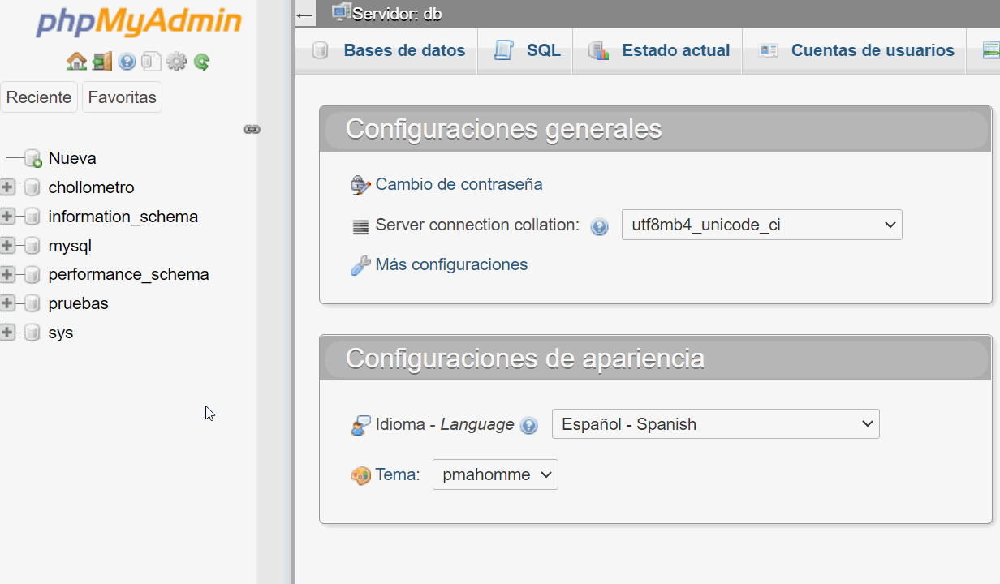

# Desenvolupament d'aplicacions web: Accés a Dades.

??? abstract "Duració i criteris d'avaluació"

    Duració estimada: 10 hores

    <hr />

    | Resultat d'aprenentatge | Criteris d'avaluació |
    | --------                | --------             |
    | 6. Desenvolupa aplicacions web d'accés a magatzems de dades, aplicant mesures per a mantindre la seguretat i la integritat de la informació.| a) S'han analitzat les tecnologies que permeten l'accés mitjançant programació a la informació disponible en magatzems de dades. <br/> b) S'han creat aplicacions que establisquen connexions amb bases de dades. <br/> c) S'ha recuperat informació emmagatzemada en bases de dades. <br/> d) S'ha publicat en aplicacions web la informació recuperada. <br/> e) S'han utilitzat conjunts de dades per a emmagatzemar la informació. <br/> f) S'han creat aplicacions web que permeten l'actualització i l'eliminació  d'informació disponible en una base de dades.<br/> g) S'han provat i documentat les aplicacions web. |


En aquesta unitat aprendrem a accedir a dades que es troben en un servidor; recuperant, editant i creant aquestes dades a través d'una base de dades.

A través de les diferents capes o nivells, de les quals 2 d'elles ja coneixem (*Nginx*, *PHP*) i *MySQL* la que estudiarem en aquest tema.

<div class="center img-large">
    
</div>

## 1. Introducció a les tecnologies per accedir a dades

### Bases de dades relacionals (SQL)
Les bases de dades relacionals utilitzen llenguatge SQL per emmagatzemar i recuperar dades de taules relacionades. En PHP, les tecnologies més utilitzades per accedir-hi són **PDO** i **MySQLi**. **PDO** suporta múltiples sistemes de bases de dades (MySQL, PostgreSQL, etc.), mentre que **MySQLi** està dissenyat específicament per a MySQL.

### Bases de dades NoSQL
Les bases de dades NoSQL, com **MongoDB** o **Firebase**, emmagatzemen dades en formats no estructurats, com JSON. Aquestes són ideals per a aplicacions que gestionen grans volums de dades o dades no estructurades. **MongoDB** és un sistema orientat a documents, mentre que **Firebase** és conegut per les seves capacitats en temps real.

### Accés a APIs
Les **APIs REST** permeten accedir a dades de serveis web externs utilitzant sol·licituds HTTP i respostes en formats com JSON o XML. **GraphQL** és una alternativa moderna que permet sol·licituds més específiques, només retornant les dades necessàries, en contrast amb les sol·licituds REST, que poden ser més generals.

### Web Scraping
El **web scraping** és el procés d'extracció automàtica de dades de pàgines web. Aquesta tècnica es pot utilitzar per recuperar informació d'una pàgina web quan no hi ha una API disponible. En PHP, es poden utilitzar diverses biblioteques per descarregar i analitzar contingut HTML, com ara **cURL** i **DOMDocument**.

### Consideracions de seguretat
És fonamental garantir la seguretat quan es treballa amb l'accés a dades. Això inclou protegir les aplicacions contra vulnerabilitats comunes, com les **injeccions SQL**, i assegurar les connexions utilitzant **SSL/TLS** quan es comuniqui amb bases de dades remotes o APIs externes.


## 2. Bases de dades relacionals (SQL)

### Instal·lació
A través de **XAMPP** és molt senzill, simplement ens descarregaríem el programa i l'activaríem. Per a descarregar XAMPP [prem ací](https://www.apachefriends.org/es/download.html).

Amb ***Docker*** utilitzarem un altre  repositori que inclou el mysql i el phpMyAdmin i llancem
``` bash
docker-compose up -d
```

Si tot ha eixit bé i el contenidor està en marxa, podrem visitar la pàgina de phpMyAdmin de la següent manera
``` html
http://localhost:8000
```

<div class="center img-medium">
    
</div>

Per a accedir hem d'utilitzar les següents credencials que venen configurades en el arxiu `docker-compose.yml`

```
usuario: root
contraseña: 1234
```

### Estructura d'una base de dades

Sabem que una base de dades té molts camps amb els seus noms i valors, però a més sabem que la base de dades ha de tindre un nom. per tant tindríem la següent estructura per a una base de dades:
    
    NombreBaseDeDatos
        |__Tabla-#1
        |       |__DatosTabla-#1
        |
        |__Tabla-#2
        |       |__DatosTabla-#2
        |
        |__Tabla-#3
        |       |__DatosTabla-#3
        [...]


Vegem-ho en un exemple real

    Ryanair
        |__pasajero
        |    |__id[*]
        |    |__nombre
        |    |__apellidos
        |    |__edad
        |    |__id_vuelo[^]
        |
        |__vuelo
        |    |__id[*]
        |    |__n_plazas
        |    |__disponible
        |    |__id_pais[^]
        |
        |__pais
             |__id[*]
             |__nombre

<div class="leyenda">
    [*] Clau primària [^] Clave Forània
</div>

<div class="center img-large">
    
</div>

### SQL

Aquest llenguatge de consulta estructurada (*Structured Query Language*) és el que utilitzarem per a realitzar les consultes a les nostres bases de dades per a mostrar el contingut en les diferents interfícies web que creem al llarg de la unitat. Si vols saber més detalls visita [Wiki SQL](https://es.wikipedia.org/wiki/sql)

Exemple d'una sentència SQL on seleccionem totes les files i columnes de la nostra taula anomenada **'pais'**

``` sql
SELECT * FROM pais
```

Estas sentencias pueden invocarse desde la consola de comandos mediante el intérprete *mysql* (previamente instalado en el sistema) o a través de la herramienta phpMyAdmin.

Las sentencias SQL también las podemos usar dentro de nuestro código php, de tal manera que cuando se cargue nuestra interfaz web, lance una sentecia SQL para mostrar los datos que queramos.

``` php
<?php
    // Llistat de clients, adreçats per DNI de manera ASCendent
    $clientesOrdenadosPorDNI = "SELECT * FROM `pasajero` ORDER BY `dni`" ASC;
?>
```

### phpMyAdmin

<div class="center img-medium">
    
</div>

Aquest programari funciona sota Ngingx i PHP i és més que res una interfície web per a gestionar les bases de dades que tinguem disponibles en el nostre servidor local. Molts **hostings* ofereixen aquesta eina per defecte per a poder gestionar les BBDD que tinguem configurades sota el nostre compte.

#### Creant una base de dades dins de phpMyAdmin

<div class="center img-large">
    
</div>

1.  Per a crear una nova base de dades hem d'entrar en *phpMyAdmin* com a *usuari root* i punxar en l'opció <span class="warning">*Nova*</span> del menú de l'esquerra.

2. En la nova finestra de creació posarem un **nom** a nostra *bbdd*.

3. També establirem el **cotejamiento** <span class="warning">*utf8m4_unicode_ci*</span> perquè nostra *bbdd* suporte tot tipus de caràcters (com els asiàtics) i fins i tot *emojis* ;)

4. Li donem al botó de **Crear** per a crear la *bbdd* i començar a escriure les diferents taules que anem a introduir en ella.

El sistema generarà el codi SQL per a crear tot el que li hem posat i crearà la base de dades amb les taules que li hàgem ficat.
``` sql
CREATE TABLE `persona`. ( `id` INT NOT NULL AUTO_INCREMENT , `nombre` TINYTEXT NOT NULL , `apellidos` TEXT NOT NULL , `telefono` TINYTEXT NOT NULL , PRIMARY KEY (`id`)) ENGINE = InnoDB;
```

#### Opcions en phpMyAdmin

Quan seleccionem una base de dades de la llista, el sistema ens mostra diverses pestanyes amb les quals interactuar amb la base de dades en qüestió:

- `Estructura`: Podem veure les diferents taules que consoliden la nostra base de dades

- `SQL`: Per si volem injectar codi SQL perquè el sistema l'interprete

- `Buscar`: Serveix per a buscar per termes, en la nostra base de dades, aplicant diferents filtres de cerca

- `Generar consulta`: semblança a SQL però d'una manera més gràfica, sense haver de saber res del llenguatge

- `Exportar i importar`: Com el seu nom indica, per a fer qualsevol de les 2 operacions sobre la base de dades

- `Operacions`: Diferents opcions avançades per a realitzar en la nostra base de dades, de la qual destacarem l'opció *Cotejamiento* on podrem canviar el *cotejamiento* de la nostra taula però <span class="alert">*ULL AMB ACÔ* perquè podem eliminar dades sense voler, ja que en canviar el *cotejamiento* podem suprimir caràcters no suportats pel nou *cotejamiento*</span>

No aprofundirem en la resta d'opcions però, en la pestanya **Més** existeix l'opció **Dissenyador** per a poder editar les relacions entre taules d'una manera gràfica (punxant i arrossegant) que veurem més endavant.

## 3. PHP Data Objects :: PDO

*PHP Data Objects* (o *PDO*) és un *driver* de *PHP* que s'utilitza per a treballar sota una interfície d'objectes amb la base de dades. Hui dia és el que més s'utilitza per a manejar informació des d'una base de dades, ja siga relacional o no relacional.

Per establir la connexió en la bbdd utilitzarem:

``` php
<?php
    $conexion = new PDO('mysql:host=localhost; dbname=dwes', 'dwes', 'abc123');
```

A més, amb *PDO* podem usar les excepcions amb *try catch* per a gestionar els errors que es produïsquen en la nostra aplicació, per a això, com féiem abans, hem d'encapsular el codi entre blocs *try / catch*.

``` php
<?php

    $dsn = 'mysql:dbname=prueba;host=127.0.0.1';
    $usuario = 'usuario';
    $contraseña = 'contraseña';

    try {
        $mbd = new PDO($dsn, $usuario, $contraseña);
        $mbd->setAttribute(PDO::ATTR_ERRMODE, PDO::ERRMODE_EXCEPTION);
    } catch (PDOException $e) {
        echo 'Falló la conexión: ' . $e->getMessage();
    }
```
En primer lloc, creem la connexió amb la base de dades a través del constructor *PDO* passant-li la informació de la base de dades.

En segon lloc, establim els paràmetres per a manejar les exempcions, en aquest cas hem utilitzat:

- `PDO::ATTR_ERRMODE` indicant-li a PHP que volem un reporte d'errors.
- `PDO::ERRMODE_EXCEPTION` amb aquest atribut obliguem al fet que llance exempcions, a més de ser l'opció més humana i llegible que hi ha a l'hora de controlar errors.

Qualsevol error que es llance a través de **PDO**, el sistema llançarà una <span class="alert">**PDOException**</span>.

### Fitxer de configuració de la BD

De la mateixa manera que podem tenir el nostre arxiu de funcions `funciones.php` i alberguem totes les funcions que s'usen de manera global en l'aplicació, podem establir un arxiu de constants on definim els paràmetres de connexió amb la base de dades.
```php
<?php

    //  ▒▒▒▒▒▒▒▒ conexion.php ▒▒▒▒▒▒▒▒

    constDSN = "mysql:host=localhost;dbname=dwes";
    constUSUARIO = "dwes";
    constPASSWORD = "abc123";

    /*  ▒▒▒▒▒▒▒▒▒▒▒▒▒▒▒▒▒▒▒▒▒▒▒▒▒▒▒▒▒▒▒▒▒▒▒▒▒▒▒▒▒▒▒▒▒

        ▒▒▒▒▒▒▒▒ NO SUBAS ESTE ARCHIVO A git ▒▒▒▒▒

        ▒▒▒▒▒▒▒▒▒▒▒▒▒▒▒▒▒▒▒▒▒▒▒▒▒▒▒▒▒▒▒▒▒▒▒▒▒▒▒▒▒▒▒▒▒ */

```

Aquest arxiu conté informació <span class="alert">**molt sensible**</span> així que no és recomanable que puges aquest arxiu a **git**.

### Sentències preparades

Es tracta de sentències que s'estableixen com si foren plantilles de la SQL que llançarem, acceptant paràmetres que són establits a posteriori de la declaració de la sentència preparada.

Les sentències preparades eviten la **injecció** de SQL (SQL Injection) i milloren el rendiment de nostres *aplicacions* o pàgines web.

``` php
<?php
    $sql = "INSERT INTO Clientes VALUES (?, ?, ?, ?)";
```

Cada interrogant és un paràmetre que establirem després, unes quantes línies més a baix.

Una vegada tenim la plantilla de la nostra consulta, hem de seguir amb la preparació juntament amb 3 mètodes més de **PHP** per a la seua completa execució:

- `prepare:` prepara la **sentencia** abans de ser executada.
- `bind`: el tipus d'unió (**bind*^) de dada que pot ser mitjançant ' ? ' o ' :parametre '
- `execute` s'executa la consulta unint la plantilla amb les *variables* o paràmetres que hem establit.

### Exemple paràmetros

```php
<?php
    //  ▒▒▒▒▒▒▒▒ Borrando con parámetros ▒▒▒▒▒▒▒▒

    include "config/database.inc.php";

    $conexion = null;

    try { 
        $cantidad = $_GET["cantidad"];

        $conexion = new PDO(DSN, USUARIO, PASSWORD);
        $conexion -> setAttribute(PDO::ATTR_ERRMODE, PDO::ERRMODE_EXCEPTION);

        $sql = "DELETE FROM stock WHERE unidades = ?";
        $sentencia = $conexion -> prepare($sql);

        $isOk = $sentencia -> execute([$cantidad]);
        $cantidadAfectada = $sentencia -> rowCount();

        echo $cantidadAfectada;
    } catch (PDOException $e) {
        echo $e -> getMessage();
    }

    $conexion = null
```

### Exemple bindParam

Molt semblant a utilitzar paràmetres però aquesta vegada la variable està dins de la sentència SQL, en aquest cas l'hem anomenada `:cant`

```php
<?php
    include "config/database.inc.php";

    $conexion=null;

    try {
        $cantidad = $_GET["cantidad"] ?? 0;

        $conexion = new PDO(DSN, USUARIO, PASSWORD);
        $conexion -> setAttribute(PDO::ATTR_ERRMODE, PDO::ERRMODE_EXCEPTION);

        $sql = "DELETE FROM stock WHERE unidades = :cant";

        $sentencia = $conexion -> prepare($sql);
        $sentencia -> bindParam(":cant", $cantidad);
        
        $isOk = $sentencia -> execute();
        
        $cantidadAfectada = $sentencia -> rowCount();
        
        echo $cantidadAfectada;
    } catch (PDOException $e) {
        echo $e -> getMessage();
    }

    $conexion = null;
```

### bindParam VS bindValue

Utilitzarem `bindValue()` quan hàgem d'inserir dades només una vegada, en canvi, haurem d'usar `bindParam()` quan hàgem de passar dades múltiples, com per exemple, un *array*.

```php
<?php
    // se asignan nombre a los parámetros
    $sql = "DELETE FROM stock WHERE unidades = :cant";
    $sentencia = $conexion -> prepare($sql);

    // bindParam enlaza por referencia
    $cantidad = 0;

    $sentencia -> bindParam(":cant", $cantidad);
    $cantidad = 1;

    // se eliminan con cant = 1
    $isOk = $sentencia -> execute();

    // bindValue enlaza por valor
    $cantidad = 0;

    $sentencia -> bindValue(":cant", $cantidad);
    $cantidad = 1;

    // se eliminan con cant = 0
    $isOk = $sentencia->execute();
```

Per a més informació i ús de les variables *PDO* [consulta el manual de PHP](https://www.php.net/manual/es/pdo.constants.php).

### Inserint registres

A l'hora d'inserir registres en una base de dades, hem de tindre en compte que en la taula pot haver-hi valors autoincrementats. Per a salvaguardar açò, el que hem de fer és deixar aqueix camp autoincrementat buit, però a l'hora de fer la connexió, hem de recuperar-ho amb el mètode `lastInsertId()`.

``` php
<?php
    $nombre = $_GET["nombre"] ?? "SUCURSAL X";
    $telefono = $_GET["telefono"] ?? "636123456";

    $sql="INSERT INTO tienda(nombre, tlf) VALUES (:nombre, :telefono)";

    $sentencia = $conexion -> prepare($sql);
    $sentencia -> bindParam(":nombre", $nombre);
    $sentencia -> bindParam(":telefono", $telefono);

    $isOk = $sentencia -> execute();
    $idGenerado = $conexion -> lastInsertId();

    echo $idGenerado;
```

### Consultant registres

A l'hora de recuperar els resultats d'una consulta, bastarà amb invocar al mètode `PDOStatement::fetch` per a llistar les files generades per la consulta.

Però hem de triar el tipus de dada que volem rebre entre els 3 que hi ha disponibles:

- `PDO::FETCH_ASSOC:` array indexat que els seus keys són el nom de les columnes.
- `PDO::FETCH_NUM:` array indexat que els seus keys són números.
- `PDO::FETCH_BOTH:` valor per defecte. Retorna un array indexat que els seus keys són tant el nom de les columnes com números.

<div class="center img-large">
    
</div>

``` php
<?php
    //  ▒▒▒▒▒▒▒▒ consulta con array asociativo.php ▒▒▒▒▒▒▒▒

    include "config/database.inc.php";

    $conexion = null;

    try{
        $conexion = new PDO(DSN, USUARIO, PASSWORD);
        $conexion -> setAttribute(PDO::ATTR_ERRMODE, PDO::ERRMODE_EXCEPTION);

        $sql = "select * from tienda";

        $sentencia = $conexion -> prepare($sql);
        $sentencia -> setFetchMode(PDO::FETCH_ASSOC);
        $sentencia -> execute();
        
        while($fila = $sentencia -> fetch()){
            echo "Codigo:" . $fila["cod"] . "<br />";
            echo "Nombre:" . $fila["nombre"] . "<br />";
            echo "Teléfono:" . $fila["tlf"] . "<br />";
        }

    }catch(PDOException $e) {
        echo $e -> getMessage();
    }

    $conexion = null;
```

Recuperant dades amb una matriu com a resultat de la nostra consulta

``` php
<?php
    //  ▒▒▒▒▒▒▒▒ consulta con array asociativo ▒▒▒▒▒▒▒▒

    $sql="SELECT * FROM tienda";

    $sentencia = $conexion -> prepare($sql);
    $sentencia -> setFetchMode(PDO::FETCH_ASSOC);
    $sentencia -> execute();

    $tiendas = $sentencia -> fetchAll();

    foreach($tiendasas$tienda) {
        echo"Codigo:" . $tienda["cod"] . "<br />";
        echo"Nombre:" . $tienda["nombre"] . "<br />";
    }
```
Però si el que volem és llegir dades amb forma d'objecte utilitzant `PDO::FETCH_OBJ`, hem de crear un objecte amb propietats públiques amb el mateix nom que les columnes de la taula que anem a consultar.

``` php
<?php
    //  ▒▒▒▒▒▒▒▒ consulta con formato de objeto ▒▒▒▒▒▒▒▒

    $sql="SELECT * FROM tienda";

    $sentencia = $conexion -> prepare($sql);
    $sentencia -> setFetchMode(PDO::FETCH_OBJ);
    $sentencia -> execute();

    while($t = $sentencia -> fetch()) {
        echo"Codigo:" . $t -> cod . "<br />";
        echo"Nombre:" . $t -> nombre . "<br />";
        echo"Teléfono:" . $t -> tlf . "<br />";
    }
```

### Consultes amb models

Portem temps creant classes en PHP i les consultes també admeten aquest tipus de dades mitjançant l'ús de `PDO::FETCH_CLASS`

Si usem aquest mètode, hem de tindre en compte que els noms dels atributs privats han de coincidir amb els noms de les columnes de la taula que anem a manejar.

Així doncs, si pel que siga canviem l'estructura de la taula <span class="alert">**HEM DE CANVIAR**</span> la nostra classe perquè tot continue funcionant.

``` php
<?php
    //  ▒▒▒▒▒▒▒▒ clase Tienda ▒▒▒▒▒▒▒▒

    classTienda {
        private int $cod;
        private string $nombre;
        private ? string $tlf;
        
        public function getCodigo() : int {
            return $this -> cod;
        }
        
        public function getNombre() : string {
            return $this -> nombre;
        }
        
        public function getTelefono() : ?string {
            return $this -> tlf;
        }
    }
```

``` php
<?php
    //  ▒▒▒▒▒▒▒▒ Consultando a través de la clase Tienda ▒▒▒▒▒▒▒▒

    $sql = "SELECT * FROM tienda";
    $sentencia = $conexion -> prepare($sql);

    // Aquí 'Tienda' es el nombre de nuestra clase
    $sentencia -> setFetchMode(PDO::FETCH_CLASS, "Tienda");
    $sentencia -> execute();

    while($t = $sentencia -> fetch()) {
        echo "Codigo: " . $t -> getCodigo() . "<br />";
        echo "Nombre: " . $t -> getNombre() . "<br />";
        echo "Teléfono: " . $t -> getTelefono() . "<br />";
        
        var_dump($t);
    }
```

Però què passa si les nostres classes tenen constructor? doncs que hem d'indicar-li, al mètode FECTH, que emplene les propietats després de cridar al constructor i per a això fem ús de `PDO::FETCH_PROPS_LATE`.
``` php
<?php
    //  ▒▒▒▒▒▒▒▒ Consulta para una clase con constructor ▒▒▒▒▒▒▒▒

    $sql = "SELECT * FROM tienda";

    $sentencia = $conexion -> prepare($sql);
    $sentencia -> setFetchMode(PDO::FETCH_CLASS | PDO::FETCH_PROPS_LATE, Tienda::class);
    $sentencia -> execute();

    $tiendas = $sentencia -> fetchAll();
```

### Consultes amb LIKE

Per a utilitzar el comodí *LIKE* o altres comodins, hem d'associar-lo a la dada i MAI en la pròpia consulta.

``` php
<?php
    //  ▒▒▒▒▒▒▒▒ Utilizando comodines :: LIKE ▒▒▒▒▒▒▒▒

    $sql = "SELECT * FROM tienda where nombre like :nombre or tlf like :tlf";

    $sentencia = $conexion -> prepare($sql);
    $sentencia -> setFetchMode(PDO::FETCH_CLASS | PDO::FETCH_PROPS_LATE, Tienda::class);

    $cadBuscar = "%" . $busqueda . "%";

    $sentencia -> execute(["nombre" => $cadBuscar,"tlf" => $cadBuscar]);

    $result = $sentencia -> fetchAll();
```

Teniu una llista d'exemples molt completa en la [documentació oficial](https://phpdelusions.net/pdo/objects).

## 4. Login & Password

<div class="center img-medium">
    
</div>

Per a manejar un sistema complet de login i password amb contrasenyes xifrades, necessitem un mètode que xifre aqueixos *strings* que l'usuari introdueix com a contrasenya; tant en el formulari de registre com en el del *login*, ja que en codificar una contrasenya, després hem de descodificar-la per a comprovar que totes dues *contrasenyes (la que introdueix l'usuari en el login i la que tenim en la base de dades) coincidisquen.

Necessitem doncs:

- `password_hash()` per a emmagatzemar la contrasenya en la base de dades a l'hora de fer el *INSERT*
- `PASSWORD_DEFAULT` emmagatzemem la contrasenya usant el mètode d'encriptació bcrypt

- `PASSWORD_BCRYPT` emmagatzemem la contrasenya usant l'algorisme CRYPT_BLOWFISH compatible amb crypt()

- `password_verify()` per a verificar l'usuari i la contrasenya

``` php
<?php
    //  ▒▒▒▒▒▒▒▒ Almacenando usuario y password en BD ▒▒▒▒▒▒▒▒

    $usu = $_POST["usuario"];
    $pas = $_POST["password"];

    $sql = "INSERT INTO usuarios(usuario, password) VALUES (:usuario, :password)";

    $sentencia = $conexion -> prepare($sql);

    $isOk = $sentencia -> execute([
        "usuario" => $usu,
        "password" => password_hash($pas,PASSWORD_DEFAULT)
    ]);
```

Ara que tenim l'usuari codificat i guardat en la base de dades, el recuperarem per a poder loguejar-lo correctament.
``` php
<?php
    //  ▒▒▒▒▒▒▒▒ Recuperando usuario y password en BD ▒▒▒▒▒▒▒▒

    $usu = $_POST["login"] ?? "";

    $sql = "select * from usuarios where usuario = ?";

    $sentencia = $conexion -> prepare($sql);
    $sentencia -> execute([$usu]);

    $usuario = $sentencia -> fetch();

    if($usuario && password_verify($_POST['pass'], $usuario['password'])) {
        echo"OK!";
    } else {
        echo"KO";
    }
```

## 5. QueryBuilder

Un Query Builder (Constructor de Consultes) és una eina o classe que facilita la creació, execució i manipulació de consultes SQL en un programa. L'objectiu principal és proporcionar una interfície més intuïtiva i segura per interactuar amb bases de dades, sense haver d'escriure consultes SQL en brut.

A continuació, detallo algunes de les principals avantatges i característiques d'un Query Builder com el que has compartit anteriorment:

    * 1. Abstracció de la Base de Dades:
    - El Query Builder proporciona una capa d'abstracció que permet interactuar amb diferents tipus de bases de dades (MySQL, PostgreSQL, SQLite, etc.) sense canviar el codi de la teva aplicació. Això facilita la portabilitat i l'escalabilitat del codi.

    * 2. Seguretat:
    - Prevé injeccions SQL: Gràcies a l'ús de sentències preparades i enllaçament de paràmetres, el Query Builder ajuda a prevenir atacs d'injecció SQL, una de les amenaces més comunes en desenvolupament web.

    * 3. Sintaxi Més Neta i Més Fàcil:
    - Els Query Builders solen proporcionar una sintaxi més neta i fàcil d'entendre que les cadenes SQL pures. Això fa que el codi sigui més llegible i fàcil de mantenir.

    * 4. Reutilització de Codi:
    - Les funcions del Query Builder es poden reutilitzar a tot el projecte, reduint la duplicació de codi i facilitant el manteniment.

    * 5. Flexibilitat:
    - Permet realitzar consultes complexes amb una sintaxi simplificada, facilitant l'adaptació del codi a canvis en els requeriments de l'aplicació.

    * 6. Desenvolupament Més Ràpid:
    - Ajuda a accelerar el procés de desenvolupament, ja que els desenvolupadors no necessiten recordar la sintaxi SQL exacta per a cada tipus de base de dades.

    * 7. Fàcil de Depurar:
    - El codi generat pel Query Builder és més fàcil de depurar en comparació amb les llargues cadenes SQL.

    * 8. Suport per a Operacions CRUD:
    - Els Query Builders solen incloure suport integrat per a operacions CRUD (Crear, Llegir, Actualitzar, Esborrar), fent més fàcil la manipulació de dades.

En resum, un Query Builder serveix per simplificar la interacció amb bases de dades, proporcionant una interfície més segura, neta i fàcil d'utilitzar que les cadenes SQL pures. Ajuda a accelerar el desenvolupament, facilita el manteniment i millora la seguretat de l'aplicació.
Ací en tenim un exemple de construcció casera:

```php
<?php

namespace BatBook;

use PDO;

class QueryBuilder
{
    // Aquesta funció serveix per a construir i executar consultes SQL de tipus SELECT.
    // Es pot filtrar per valors, limitar la quantitat de resultats i establir un offset.
    public static function sql($class, $values=null, $limit = null, $offset = null)
    {
        // Obté el nom de la taula a partir de la propietat estàtica $nameTable de la classe passada com argument.
        $table = $class::$nameTable;
        
        // Obté una connexió a la base de dades.
        $conn = Connection::get();
        
        // Construeix la consulta SQL bàsica.
        $sql = "SELECT * FROM $table";
        
        // Afegeix condicions WHERE si es proporcionen valors per a filtrar.
        if ($values) {
            $sql .= " WHERE ";
            foreach (array_keys($values) as $key => $id) {
                if ($key != 0) {
                    $sql .= " AND $id=:$id";
                } else {
                    $sql .= "$id=:$id";
                }
            }
        }
        
        // Afegeix les clàusules LIMIT i OFFSET si són necessàries.
        if (isset($limit) && isset($offset)) {
            $sql .= " LIMIT $limit OFFSET $offset";
        }
        
        // Prepara la sentència SQL.
        $sentence = $conn->prepare($sql);
        
        // Enllaça els valors a la sentència.
        foreach ($values??[] as $key => $value) {
            $sentence->bindValue(":$key", $value);
        }
        
        // Estableix el mode de recuperació a objectes de la classe especificada.
        $sentence -> setFetchMode(PDO::FETCH_CLASS | PDO::FETCH_PROPS_LATE , $class);
        
        // Executa la consulta.
        $sentence -> execute();
        
        // Retorna tots els resultats obtinguts.
        return  $sentence->fetchAll();
    }

    // Aquesta funció serveix per a trobar una fila en una taula basant-se en el seu ID.
    public static function find($class, $id)
    {
        //TODO
    }

    // Aquesta funció serveix per a insertar una fila en una taula.
    public static function insert($class, $values)
    {
        $table = $class::$nameTable;
        $conn = Connection::get();
        $sql = "INSERT INTO $table (";
        foreach (array_keys($values) as $key => $id) {
            if ($key != 0) {
                $sql .= ','.$id;
            } else {
                $sql .= $id;
            }
        }
        $sql .= ") VALUES (";
        foreach (array_keys($values) as $key => $id) {
            if ($key != 0) {
                $sql .= ',:'.$id;
            } else {
                $sql .= ':'.$id;
            }
        }
        $sql .= ")";
        $sentence = $conn->prepare($sql);
        foreach ($values as $key => $value) {
            $sentence->bindValue(":$key", $value);
        }
        $sentence -> execute();
        return $conn->lastInsertId();
    }

    // Aquesta funció serveix per a actualitzar una fila en una taula.
    public static function update($class, $values, $id)
    {
        $table = $class::$nameTable;
        $conn = Connection::get();
        $sql = "UPDATE $table SET ";
        foreach (array_keys($values) as $key => $value) {
            if ($key != 0) {
                $sql .= ','.$value.'=:'.$value;
            } else {
                $sql .= $value.'=:'.$value;
            }
        }
        $sql .= " WHERE id=:id";
        $sentence = $conn->prepare($sql);
        foreach ($values as $key => $value) {
            $sentence->bindValue(":$key", $value);
        }
        $sentence->bindValue(":id", $id);  
        $sentence -> execute();
        return $id;
    }

    // Aquesta funció serveix per a eliminar una fila en una taula basant-se en el seu ID.
    public static function delete($class, $id)
    {
        //TODO
    }
}
```

En resum, aquesta classe proporciona funcions estàtiques per a la construcció i execució de consultes SQL bàsiques com SELECT, INSERT, UPDATE, i DELETE. Utilitza l'extensió PDO per a la connexió a bases de dades i la preparació de sentències SQL, la qual cosa ajuda a prevenir injeccions SQL. També permet la manipulació fàcil de files en bases de dades, tot retornant objectes de la classe especificada.

### Respotes d'error

Quan no trebem un recurs en al nostra web, podem mostrar a l'usuari una pàgina específica d'error utilitzant la funció header. Una típica seria:

```php
<!-- not-found.php -->
<?php http_response_code(404); ?>
<!DOCTYPE html>
<html lang="en">
<head>
    <meta charset="UTF-8">
    <meta http-equiv="X-UA-Compatible" content="IE=edge">
    <meta name="viewport" content="width=device-width, initial-scale=1.0">
    <title>No trobat</title>
</head>
<body>
    <h1>404 - Pàgina no trobada</h1>
    <p>Ho sentim, la pàgina que estàs buscant no s'ha pogut trobar.</p>
    <a href="index.php">Torna a l'inici</a>
</body>
</html>
```

I per a utilitzar-la:

```php
<?php
header("Location: not-found.php");
exit;
?>

```

## 6. Accès a fitxers

Gràcies a la funció fopen() des de PHP podem obrir arxius que es troben en els nostres servidor o una URL.

A aquesta funció cal passar-li 2 paràmetres; el nom de l'arxiu que volem obrir i la manera en què s'obrirà

``` php
$fp = fopen("miarchivo.txt", "r");
```

Moltes vegades no podem obrir l'arxiu perquè aquest no es troba o no tenim accés a ell, per això és recomanable comprovar que podem fer-ho

``` php
if (!$fp = fopen("miarchivo.txt", "r")){
    echo "No se ha podido abrir el archivo";
}
```

### Maneres d'obertura de fitxers

- `r`: Manera lectura. Punter al principi de l'arxiu.
- `r+`: Obertura per a lectura i escriptura. Punter al principi de l'arxiu
- `w`: Obertura per a escriptura. Punter al principi de l'arxiu i el sobreescriu. Si no existeix s'intenta crear.
- `w+`: Obertura per a lectura i escriptura. Punter al principi de l'arxiu i el sobreescriu. Si no existeix s'intenta crear.
- `a`: Obertura per a escriptura. Punter al final de l'arxiu. Si no existeix s'intenta crear.
- `a+`: Obertura per a lectura i escriptura. Punter al final de l'arxiu. Si no existeix s'intenta crear.
- `x`: Creació i obertura per a només escriptura. Punter al principi de l'arxiu. Si l'arxiu ja existeix donarà error E_*WARNING. Si no existeix s'intenta crear.
- `x+`: Creació i obertura per a lectura i escriptura. Mateix comportament que x.
- `c`: Obertura per a escriptura. Si no existeix es crea. Si existeix no se sobreescriu ni dona cap error. Punter al principi de l'arxiu.
- `c+`: Obertura per a lectura i escriptura. Mateix comportament que C.
- `b`: Quan es treballa amb arxius binaris com *jpg, pdf, *png i altres. Se sol col·locar al final de la manera, és a dir *rb, r+b, x+b, *wb...

### Operacions amb arxius

Per a poder **llegir** un arxiu necessitem usar la funció *fread()* de *PHP*

```php
//  ▒▒▒▒▒▒▒▒ Abriendo un archivo y leyendo su contenido ▒▒▒▒▒▒▒▒

$file = "miarchivo.txt";
$fp = fopen($file, "r");

// filesize() nos devuelve el tamaño del archivo en cuestión
$contents = fread($fp, filesize($file));

// Cerramos la conexión con el archivo
fclose();
```

Si el que volem és **escriure** en un arxiu, haurem de fer ús de la funció *fwrite()*

```php
//  ▒▒▒▒▒▒▒▒ Escribiendo en un archivo ▒▒▒▒▒▒▒▒

$file = "miarchivo.txt";
$texto = "Hola que tal";

$fp = fopen($file, "w");

fwrite($fp, $texto);
fclose($fp);
```

### Informació d'un fitxer

Amb PHP i el seu mètode *stat()* podem obtindre informació sobre els arxius que li indiquem. Aquest mètode retorna fins a un total de 12 elements amb *informació* sobre el nostre arxiu.

0	*dev*	 número de dispositiu
1	*ino*	 número d'i-node
2	*mode*	 manera de protecció de l'i-node
3	*nlink*	 nombre d'enllaços
4	*uid*	 ID d'usuari del propietari
5	*gid*	 ID de grup del propietari
6	*rdev*	 tipus de dispositiu, si és un dispositiu i-node
7	*size*	 grandària en bytes
8	*atime*	 moment de l'últim accés (temps Unix)
9	*mtime*	 moment de l'última modificació (temps Unix)
10	*ctime*	 moment de l'última modificació de l'i-node (temps Unix)
11	*blksize*	 grandària del bloc E/S del sistema de fitxers
12	*blocks*	 nombre de blocs de 512 bytes assignats

Uns exemples...

``` php
<?php

//  ▒▒▒▒▒▒▒▒ Información del archivo ▒▒▒▒▒▒▒▒

$file = "miarchivo.txt";
$texto = "Todos somos muy ignorantes, lo que ocurre es que no todos ignoramos las mismas cosas.";

$fp = fopen($file, "w");
fwrite($fp, $texto);

$datos = stat($file);

echo $datos[3] . "<br>"; // Número de enlaces, 1
echo $datos[7] . "<br>"; // Tamaño en bytes, 85
echo $datos[8] . "<br>"; // Momento de último acceso, 1444138104
echo $datos[9] . "<br>"; // Momento de última modificación, 1444138251

?>
```

Dona una ullada a [les funcions de directoris](https://www.php.net/manual/es/book.dir.php) que té **PHP**, és molt interessant.

## 7. Web Scraping 

Consisteix a navegar a una pàgina web i extraure informació automàticament, a partir del codi HTML generat, i organitzar la informació pública disponible en Internet.
Aquesta pràctica requereix l'ús d'una llibreria que facilite la descàrrega de la informació desitjada imitant la interacció d'un navegador web. Aquest "robot" pot accedir a diverses pàgines simultàniament.

!!! question "¿És legal?"
Si el lloc web indica que té el contingut protegit per drets d'autor o en les normes d'accés via usuari/contrasenya ens avisa de la seua prohibició, estaríem incorrent en un delicte.
És recomanable estudiar l'arxiu `robots.txt` que es troba en l'arrel de cada lloc web.
Més informació en l'article [El manual complet per al web scraping legal i ètic en 2021](https://ichi.pro/es/el-manual-completo-para-el-web-scraping-legal-y-etico-en-2021-69178542830388)

### Goutte

[Goutte](https://github.com/FriendsOfPHP/Goutte) és un senzill client HTTP per a PHP creat específicament per a fer web scraping. Ho va desenvolupar el mateix autor del framework *Symfony* i ofereix un API senzilla per a extraure dades de les respostes HTML/XML dels llocs web.

Els components principals que abstrau *Goutte* sobre *Symfony* són:

* `BrowserKit`: simula el comportament d'un navegador web.
* `CssSelector`: tradueix consultes CSS en consultes XPath.
* `DomCrawler`: facilita l'ús del DOM i XPath.

Per a poder utilitzar *Goutte* en el nostre projecte, executarem el següent comando en el terminal:

``` bash
composer require fabpot/goutte
```

### Goutte con selectores CSS

A continuació farem un exemple molt senzill utilitzant els selectors CSS, extraient informació de la web `https://books.toscrape.com/`, la qual és una pàgina per a proves que no rebutjarà les nostres peticions.

Després de crear un client amb *Goutte*, hem de realitzar un petició a una URL. Amb la resposta obtinguda, podem utilitzar el mètode `filter` per a indicar-li la ruta CSS que volem recórrer i iterar sobre els resultats mitjançant una funció anònima. Una vegada estem dins d'un determinat node, el mètode `text()` ens retornarà el contingut del propi node.

En concret, ficarem en un array associatiu el títol i el preu de tots els llibres de la categoria *Classics*.

``` php
<?php
require '../vendor/autoload.php';

$httpClient = new \Goutte\Client();
$response = $httpClient->request('GET', 'https://books.toscrape.com/catalogue/category/books/classics_6/index.html');
// colocamos los precios en un array
$precios = [];
$response->filter('.row li article div.product_price p.price_color')->each(
    // le pasamos $precios por referencia para poder editarla dentro del closure
    function ($node) use (&$precios) {
        $precios[] = $node->text();
    }
);

// colocamos el nombre y el precio en un array asociativo
$contadorPrecios = 0;
$libros = [];
$response->filter('.row li article h3 a')->each(
    function ($node) use ($precios, &$contadorPrecios, &$libros) {
        $libros[$node->text()] = $precios[$contadorPrecios];
        $contadorPrecios++;
    }
);
```

### Crawler

Un cas molt comú és obtindre la informació d'una pàgina que té els resultats paginados, de manera que anem recorrent els enllaços i accedint a cadascun dels resultats.

En aquest cas agafarem tots els preus dels llibres de fantasia, i els sumarem:

``` php
<?php
require '../vendor/autoload.php';

use Goutte\Client;
use Symfony\Component\HttpClient\HttpClient;

$client = new Client(HttpClient::create(['timeout' => 60]));
$crawler = $client->request('GET', 'https://books.toscrape.com/catalogue/category/books/fantasy_19/index.html');

$salir = false;

$precios = [];
while (!$salir) {
    $crawler->filter('.row li article div.product_price p.price_color')->each(
        function ($node) use (&$precios) {
            $texto = $node->text();
            $cantidad = substr($texto, 2); // Le quitamos las libras ¿2 posiciones?
            $precios[] = floatval($cantidad);
        }
    );

    $enlace = $crawler->selectLink('next');
    if ($enlace->count() != 0) {
        // el enlace next existe
        $sigPag = $crawler->selectLink('next')->link();
        $crawler = $client->click($sigPag); // hacemos click
    } else {
        // ya no hay enlace next
        $salir = true;
    }
}

$precioTotal = array_sum($precios);
echo $precioTotal;
```


## 8. Exercisis

### Bateria d'exercicis solucionats 
 
##### Exercici 1. Connexió bàsica

1. Crea un fitxer PHP que faça una connexió a una base de dades MySQL utilitzant PDO.

<details>
<summary>Solució</summary>

``` php
<?php
try {
    $dsn = 'mysql:host=localhost;dbname=test';
    $usuari = 'usuari';
    $contrasenya = 'contrasenya';
    $pdo = new PDO($dsn, $usuari, $contrasenya);
    echo "Connexió establerta!";
} catch (PDOException $e) {
    echo "Error de connexió: " . $e->getMessage();
}
 
```
</details>


##### Exercici 2. Inserir un registre

1. Escriu una funció que insereixi un nou usuari a la taula `users` amb el nom i correu electrònic passats per paràmetre.

<details>
<summary>Solució</summary>

``` php
<?php
function inserirUsuari($nom, $correu) {
    global $pdo;
    $sql = "INSERT INTO users (nom, correu) VALUES (:nom, :correu)";
    $stmt = $pdo->prepare($sql);
    $stmt->bindParam(':nom', $nom);
    $stmt->bindParam(':correu', $
    echo "Usuari inserit!";
}
```

</details>

##### Exericici 3. Recuperar dades
 
1. Fes una consulta SQL que mostri tots els usuaris registrats a la taula `users` i mostra'ls en una taula HTML.

<details>
<summary>Solució</summary>

``` php
<?php
function mostrarUsuaris() {
    global $pdo;
    $sql = "SELECT * FROM users";
    $stmt = $pdo->query($sql);
    echo "<table>";
    while ($fila = $stmt->fetch(PDO::FETCH_ASSOC)) {
        echo "<tr><td>{$fila['nom']}</td><td>{$fila['correu']}</td></tr>";
    }
    echo "</table>";
}
```

</details>

##### Exercici 4. Actualitzar dades

1. Escriu una funció que actualitzi el correu electrònic d'un usuari segons el seu identificador (`id`).

<details>
<summary>Solució</summary>

``` php
<?php
function actualitzarCorreu($id, $nouCorreu) {
    global $pdo;
    $sql = "UPDATE users SET correu = :correu WHERE id = :id";
    $stmt = $pdo->prepare($sql);
    $stmt->execute([':correu' => $nouCorreu, ':id' => $id]);
    echo "Correu actualitzat!";
}
```

</details>

##### Exercici 5. Eliminar un registre

1. Implementa un script que esborri un usuari per identificador (`id`).

<details>
<summary>Solució</summary>

``` php
<?php
function eliminarUsuari($id) {
    global $pdo;
    $sql = "DELETE FROM users WHERE id = :id";
    $stmt = $pdo->prepare($sql);
    $stmt->execute([':id' => $id]);
    echo "Usuari eliminat!";
}
```
</details>

##### Exercici 6. Ús de sentències preparades

1. Refactoritza els exercicis anteriors per utilitzar sentències preparades per evitar injecció SQL.

<details>
<summary>Solució</summary>

``` php
<?php
function inserirAmbPreparada($nom, $correu) {
    global $pdo;
    $sql = "INSERT INTO users (nom, correu) VALUES (:nom, :correu)";
    $stmt = $pdo->prepare($sql);
    $stmt->bindParam(':nom', $nom);
    $stmt->bindParam(':correu', $correu);
    $stmt->execute();
    echo "Usuari inserit amb sentència preparada!";
}
```

</details>

##### Exercici 7. Tractament d'errors

1. Modifica el codi anterior per gestionar els errors amb `try-catch` i mostrar missatges d'error clars.

<details>
<summary>Solució</summary>

``` php
<?php
 try {
    actualitzarCorreu(5, 'noucorreu@example.com');
} catch (PDOException $e) {
    echo "Error en actualitzar: " . $e->getMessage();
}
```
</details>

##### Exercici 8. Ús de Query Builder

1. Utilitza un Query Builder per fer consultes a la base de dades de manera més fàcil i segura sense escriure SQL explícitament.

<details>
<summary>Solució</summary>

``` php
<?php
#  Ús de Query Builder (amb Laravel com a exemple)
use Illuminate\Support\Facades\DB;

function obtenirUsuaris() {
    $usuaris = DB::table('users')->get();
    foreach ($usuaris as $usuari) {
        echo $usuari->nom . ' - ' . $usuari->correu . "<br>";
    }
}
```
</details>

##### Exercici 9. Tractament de fitxers

1. Crea un script que llegeixi un fitxer CSV i insereixi les dades en una taula de la base de dades.

<details>
<summary>Solució</summary>

``` php
<?php
 
function llegirCSV($fitxerCSV) {
    global $pdo;
    if (($gestor = fopen($fitxerCSV, "r")) !== FALSE) {
        while (($dades = fgetcsv($gestor, 1000, ",")) !== FALSE) {
            $sql = "INSERT INTO users (nom, correu) VALUES (:nom, :correu)";
            $stmt = $pdo->prepare($sql);
            $stmt->execute([':nom' => $dades[0], ':correu' => $dades[1]]);
        }
        fclose($gestor);
        echo "Dades inserides des del CSV!";
    }
}

```
</details>


##### Exercici 10. Web Scraping

1. Utilitza Goutte per a fer web scraping a la pàgina `https://books.toscrape.com/` i extreu el títol i preu de tots els llibres de la categoria `Classics`.
2. Mostra els resultats en una taula HTML.
3. Suma tots els preus i mostra el preu total.
4. Modifica el codi per a recórrer totes les pàgines de resultats.
  
<details>
<summary>Solució</summary>
    
``` php    
<?php
     require '../vendor/autoload.php';
     
     
     use Goutte\Client;
     use Symfony\Component\HttpClient\HttpClient;
     
     $client = new Client(HttpClient::create(['timeout' => 60]));
     $crawler = $client->request('GET', 'https://books.toscrape.com/catalogue/category/books/classics_6/index.html');
     
     $salir = false;
     
     $precios = [];
     while (!$salir) {
         $crawler->filter('.row li article div.product_price p.price_color')->each(
             function ($node) use (&$precios) {
                 $texto = $node->text();
                 $cantidad = substr($texto, 2); // Le quitamos las libras ¿2 posiciones?
                 $precios[] = floatval($cantidad);
             }
         );
     
         $enlace = $crawler->selectLink('next');
         if ($enlace->count() != 0) {
             // el enlace next existe
             $sigPag = $crawler->selectLink('next')->link();
             $crawler = $client->click($sigPag); // hacemos click
         } else {
             // ya no hay enlace next
             $salir = true;
         }
     }    
     
     $precioTotal = array_sum($precios);
     echo $precioTotal;
```

</details>
 
### Exercicis proposats

#### Exercici 1: Creació d'una base de dades

1. **Descripció:**
   Crea una base de dades amb una taula `empleats` que tinga els camps `id`, `nom`, `cognom` i `sou`.

2. **Requisits:**
    - Crear la base de dades i la taula.
    - Definir els tipus de dades adequats per als camps.

#### Exercici 2: Llistat d'empleats

1. **Descripció:**
   Crea un script PHP que mostre tots els empleats de la taula `empleats` en una taula HTML.

2. **Requisits:**
    - Connectar-se a la base de dades.
    - Recuperar els empleats i mostrar-los en una taula HTML.

#### Exercici 3: Formulari per a afegir empleats

1. **Descripció:**
   Afegeix un formulari HTML que permeta afegir nous empleats a la taula `empleats`.

2. **Requisits:**
    - Crear un formulari per a introduir el `nom`, `cognom` i `sou` de l'empleat.
    - Crear un script PHP per a gestionar la inserció de nous empleats en la taula.

#### Exercici 4: Formulari per a actualitzar el sou d'un empleat

1. **Descripció:**
   Afegeix un formulari per a modificar el sou d'un empleat existent.

2. **Requisits:**
    - Crear un formulari per a seleccionar l'empleat i introduir el nou sou.
    - Escriure un script PHP per a actualitzar el sou en la base de dades.

#### Exercici 5: Formulari per a eliminar un empleat

1. **Descripció:**
   Afegeix un formulari per a eliminar un empleat de la taula `empleats`.

2. **Requisits:**
    - Crear un formulari per a seleccionar l'empleat a eliminar.
    - Escriure un script PHP per a eliminar l'empleat de la base de dades.

#### Exercici 6: Creació de la classe `Empleat`

1. **Descripció:**
   Crea una classe `Empleat` en PHP amb els atributs `id`, `nom`, `cognom` i `sou` i utilitza-la per a representar els empleats.

2. **Requisits:**
    - Definir la classe `Empleat` amb els seus atributs.
    - Modificar els exercicis anteriors per a utilitzar aquesta classe en lloc de variables simples.

#### Exercici 7: Ús d'un Query Builder

1. **Descripció:**
   Modifica els exercicis anteriors per a utilitzar un Query Builder per a fer les consultes a la base de dades.

2. **Requisits:**
    - Implementar el Query Builder en les operacions de consulta, inserció, actualització i eliminació.

#### Exercici 8: Poblar la taula amb dades de webscraping

1. **Descripció:**
   Modifica l'exercici de webscraping per a poblar una taula de la base de dades amb els llibres de la categoria `Classics` de la pàgina `https://books.toscrape.com/`.

2. **Requisits:**
    - Realitzar el webscraping de la pàgina esmentada.
    - Inserir els llibres en una taula de la base de dades.

## 9. Enunciat dels projectes

### Projecte "Ofegat" i "4 en Ratlla"

#### 1. Autenticació d'Usuaris i Gestió de Partides Guardades

1. **Registre d'Usuari:**
   - Crea un formulari de registre perquè nous usuaris es puguen registrar.
   - **Validació del registre**: Comprova que el nom d'usuari no estiga duplicat i que la contrasenya complisca certs requisits.
   - Emmagatzema la contrasenya de l'usuari en forma de **hash** utilitzant `password_hash()` per garantir la seguretat.

2. **Inici de Sessió (Login):**
   - Crea un formulari d’inici de sessió (nom d’usuari i contrasenya).
   - Autentica l’usuari comprovant el nom d’usuari i la contrasenya amb `password_verify()`.
   - Si l'autenticació és correcta, inicialitza una sessió per a l'usuari i guarda l'**ID de l’usuari** en la sessió.

3. **Gestió de Partides Guardades:**
   - Quan l'usuari inicia sessió, comprova si té una partida guardada:
      - Si té una partida guardada, ofereix l’opció de **reprendre** la partida.
      - Si no té cap partida guardada, permet iniciar una **nova partida**.
   - Si l'usuari decideix iniciar una nova partida, la partida guardada anteriorment es **sobrescriu**.

4. **Opcions per als Usuaris:**
   - **Iniciar nova partida**: L’usuari pot començar una nova partida. Aquesta acció esborrarà la partida anterior guardada.
   - **Reprendre partida**: Si l’usuari té una partida guardada, pot continuar-la des d’on ho va deixar.
   - **Tancar sessió**: Afig una opció perquè l’usuari puga tancar sessió i finalitzar la seua sessió activa.

5. **Manteniment de la Sessió de Joc:**
   - Una vegada que l'usuari ha iniciat sessió, guarda l’estat del joc a la sessió.
   - Quan l'usuari finalitza la sessió o vol guardar el seu progrés, emmagatzema l’estat actual de la partida a la base de dades.

#### 2. Requisits Específics per a Cada Joc

##### **Ofegat:**
1. **Guardar i carregar partida:**
   - Desa l'estat de la partida a la base de dades: la paraula a endevinar, les lletres encertades, els intents restants, i l’estat de la partida (en curs, guanyada o perduda).
   - Permet que l'usuari reprenga la partida guardada quan torna a iniciar sessió.

2. **Lògica de la Partida:**
   - Gestiona el joc amb sessions mentre l'usuari juga activament. La base de dades només s’utilitza per guardar o carregar una partida guardada.

##### **4 en Ratlla:**
1. **Guardar i carregar partida:**
   - Desa l'estat de la partida a la base de dades: l’estat de la graella, el torn del jugador actual, i l’estat de la partida (en curs, guanyada o empatada).
   - Quan l’usuari reprén la partida, carrega l'estat de la graella i continua des del torn correcte.

2. **Lògica de la Partida:**
   - La graella es manté en la sessió durant el joc actiu. Només es guarda a la base de dades quan es desitja interrompre la partida i es carrega al reprendre-la.

#### 3. Consideracions Addicionals

1. **Seguretat:**
   - Utilitza **hashing** de contrasenyes amb `password_hash()` per emmagatzemar-les de forma segura.
   - Gestiona les **sessions** i les **cookies** de manera segura per evitar robatoris de sessió.

2. **Millores de la Interfície d'Usuari:**
   - Proporciona missatges clars d'error en cas de contrasenyes incorrectes o usuaris inexistents.
   - Implementa una navegació senzilla per iniciar una nova partida o continuar una partida guardada.

3. **Proves:**
   - Realitza proves per assegurar que l’autenticació d’usuaris funciona correctament.
   - Verifica que les partides es guarden i es recuperen adequadament.

---

### **Exemple d'Estructura de la Base de Dades:**

```sql
CREATE TABLE usuaris (
    id INT AUTO_INCREMENT PRIMARY KEY,
    nom_usuari VARCHAR(50) UNIQUE NOT NULL,
    contrasenya VARCHAR(255) NOT NULL
);

CREATE TABLE partides (
    id INT AUTO_INCREMENT PRIMARY KEY,
    usuari_id INT NOT NULL,
    paraula VARCHAR(100), -- Només per al joc Ofegat
    lletres_encertades VARCHAR(100), -- Només per al joc Ofegat
    intents_restants INT, -- Només per al joc Ofegat
    graella TEXT, -- Només per al joc 4 en Ratlla
    torn_actual INT, -- Només per al joc 4 en Ratlla
    estat_partida ENUM('en_curs', 'guanyada', 'perduda') NOT NULL,
    FOREIGN KEY (usuari_id) REFERENCES usuaris(id) ON DELETE CASCADE
);
```
