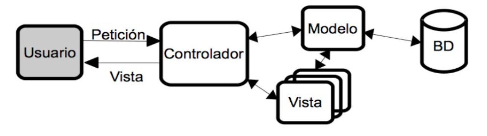

<style>
    img { margin: 20px 0; border-radius: 8px; }

    .alert { color: #BD1550; }
    .warning { color: #E97F02; }
    .success { color: #8A9B0F; }

    .center { text-align: center; }
    .right { text-align: right; }

    .img-small { max-width: 200px; margin: auto; }
    .img-medium { max-width: 400px; margin: auto; }
    .img-large { max-width: 800px; margin: auto; }

    .leyenda {
        font-size: small;
        margin: 10px 0;
    }
</style>

# Frameworks PHP. Laravel

> Duració estimada: 26hores

# INTRODUCCIÓ ALS FRAMEWORKS PHP I LARAVEL

## Frameworks

Un **framework** és una eina que proporciona una sèrie de mòduls que ajuden a organitzar i desenvolupar un producte programari. En el cas concret dels **frameworks PHP**, la majoria d'ells proporcionen una sèrie de comandos o eines per a crear projectes amb una estructura determinada (normalment, seguint el patró **MVC** que veurem després), de manera que ja donen una base de treball feta, i facilitats per a poder crear el model de dades, la connexió a la base de dades, les rutes de les diferents seccions de l'aplicació, etc.
Els frameworks PHP com Laravel, Symfony, CodeIgniter, i CakePHP, ofereixen eines robustes per accelerar el desenvolupament web. Un framework ben dissenyat pot ajudar a :

 * Evitar problemes comuns 
 * Estandarditzar el codi 
 * Facilitar el manteniment. 

Entre aquests, Laravel destaca per les seves fortes funcionalitats, comunitat activa i constant evolució.

### Exemples de frameworks PHP

Actualment existeix una gran varietat de frameworks PHP que triar per a desenvolupar les nostres aplicacions. Alguns dels més populars són:

* **Laravel**, un framework relativament recent (va ser creat en 2011), i que ha guanyat bastant popularitat en els últims anys. La seua filosofia és el poder desenvolupar projectes de manera elegant i simple. Compta amb una àmplia comunitat de suport darrere, i se li augura un futur bastant consolidat.

* **Symfony**, creat en 2005, compta amb més camí fet que Laravel, i una estructura més consolidada. En les seues primeres versions es presentava com un framework més monolític (s'instal·laven massa mòduls que després no necessitàvem), però recentment ha adaptat la seua estructura per a fer-la més modular.

* **CodeIgniter**, un framework més lleuger que els anteriors, però també amb un ampli grup de seguidors i desenvolupadors. Va ser creat en 2006 i, encara que ha patit una etapa d'abandó, ha tornat a agafar força en els últims anys, potser a causa de la seua simplicitat d'ús.

* **CakePHP**, creat en 2005, és un altre framework similar a CodeIgniter quant a simplicitat i facilitat d'ús. Té una àmplia comunitat també darrere que li dóna suport.

* **Zend**, creat en 2006, és un altre framework bastant popular, encara que potser amb menor visibilitat que els anteriors hui dia, a l'altura de CakePHP.

* **Phalcon**, un altre framework de recent creació (2012), amb una potent capacitat de processament de pàgines PHP, i la possibilitat de treballar com microframework (més lleuger, per a oferir funcionalitats molt específicas) o com framework complet.

De fet, molts frameworks més antics també han incorporat recentment la possibilitat d'executar-los com microframeworks. Quasi tots els frameworks PHP tenen una sèrie de característiques comunes, com són l'ús del patró MVC per a desenvolupar els seus projectes, la injecció de dependències per a gestionar recursos com ara connexions a bases de dades, o elements compartits per tota l'aplicació, la possibilitat de desenvolupar tant webs completes com serveis REST accessibles des de diversos clients, etc.

#### Quin triar

A l'hora de decantar-nos per l'un o l'altre framework, no ens hauríem de deixar enganyar per la popularitat d'aquest, en termes de quota de mercat. En aqueix terreny, Symfony i Laravel probablement són els més demandats, però la corba d'aprenentatge en ells pot ser que siga més pronunciada que en uns altres a priori més senzills, com CodeIgniter o CakePHP.

Cada framework pot estar millor orientat que un altre per a determinats tipus de projectes o necessitats. Si volem aprendre una cosa ràpida per a llançar l'aplicació com més prompte millor, potser Symfony **no** és la millor opció. Si, per contra, preferim xopar-nos d'un framework amb una comunitat important darrere que ens puga donar suport i ens garantisca un temps de vida llarg, llavors Symfony o Laravel poden ser millors candidats.

#### Per què Laravel?

###### Comparativa amb Altres Frameworks
Comparat amb altres frameworks com Symfony o CodeIgniter, Laravel sobresurt per la seva sintaxi expressiva i elegant, una curva d'aprenentatge amigable i un ecosistema ric. Per exemple, mentre Symfony pot ser més adequat per a aplicacions d'alta complexitat, Laravel és sovint preferit per la seva facilitat d'ús i eficiència en el desenvolupament de projectes de diverses mides.
###### Raons Específiques per Triar Laravel
Laravel s'adapta bé a una àmplia gamma d'aplicacions, des de llocs web simples fins a aplicacions empresarials complexes. Destaca per la seva arquitectura MVC, suport natu per a APIs RESTful, i funcions com Eloquent ORM, que simplifiquen les operacions de bases de dades. A més, Laravel posseeix una gran documentació i una comunitat vibrant, facilitant l'aprenentatge i la resolució de problemes.
###### Tendències Recents i Actualitzacions de Laravel
En les versions recents, Laravel ha incorporat millores significatives en rendiment, seguretat i funcionalitats modernes. Això inclou l'actualització a les darreres versions de PHP, millorant la compatibilitat i rendiment. Es recomana estar atent a les últimes actualitzacions per aprofitar al màxim el potencial de Laravel.
###### Exemples Pràctics i Estudis de Casos
En el món real, Laravel s'ha utilitzat en una àmplia varietat de projectes, des de sistemes de gestió de continguts fins a aplicacions de comerç electrònic. Aquesta versatilitat és testimoni de la seva eficàcia com a eina de desenvolupament.Aquí teniu alguns exemples:

* Laracasts: És una plataforma d'aprenentatge en línia enfocada a PHP i Laravel, i fa un ús extensiu de Laravel.
* Vogue Archive: El lloc web de l'arxiu de Vogue, que ofereix accés a tots els números de la revista des de 1892, està construït amb Laravel.
* MyRank: Una plataforma en línia per a l'educació i l'avaluació, MyRank utilitza Laravel per gestionar el seu contingut i les funcions interactives.
* Alison: Un dels portals d'aprenentatge en línia més grans, Alison també fa ús de Laravel per a la seva infraestructura web.
* Startups.co: Una plataforma per a emprenedors que busca ajuda amb la planificació, el finançament i la creixença dels seus negocis. Laravel és utilitzat per a mantenir la seva plataforma.

## Característiques Laravel

**Laravel** és un framework de codi obert per al desenvolupament d'aplicacions web en PHP que posseeix una sintaxi simple, expressiva i elegant. Va ser creat en 2011 per Taylor Otwell, inspirant-se en **Ruby on Rails i Symfony**, dels quals ha adoptat els seus principals avantatges.

Laravel facilita el desenvolupament simplificant el treball amb tasques comunes com l'autenticació, el enrutamiendo, gestió sessions, l'emmagatzematge en caché, etc. Algunes de les principals característiques i avantatges de Laravel són:

* Esta dissenyat per a desenvolupar sota el patró **MVC** (model - vista - controlador), centrant-se en la correcta separació i modularització del codi. El que facilita el treball en equip, així com la claredat, el manteniment i la reutilització del codi.
* Eloquent, el ORM de Laravel, fa que treballar amb bases de dades sigui més senzill i intuïtiu, especialment en la gestió de relacions complexes.
* Permet la gestió de **bases de dades** i la manipulació de taules des de codi, mantenint un control de versions de les mateixes mitjançant el seu sistema de **Migracions**.
* Utilitza un **sistema de plantilles** per a les vistes anomenat **Blade**, el qual fa ús de la cache per a donar-li major velocitat. Blade facilita la
  creació de **vistes** mitjançant l'ús de layouts, herència i seccions.
* Facilita l'extensió de funcionalitat mitjançant paquets o **llibreries externes**. D'aquesta forma és molt senzill afegir paquets que ens
  faciliten el desenvolupament d'una aplicació i ens estalvien molt temps de programació.
* Incorpora un **intèrpret de línia de comandos** anomenat **Artisan** que ens ajudarà amb un munt de tasques rutinàries com la creació de
  diferents components de codi, treball amb la base de dades i migracions, gestió de rutes, cachés, cues, tasques programades, etc.
* Laravel Jetstream ofereix una implementació robusta per a l'autenticació i la gestió de sessions. Laravel Sanctum es utilitza per a APIs tokenitzades, proporcionant una solució elegant per a la autenticació d'APIs.
* Laravel inclou proteccions de seguretat com la protecció CSRF, xifrat segur de contrasenyes i defenses contra injeccions SQL, garantint un entorn segur per al desenvolupament d'aplicacions web.
* Amb Laravel, és possible construir arquitectures de microserveis eficaces, utilitzant Laravel Lumen o integrant-se amb altres serveis i APIs.
* Laravel facilita la creació d'APIs RESTful amb característiques com les API Resources i la integració amb Laravel Passport per l'autenticació OAuth.
* La comunitat de Laravel és una de les més actives i de suport en el món PHP, amb recursos com Laracasts, paquets de tercers, i fòrums extensos.

## Primers passos amb Laravel

### Instal·lacio amb docker (laravel sail)

Si ja esteu desenvolupant Linux i Docker Compose està instal·lat, podeu utilitzar una senzilla ordre de terminal per a crear un nou projecte Laravel. Per exemple, per a crear una nova aplicació Laravel en un directori anomenat "exemple-app", podeu executar l'ordre següent al terminal:

curl -s https://laravel.build/example-app | bash

Per descomptat, podeu canviar "exemple-app" en aquest URL a qualsevol cosa que vulgueu - només assegureu-vos que el nom de l'aplicació només conté caràcters alfanumèrics, guions i guions baixos. El directori de l'aplicació Laravel es crearà dins del directori des del qual executeu l'ordre.

La instal·lació del **Sail** pot trigar diversos minuts mentre els contenidors de l'aplicació del **sail** es construeixen a la vostra màquina local.

Després de crear el projecte, 

Seria bó comprovar que el .env inclou la següent configuració:

```php
WWWUSER = 1000
WWWGROUP = 1000
```

Ara podeu navegar al directori de l'aplicació i iniciar Laravel Sail. Laravel Sail proporciona una interfície senzilla de línia d'ordres per a interactuar amb la configuració predeterminada de l'acoblador Laravel:
```php
cd exemple-app && ./vendor/bin/sail up &
```

Un cop iniciats els contenidors Docker de l'aplicació, podeu accedir a l'aplicació al vostre navegador web a: http://localhost.

Per a executar una terminal en el contenidor haurem d'executar:

```php
./vendor/bin/sail bash
```

I per a inicialitzar la base de dades des de dins del contenidor:

```php
php artisan migrate
```

##### phpmyadmin

Si volem que funcione el phpmyadmin haurien d'afegir un altre contenidor docker, o farem incluint el següent codi en el docker-compose.yml

```php
myadmin:
    image: 'phpmyadmin:latest'
    ports:
      - 8080:80
    environment:
      MYSQL_ROOT_PASSWORD: '${DB_PASSWORD}'
    links:
      - "mysql:db"
    depends_on:
      - mysql
    networks:
      - sail
```

### Instal·lació des de repositori github

Seguiu aquests passos per a un repositori de Laravel amb Sail després de clonar des de Github. Aquest és un exemple

1. **Clona el repositori, exemple:**

    $ git clone https://github.com/example/laravel-backend-api.git

2. **Canvia el directori a l'aplicació/projecte de nova creació.**
   
    $ cd laravel-backend-api

3. **Copia el fitxer .env**
   
    $ cp .env.example .env

4. **Obre .env per a coincidir la configuració amb les línies següents:**

   ```php
   DB_CONNECTION=mysql
   DB_HOST=mysql
   DB_PORT=3306
   DB_DATABASE=batoiBook
   DB_USERNAME=root
   DB_PASSWORD=1234
   
5. ** Afegix el phpmyadmin a docker-compose.yml**
   
   ```php
   myadmin:
       image: 'phpmyadmin:latest'
       ports:
         - 8080:80
       environment:
         MYSQL_ROOT_PASSWORD: '${DB_PASSWORD}'
       links:
         - "mysql:db"
       depends_on:
         - mysql
       networks:
         - sail
    ```

5. **Instal·la totes les dependències requerides**
   
    $ docker run --rm -v $(pwd):/opt -w /opt laravelsail/php82-composer:latest composer install
   
    NOTA: Això pot trigar una estona si aquesta és la primera vegada que s'instal·la com a contenidor.

6. **Executa els servidors amb Sail**
   
    $ vendor/bin/sail up -d

7. **Entra en el phpmyadmin (localhost:8080) i crea la base de dades batoiBook.**

8. **Inicia el terminal del contenidor**
   
    $ vendor/bin/sail bash

9. **Genera la clau APP.KEY.**
   
    $ php artisan key:generate

10. **Construeix la llavor.**
    
    $ php artisan migrate:fresh --seed

11. **Genera els node_modules**
    
    $ npm install

    $ npm run build

Ara podeu obrir la vostra aplicació amb el vostre navegador: http://localhost

Ara que ja tenim tot el sistema preparat per a desenvolupar projectes Laravel, vegem els primers passos que hem de donar per a crear aquests projectes.


### El comanament Artisan

Laravel inclou un interfície de línia de comandos (CLI, Command line interface) anomenat **Artisan**. Aquesta utilitat ens va a permetre realitzar múltiples tasques necessàries durant el procés de desenvolupament o desplegament a producció d'una aplicació, per la qual cosa ens facilitarà i accelerarà el treball.
Per a veure una llista de totes les opcions que inclou Artisan podem executar el següent comando en un consola o terminal del sistema en la carpeta arrel del nostre projecte:

    php artisan list

Si volem obtenir una ajuda més detallada sobre alguna de les opcions de Artisan simplement hem d'escriure la paraula **help** davant del comando en qüestió, per exemple:

    php artisan help migrate

A poc a poc anirem veient més opcions de Artisan, de moment anem a comentar solament dues opcions importants: el llistat de rutes i la generació de codi.

Per a veure un llistat amb totes les rutes que hem definit en el fitxer routes.php podem executar el comando:

    php artisan route:list

Açò ens mostrarà una taula amb el mètode, l'adreça, l'acció i els filtres definits per a totes les rutes. D'aquesta forma podem comprovar totes les rutes de la nostra aplicació i assegurar-nos que estiga tot correcte.


### Estructura d'un projecte Laravel

En crear un nou projecte de Laravel se'ns generarà una estructura de carpetes i fitxers per a organitzar el nostre codi. És important que coneguem perquè val cada element i on hem de col·locar el nostre codi. Les carpetes que més utilitzarem i les que millor haurem de conèixer són:

* **app** – Conté el codi central de la vostra aplicació. Aviat explorarem aquest directori amb més detall; no obstant això, gairebé totes les classes de la vostra aplicació estaran en aquest directori.

* **bootstrap** - Conté el fitxer app.php que arrossega l'entorn de treball. Aquest directori també alberga un directori de memòria cau que conté els fitxers generats per l'entorn de treball per a l'optimització del rendiment, com ara els fitxers de memòria cau de rutes i serveis. Normalment no hauríeu de modificar cap fitxer dins d'aquest directori.
* **config** – conté tots els fitxers de configuració de l'aplicació. És una gran idea llegir tots aquests fitxers i familiaritzar-se amb totes les opcions disponibles.
* **database** – En aquesta carpeta s'inclou tot el relacionat amb la definició de la base de dades del nostre projecte. Dins d'ella podem trobar al seu torn tres carpetes: factors, migrations i seeds. En el capítol sobre base de dades analitzarem millor el seu contingut.
* **public** – conté el fitxer index.php, que és el punt d'entrada per a totes les peticions que entren a la vostra aplicació i configura la càrrega automàtica. Aquest directori també allotja els vostres actius com imatges, JavaScript i CSS.
* **lang** – En aquesta carpeta es guarden arxius PHP que contenen arrays amb els textos del nostre lloc web en
  diferents llenguatges, solament serà necessari utilitzar-la en cas que es desitge que l'aplicació es puga traduir.
* **resources** – conté les vostres vistes, així com els vostres actius crus i no compilats com CSS o JavaScript.
* **storage** – En aquesta carpeta Laravel emmagatzema tota la informació interna necessaris per a l'execució de la web, com són els arxius de sessió, la caché, la compilació de les vistes, fique informació i els logs del sistema. El directori storage/app/public es pot utilitzar per emmagatzemar fitxers generats per l'usuari, com ara avatars de perfil, que haurien de ser accessibles públicament. Hauríeu de crear un enllaç simbòlic al públic/emmagatzematge que apunti a aquest directori. Podeu crear l'enllaç utilitzant l'ordre php artisan storage:link Artisan.
* **routes** – En aquesta carpeta es defineixen totes les rutes del nostre lloc web, enllaçant una URL del navegador amb un mètode d'un controlador. A més ens permet realitzar validacions (mitjançant Middleware) i altres operacions sobre les rutes del nostre lloc. Hi han per a accedir a contingut web normal
  ( web.php ), com per a serveis web ( api.php ), com per a comandos i altres opcions.
* **tests**–Esta carpeta se utilitza per als fixers amb les proves automatitzades. Laravel inclou un sistema que facilita tot el procés de
  proves amb PHPUnit.
* **vendor** – En aquesta carpeta s'allotgen totes les llibreries i dependències que conformen el framework de Laravel. Aquesta carpeta tampoc l'haurem de modificar, ja que tot el codi que conté són llibreries que s'instal·len i actualitzen mitjançant l'eina **Composer**.
  A més en la carpeta arrel també podem trobar dos fitxers molt importants i que també utilitzarem:
* **.env** – Aquest fitxer s'utilitza per a emmagatzemar els valors de configuració que són propis de la màquina o instal·lació actual. El que ens permet canviar fàcilment la configuració segons la màquina en la qual s'instal·le i
  tenir opcions diferents per a producció, per a diferents desenvolupadors, etc. Important, aquest fitxer hauria d'estar en el **.gitignore**.
* **composer.json** – Aquest fitxer és l'utilitzat per Composer per a realitzar la instal·lació de Laravel. En una instal·lació inicial
  únicament s'especificarà la instal·lació d'un paquet, el propi framework de Laravel, però podem especificar la instal·lació d'altres llibreries o paquets externs que afigen funcionalitat a Laravel.

#### Carpeta App
La majoria de la vostra aplicació es troba al directori d'aplicacions. De manera predeterminada, aquest directori es troba a l'espai de noms d'App i el Composer el carrega automàticament utilitzant l'estàndard de càrrega automàtica PSR-4.
El directori d'aplicacions conté una varietat de directoris addicionals com Console, Http i Providers. Penseu en els directoris Console i Http com proporcionar una API al nucli de la vostra aplicació. El protocol HTTP i la CLI són mecanismes per interactuar amb la vostra aplicació, però en realitat no contenen lògica d'aplicació. En altres paraules, són dues maneres d'emetre ordres a la vostra sol·licitud. El directori Consola conté totes les vostres ordres de l'Artisan, mentre que el directori Http conté les vostres controladores, programari intermediari i peticions.

Es generaran una varietat d'altres directoris dins del directori d'aplicacions a mesura que utilitzeu les ordres make Artisan per generar classes. Així, per exemple, el directori d'apps/Jobs no existirà fins que executeu l'ordre make:job Artisan per generar una classe de treball.
* **app/Console** - Per definir els nostres comanaments
* **app/Exceptions** - Per definir les nostres exempcions
* **app/Models** - Per a definir els models
* **app/Http/Controllers** – Conté tots els arxius amb les classes dels controladors que serveixen per a interactuar amb els models, les vistes i manejar la lògica de l'aplicació.
* **app/Http/Middleware** – Són els filtres o classes intermèdies que podem utilitzar per a realitzar determinades accions, com la validació de permisos, abans o després de l'execució d'una petició a una ruta del nostre projecte web.
* **Providers** - Conté els proveïdors de serveis de l'aplicació, més els que puguem definir nosaltres.
* A més, ací s'inclouen, o es poden incloure, carpetes addicionals per a la nostra aplicació, com la carpeta **Events** per a definir els esdeveniments que ocórreguen, o diferents carpetes per a emmagatzemar el model de dades o classes de la nostra aplicació.


### Arquitectura d'un projecte Laravel

Una vegada vista l'estructura de carpetes i arxius que es genera quan creguem un projecte Laravel, és important també tindre unes nocions bàsiques de com s'interconnecten els elements internament, i què fa que un projecte Laravel es puga posar en marxa.

#### Els proveïdors de serveis (service providers)

Els proveïdors de serveis són els principals responsables de l'arrancada o posada en marxa de tot projecte Laravel, la qual cosa es coneix com bootstrapping. S'encarreguen de registrar els components del projecte, dependències externes, classes i mètodes definidos per nosaltres, per a fer-los accessibles a la resta de l'aplicació.

Si obrim l'arxiu **config/app.php** del nostre projecte Laravel, veurem entre altres coses una secció denominada **providers**, on es definix un array amb tots els proveïdors de serveis que es posen en marxa en arrancar l'aplicació. Entre altres coses, hi ha proveïdors de serveis per a accés a la base de dades (**DatabaseServiceProvider**), autenticació d'usuaris (**AuthServiceProvider**), etc.

##### Les classes del nucli de Laravel

Per a poder desenvolupar els components de les aplicacions Laravel, és necessari comptar amb una infraestructura prèvia de classes que ens faciliten aquesta tasca. Així, al llarg de les següents sessions farem ús d'algunes classes proporcionades per Laravel que vénen preinstal·lades amb el framework, com ara **Route,Model** etc, i que ens permeten o bé heretar d'elles per a crear altres subclasses (com és el cas dels models de dades) o bé utilitzar alguns mètodes d'utilitat que aquestes classes proporcionen (com el cas del classe **Route**, per exemple).

Convé tindre present que totes aquestes classes pertanyents al nucli de Laravel parteixen d'un espai de noms comú anomenat **Illuminate** , per la qual cosa, en els arxius font on les utilitzem, serà freqüent trobar instruccions **use** que comencen per aquest espai de noms. Per exemple:

```php
use Illuminate\Database\Eloquent\Model;
```

##### Altres elements

A més dels dos pilars anteriors sobre els quals se sustenta fonamentalment el desenvolupament de projectes en Laravel, podem parlar d'altres elements que ens poden resultar d'utilitat en el desenvolupament, com són els facades i els contracts.

Les facades proporcionen una interfície estàtica als elements de l'aplicació, de manera que faciliten l'accésa uns certs mètodes o utilitats. Per exemple, la facade	**cache** permet accedir de manera senzilla amb el seu mètode **get**a unes certes propietats cachejades prèviament.

```php
return Cache::get('key');
```

Els **contracts** són un conjunt d'interfícies que proporcionen el nucli de serveis oferits per Laravel. Per exemple, mètodes per a enviar e-mails, o encolar tasques en una cola de prioritat, etc.


### MVC: Model - Vista - Controlador

El model–vista–controlador (MVC) és un patró d'arquitectura de programari que separa les dades i la lògica de negoci d'una aplicació de la interfície d'usuari i el mòdul encarregat de gestionar els esdeveniments i les comunicacions. Per a açò MVC proposa la construcció de tres components diferents que són el model, la vista i el controlador, és a dir, d'una banda defineix components per a la representació de la informació, i d'altra banda per a la interacció de l'usuari. Aquest patró d'arquitectura de programari es basa en les idees de **reutilització de codi** i la **separació de conceptes**, característiques que cerquen facilitar la tasca de desenvolupament d'aplicacions i el seu posterior manteniment.
De manera genèrica, els components de MVC es podrien definir com segueix:

* El **Model**: És la **representació de la informació** amb la qual el sistema opera, per tant gestiona tots els accessos a aquesta informació, tant consultes com a actualitzacions. Les peticions d'accés o manipulació d'informació arriben al 'model' a través del 'controlador'.
* El **Controlador**: **Respon a esdeveniments** (usualment accions de l'usuari) i **invoca peticions al 'model'** quan es fa alguna sol·licitud d'informació (per exemple, editar un document o un registre en una base de dades). Per tant es podria dir que el 'controlador' fa d'intermediari entre la 'vista' i el 'model'.
* La **Vista**: **Presenta el 'model'** i les dades preparades pel controlador a l'usuari de **forma visual**. L'usuari podrà interactuar amb la vista i realitzar altres peticions que s'enviaran al controlador.



#### Funcionament bàsic

El funcionament bàsic que segueix Laravel després d'una petició web a una URL del nostre lloc és el següent:

* Totes les peticions entren a través del fitxer **public/index.php**, el qual en primer lloc comprovarà en el fitxer de rutes (**routes/web.php**) si la URL és vàlida i en cas de ser-ho al fet que controlador ha de fer la petició.

* A continuació cridarà al mètode del controlador assignat per a aquesta ruta. Com hem vist, el controlador és el punt d'entrada de les peticions de l'usuari, el qual, depenent de la petició:
    * Accedirà a la base de dades (si fóra necessari) a través dels "models" per a obtenir dades (o per a afegir, modificar o eliminar).
    * Després d'obtenir les dades necessàries els prepararà per a passar-li'ls a la vista.

* En el tercer pas el controlador cridarà a una vista amb una sèrie de dades associades, la qual es prepararà per a
  mostrar-se correctament a partir de les dades d'entrada i finalment es mostrarà a l'usuari.
  A continuació s'inclou un xicotet esquema d'aquest funcionament:

<figure>
  
  <figcaption>Funcionament Bàsic Laravel</figcaption>
</figure>


