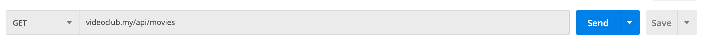

<style>
    img { margin: 20px 0; border-radius: 8px; }

    .alert { color: #BD1550; }
    .warning { color: #E97F02; }
    .success { color: #8A9B0F; }

    .center { text-align: center; }
    .right { text-align: right; }

    .img-small { max-width: 200px; margin: auto; }
    .img-medium { max-width: 400px; margin: auto; }
    .img-large { max-width: 800px; margin: auto; }

    .leyenda {
        font-size: small;
        margin: 10px 0;
    }
</style>

# Servicios REST

> Duración estimada: 32 sesiones


## Introducció als serveis REST

[Video](https://youtu.be/ByJ804KuEas)

Una **API** (Application Programming Interface) és un conjunt de funcions i procediments pels quals, una aplicació externa accedeix a les dades, a manera de biblioteca com una capa d'abstracció i la API s'encarrega d'enviar la dada sol·licitada.

Una de les característiques fonamentals de les API és que són **Sateless**, la qual cosa vol dir que les peticions es fan i desapareixen, no hi ha usuaris loguejats ni dades que es queden emmagatzemats.

Exemples de **APIs** gratuïtes:

- [ChuckNorris IO](https://api.chucknorris.io/#!)
- [OMDB](https://www.omdbapi.com/)
- [PokeAPI - Pokemon](https://pokeapi.co/)
- [The Star Wars API](https://swapi.dev/)


## Els serveis REST

### Consultar una API externa

Per consultar una API externa com https://swapi.dev/ des de Laravel, pots utilitzar la biblioteca HTTP client de Laravel, que proporciona una interfície senzilla per a realitzar peticions HTTP. Ací tens un exemple de com fer una petició GET per a obtenir informació sobre personatges de "Star Wars":

**Instal·la la Biblioteca HTTP Client:**
Si no està ja instal·lat, pots afegir la biblioteca HTTP client de Laravel al teu projecte amb Composer:

```bash
composer require guzzlehttp/guzzle
```

**Realitza una Petició GET:**
Després, pots utilitzar el facade Http per a realitzar una petició GET. Aquí tens un exemple de com consultar informació sobre personatges:

```php
use Illuminate\Support\Facades\Http;

public function getStarWarsCharacters()
{
$response = Http::get('https://swapi.dev/api/people/');

    if ($response->successful()) {
        $data = $response->json();
        // Manipula o mostra les dades com necessites
    } else {
        // Maneja l'error
    }
}
```

En aquest exemple, la petició GET a https://swapi.dev/api/people/ retorna informació sobre personatges de "Star Wars". La resposta es verifica per a comprovar si ha estat exitosa, i després es processen les dades JSON. Pots adaptar aquest codi per a fer altres tipus de consultes a l'API, depenent de la informació que necessites.


### REST

Amb aquesta metodologia anomenada **REST** podrem construir *APIs* perquè des d'un client extern es puguen consumir.

Gràcies a aquest **standard** de l'arquitectura del programari podrem muntar una API que utilitze els mètodes standard GET, POST, PUT i DELETE.


### Construïnt una API/REST bàsica

[Video](https://youtu.be/1O8cvJKNhm8)


Vegem ara quins passos donar per a construir una API REST en Laravel que done suport a les operacions
bàsiques sobre una o diverses entitats: consultes (GET), insercions (POST), modificacions (PUT) i esborrats (DELETE). Emprarem per a això els denominats controladors de API
i que proporcionen un conjunt de funcions ja definides per a donar suport a cadascun d'aquests
comandos.

##### Definint els controlador de la API

Per a proporcionar una API REST als clients que ho requerisquen, necessitem definir un controlador (o
controladors) orientats a oferir aquests serveis REST. Aquests controladors en Laravel es denominen de tipus
**api**, com vam veure en sessions prèvies. Normalment es definirà un controlador API per cadascun dels
models als quals necessitem accedir. Crearem un de prova per a oferir una API REST sobre els
llibres de la nostra aplicació de videoclub.
Existeixen diferents maneres d'executar el comando de creació del controlador de API. Ací mostrarem
potser un dels més útils:

```php
php artisan make:controller Api/MovieController --api --model=Movie
```

Això crearà el controlador en la carpeta **App\Http\Controllers\Api** amb una sèrie de funcions ja predefinides. No és obligatori situar-ho en aqueixa subcarpeta, òbviament, però això ens servirà per a separar els controladors de API de la resta. Aquesta serà l'aparença del controlador generat:

```php
<?php

namespace App\Http\Controllers\Api;

use App\Http\Controllers\Controller;
use App\Models\Movie;
use Illuminate\Http\Request;

class MovieController extends Controller
{
    /**
     * Display a listing of the resource.
     *
     * @return \Illuminate\Http\Response
     */
    public function index()
    {
        //
    }

    /**
     * Store a newly created resource in storage.
     *
     * @param  \Illuminate\Http\Request  $request
     * @return \Illuminate\Http\Response
     */
    public function store(Request $request)
    {
        //
    }

    /**
     * Display the specified resource.
     *
     * @param  \App\Models\Movie  $movie
     * @return \Illuminate\Http\Response
     */
    public function show(Movie $movie)
    {
        //
    }

    /**
     * Update the specified resource in storage.
     *
     * @param  \Illuminate\Http\Request  $request
     * @param  \App\Models\Movie  $movie
     * @return \Illuminate\Http\Response
     */
    public function update(Request $request, Movie $movie)
    {
        //
    }

    /**
     * Remove the specified resource from storage.
     *
     * @param  \App\Models\Movie  $movie
     * @return \Illuminate\Http\Response
     */
    public function destroy(Movie $movie)
    {
        //
    }
}
```

Observem que s'incorpora automàticament la clàusula use per a carregar el model associat, que
hem indicat en el paràmetre **--model** . A més, els mètodes show , update i destroy ja vénen amb un paràmetre de tipus Llibre que facilitarà molt algunes tasques.

##### Establint les rutes (endPoints)


Una vegada tenim el controlador API creat, definirem les rutes associades a cada mètode del controlador. Si recordem de sessions anteriors, podíem emprar el mètode **Route::resource** en l'arxiu **routes/web.php** per a establir de colp totes les rutes associades a un controlador de recursos.

De manera anàloga, podem emprar el mètode **Route::apiResource** en l'arxiu
**routes/api.php** per a establir automàticament totes les rutes d'un controlador de API. Afegim
aquesta línia en aquest arxiu **routes/api.php** :

```
Route::apiResource('movies',Api\MovieController::class);
```

Les rutes de API (aquelles definides en l'arxiu **routes/api.php** ) per defecte tenen un prefix
api , tal com s'estableix en el provider **RouteServiceProvider** . Per tant, hem definit una
ruta general **api/movies** , de manera que totes les subrutes que es deriven d'ella portaran a l'un o l'altre mètode del controlador de API de video.
Podem comprovar quines rutes hi ha actives amb aquest comando:

```
php artisan route:list

+--------+-----------+--------------------+----------------+--------------------------------------------------+------------+
| Domain | Method    | URI                | Name           | Action                                           | Middleware |
+--------+-----------+--------------------+----------------+--------------------------------------------------+------------+
|        | GET|HEAD  | /                  |                | App\Http\Controllers\HomeController              | web        |
|        | GET|HEAD  | api/movies         | movies.index   | App\Http\Controllers\Api\MovieController@index   | api        |
|        | POST      | api/movies         | movies.store   | App\Http\Controllers\Api\MovieController@store   | api        |
|        | GET|HEAD  | api/movies/{movie} | movies.show    | App\Http\Controllers\Api\MovieController@show    | api        |
|        | PUT|PATCH | api/movies/{movie} | movies.update  | App\Http\Controllers\Api\MovieController@update  | api        |
|        | DELETE    | api/movies/{movie} | movies.destroy | App\Http\Controllers\Api\MovieController@destroy | api        |
|        | GET|HEAD  | api/user           |                | Closure                                          +--------------------------------------------------+------------+

```

### Serveis GET

Començarem per definir el mètode index . En aquest cas, obtindrem el conjunt de videos de labase de dades i retornar-lo tal qual:

```php
public function index()
{
	$movies = Movie::get();
	return $movies;
}
```

Si accedim a la ruta **api/videos** des del navegador, s'activarà el mètode index que acabem d'implementar, i rebrem els llibres de la base de dades, directament en format JSON.

```json
{
"id": 1,
"title": "El padrino",
"year": "1972",
"director": "Francis Ford Coppola",
"poster": "http://ia.media-imdb.cimages/M/MV5BMjEyMjcyNDI4MF5BMl5BanBnXkFtZTcwMDA5Mzg3OA@@._V1_SX214_AL_.jpg",
"rented": 0,
"synopsis": "Don Vito Corleone (Marlon Brando) es el respetado y temido jefe de una de las cinco familias de la mafia de Nueva York. Tiene cuatro hijos: Connie (Talia Shire), el impulsivo Sonny (James Caan), el pusilánime Freddie (John Cazale) y Michael (Al Pacino), que no quiere saber nada de los negocios de su padre. Cuando Corleone, en contra de los consejos de 'Il consigliere' Tom Hagen (Robert Duvall), se niega a intervenir en el negocio de las drogas, el jefe de otra banda ordena su asesinato. Empieza entonces una violenta y cruenta guerra entre las familias mafiosas.",
"created_at": "2020-12-03T11:19:19.000000Z",
"updated_at": "2020-12-21T10:36:20.000000Z"
},
{
"id": 2,
"title": "El Padrino. Parte II",
"year": "1974",
"director": "Francis Ford Coppola",
"poster": "http://ia.media-imdb.cimages/M/MV5BNDc2NTM3MzU1Nl5BMl5BanBnXkFtZTcwMTA5Mzg3OA@@._V1_SX214_AL_.jpg",
"rented": 0,
"synopsis": "Continuación de la historia de los Corleone por medio de dos historias paralelas: la elección de Michael Corleone como jefe de los negocios familiares y los orígenes del patriarca, el ya fallecido Don Vito, primero en Sicilia y luego en Estados Unidos, donde, empezando desde abajo, llegó a ser un poderosísimo jefe de la mafia de Nueva York.",
"created_at": "2020-12-03T11:19:19.000000Z",
"updated_at": "2020-12-03T11:19:19.000000Z"
}}
```


D'una forma similar, podríem implementar i provar el mètode show

```php
public function show(Movie $movie)
{
	return $movie;
}
```

En aquest cas, si accedim a la URI **api/movies/1** , obtindrem la informació del video amb id = 1. Notar que Laravel s'encarrega automàticament de buscar el llibre per nosaltres (fer la corresponent operació **find** per a l'id proporcionat). És el que es coneix com a enllaç implícit, i és alguna cosa que
també està disponible en els controladors web normals, sempre que els associem correctament amb el model vinculat. Això es fa automàticament si creem el controlador juntament amb el model o si usem el paràmetre --model per a associar-ho, com hem fet ací.

#### Mes coses sobre el format JSON i la resposta

Després de provar els dos serveis anteriors, hauràs observat que Laravel s'encarrega de transformar directament els registres obtinguts a format JSON quan els enviem mitjançant return , per la qual cosa, en principi, no tenim per què preocupar-nos d'aquest procés. No obstant això, d'aquesta manera s'escapen
algunes coses al nostre control. Per exemple, i sobretot, no podem especificar el codi d'estat de la resposta, que per defecte és 200 si tot ha anat correctament. A més, tampoc podem controlar quina informació enviar de l'objecte en qüestió.

Si volem limitar o formatar la informació a enviar dels objectes que estem tractant, i que no s'envien tots els seus camps sense més, tenim diverses opcions:

* Si volem afegir o modificar més informació en la resposta, com el codi d'estat, l'estructura anterior no ens serveix, ja que sempre s'enviarà un codi 200. Per a això, és convenient emprar el mètode **response()->json(...)** , que permet especificar com a primer paràmetre les dades a enviar, i com segon paràmetre el codi d'estat. Els mètode anterior quedaria així,
  enviant un codi 200 com a resposta (encara que si s'omet el segon paràmetre, s'assumeix que és 200):

```php
public function show(Movie $movie)
{
	return response()->json($movie, 200);
}
```

!!! note "Codis de resposta"
Quant als codis d'estat de la resposta, depén del resultat de l'operació que s'haja realitzat, aquests es cataloguen en cinc grups:

         * Codis 1xx: representen informació sobre una petició normalment incompleta. No són molt habituals, però es poden emprar quan la petició és molt llarga, i s'envia abans una capçalera per a comprovar si es pot processar aquesta petició.
         * Codis 2xx: representen peticions que s'han pogut atendre satisfactòriament. El codi més habitual és el 200, resposta estàndard per a les peticions que són correctes. Existeixen altres variants, com el codi 201, que s'envia quan s'ha inserit o creat un nou recurs en el servidor (una inserció en una base de dades, per exemple), o el codi 204, que indica que la petició s'ha atés bé, però no s'ha retornat res com a resposta.
         * Codis 3xx: són codis de redirecció, que indiquen que d'alguna manera la petició original s'ha redirigit a un altre recurs del servidor. Per exemple, el codi 301 indica que el recurs sol·licitat s'ha mogut permanentment a una altra URL. El codi 304 indica que el recurs sol·licitat no ha canviat des de l'última vegada que es va sol·licitar, per si es vol recuperar de la caixet local en aqueix cas.
         * Codis 4xx: indiquen un error per part del client. El més típic és l'error 404, que indica que estem sol·licitant una URL o recurs que no existeix. Però també hi ha altres habituals, com el 401 (client no autoritzat), o 400 (les dades de la petició no són correctes, per exemple, perquè els camps del formulari no són vàlids).
         * Codis 5xx: indiquen un error per part del servidor. Per exemple, l'error 500 indica un error intern del servidor, o el 504, que és un error de timeout per temps excessiu a emetre la resposta.


* Afegir clàusules **hidden** en els models corresponents, per a indicar que aqueixa informació no ha de ser enviada en cap cas enlloc de l'aplicació. És el que ocorre, per exemple, amb el camp password del model d'Usuari :

```php
protected $hidden = ['password'];
```

* Definir a mà un array amb els camps a enviar en el mètode del controlador. En el cas de la fitxa del video anterior, si només volem enviar el títol i el director, podríem fer una cosa així:

```php
public function show(Movie $movie)
{
	return [
		'titulo' => $movie->title,
		'director' => $movie->director
	];
}
```

* En el cas que el pas anterior siga molt costós (perquè el model té molts camps, o perquè hem de fer el mateix en diverses parts del codi), també podem definir recursos (resources), que permeten separar el codi de la informació a mostrar del propi controlador. 


### [Eloquent: API Resources](https://laravel.com/docs/9.x/eloquent-resources)

Quan creeu una API, és possible que necessiteu una capa de transformació que es trobe entre els vostres models Eloqüents i les respostes JSON que es retornen realment als usuaris de la vostra aplicació. Per exemple, podeu voler mostrar certs atributs per a un subconjunt d'usuaris i no d'altres, o podeu incloure sempre certes relacions en la representació JSON dels vostres models. Les classes de recursos d'Eloquent permeten transformar expressivament i fàcilment els vostres models i col·leccions de models en JSON.

Per descomptat, sempre podreu convertir models o col·leccions eloqüents a JSON utilitzant els seus mètodes toJson; no obstant això, els recursos eloqüents proporcionen un control més granular i robust sobre la serialització JSON dels vostres models i les seves relacions.


#### Generació de recursos
Per a generar una classe de recursos, podeu utilitzar l'ordre make:resource Artisan. Per defecte, els recursos es col·locaran al directori app/Http/Resources de la vostra aplicació. Els recursos amplien la classe Illuminate\Http\Resources\Json\JsonResource:

```console
php artisan make:resource UserResource
```

##### Col·leccions de recursos
A més de generar recursos que transformen models individuals, podeu generar recursos que són responsables de transformar col·leccions de models. Permet que les respostes JSON incloguin enllaços i altres metainformació que són rellevants per a tota una col·lecció d'un recurs donat.

Per a crear una col·lecció de recursos, haureu d'utilitzar l'indicador --collection en crear el recurs. O, incloent la paraula Col·lecció en el nom del recurs indicarà a Laravel que hauria de crear un recurs de col·lecció. Els recursos de la col·lecció estenen la classe Illuminate\Http\Resources\Json\ResourceCollection:

```console
php artisan make:resource User --collection

php artisan make:resource UserCollection
```

#### Conceptes bàsics

Una classe de recursos representa un únic model que s'ha de transformar en una estructura JSON. Per exemple, aquí hi ha una classe senzilla de recursos UserResource:

```php
<?php
 
namespace App\Http\Resources;
 
use Illuminate\Http\Resources\Json\JsonResource;
 
class UserResource extends JsonResource
{
    /**
     * Transform the resource into an array.
     *
     * @param  \Illuminate\Http\Request  $request
     * @return array
     */
    public function toArray($request)
    {
        return [
            'id' => $this->id,
            'name' => $this->name,
            'email' => $this->email,
            'created_at' => $this->created_at,
            'updated_at' => $this->updated_at,
        ];
    }
}
```

Cada classe de recurs defineix un mètode toArray que retorna la matriu d'atributs que s'han de convertir en JSON quan es retorna el recurs com a resposta des d'una ruta o mètode de controlador.

Tingueu en compte que podem accedir a les propietats del model directament des de la variable $this. Això és degut al fet que una classe de recurs farà un servidor intermediari automàtic de la propietat i l'accés als mètodes fins al model subjacent per a un accés convenient. Un cop definit el recurs, es pot retornar des d'una ruta o controlador. El recurs accepta la instància del model subjacent a través del seu constructor:

```php
use App\Http\Resources\UserResource;
use App\Models\User;

Route::get('/user/{id}', function ($id) {
return new UserResource(User::findOrFail($id));
});
```
Cada classe de recurs defineix un mètode toArray Si esteu retornant una col·lecció de recursos o una resposta paginada, hauríeu d'utilitzar el mètode de col·lecció proporcionat per la classe de recurs quan creeu la instància de recurs en la vostra ruta o controlador:

```php
use App\Http\Resources\UserResource;
use App\Models\User;

Route::get('/users', function () {
return UserResource::collection(User::all());
});
```

Tingueu en compte que això no permet afegir metadades personalitzades que puguin necessitar ser retornades amb la vostra col·lecció. Si voleu personalitzar la resposta de la col·lecció de recursos, podeu crear un recurs dedicat per a representar la col·lecció:

```console
php artisan make:resource UserCollection
```

Un cop generada la classe de col·lecció de recursos, podeu definir fàcilment qualsevol metadada que s'ha d'incloure amb la resposta:

```php
<?php
 
namespace App\Http\Resources;
 
use Illuminate\Http\Resources\Json\ResourceCollection;
 
class UserCollection extends ResourceCollection
{
    /**
     * Transform the resource collection into an array.
     *
     * @param  \Illuminate\Http\Request  $request
     * @return array
     */
    public function toArray($request)
    {
        return [
            'data' => $this->collection,
            'links' => [
                'self' => 'link-value',
            ],
        ];
    }
}
```

Després de definir la col·lecció de recursos, es pot retornar des d'una ruta o controlador:

```php
use App\Http\Resources\UserCollection;
use App\Models\User;

Route::get('/users', function () {
return new UserCollection(User::all());
});
```


### Resta dels serveis

[Video](https://youtu.be/pieNTwMManY)


Vegem ara com implementar la resta de serveis (POST, PUT i DELETE). En el cas de la inserció (POST), haurem de rebre en la petició les dades de l'objecte a inserir (un llibre, en el nostre exemple). Igual que les dades del servidor al client s'envien en format JSON, és d'esperar en aplicacions que segueixen l'arquitectura REST que les dades del client al servidor també s'envien en format JSON.
El nostre mètode **store** , associat al servei POST, podria quedar d'aquesta manera (retornem el codi d'estat 201, que s'utilitza quan s'han inserit elements nous):

```php
public function store(MoviePost $request)
{
        $movie = new Movie();
        $movie->title = $request->title;
        $movie->year = $request->year;
        $movie->director = $request->director;
        $movie->poster = $request->poster;
        $movie->synopsis = $request->synopsis;
        $movie->save();
        return response()->json($movie, 201);
}
```

De forma semblant tindriem el mètode **update** per al servei PUT. En est cas tornem un codi 200.

```php
 public function update(MoviePost $request, Movie $movie)
    {
        $movie->title = $request->title;
        $movie->year = $request->year;
        $movie->director = $request->director;
        $movie->poster = $request->poster;
        $movie->synopsis = $request->synopsis;
        $movie->save();
        return response()->json($movie);
    }
```    

Finalment, pel servei DELETE, hem d'implementar el mètode **destroy** , que podria quedar així:

```php
public function destroy(Movie $movie)
{
	$movie->delete();
	return response()->json(null, 204);
}
```

Notar que retornem un codi d'estat 204, que indica que no estem retornant contingut (és null). D'altra banda, és habitual en aquesta mena d'operacions d'esborrat retornar en format JSON l'objecte que s'ha eliminat, per si de cas es vol desfer l'operació en un pas posterior. En aquest cas, la resposta del mètode d'esborrat seria així:

```php
return response()->json($movie,204);
```

Com podem començar a intuir, provar aquests serveis no és tan senzill com provar serveis de tipus GET, ja que no podem simplement teclejar una URL en el navegador. Necessitem un mecanisme per a passar-li les dades al servidor en format JSON, i també el mètode (POST, PUT o DELETE).

##### Validació de dades

A l'hora de rebre dades en format JSON per a serveis REST, també podem establir mecanismes de validació similars als vistos per als formularis, a través dels corresponents **requests**, com ja hem fet en els exemples anteriors.

##### Respostes d'error


D'altra banda, hem d'assegurar-nos que qualsevol error que es produïsca en la part del API retorne un contingut en format JSON, i no una pàgina web. Per exemple, si sol·licitem veure la fitxa d'un llibre que el seu id no existeix, no hauria de retornar-nos una pàgina d'error 404, sinó un codi d'estat 404 amb un missatge d'error en format JSON.
Això no es compleix per defecte, ja que Laravel està configurat per a renderitzar una vista amb l'error produït. En el cas de Laravel 8 hem de modificar el mètode **register** dins de la classe **App\Exceptions\Handler.php**. Ho podem deixar de la següent forma:

```php
<?php

namespace App\Exceptions;

use Illuminate\Database\QueryException;
use Illuminate\Foundation\Exceptions\Handler as ExceptionHandler;
use Throwable;
use Illuminate\Validation\ValidationException;
use Illuminate\Auth\AuthenticationException;
use Illuminate\Database\Eloquent\ModelNotFoundException;

class Handler extends ExceptionHandler
{
    /**
     * A list of the exception types that are not reported.
     *
     * @var array
     */
    protected $dontReport = [
        //
    ];

    /**
     * A list of the inputs that are never flashed for validation exceptions.
     *
     * @var array
     */
    protected $dontFlash = [
        'password',
        'password_confirmation',
    ];

    /**
     * Register the exception handling callbacks for the application.
     *
     * @return void
     */
    public function register()
    {
        $this->renderable(function (Throwable $exception) {

            if (request()->is('api*'))
            {
                if ($exception instanceof ModelNotFoundException)
                    return response()->json(['error' => 'Elemento no encontrado'], 404);
                else if ($exception instanceof AuthenticationException)
                    return response()->json(['error' => 'Usuario no autenticado'], 401);
                else if ($exception instanceof ValidationException)
                    return response()->json(['error' => 'Datos no válidos'], 400);
                else if ($exception instanceof QueryException)
                    return response()->json(['error' => 'Datos no válidos'], 400);
                else if (isset($exception))
                    return response()->json(['error' => 'Error en la aplicación (' .get_class($exception) . '):' .$exception->getMessage()], 500);
            }
        });
    }
}
```
### Provant els serveis amb POSTMAN

Ja hem vist que provar uns serveis de llistat (GET) és senzill a través d'un navegador. Però els serveis d'inserció (POST), modificació (PUT) o esborrat (DELETE) exigeixen d'altres eines per a poder ser provats. Podríem definir formularis amb aquests mètodes encapsulats, però l'esforç de definir
aqueixos formularis per a després no utilitzar-los més no mereix molt la pena. Veurem a continuació una eina molt útil per a provar tot tipus de serveis sense necessitat d'implementar gens addicional.

**Postman** és una aplicació gratuïta i multiplataforma que permet enviar tot tipus de peticions a un servidor determinat, i examinar la resposta que aquest produeix. D'aquesta forma, podem comprovar que els serveis ofereixen la informació adequada abans de ser usats per una aplicació client real.

La primera vegada que l'executem ens preguntarà si volem registrar-nos, de manera que puguem compartir els projectes que fem entre els diferents equips en què estiguem registrats, però podem saltar aquest pas fent clic en l'enllaç inferior.

Després d'iniciar l'aplicació, veurem la pantalla d'inici de Postman. Al principi apareixeran diverses opcions en la zona central, per a crear col·leccions o peticions, encara que també les podem crear des del
botó **New** a la cantonada superior esquerra. Per exemple, podem crear una col·lecció "Movies", i apareixerà en el panell esquerre:

Des del mateix botó*New a la cantonada superior esquerra podem crear noves peticions i associar-les a una col·lecció. Existeix una forma alternativa (potser més còmoda) de crear aqueixes peticions, a través del panell
de pestanyes, afegint noves:

#### Afegir peticions GET


Per a afegir una petició, habitualment triarem el tipus de comando sota les pestanyes (GET, POST, PUT, DELETE) i la URL associada a aquest comando. Per exemple:



Llavors, podem fer clic en el botó "Save" en la part dreta, i guardar la petició per a poder-la reutilitzar. En guardar-la, ens demanarà que li assignem un nom (per exemple, "GET movies" en aquest cas), i la
col·lecció en la qual s'emmagatzemarà (la nostra col·lecció de "Movies").


Després, podrem veure la prova associada a la col·lecció, en el panell esquerre, i si seleccionem aquesta prova i premem en el botó blau de "*Send" (part dreta), podem veure la resposta emesa pel servidor en el panell inferior de resposta (si tenim, és clar, el servidor en marxa)


Seguint aquests mateixos passos, podem també crear una nova petició per a obtindre un llibre a partir del seu id, per GET:


Bastaria amb reemplaçar l'id de la URL pel qual vulguem consultar realment. Si provem aquesta petició, obtindrem la resposta corresponent:


#### Afegir altres tipus de peticions

Les peticions POST difereixen de les peticions GET en què s'envia certa informació en el cos de la petició. Aquesta informació normalment són les dades que es volen afegir en el servidor. Com podem fer això amb Postman?
En primer lloc, creem una nova petició, triem el comando POST i definim la URL (en el nostre cas, videoclub.my/api/movies o una cosa similar, depenent de com tinguem en marxa el servidor).
Llavors, fem clic en la pestanya Body, sota la URL, i establim el tipus com **raw** perquè ens deixe escriure'l sense restriccions. També convé canviar la propietat **Text** perquè siga JSON, i que així el servidor reculla el tipus de dada adequada. S'afegirà automàticament una capçalera de petició (**Header**)
que especificarà que el tipus de contingut que s'enviarà són dades JSON. Després, en el quadre de text sota aquestes opcions, especifiquem l'objecte JSON que volem enviar per a inserir:


Després d'això, n'hi ha prou amb guardar la petició com hem fet amb les anteriors, i llançar-la per a veure el resultat.

Quant a les peticions PUT, procedirem de manera similar a les peticions POST: hem de triar el comando (PUT en aquest cas), la URL, i completar el cos de la petició amb les dades que vulguem modificar del contacte. En aquest cas, a més, l'id del llibre l'enviarem també en la pròpia URL:


Per a peticions DELETE, la mecànica és similar a la fitxa de l'element (operació GET), canviant el comando GET per DELETE, i sense necessitat d'establir res en el cos de la petició:


## Autenticació en serveis REST


En una API REST també pot ser necessari protegir certs serveis, de manera que només puguen accedir a ells els usuaris autenticats. No obstant això, en aquest cas no tenim disponible el mecanisme d'autenticació basat en sessions que vam veure en temes anteriors, ja que la parteix client que consula la API
REST no té per què estar basada en un navegador. Podríem accedir des d'una aplicació d'escriptori feta a Java, per exemple, o des d'una aplicació mòbil, i en aquests casos no podríem disposar de les sessions, pròpies de clients web o navegadors. En el seu lloc, emprarem un mecanisme d'autenticació basat en tokens.

#### Fonaments de l'autenticació basada en tokens

L'autenticació basada en tokens és un mecanisme de validació d'usuaris en aplicacions client/servidor que podríem dir que és més universal que l'autenticació basada en sessions, ja que permet autenticar usuaris provinents de diferents tipus de clients. El que es fa és el següent:

* L'usuari necessita enviar les seues credencials (login i password), de manera similar a com es fa en una aplicació web normal, encara que aquesta vegada les dades s'envien normalment en format JSON.
* El servidor valida aqueixes credencials i, si són correctes, genera una cadena de text anomenada **token**, d'una certa longitud, i que servirà per a identificar unívocament a l'usuari a partir d'aqueix moment. Dit token ha de ser enviat de tornada (també en format JSON) al client que es va validar.
* A partir d'aquest punt, el client ha d'adjuntar el token com a part de la informació en cada petició que realitza a una zona d'accés restringit, de manera que el servidor puga consultar el token i comprovar si correspon amb el d'algun usuari autoritzat. Aquest token normalment s'envia en una capçalera de la petició anomenada **Authorization**, com veurem després, i el servidor pot consultar el valor d'aquesta capçalera per a verificar l'accés del client.

#### Alternatives per a la implementació de l'autenticació basada en tokens

Podem emprar diferents alternatives per a l'autenticació basada en tokens baix Laravel. Comentarem dues d'elles.


* D'altra banda podem valdre'ns de la llibreria **Laravel Sanctum**, que proporciona mecanismes d'autenticació per a APIs i per a SPAs (Single Page Applications, aplicacions de pàgina única). Entre els seus avantatges podem destacar que és senzilla d'integrar en l'aplicació i automatitza alguns aspectes
de la gestió de tokens, a més de comptar amb el suport oficial de Laravel. Com a inconvenients, és una llibreria més intrusiva que l'anterior, ja que requereix crear una taula addicional on emmagatzemar els tokens.


#### Sanctum or Passport

A l'hora de instal·lar una llibreria per a l'autenticació podem triar per Passport que utilitza **OATH2** per autenticació o una versió més simple que no l'utilitza com és Sanctum. Esta senzilla gràfica us pot orientar per saber quin dels dos instal·le. 


## Autenticació basada en tokens emprant Laravel Sanctum

Laravel Sanctum proporciona un sistema d'autenticació lleuger per a SPA (aplicacions de pàgina única), aplicacions mòbils i APIs simples basades en tokens. Sanctum permet a cada usuari de la vostra aplicació generar múltiples tokens API per al seu compte. A aquests tokens se'ls poden concedir habilitats  que especifiquin quines accions es permeten als tokens.

### Com funciona
Laravel Sanctum existeix per resoldre dos problemes separats. Parlem de cadascun abans d'aprofundir més a la biblioteca.

#### Tokens de l'API
En primer lloc, Sanctum és un paquet senzill que podeu utilitzar per emetre tokens API als vostres usuaris sense la complicació d'OAuth. Aquesta característica s'inspira en GitHub i altres aplicacions que emeten "tokens d'accés personal". Per exemple, imagineu que la "configuració del compte" de la vostra aplicació té una pantalla on un usuari pot generar un token API per al seu compte. Podeu utilitzar Sanctum per generar i gestionar aquests tokens. Aquests tokens solen tenir un temps de venciment molt llarg (anys), però poden ser revocats manualment per l'usuari en qualsevol moment.
Laravel Sanctum ofereix aquesta funció mitjançant l'emmagatzematge de tokens API d'usuari en una única taula de base de dades i l'autenticació de les peticions HTTP entrants a través de la capçalera Authorization que hauria de contenir un token API vàlid.

#### Autenticació de SPA
En segon lloc, Sanctum existeix per oferir una manera senzilla d'autenticar aplicacions de pàgina única (SPAs) que necessiten comunicar-se amb una API alimentada per Laravel. Aquests SPA poden existir al mateix repositori que la vostra aplicació Laravel o poden ser un repositori completament separat, com un SPA creat amb Vue CLI o una aplicació Next.js.
Per a aquesta funció, Sanctum no utilitza tokens de cap tipus. En canvi, Sanctum utilitza els serveis d'autenticació de sessió basats en galetes de Laravel. Normalment, Sanctum utilitza el guard d'autenticació web de Laravel per aconseguir-ho. Això proporciona els beneficis de la protecció CSRF, l'autenticació de sessió, així com protegeix contra fuites de les credencials d'autenticació a través de XSS.
El Sanctum només intentarà autenticar-se usant galetes quan la petició entrant s'origini des del vostre propi frontal de SPA. Quan Sanctum examina una sol·licitud HTTP entrant, primer comprovarà si hi ha una galeta d'autenticació i, si no n'hi ha cap, Sanctum examinarà la capçalera d'autorització per a un testimoni API vàlid.


!!! note "Una autenticació"
    Està molt bé utilitzar Sanctum només per a l'autenticació de tokens API o només per a l'autenticació de SPA. Només perquè utilitzeu Sanctum no vol dir que heu d'utilitzar les dues característiques que ofereix.


## Instal·lació

Les versions més modernes de laravel ja la tenen instal·lada, en cas contrari podeu trobar la informació en la [documentació oficial](https://laravel.com/docs/9.x/sanctum#configuration)

### Generant tokens

Sanctum us permet emetre tokens API / tokens d'accés personal que es poden utilitzar per autenticar les peticions API a la vostra aplicació. Quan es fan sol·licituds utilitzant tokens API, el token s'ha d'incloure a la capçalera d'autorització com a token Bearer.

Per començar a emetre tokens per als usuaris, el model d'usuari hauria d'utilitzar el trait Laravel\Sanctum\HasApiTokens:

```php
use Laravel\Sanctum\HasApiTokens;

class User extends Authenticatable
{
use HasApiTokens, HasFactory, Notifiable;
}
```

Per a emetre un token, podeu utilitzar el mètode createToken. El mètode createToken retorna una instància Laravel\Sanctum\NewAccessToken. Els tokens de l'API es generen utilitzant el hash SHA-256 abans de ser emmagatzemats a la vostra base de dades, però podeu accedir al valor de text net del token utilitzant la propietat PlainTextToken de la instància NewAccessToken.
Per a vincular la generació del token amb un procediment d'autenticació podem fer-ho definint un mètode login , per exemple, que validarà les credencials que li arriben (login i password). Si són correctes, cridarà al mètode **createToken** de Sanctum (incorporat a l'usuari a través del **trait HasApiTokens** ), associant-lo al login de l'usuari entrant, i li retornarà el token en
format text pla, com un objecte JSON. En cas que hi haja un error en l'autenticació, enviarà de tornada un missatge d'error, amb el codi 401 d'accés no autoritzat.


```console
php artisan make:controller Api/LoginController
```


```php
use App\Http\Controllers\Controller;
use Illuminate\Http\Request;
use Illuminate\Support\Facades\Hash;
use App\Models\User;

class LoginController extends Controller
{
	public function login(Request $request)
    { 
        $request->validate([
            'email' => 'required|email',
            'password' => 'required'
        ]);

        if (!Auth::attempt($request->only('email', 'password'))) {
            throw ValidationException::withMessages([
                'email' => ['The provided credentials are incorrect.'],
            ]);
        }

        $user = User::where('email', $request->email)->firstOrFail();

        // Crear un token de Sanctum
        $token = $user->createToken('api-token')->plainTextToken;

        return response()->json(['token' => $token], 200);
    }
}
```

Definim en l'arxiu **routes/api.php** una ruta que redirigisca a aquest mètode, per a quan l'usuari vulga autenticar-se (recorda afegir amb use la corresponent classe):

```php
Route::post('login', [\App\Http\Controllers\Api\LoginController::class,'login']);
```

##### Protecció de rutes


Per protegir rutes de manera que totes les sol·licituds entrants s'hagin d'autenticar, hauríeu d'adjuntar el guard d'autenticació sanctum a les rutes protegides dins dels vostres fitxers de rutes/api.php. Aquest guard assegurarà que les peticions entrants s'autentiquen com a peticions d'estat, galetes autenticades o continguin una capçalera vàlida de testimoni API si la petició és d'un tercer.


Per a protegir les rutes que necessitem en els controladors API, les especifiquem en el constructor del controlador. Per exemple, així protegiríem totes les rutes del nostre controlador MovieController , excepte index i show :

```php
use Illuminate\Http\Request;
 
Route::get('/user',[userController::class,'show'])->middleware('auth:sanctum');
```

#### Revocant tokens

Podeu "revocar" tokens suprimint-los de la base de dades utilitzant la relació tokens que proporciona el tret Laravel\Sanctum\HasApiTokens:

```php
// Revoke all tokens...
$user->tokens()->delete();

// Revoke the token that was used to authenticate the current request...
$request->user()->currentAccessToken()->delete();

// Revoke a specific token...
$user->tokens()->where('id', $tokenId)->delete();
```

#### Caducitat del tokens
Per defecte, els tokens de Sanctum no caduquen i només poden ser invalidats revocant el token. No obstant això, si voleu configurar un temps de venciment per als toekns API de la vostra aplicació, podeu fer-ho mitjançant l'opció de configuració de venciment definida al fitxer de configuració de sanctum de la vostra aplicació. Aquesta opció de configuració defineix el nombre de minuts fins que un token emès es consideri expirat:

```
'expiració' =, 525600,
```

Si heu configurat un temps de venciment del token per a la vostra aplicació, també podeu programar una tasca per a eliminar els tokens caducats de la vostra aplicació. Afortunadament, Sanctum inclou un ordre sanctum:prune-expired Artisan que podeu utilitzar per aconseguir això. Per exemple, podeu configurar les tasques programades per a suprimir tots els registres de la base de dades de tokens caducats que hagin expirat almenys 24 hores:

```console
$schedule->command('sanctum:prune-expired --hours=24')->daily();
```

### Prova d'autenticació amb POSTMAN

Vegem com provar l'autenticació per token en el projecte de videoclub, per qualsevol dels mètodes vistos abans.
En primer lloc, i després de posar en marxa el projecte, ens assegurarem que podem accedir sense restriccions als dos serveis que no requereixen autorització ( index o show ), igual que abans.


Si accedim a un recurs protegit obtenim 

```json
{ "error": "Credenciales no válidas"}
```

Ara anem a loguejar-se


Ara hem de copiar aquest token, i pegar-ho en la petició d'accés restringit. Haurem de pegar-ho en la capçalera Authorization (obrir aqueixa pestanya sota la URL de la petició en Postman), i el normal és enviar-ho com un **Bearer token**, segons els estàndards. Llavors sí que tindrem la resposta correcta de l'operació
sol·licitada.


A l'hora de traslladar aquestes proves a una aplicació "real", enviaríem les credencials per JSON al servidor, obtindríem el token de tornada i l'emmagatzemaríem localment en alguna variable o suport
(per exemple, en l'element localStorage , si treballem amb algun framework Javascript). Després, davant cada petició JSON que férem al servidor, adjuntaríem aquest token en la capçalera Authorization perquè fóra validat pel servidor.

### [Què és swagger](https://www.chakray.com/es/swagger-y-swagger-ui-por-que-es-imprescindible-para-tus-apis/)


[Video](https://youtu.be/3-gZqyhuFPY)
[Video](https://youtu.be/thXuHLM54K4)

### Documentació

Per a poder utilitzar swagger en Laravel podem instal·lar el següent paquet que utilitza Swagger-php i swagger-ui adaptat per treballar amb Laravel.

```
composer require "darkaonline/l5-swagger"
```

i publicarem el fitxers de configuració i vistes

```
php artisan vendor:publish --provider "L5Swagger\L5SwaggerServiceProvider"
```

A continuació, obriu un fitxer **config/l5-swagger.php**.  Passem per les claus essencials:

* routes.api - Aquest és una URL per accedir a la documentació d'interfície d'usuari.  El vostre equip de frontend l'utilitzarà per accedir a la documentació.  Per defecte és api/documentació.  Podeu canviar-ho a quelcom més petit com api/docs

* Generar_always — Es millor desactivar-ho ja que generarà documentació sobre la marxa.  No és útil amb l'API gran.  Sempre podeu executar manualment

```
    php artisan config:cache
	php artisan l5-swagger:generate
```

Aquests són els més importants per a començar.  Ara si intenteu crear documents mitjançant aquesta ordre retornarà un error

```
Required @OA\Info() not found
```

Això vol dir que primer heu de crear aquesta notació.  Així que afegim-ho.  Prefereixo crear un controlador abstracte per a una API, però podeu afegir això a **app/Http/Controllers/Controller.php**


```
/**
 * @OA\Info(
 *    title="Your super  ApplicationAPI",
 *    version="1.0.0",
 * )
 */
class Controller extends BaseController
{
    use AuthorizesRequests, DispatchesJobs, ValidatesRequests;
}
```

A continuació, hem d'afegir documents per a almenys una ruta, per exemple per per app/Http/Controllers/Api/LoginController.php:

```
/**
 * @OA\Post(
 * path="/login",
 * summary="Sign in",
 * description="Login by email, password",
 * operationId="authLogin",
 * tags={"auth"},
 * @OA\RequestBody(
 *    required=true,
 *    description="Pass user credentials",
 *    @OA\JsonContent(
 *       required={"email","password"},
 *       @OA\Property(property="email", type="string", format="email", example="user1@mail.com"),
 *       @OA\Property(property="password", type="string", format="password", example="PassWord12345"),
 *       @OA\Property(property="persistent", type="boolean", example="true"),
 *    ),
 * ),
 * @OA\Response(
 *    response=422,
 *    description="Wrong credentials response",
 *    @OA\JsonContent(
 *       @OA\Property(property="message", type="string", example="Sorry, wrong email address or password. Please try again")
 *        )
 *     )
 * )
 */
```

Ara, estàs preparat per generar **php artisan l5-swagger:generate** i vés a l'URL que has proporcionat a la teva configuració.  En el meu cas, serà http://videoclub/api/docs.

Veuràs una cosa així:


Ara mirarem les anotacions.  Intentaré explicar com utilitzar-les:

* **@OA** — significa anotació d'Open API.  Podeu llegir més [aquí](https://swagger.io/specification/)
* **@OA/POST**  — vol dir petició DE POST.  Hi ha GET, POST, DELETE, etc.
* **Path** — és un URL
* **Tags** — us agruparà API per seccions.
* **@OA\RequestBody** — és obvi pel nom.  Hauria de tenir una anotació JsonContent dins amb propietats (és a dir, descripcions de camp).
* **OA\Response** — podeu tenir tantes respostes com vulgueu.  Hauríeu de proporcionar totes les respostes possibles d'èxit i error.

Anem a afegir un codi de resposta 200:

```
* 	@OA\Response(
*     response=200,
*     description="Success",
*     @OA\JsonContent(
*        @OA\Property(property="user", type="object", ref="#/components/schemas/User"),
*     )
*  ),
```

L'anotació **@OA\Property** té una clau de propietat(nom de camp) i un tipus.  El tipus pot tenir valors diferents: string, object, integer, array, boolean, etc.
En aquesta resposta, vaig utilitzar el tipus objecte.  Podeu passar una referència a aquest objecte.  Crearem un objecte **user**.  Prefereixo afegir això a la classe Model.

```
/**
 *
 * @OA\Schema(
 * required={"password"},
 * @OA\Xml(name="User"),
 * @OA\Property(property="id", type="integer", readOnly="true", example="1"),
 * @OA\Property(property="role", type="string", readOnly="true", description="User role"),
 * @OA\Property(property="email", type="string", readOnly="true", format="email", description="User unique email address", example="user@gmail.com"),
 * @OA\Property(property="email_verified_at", type="string", readOnly="true", format="date-time", description="Datetime marker of verification status", example="2019-02-25 12:59:20"),
 * @OA\Property(property="first_name", type="string", maxLength=32, example="John"),
 * @OA\Property(property="last_name", type="string", maxLength=32, example="Doe"),

 * )
 *
 * Class User
 *
 */
```

Mireu aquesta notació **@OA\Xml(nom=” Usuari)**.  Aquest nom s'utilitzarà en una clau ref de la **@OA\Property**


Ara veureu una icona de bloqueig prop de la ruta.  Quan feu clic sobre això, podreu afegir l'autenticació de Bearer.


### [Exemple](https://blog.quickadminpanel.com/laravel-api-documentation-with-openapiswagger/)

El gran problema d'este component és que no està ben documentat. Partint del següent exemple he documentant el mètode get i post del videoclub i ha quedat així:

Primer cal possar l'inici del swagger en el **Controller.php** de la següent manera:


```
/**
 * @OA\Info(
 *    title="VideoClub ApplicationAPI",
 *    version="1.0.0",
 * )
 */

/**
 * @OA\SecurityScheme(
 *     type="http",
 *     description="Login with email and password to get the authentication token",
 *     name="Token based Based",
 *     in="header",
 *     scheme="bearer",
 *     bearerFormat="JWT",
 *     securityScheme="apiAuth",
 * )
 */
```
La primera part serveix per a identificar el projecte i la segon per a l'autenticació de la API basada en tokens.

Ara omplirem el **model Movie.php** per a generar el schema Movie.

```
/**
 *
 * @OA\Schema(
 * required={"id,title"},
 * @OA\Xml(name="Movie"),
 * @OA\Property(property="id", type="integer", readOnly="true", example="1"),
 * @OA\Property(property="title", type="string", readOnly="true", description="User role"),
 * @OA\Property(property="year", type="integer", readOnly="true",  description="Year", example="1956"),
 * @OA\Property(property="director", type="string", readOnly="true",  description="Director", example="Copolla"),
 * @OA\Property(property="genre", type="string", readOnly="true",  description="Genre", example="Thriller"),
 * )
 */
```
Observeu que en el genre retorne un string perquè serà el que voldrè retornar, en compte de la id de Genre.

Ara generarè el schema de la petició request del post de movie. No és exactament igual que esta perquè ací voldré el genre amb ID i restriccions en alguns camps. Ho puc fer en el **MoviePost.php** dins de request.

```
/**
 * @OA\Schema(
 *      title="Store Movie Request",
 *      required={"title,director,year"},
 *      description="Store Movie request body data",
 *      @OA\Xml(name="MoviePost"),
 * )
 */
 /**
     * @OA\Property(
     *      property = "title",
     *      title="name",
     *      description="Title",
     *      example="Titanic"
     * )
     *
     * @var string
     */
  /**
     * @OA\Property(
     *      property = "year",
     *      title="year",
     *      description="Year",
     *      example="1998"
     * )
     *
     * @var integer
     */
 /**
     * @OA\Property(
     *      property = "genre",
     *      title="genre",
     *      description="Genre",
     *      example="1"
     * )
     *
     * @var integer
     */
 /**
     * @OA\Property(
     *      property = "director",
     *      title="director",
     *      description="Director",
     *      example="Steven Spilberg"
     * )
     *
     * @var string
     */
    /**
     * @OA\Property(
     *      property = "synopsis",
     *      title="synopsis",
     *      description="Synopsis",
     *      example="De que va la pelicula"
     * )
     *
     * @var string
     */

    /**
     * @OA\Property(
     *      property = "poster",
     *      title="poster",
     *      description="Poster",
     *      example="adreça del poster"
     * )
     *
     * @var string
     */         
``` 
No he pogut fer-ho d'un altra manera. Diferix un poc de la que he utilitzat al model Movie, però si no ho feia així no funcionaba.

Falta ara generar la resposta de totes les pelicules per al index. Per aço genere un Resource per a Movies, amb el següent codi.

```php
<?php

namespace App\Http\Resources;

use Illuminate\Http\Resources\Json\JsonResource;
/**
 * @OA\Schema(
 *     title="MovieResource",
 *     description="Project resource",
 *     @OA\Xml(name="MovieResource"),
 * )
 */
class MovieResource extends JsonResource
{
    /**
     * Transform the resource collection into an array.
     *
     * @param  \Illuminate\Http\Request  $request
     * @return array
     */

    /**
     * @OA\Property(
     *     property="data",
     *     title="data",
     *     description="Data wrapper"
     * )
     *
     * @var \App\Models\Movie[]
     */
    public function toArray($request)
    {
        return [ 'id' => $this->id,
            'title' => $this->title,
            'director' => $this->director,
            'year' => $this->year,
            'genre' => $this->Genre->title??'Desconocido'];
    }
}
``` 
Este resource farà que quan l'utilitze hem retornarà els camps que he possat en la funció toArray i no tots els camps. El puc utilitzar per tornar camps de relacions o canviar el nom dels camps. En quan al swagger, noteu que torne un array de Movies dins d'un camp data.

Per últim el controlador de movies queda de la següent manera.

```php
  /**
     * Display a listing of the resource.
     *
     * @return \Illuminate\Http\Response
     */
    /**
     * @OA\Get(
     *      path="/api/movies",
     *      operationId="getMoviesList",
     *      tags={"Movies"},
     *      summary="Get list of movies",
     *      description="Returns list of movies",
     *      @OA\Response(
     *          response=200,
     *          description="Successful operation",
     *          @OA\JsonContent(ref="#/components/schemas/MovieResource")
     *       ),
     *      @OA\Response(
     *          response=401,
     *          description="Unauthenticated",
     *      ),
     *      @OA\Response(
     *          response=403,
     *          description="Forbidden"
     *      )
     *     )
     */
    public function index()
    {

        return MovieResource::collection(Movie::get());
    }

    /**
     * Store a newly created resource in storage.
     *
     * @param  \Illuminate\Http\Request  $request
     * @return \Illuminate\Http\Response
     */
    /**
     * @OA\Post(
     *      path="/api/movies",
     *      operationId="movieProject",
     *      tags={"Movies"},
     *      summary="Store new movie",
     *      description="Returns movie data",
     *      security={ {"apiAuth": {} }},
     *      @OA\RequestBody(
     *          required=true,
     *          @OA\JsonContent(ref="#/components/schemas/MoviePost")
     *      ),
     *      @OA\Response(
     *          response=201,
     *          description="Successful operation",
     *          @OA\JsonContent(ref="#/components/schemas/Movie")
     *       ),
     *      @OA\Response(
     *          response=400,
     *          description="Bad Request"
     *      ),
     *      @OA\Response(
     *          response=401,
     *          description="Unauthenticated",
     *           @OA\JsonContent(
     *              @OA\Property(
     *                  property="error",
     *                  type="string",
     *                  example="Usuario no autenticado"))
     *      ),
     *      @OA\Response(
     *          response=403,
     *          description="Forbidden"
     *      )
     * )
     */
    public function store(MoviePost $request)
    {
        $movie = new Movie();
        $movie->title = $request->title;
        $movie->year = $request->year;
        $movie->director = $request->director;
        $movie->poster = $request->poster;
        $movie->synopsis = $request->synopsis;
        $movie->save();
        response()->json($movie, 201);
    }
```

Mireu que per al post utilitze la seguretat que ja havia definit.
Ara veureu una icona de bloqueig prop de la ruta.  Quan feu clic sobre això, podreu afegir l'autenticació de Bearer.


Us encomane a que vejau el video on està tot explicat perquè amb els apunt soles queda una mica difícil d'entendre.

[Documentació de swagger-php](http://zircote.github.io/swagger-php/Getting-started.html)


## Exercicis

801. **Inicialització de Dades amb usersSeeder**

    **Objectiu:** Utilitza el usersSeeder per a afegir personatges de Star Wars com a usuaris del nostre sistema.
    
    **Tasca:** Modifica usersSeeder perquè carregue personatges de Star Wars en la base de dades, assignant-los com a usuaris del sistema.

802. **Desenvolupament d'una API per a batoiBook**
   
    **Objectiu:** Crea una API per al projecte batoiBook amb les següents especificacions:

    **Endpoints per Consultar Taules:**

    * **Taules courses, families, i modules**: Crea endpoints per aquestes taules. Les respostes hauran de retornar-se sense utilitzar Resources, però incloent el codi de resposta HTTP.
    * **Taula users**: Similar als anteriors, però en aquest cas, retorna només id, name, email, i administrador en les respostes.
    * **Taula books**:
        * Utilitza un apiResource per a incloure el nom del propietari i el nom del mòdul en les respostes. Adapta els noms dels camps a un idioma oficial d'Espanya.
        * Per mostrar tots els llibres de manera paginada, crea una Collection Resource que afiga detalls com el número de pàgina actual, el nombre total de pàgines, el nombre de registres per pàgina, i el total de registres disponibles. Inclou també l'estat de la resposta i enllaços a les pàgines anterior i posterior.
    * **Taula sales**: Segueix un procés similar al de la taula books per a mostrar les vendes paginades.
    * Endpoints per a Creació, Modificació, i Esborrat:
        * Crea endpoints específics per a crear, modificar, i esborrar elements en les taules books i sales.

804. **Gestió d'Errors**

    **Objectiu**: Assegura que els missatges d'error es retornen en format JSON.

804. **Endpoint per a Iniciar Sessió i Protecció de Rutes**

    **Objectiu**: Implementa un sistema d'autenticació i seguretat per a l'API.

    **Tasca**: Crea un endpoint per a iniciar sessió en l'aplicació. A més, protegeix les rutes POST, PUT, i DELETE en les taules que ho requereixen, assegurant que només usuaris autenticats puguen realitzar aquestes accions.


    *        